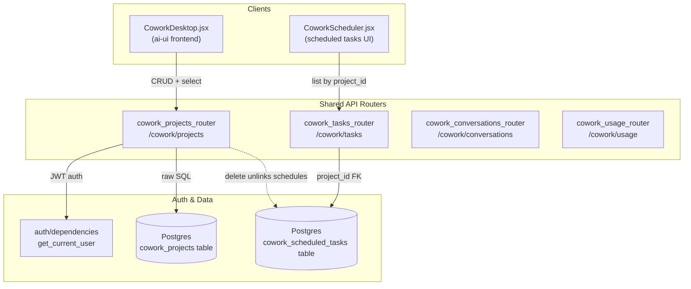
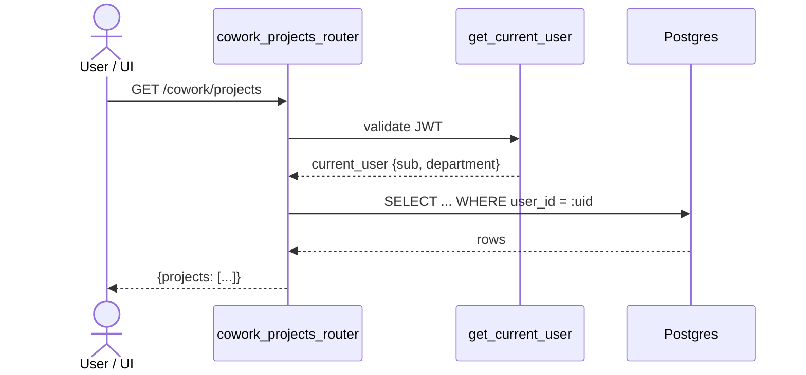
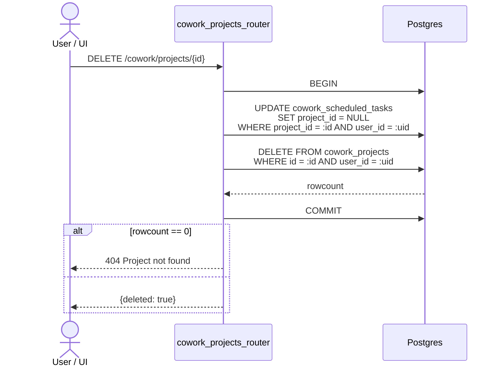
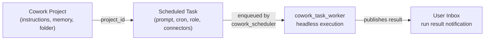
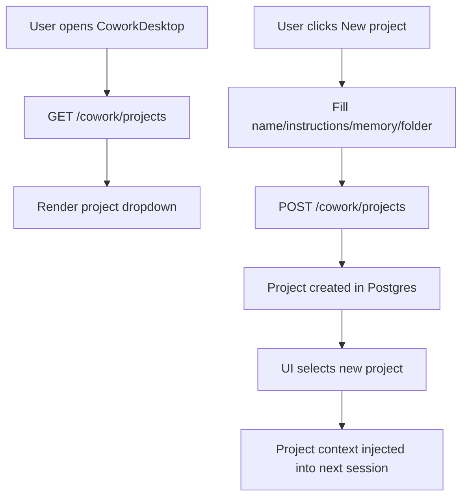

# cowork_projects_router

The `cowork_projects_router` module provides the REST API surface for **Cowork Projects** — server-persisted, per-user project containers used by the Cowork office assistant ("Buddy"). A project bundles standing instructions, persistent memory, and an optional document folder. Scheduled Cowork tasks can be attached to a project so that recurring work is grouped and scoped.

This module is part of the shared API router layer (`shared_api_routers`) and is consumed by the Cowork desktop UI and any other client that needs durable project context.

---

## 1. Purpose & Core Functionality

Before this module existed, Cowork projects were stored in browser `localStorage`. That made them non-durable, single-device, and impossible for scheduled tasks to reference reliably. The `cowork_projects_router` moves projects into Postgres, scopes them to the authenticated user's JWT `sub`, and exposes a small CRUD API:

| Method | Path | Purpose |
|--------|------|---------|
| `GET` | `/cowork/projects` | List the current user's projects |
| `POST` | `/cowork/projects` | Create a new project |
| `PUT` | `/cowork/projects/{id}` | Update an owned project |
| `DELETE` | `/cowork/projects/{id}` | Delete an owned project |

A project is the unit of context for Cowork: its **instructions** shape how Buddy behaves, its **memory** carries facts across tasks, and its **folder** defines a document scope for file-based work.

> **Note:** This module is distinct from [`projects_router`](../products/projects_router.md), which manages code-centric projects (repo, product, team) used by the main AI chat/workspace features. Cowork projects are office-assistant contexts; `projects_router` projects are software-development contexts.

---

## 2. Architecture & Component Relationships

### 2.1 High-level placement



### 2.2 Module dependencies

- **Authentication** — every route depends on `get_current_user` from `auth.dependencies`. The user's `sub` claim is the row owner; `department` is stored for optional future scoping.
- **Database access** — the router imports `db.database.engine` and uses raw SQLAlchemy `text()` queries. There is no ORM model for `cowork_projects` in `db/models.py`; the table is managed directly by this router and its related Cowork modules.
- **Logging** — uses `core.logger` for operational events (create/delete).
- **Scheduled tasks** — [`cowork_tasks_router`](cowork_tasks_router.md) stores `project_id` as a foreign-key-like reference. Deleting a project unlinks (sets `NULL`) those references rather than deleting the tasks.
- **Execution** — [`cowork_scheduler`](../workers/cowork_scheduler.md) and `cowork_task_worker` read task rows (including `project_id`) and run them headlessly.
- **Frontend** — `CoworkDesktop.jsx` loads projects via `GET /cowork/projects`, creates/updates them, and injects the active project's instructions/memory/folder into new office sessions.

---

## 3. Data Model

### 3.1 Request schema: `ProjectBody`

```python
class ProjectBody(BaseModel):
    name: str
    instructions: str = ""
    memory: str = ""
    folder: Optional[str] = None
```

| Field | Meaning |
|-------|---------|
| `name` | Human-readable project label (required, trimmed) |
| `instructions` | Standing system-like instructions applied to every task in the project |
| `memory` | Persistent facts/context the assistant should remember across tasks |
| `folder` | Optional local or server-side document folder that scopes file access |

### 3.2 Storage schema (`cowork_projects`)

The router writes the following columns:

| Column | Source |
|--------|--------|
| `id` | `uuid.uuid4()` |
| `user_id` | `current_user["sub"]` |
| `name` | `ProjectBody.name` (trimmed) |
| `instructions` | `ProjectBody.instructions` |
| `memory` | `ProjectBody.memory` |
| `folder` | `ProjectBody.folder` or `NULL` |
| `department` | `current_user.get("department")` or `NULL` |
| `created_at` / `updated_at` | Postgres defaults / `NOW()` |

The response helper `_row()` serializes rows into a flat JSON dict with ISO-like string timestamps.

---

## 4. Endpoints & Behavior

### 4.1 `GET /cowork/projects` — `list_projects`

Returns all projects owned by the current user, ordered by `updated_at DESC`.



### 4.2 `POST /cowork/projects` — `create_project`

Validates that `name` is non-empty after trimming, generates a UUID, inserts the row, and logs the creation.

```mermaid
sequenceDiagram
    actor U as User / UI
    participant CPR as cowork_projects_router
    participant AUTH as get_current_user
    participant DB as Postgres

    U->>CPR: POST /cowork/projects (ProjectBody)
    CPR->>CPR: trim(name); 400 if empty
    CPR->>AUTH: validate JWT
    AUTH-->>CPR: current_user
    CPR->>CPR: generate project_id
    CPR->>DB: INSERT cowork_projects
    DB-->>CPR: ok
    CPR->>CPR: logger.info(...)
    CPR-->>U: 201 {id, name}
```

### 4.3 `PUT /cowork/projects/{project_id}` — `update_project`

Updates mutable fields of an owned project. Returns `404` if the `(id, user_id)` pair does not exist.

### 4.4 `DELETE /cowork/projects/{project_id}` — `delete_project`

Deletes the project but **preserves** its scheduled tasks by setting their `project_id` to `NULL`. This avoids accidental data loss while keeping the foreign reference clean.



---

## 5. How It Fits Into the Overall System

### 5.1 Cowork session context

In `CoworkDesktop.jsx`, the active project is stamped onto every new office session:

1. The UI loads projects from `GET /cowork/projects` on mount.
2. The user selects a project from a dropdown.
3. The project's `instructions`, `memory`, and `folder` are passed into `coworkOfficeCreateSession`.
4. The agent uses that context for the lifetime of the session.

This makes projects the durable "persona + memory + workspace" container for the Cowork office assistant.

### 5.2 Scheduled-task grouping

`CoworkScheduler.jsx` opens scoped to the active project (`projectId`, `projectName`). When a task is created, [`cowork_tasks_router`](cowork_tasks_router.md) stores the project's id in `cowork_scheduled_tasks.project_id`. Later, the scheduler and worker can retrieve the task and, if needed, rehydrate the project's context.



### 5.3 Security & isolation

- **Ownership isolation** — every query includes `user_id = :uid`, so users can only see and mutate their own projects.
- **Input validation** — `name` is trimmed and required; other fields are optional strings.
- **No cascade delete** — scheduled tasks are unlinked, not destroyed, preventing accidental loss of recurring work.
- **Department column** — stored at creation for potential future ABAC/department scoping, but the current implementation is strictly user-scoped.

---

## 6. Process Flows

### 6.1 Creating and selecting a project



### 6.2 Deleting a project with linked schedules

```mermaid
flowchart TD
    A[User deletes project] --> B[DELETE /cowork/projects/{id}]
    B --> C[BEGIN transaction]
    C --> D[UPDATE cowork_scheduled_tasks<br/>SET project_id = NULL]
    D --> E[DELETE FROM cowork_projects]
    E --> F[COMMIT]
    F --> G[Return {deleted: true}]
```

---

## 7. Related Modules

| Module | Relationship |
|--------|--------------|
| [`cowork_tasks_router`](cowork_tasks_router.md) | Stores `project_id` on scheduled tasks; provides task CRUD and history |
| [`cowork_scheduler`](../workers/cowork_scheduler.md) | Polls/dispatches due scheduled tasks |
| `cowork_task_worker` | Executes scheduled tasks headlessly and publishes inbox notifications |
| [`cowork_conversations_router`](cowork_conversations_router.md) | Persists Cowork conversations; may carry `projectId` |
| [`cowork_usage_router`](cowork_usage_router.md) | Records Cowork usage and spend limits |
| `auth/dependencies` | Supplies `get_current_user` JWT dependency |
| `db/database` | Provides the SQLAlchemy engine used for raw queries |
| `core/logger` | Structured logging for operational events |
| [`projects_router`](../products/projects_router.md) | **Different** project type — code/workspace projects with repos and products |

---

## 8. Developer Notes

- The router intentionally uses **raw SQL** rather than an ORM model. This keeps the Cowork schema lightweight and co-located with the router logic.
- The `department` column is written but not used for filtering today. If multi-tenant or department-scoped Cowork features are added, this column is the natural extension point.
- `folder` is stored as a free-form string. The desktop client interprets it as a local filesystem path; a web client could interpret it as a document namespace or bucket.
- When extending the schema, keep `ProjectBody` and the `_COLS` / `_row()` helper in sync to avoid silent column mismatches.
