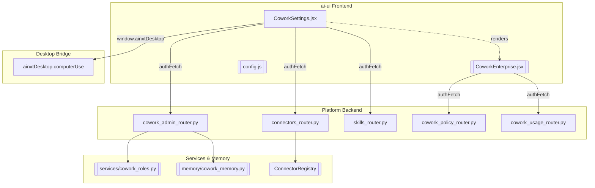
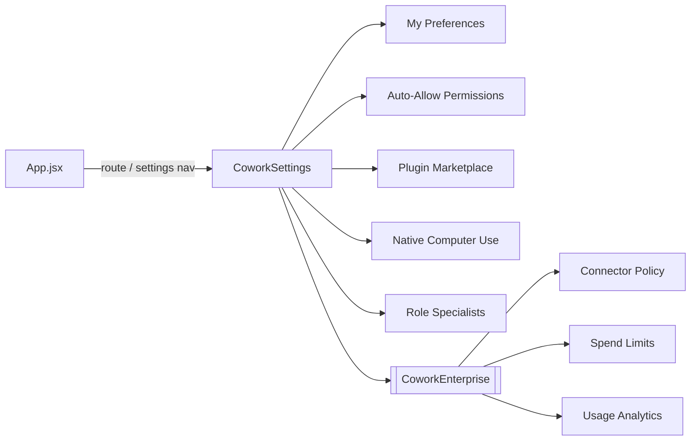
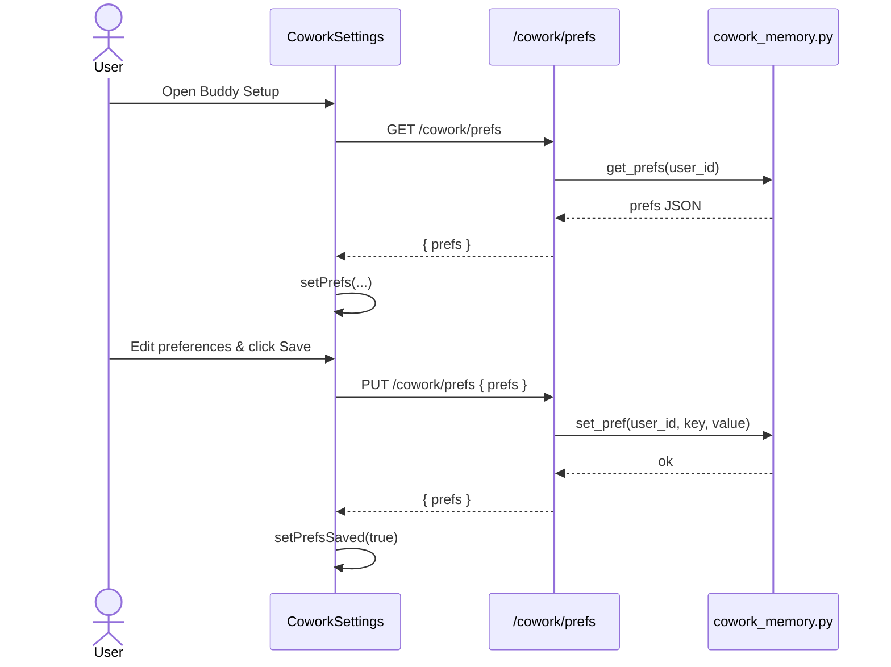
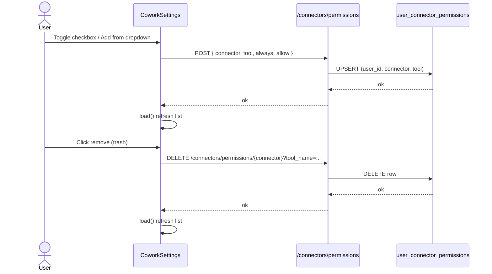
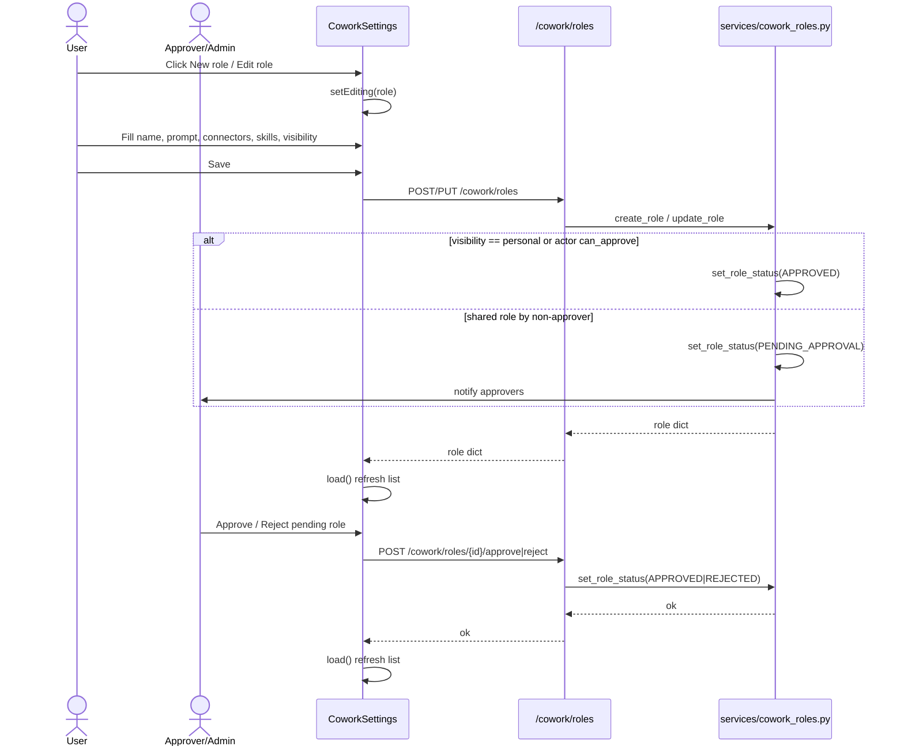

# Cowork Settings (Buddy Setup)

## Introduction

`CoworkSettings` is the React-based **Buddy Setup** screen in the `ai-ui` frontend. It is the single self-service personalization hub where end-users configure how the AI assistant ("Buddy") drafts content, which connector tools it may invoke without prompting, and which role-specialist persona it should adopt. For administrators, the same screen also provides governance controls over role publishing, connector policies, department spend limits, and usage analytics.

The module is implemented in `ai-ui/src/components/CoworkSettings.jsx` and is backed by the platform's backend routers, primarily `cowork_admin_router.py` and `routers/connectors_router.py`. It embeds the [CoworkEnterprise](cowork_enterprise.md) component for organization-wide policy and budget controls.

---

## Purpose and Core Functionality

The module serves two audiences:

1. **End users** — personalize Buddy's behavior and manage their own auto-allow permissions and private role specialists.
2. **Administrators / approvers** — manage org-wide role marketplace, connector policies, department spend limits, usage analytics, and native computer-use enablement.

### Feature Areas

| Section | Audience | Purpose |
|---------|----------|---------|
| **My Preferences** | All users | Configure email signature, default document format, preferred PPT theme, and response tone. |
| **Auto-Allow Permissions** | All users | Choose which connector tools Buddy (and scheduled tasks) may run without per-use confirmation. |
| **Plugin Marketplace** | All users | Browse and select from published, approved role specialists. |
| **Native Computer Use** | Admin + desktop only | Enable or disable local desktop automation via the desktop app's computer-use bridge. |
| **Role Specialists** | All users (create personal); admins/approvers (publish/approve) | Build, edit, approve, and publish persona roles that bundle a system prompt, allowed connectors, and office skills. |
| **Enterprise Controls** | Admin only | Org-wide connector allow/deny policies, department spend limits, and usage analytics. |

---

## Architecture

### Component Hierarchy

---

## Component Responsibilities

### `CoworkSettings`

The main container component. It:

- Determines whether the current user is an admin (`user?.role === "admin"`).
- Loads user preferences, roles, connectors, skills, and connector permissions in parallel on mount.
- Renders all sub-sections conditionally based on user role and desktop availability.
- Manages the `editing` state for role creation/update.

### `togglePermission(connectorName, toolName, currentValue)`

Upserts a per-user permission decision. When `always_allow` is toggled on, Buddy may invoke that tool without an interactive approval prompt. Calls `POST /connectors/permissions`.

### `savePrefs()`

Persists the user's personal preferences (`email_signature`, `default_doc_format`, `preferred_ppt_theme`, `tone`) via `PUT /cowork/prefs`.

### `toggleCu()`

Toggles the desktop-native computer-use capability by calling `window.ainxtDesktop.computerUse.setEnabled(...)`. Only available when the user is an admin and the desktop bridge is present.

### `saveRole()`

Creates or updates a role specialist. Validates that `name` and `system_prompt` are non-empty, strips internal UI fields, and sends `POST /cowork/roles` or `PUT /cowork/roles/{id}`. Shared roles (`private`/`public`) enter an approval workflow unless the actor is an approver.

### `handleAdd()`

Adds a new connector/tool pair to the auto-allow list using the two-dropdown form. Supports wildcard (`*`) entries that apply to every tool of a connector.

### `CoworkEnterprise` (embedded)

Rendered only for admins. Provides organization-wide connector policy rules, department spend limits, and usage analytics. See [cowork_enterprise.md](cowork_enterprise.md) for detailed documentation.

---

## Data Flows

### Preferences Load and Save

### Auto-Allow Permissions

### Role Specialist Lifecycle

---

## State Management

`CoworkSettings` uses local React state (`useState`, `useEffect`, `useCallback`). No external store (e.g., Redux/Zustand) is used.

| State | Type | Description |
|-------|------|-------------|
| `prefs` | object | Current preference values. |
| `savingPrefs` / `prefsSaved` | boolean | UI feedback for save action. |
| `roles` | array | Roles visible to the current user. |
| `connectors` | array | Available connector definitions with tool lists. |
| `skills` | array | Available office/behavioral skills. |
| `editing` | object \| null | Role currently being created or edited. |
| `permissions` | array | Current user's connector permission rows. |
| `permBusy` | object | Loading flags per connector::tool key. |
| `cuEnabled` | boolean | Desktop computer-use enabled state. |
| `mktQuery` / `skillQuery` | string | Search filters for marketplace and skill picker. |

---

## API Endpoints Used

| Endpoint | Method | Purpose |
|----------|--------|---------|
| `/cowork/prefs` | GET, PUT | Load/save user preferences. |
| `/cowork/roles` | GET, POST | List and create role specialists. |
| `/cowork/roles?published=1` | GET | List only published/approved roles for the marketplace. |
| `/cowork/roles/{id}` | PUT, DELETE | Update or delete a role. |
| `/cowork/roles/{id}/approve` | POST | Approve a pending role. |
| `/cowork/roles/{id}/reject` | POST | Reject a pending role. |
| `/connectors/available` | GET | List active connectors and their tools. |
| `/connectors/permissions` | GET, POST | List/upsert user connector permissions. |
| `/connectors/permissions/{connector}?tool_name=...` | DELETE | Revoke a permission. |
| `/skills` | GET | List available skills. |

For admin-only enterprise endpoints, see [cowork_enterprise.md](cowork_enterprise.md).

---

## Security and Governance

### Role Visibility Tiers

Roles support three visibility tiers with different governance requirements:

| Tier | Scope | Approval Required |
|------|-------|-------------------|
| `personal` | Only the creator | No |
| `private` | Creator's department | Yes, unless creator is an approver |
| `public` | Whole organization | Yes; admin-only creation |

The backend enforces these rules in `cowork_admin_router.py`. The UI mirrors them by disabling the `public` option for non-admin users.

### Connector Permissions

- Permissions are stored per user in `ainxt.user_connector_permissions`.
- A wildcard entry (`tool: "*"`) applies to all tools of a connector.
- Revoking a permission deletes the row, causing Buddy to prompt the user again on next use.
- Only a fixed allowlist of connectors is surfaced in the UI for auto-allow (`microsoft_365`, `gitlab`, `jira_connector`).

### Native Computer Use

- Only admins can enable it.
- Requires the desktop bridge (`window.ainxtDesktop.computerUse`).
- Actions are confirmation-gated and screenshots are redacted for PAN/PII before reaching the model.

---

## Dependencies and Related Modules

### Direct Imports

| Import | Module | Purpose |
|--------|--------|---------|
| `authFetch`, `API_BASE` | [config.md](../core/config.md) | Authenticated HTTP client and API base URL. |
| `CoworkEnterprise` | [cowork_enterprise.md](cowork_enterprise.md) | Admin-only enterprise policy and analytics UI. |

### Backend Dependencies

| Backend Module | Documentation | Responsibility |
|----------------|---------------|----------------|
| `routers/cowork_admin_router.py` | [shared_api_routers.md](../core/shared_api_routers.md) | Role CRUD, approval workflow, preferences. |
| `routers/connectors_router.py` | [shared_api_routers.md](../core/shared_api_routers.md) | Connector definitions and user permissions. |
| `routers/skills_router.py` | [shared_api_routers.md](../core/shared_api_routers.md) | Skill listing for role builder. |
| `services/cowork_roles.py` | [shared_core.md](../core/shared_core.md) | Role persistence and governance logic. |
| `memory/cowork_memory.py` | [shared_core.md](../core/shared_core.md) | User preference storage. |

### Related Frontend Modules

| Module | Documentation | Relationship |
|--------|---------------|--------------|
| `CoworkDesktop` | [cowork_desktop.md](cowork_desktop.md) | Uses role/permission context when executing desktop tasks. |
| `CoworkCanvas` | [cowork_canvas.md](cowork_canvas.md) | May consume published roles for visual cowork sessions. |
| `CoworkScheduler` | [cowork_scheduler.md](../workers/cowork_scheduler.md) | Scheduled tasks respect auto-allow permissions configured here. |
| `AuthContext` | [auth.md](../auth/auth.md) | Supplies the `user` object (role, department, approval rights). |

---

## How It Fits into the Overall System

`CoworkSettings` is the configuration surface for the **Buddy** assistant experience. It connects end-user personalization with backend governance:

- **Chat and task execution** components (e.g., `Chat`, `CoworkDesktop`, `CoworkScheduler`) read the preferences, roles, and permissions managed here to decide how to respond, which connectors to use, and whether to prompt for approval.
- **Role specialists** created here act as lightweight agents: a system prompt + connector allowlist + skill set. They are published through the same approval-style governance used for knowledge-base artifacts.
- **Enterprise controls** embedded via `CoworkEnterprise` give administrators a single place to enforce org-wide connector policy and budget caps, which override or complement individual user permissions.
- **Native computer use** settings bridge the web UI to the desktop application, allowing controlled local automation while keeping the enablement decision visible and admin-gated.

In short, `CoworkSettings` is the policy and personalization hub that shapes every Buddy interaction across the platform.
