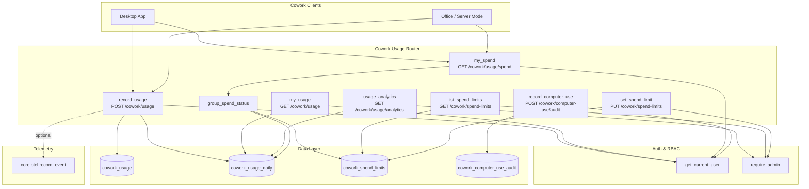
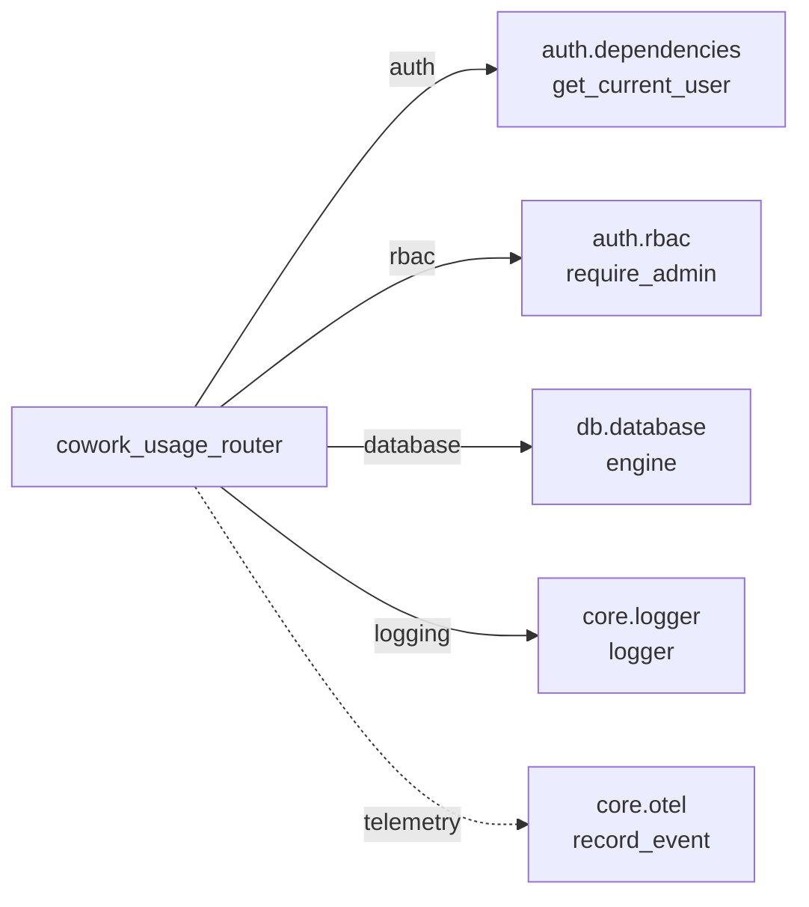
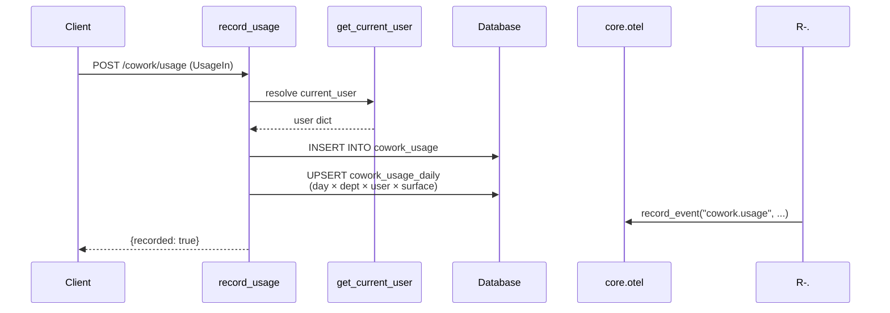
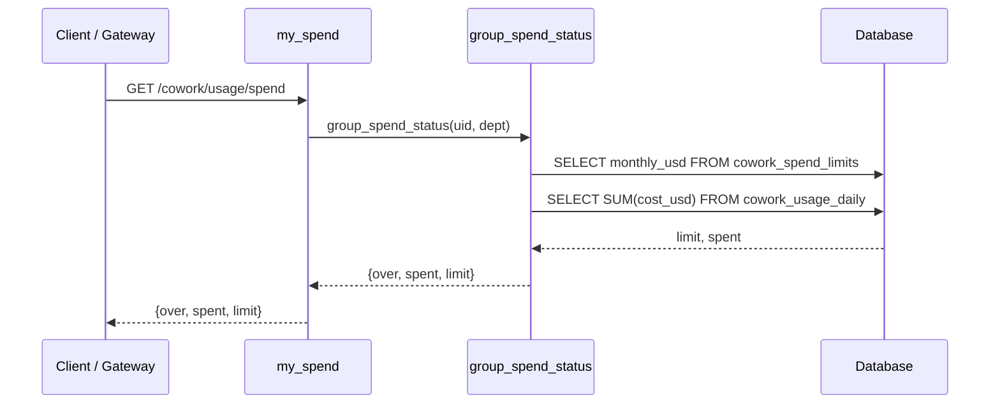
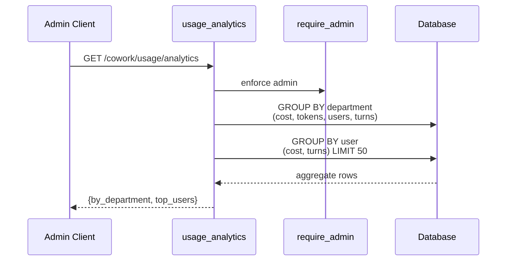
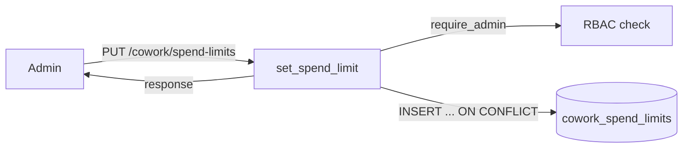

# Cowork Usage Router

## Brief Introduction

The `cowork_usage_router` module provides the enterprise usage-tracking and spend-governance surface for the Cowork product. It exposes FastAPI endpoints that record per-turn cost and token consumption, roll up month-to-date usage for the caller, produce admin analytics, enforce department-level monthly USD spend limits, and audit computer-use (CUA) actions. Spend-limit checks are consumed by the gateway in server-office mode and by the desktop client before spawning an agent, making this router a central piece of cost governance for Cowork.

---

## Purpose and Core Functionality

This router is responsible for:

1. **Recording usage** — Accepting per-turn cost/token payloads from clients and writing them to `cowork_usage` and a pre-aggregated `cowork_usage_daily` rollup.
2. **Personal usage queries** — Returning the caller's month-to-date cost, tokens, and turn count from the rollup.
3. **Admin analytics** — Returning per-department and top-user aggregates for the current month.
4. **Spend-limit governance** — Checking whether a user's department has exceeded its monthly USD cap, and allowing admins to configure caps.
5. **Computer-use audit** — Recording allow/block/redaction metadata for computer-use actions without storing sensitive values.

The design intentionally writes raw events once and maintains a daily rollup table so that read paths (analytics, spend checks, personal usage) never perform full-table scans on the raw event table.

---

## Architecture Overview



---

## Component Descriptions

### Pydantic Models

| Model | Purpose |
|-------|---------|
| `UsageIn` | Inbound payload for a single usage event: `cost_usd`, `input_tokens`, `output_tokens`, `model`, and `surface` (e.g. `cowork`, `office`, `scheduled`). |
| `SpendLimit` | Admin payload for setting a department cap: `department` and `monthly_usd`. A value of `0.0` means unlimited. |
| `CUAudit` | Inbound audit record for a computer-use action: `session_id`, `action`, `target`, `allowed`, `block_reason`, `findings_count`, `redacted`. |

### Route Handlers

| Handler | Method / Path | Access | Description |
|---------|---------------|--------|-------------|
| `record_usage` | `POST /cowork/usage` | Authenticated user | Inserts a raw usage row and upserts the caller's daily rollup. Emits an optional OTLP event. |
| `my_usage` | `GET /cowork/usage` | Authenticated user | Returns the caller's month-to-date cost, tokens, and turns from the daily rollup. |
| `usage_analytics` | `GET /cowork/usage/analytics` | Admin only | Returns per-department aggregates and the top 50 users by cost for the current month. |
| `my_spend` | `GET /cowork/usage/spend` | Authenticated user | Returns `{over, spent, limit}` for the caller's department. |
| `list_spend_limits` | `GET /cowork/spend-limits` | Admin only | Lists all configured department caps. |
| `set_spend_limit` | `PUT /cowork/spend-limits` | Admin only | Creates or updates a department cap. |
| `record_computer_use` | `POST /cowork/computer-use/audit` | Authenticated user | Records a computer-use audit event without storing sensitive values. |

### Helper Function

| Function | Purpose |
|----------|---------|
| `group_spend_status(user_id, department)` | Reads the department's monthly cap and current spend from the rollup, returning a guard object used by `my_spend` and by external callers before running agents. |
| `_db()` | Lazy import helper that returns the SQLAlchemy engine and `text` constructor to avoid circular imports at module load time. |

---

## Dependencies and Integration

The router relies on the following shared modules:

- **[auth](../auth/auth.md)** — `get_current_user` resolves the JWT-authenticated caller, and `require_admin` restricts analytics and spend-limit management to administrators.
- **db_database** — Uses `db.database.engine` for raw SQL inserts/upserts against the `cowork_usage`, `cowork_usage_daily`, `cowork_spend_limits`, and `cowork_computer_use_audit` tables.
- **core_logger** — `logger` is used for debug output when spend checks fail.
- **core_otel** — `record_event` emits an optional `cowork.usage` OTLP event for enterprise telemetry; failures are swallowed so telemetry never breaks the request.



---

## Data Flow

### Recording a Usage Event



### Spend Guard Check



### Admin Analytics



---

## Database Tables (Implied Schema)

The router operates on four tables managed elsewhere in the schema:

| Table | Role |
|-------|------|
| `cowork_usage` | Raw event log of every recorded turn. Columns include `user_id`, `department`, `role`, `surface`, `model`, `cost_usd`, `input_tokens`, `output_tokens`. |
| `cowork_usage_daily` | Pre-aggregated daily rollup keyed by `(day, department, user_id, surface)` with `cost_usd`, `tokens`, and `turns`. Used for all read paths. |
| `cowork_spend_limits` | Department caps keyed by `department` with `monthly_usd`, `updated_by`, `updated_at`. |
| `cowork_computer_use_audit` | Audit trail for computer-use actions. Stores metadata only (no sensitive values). |

---

## Security and Access Control

- All write/read endpoints require a valid JWT via [auth.dependencies.get_current_user](../auth/auth.md).
- Analytics and spend-limit configuration require admin privileges via [auth.rbac.require_admin](../auth/auth.md).
- Cost and token values are clamped to non-negative numbers before persistence.
- `surface`, `session_id`, and `action` strings are truncated to safe lengths before insertion.
- Computer-use audit records never store the actual values observed; only the event, target, allow/block decision, block reason, findings count, and redaction flag are persisted.

---

## Process Flows

### Setting a Department Spend Limit



### Computer-Use Audit Trail

```mermaid
flowchart LR
    C[Client] -->|POST /cowork/computer-use/audit| R[record_computer_use]
    R -->|get_current_user| U[User context]
    R -->|INSERT| A[(cowork_computer_use_audit)]
    R -->|{recorded: true}| C
```

---

## How It Fits into the System

The `cowork_usage_router` sits between Cowork clients (desktop, office/server mode) and the underlying usage database. It is intentionally lightweight: it does not perform LLM inference, run agents, or manage workflows. Instead, it provides the cost-governance primitives that higher-level components consume:

- The **gateway** and **desktop app** call `GET /cowork/usage/spend` before spawning or running an agent to enforce department caps.
- Clients call `POST /cowork/usage` after each agent turn to record actual spend.
- Admins use `GET /cowork/usage/analytics` and the spend-limit endpoints to monitor and control organization-wide Cowork consumption.
- Computer-use audit events feed compliance and security reporting without exposing sensitive data.

For related functionality, see:

- **[cowork_admin_router](cowork_admin_router.md)** — Role and marketplace administration for Cowork.
- **[cowork_tasks_router](cowork_tasks_router.md)** — Task scheduling and approval flows.
- **[cowork_dispatch_router](cowork_dispatch_router.md)** — Dispatch creation and claiming.
- **[budget_router](../llm/budget_router.md)** — User-level budget, HOD caps, and increase requests.
- **[auth](../auth/auth.md)** — Authentication and authorization primitives.
- **db_database** — Database connection and schema details.
