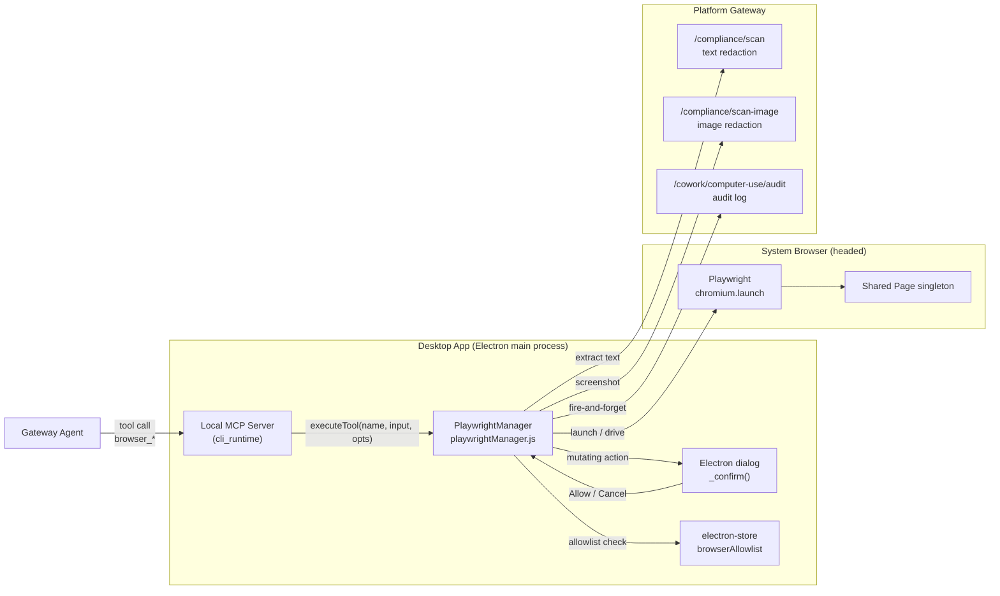
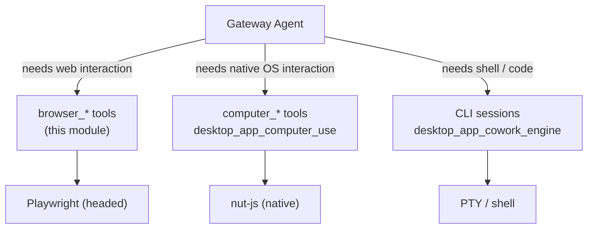
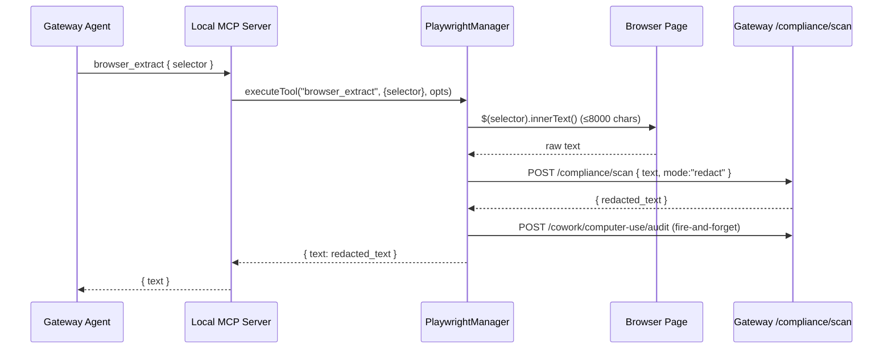
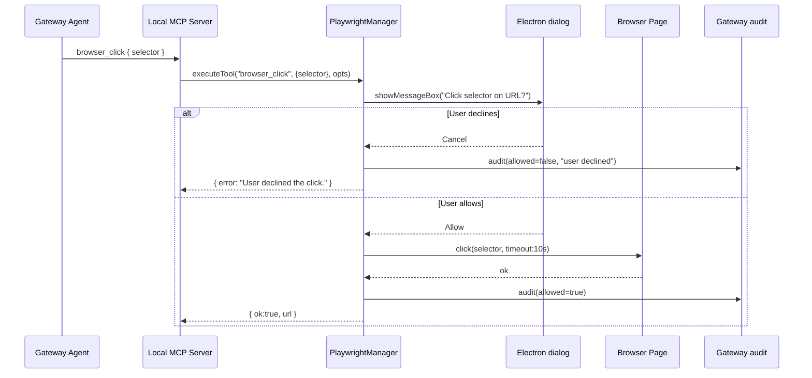
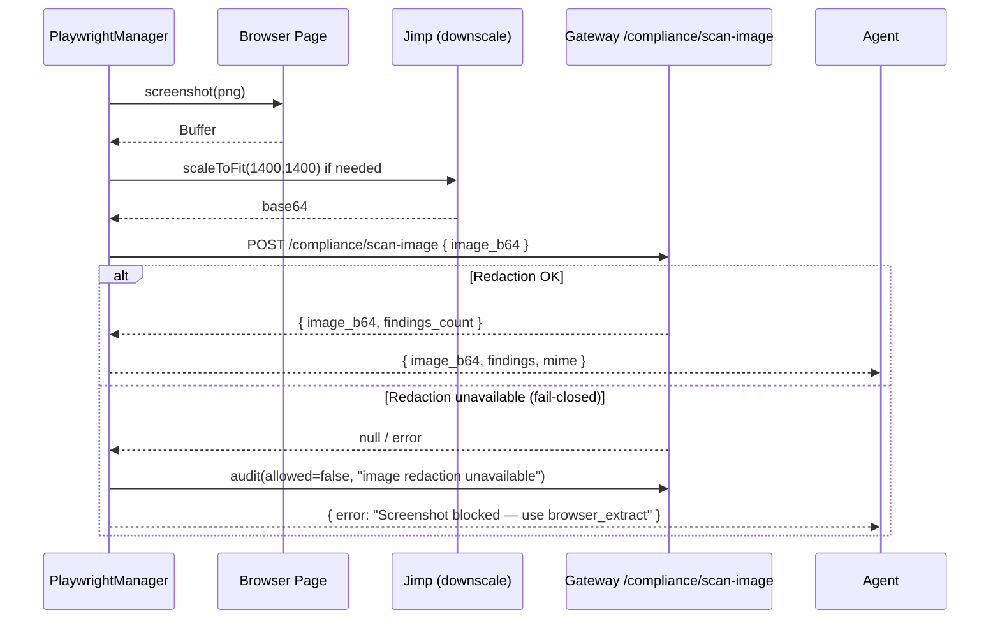
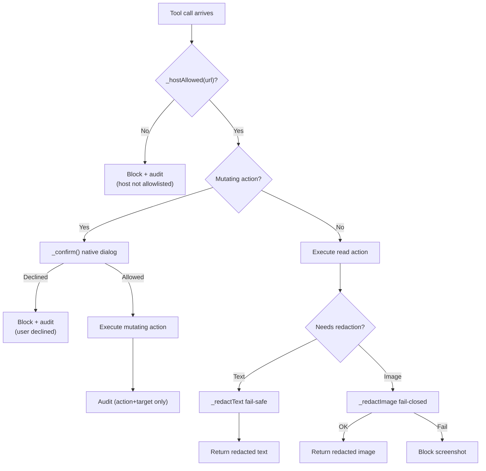

# Desktop App — Browser Automation (PlaywrightManager)

> Module: `desktop_app_browser_automation`
> Source: `desktop/src/browser/playwrightManager.js` (canonical) · `desktop/playwrightManager.js` (legacy mirror)

## 1. Introduction

The **Browser Automation** module is the desktop-only, web-scoped slice of the
desktop app's "computer use" capability. It lets the in-app agent ("Buddy") drive
a **real, headed browser on the user's own machine** to perform office tasks that
no first-class connector covers — e.g. *"open the internal dashboard and read
today's total"*, *"download the report from portal X"*.

It is built on **Playwright** (rather than Anthropic's stubbed native OS modules)
and is deliberately scoped to the web: navigation, text extraction, screenshots,
clicks, typing, and dropdown selection. It is the safer, more predictable
complement to the native OS-level [`desktop_app_computer_use`](desktop_app_computer_use.md)
module, which controls the mouse/keyboard/screen directly via `nut-js`.

### Design pillars (NPCI security posture)

| Pillar | Mechanism |
|---|---|
| **Host allowlist** | Navigation is rejected unless the URL host matches the configurable `browserAllowlist` (electron-store). Empty list = allow-all-HTTPS, audited. |
| **Human-in-the-loop** | Every *mutating* action (click / type / select) pops a native Electron confirmation dialog before executing. |
| **Audit trail** | Every action is logged (action + URL/selector) — **never** the typed values, which may contain secrets. |
| **PII redaction** | Extracted text and screenshots are redacted through the gateway compliance service *before* entering agent context. Text redaction is fail-*safe* (proceed); image redaction is fail-*closed* (block). |
| **Headed launch** | The browser is launched visibly so the user can watch the agent and log in manually — the agent never handles credentials. |

## 2. Architecture



### Where it fits in the system

The module is one of several "computer use" tool providers exposed to the gateway
agent through the desktop app's local MCP server (see
[`desktop_app_cowork_engine`](desktop_app_cowork_engine.md) and
[`desktop_app_main_process`](desktop_app_main_process.md)). The agent picks
`browser_*` tools when the task is web-scoped; it picks `computer_*` tools (from
[`desktop_app_computer_use`](desktop_app_computer_use.md)) when it must interact
with native desktop UI.



## 3. Core Components

### 3.1 Component map

```mermaid
classDiagram
  class PlaywrightManager {
    +TOOLS: ToolDescriptor[]
    +api: object
    +executeTool(name, input, opts)
    +isBrowserTool(name)
  }
  class BrowserLifecycle {
    +_launchBrowser()
    +_ensurePage()
    +_resetBrowser()
    +_STABILITY_ARGS
  }
  class Security {
    +_hostAllowed(url)
    +_confirm(message)
    +_audit(opts, action, target, allowed, reason)
  }
  class Compliance {
    +_gwPost(opts, apiPath, payload)
    +_redactText(opts, text)
    +_redactImage(opts, b64)
  }
  class ToolAPI {
    +navigate({url}, opts)
    +extract({selector}, opts)
    +screenshot(input, opts)
    +wait_for({selector, timeout}, opts)
    +back(input, opts)
    +click({selector}, opts)
    +type({selector, text}, opts)
    +select({selector, value}, opts)
    +close()
  }
  PlaywrightManager --> BrowserLifecycle
  PlaywrightManager --> Security
  PlaywrightManager --> Compliance
  PlaywrightManager --> ToolAPI
```

### 3.2 `executeTool(name, input, opts)`

The single entry point used by the local MCP server. It maps a tool name
(`browser_navigate`, `browser_extract`, …) to the corresponding `api.*` handler
and invokes it with `(input, opts)`. Throws on unknown tool names.

`opts` carries the gateway context needed for compliance and audit:
`{ gatewayBase, jwt, sessionId }`. When `opts` is absent (e.g. local testing),
redaction and audit calls silently no-op — the tools still function but without
the compliance guardrails.

### 3.3 Browser lifecycle — `_ensurePage()` / `_launchBrowser()` / `_resetBrowser()`

A single shared `_browser` + `_page` pair is reused across tool calls. The
lifecycle is defensive against the realities of corporate Windows:

- **Lazy Playwright load** — `require("playwright")` is deferred to first use so
  a corrupt/incomplete install doesn't break app startup.
- **System-browser-first launch** — Chromium is *not* bundled. The launcher tries
  system channels in platform order (Windows: Edge → Chrome → managed Chromium;
  macOS/Linux: Chrome → Edge → managed Chromium) so a fresh corporate machine
  works with zero extra installs and the installer stays small.
- **Stability flags** — `--no-sandbox`, `--disable-dev-shm-usage`, `--disable-gpu`,
  `--no-first-run`, `--no-default-browser-check`. These prevent the
  immediate-exit crash that headed Chrome/Edge exhibits on locked-down VDI /
  EDR-attached Windows (the process launches then dies before `newContext()`).
- **Liveness check** — `_ensurePage()` only reuses a page that is `!isClosed()`
  *and* whose browser `isConnected()`. A disconnected browser triggers
  `_resetBrowser()` and a fresh launch.
- **One retry** — if context/page creation fails because the just-launched browser
  died, the singleton is torn down and relaunched once from scratch before
  surfacing a human-readable error.
- **Disconnect listener** — `_browser.on("disconnected", _resetBrowser)` ensures
  a dead handle is never reused.

### 3.4 Security — `_hostAllowed()` / `_confirm()` / `_audit()`

- **`_hostAllowed(url)`** parses the URL host and checks it against
  `electron-store`'s `browserAllowlist`. With an empty allowlist it permits
  HTTPS (and localhost/private-range HTTP) but logs the host for audit. With a
  configured list it matches exact hosts and subdomains (`host === a` or
  `host.endsWith("." + a)`).
- **`_confirm(message)`** shows a native Electron `dialog.showMessageBox`
  (warning type, "Allow" / "Cancel"). Returns `true` only when the user
  explicitly allows. Used by `click`, `type`, `select`.
- **`_audit(opts, action, target, allowed, reason)`** is fire-and-forget. It
  POSTs `{ session_id, action, target, allowed, block_reason }` to the gateway's
  `/cowork/computer-use/audit` endpoint. **Values are never logged** — only the
  action name and the target (URL or CSS selector).

### 3.5 Compliance — `_gwPost()` / `_redactText()` / `_redactImage()`

`_gwPost(opts, apiPath, payload)` is a small `http`/`https` POST helper with an
8-second timeout and fail-safe `resolve(null)` on any error. It is the transport
for all gateway calls.

- **`_redactText(opts, text)`** — POSTs `{ text, mode: "redact" }` to
  `/compliance/scan` and returns `redacted_text`. **Fail-safe**: if compliance is
  unreachable, the original text is returned unchanged (reads never hard-block).
  The text itself is never logged.
- **`_redactImage(opts, b64)`** — POSTs `{ image_b64 }` to
  `/compliance/scan-image` and returns `{ ok, image_b64, findings }`.
  **Fail-closed**: if redaction is unavailable, `{ ok: false }` is returned and
  the screenshot tool blocks the result (a screenshot can leak far more than
  text). Screenshots are downscaled to ≤1400px long edge (via `jimp`) before
  redaction to stay within the model's tool-image cap.

## 4. Tool Catalog

Eight tools are exposed as MCP tool descriptors (`TOOLS` array) and dispatched by
`executeTool`. Read-only tools run without confirmation; mutating tools require
user confirmation.

| Tool | Type | Confirmation | Description |
|---|---|---|---|
| `browser_navigate` | read-ish | No (allowlist-gated) | Open a URL (allowlisted hosts only). Returns `{ url, title }`. |
| `browser_extract` | read | No | Read visible text from page or a CSS selector (≤8000 chars), PII-redacted. |
| `browser_screenshot` | read | No | Capture page screenshot, downscaled + PII-redacted (fail-closed). |
| `browser_wait_for` | read | No | Wait until a CSS selector appears (capped 30s). |
| `browser_back` | read | No | Go back one page in history. |
| `browser_click` | **mutating** | **Yes** | Click an element by CSS selector. |
| `browser_type` | **mutating** | **Yes** | Type text into a field (value never logged). |
| `browser_select` | **mutating** | **Yes** | Choose a `<select>` option by value. |

`isBrowserTool(name)` is a convenience predicate (`name.startsWith("browser_")`)
used by the MCP router to decide whether to route a tool call to this module.

## 5. Data Flow

### 5.1 Read path (e.g. `browser_extract`)



### 5.2 Mutating path (e.g. `browser_click`)



### 5.3 Screenshot path (fail-closed redaction)



## 6. Security Model



### Key guarantees

1. **No credential handling** — the browser is headed; the user logs in manually.
   The agent never sees or types credentials.
2. **No value logging** — `_log`, `_audit`, and the confirmation dialog message
   include only the action name and the target (URL / CSS selector). Typed text
   is never persisted.
3. **Asymmetric redaction failure** — text reads fail-*safe* (return original if
   compliance is down, because a read should not hard-block); image reads fail
   *closed* (block, because a raw screenshot can leak PANs and other PII that
   text extraction would not capture).
4. **Allowlist is the perimeter** — even with confirmation, navigation to a
   non-allowlisted host is rejected before any browser action.

## 7. Integration Points

| Integration | Direction | Detail |
|---|---|---|
| [`desktop_app_main_process`](desktop_app_main_process.md) | Host | The Electron main process owns the `dialog` module used by `_confirm()` and registers the global shortcut / tray that surfaces Buddy. |
| [`desktop_app_cowork_engine`](desktop_app_cowork_engine.md) | Sibling | The cowork CLI manager (`SessionManager`) and local MCP server route `browser_*` tool calls to `executeTool`. Browser tools are exposed alongside `computer_*` and CLI tools. |
| [`desktop_app_computer_use`](desktop_app_computer_use.md) | Sibling | Native OS automation (`nut-js`). Shares the same gateway compliance/audit endpoints and the same `_confirm`/`_audit` pattern, but operates on the whole screen rather than a scoped browser page. |
| `desktop_app_preload_bridge` | Sibling | The preload bridge exposes IPC to the renderer; browser automation runs entirely in the main process and does not cross the preload boundary. |
| Gateway compliance service | Outbound | `/compliance/scan` (text) and `/compliance/scan-image` (image) for PII redaction. |
| Gateway audit service | Outbound | `/cowork/computer-use/audit` for action audit logging. |
| `electron-store` | Local | `browserAllowlist` configuration key. |
| `playwright` (npm) | Local | Lazy-loaded; system-browser channels preferred over bundled Chromium. |
| `jimp` (npm) | Local | Optional image downscaling before redaction; falls back to raw base64 if unavailable. |

## 8. Configuration

| Key | Store | Default | Effect |
|---|---|---|---|
| `browserAllowlist` | `electron-store` | `[]` (empty) | Array of host strings. Empty = allow all HTTPS (+ localhost/private HTTP) with audit. Non-empty = exact host or subdomain match required. |

Environment / runtime context passed via `opts`:

| Field | Purpose |
|---|---|
| `opts.gatewayBase` | Base URL of the platform gateway (e.g. `https://ainxt...`). Required for redaction + audit. |
| `opts.jwt` | Bearer token for gateway auth. |
| `opts.sessionId` | Correlates audit entries to a cowork session. |

When `opts` is missing or incomplete, `_gwPost` resolves `null` and the tools
degrade gracefully: text is returned unredacted, screenshots are blocked, and
audit calls are skipped.

## 9. Error Handling & Resilience

- **Browser won't launch** — `_launchBrowser` tries every system channel in
  order and aggregates failure messages into a single actionable error
  ("Install Microsoft Edge or Google Chrome, or run `npx playwright install
  chromium`").
- **Browser dies mid-session** — the `disconnected` listener clears singletons;
  the next `_ensurePage()` relaunches. One internal retry absorbs the
  launch-then-immediately-exit crash common on corporate Windows.
- **Gateway unreachable** — all gateway calls have an 8s timeout and resolve
  `null` on error. Text redaction falls through to original text; image
  redaction blocks the screenshot; audit is fire-and-forget.
- **Element not found / timeout** — `extract` returns `{ error }` if no element
  matches; `wait_for` returns `{ error }` on timeout; `click`/`type`/`select`
  propagate Playwright timeouts.

## 10. File Notes

- **`desktop/src/browser/playwrightManager.js`** is the canonical, current
  implementation (audit log prefix `[buddy-browser]`).
- **`desktop/playwrightManager.js`** is a legacy mirror at the repo root
  (audit log prefix `[cowork-browser]`). It is functionally identical but should
  be considered deprecated in favor of the `src/browser/` path. Both export the
  same `{ api, TOOLS, executeTool, isBrowserTool }` surface.

## 11. Quick Reference

```js
// Dispatching a tool call from the local MCP server
const { executeTool, isBrowserTool, TOOLS } = require("./browser/playwrightManager");

if (isBrowserTool(toolName)) {
  const result = await executeTool(toolName, input, {
    gatewayBase, jwt, sessionId,
  });
}
```

```js
// Exposed MCP tool descriptors (TOOLS array)
[
  "browser_navigate",   // { url }                       → { url, title }
  "browser_extract",    // { selector? }                 → { text }       (redacted)
  "browser_screenshot", // {}                            → { image_b64 }  (redacted, fail-closed)
  "browser_wait_for",   // { selector, timeout? }        → { ok }
  "browser_back",       // {}                            → { ok, url }
  "browser_click",      // { selector }   [confirm]      → { ok, url }
  "browser_type",       // { selector, text } [confirm]  → { ok }
  "browser_select",     // { selector, value } [confirm] → { ok }
]
```
