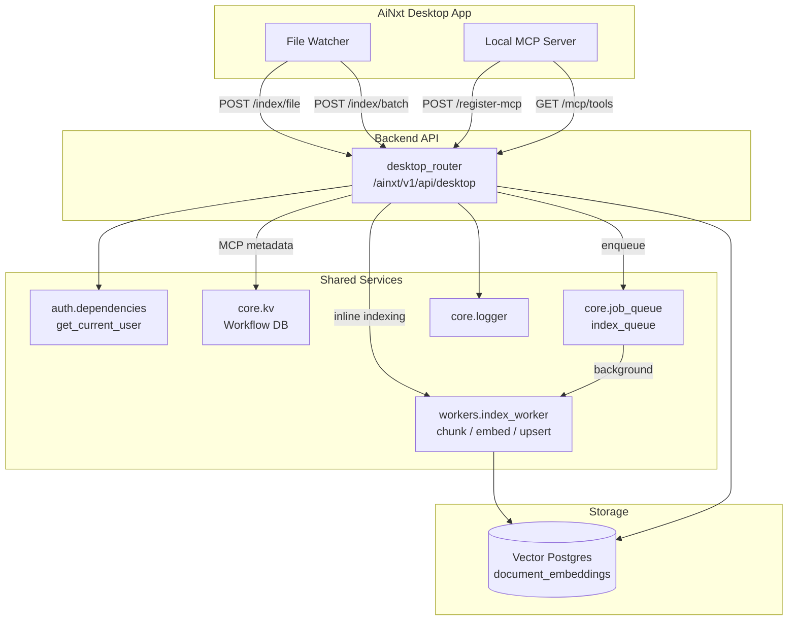
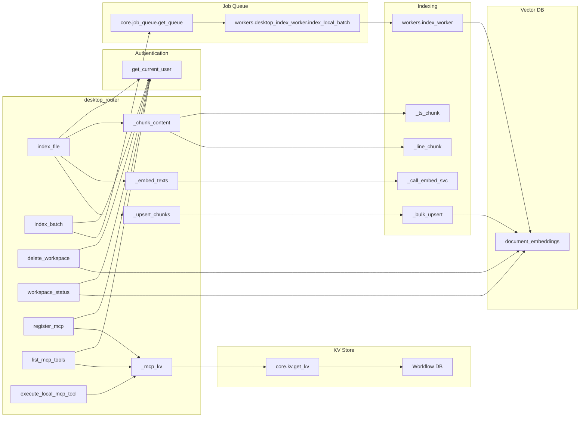
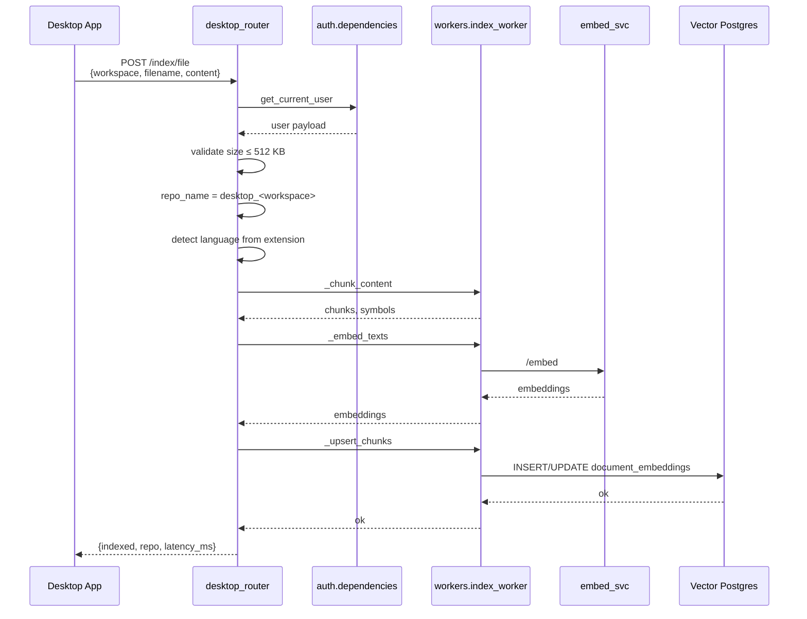
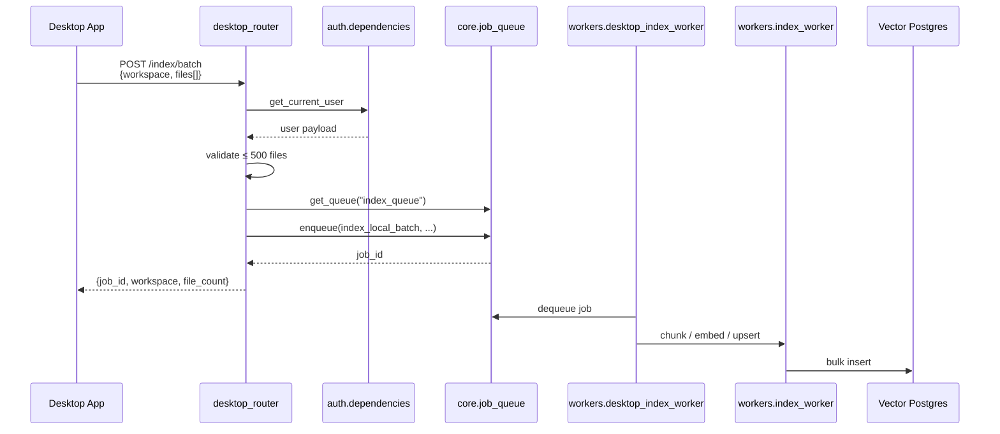
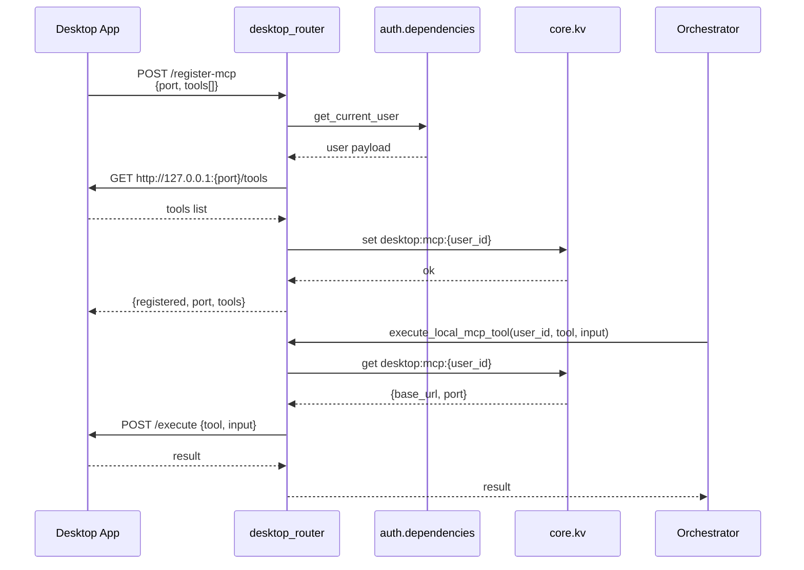

# Desktop Router

The `desktop_router` module exposes the `/ainxt/v1/api/desktop/*` API surface that connects the AiNxt Electron desktop application to the platform backend. It is responsible for two primary capabilities:

1. **Local file indexing** — ingesting files from a user's local workspace into the shared vector store so they become searchable through RAG, code retrieval, and agent context.
2. **Local MCP server registration** — allowing the desktop app to advertise a local [Model Context Protocol (MCP)](../mcp/mcp_system.md) server, whose tools can be discovered and invoked by the backend orchestrator on behalf of the user.

This router is intentionally thin: it validates requests, enforces size/scope limits, delegates heavy work to background workers and shared indexing utilities, and stores transient MCP metadata in the workflow KV store.

---

## Module Purpose

The desktop router bridges the user's local machine and the cloud backend. It enables:

- **Incremental indexing** of local project files as the user edits them.
- **Batch indexing** of entire workspaces via background jobs.
- **Workspace lifecycle management** (status checks and deletion of indexed vectors).
- **Registration and discovery** of a local MCP server running inside the desktop app.
- **Execution of local MCP tools** by backend agents when the desktop app is online.

All endpoints require an authenticated user. The router does not implement its own auth logic; it depends on the shared `auth/dependencies` layer.

---

## Architecture Overview

---

## Core Components

### Request Models

| Model | Purpose |
|-------|---------|
| `IndexFileRequest` | Payload for indexing a single local file inline. Contains `workspace`, `filename`, `content`, and optional `language`. |
| `IndexBatchRequest` | Payload for queuing a batch of files. Contains `workspace` and a list of `files`. |
| `RegisterMcpRequest` | Payload for registering a local MCP server. Contains `port` and a list of `tools`. |

### Route Handlers

| Endpoint | Method | Handler | Description |
|----------|--------|---------|-------------|
| `/index/file` | POST | `index_file` | Indexes one file synchronously. Best for watcher-driven incremental updates. |
| `/index/batch` | POST | `index_batch` | Enqueues up to 500 files for background indexing. Returns an RQ `job_id`. |
| `/index/{workspace}` | DELETE | `delete_workspace` | Removes all vector chunks for a workspace. |
| `/index/{workspace}/status` | GET | `workspace_status` | Returns chunk count and last-indexed timestamp. |
| `/register-mcp` | POST | `register_mcp` | Registers the user's local MCP server after reachability check. |
| `/mcp/tools` | GET | `list_mcp_tools` | Lists tools from the registered local MCP server. |

### Internal Helpers

| Function | Responsibility |
|----------|----------------|
| `_chunk_content` | Delegates to `workers.index_worker` for tree-sitter or line-based chunking. |
| `_embed_texts` | Calls the embedding service through `workers.index_worker._call_embed_svc`. |
| `_upsert_chunks` | Persists chunks and embeddings to `document_embeddings` via `workers.index_worker._bulk_upsert`. |
| `_detect_language` | Maps file extensions to language identifiers for tree-sitter chunking. |
| `_get_vec_pg` | Opens a direct `psycopg2` connection to the vector Postgres database. |
| `_mcp_kv` / `_mcp_get` / `_mcp_set` / `_mcp_del` | Read/write transient MCP registration state in the workflow KV store. |
| `execute_local_mcp_tool` | Invoked by the orchestrator to run a tool on the user's local MCP server. |

---

## Component Relationships

---

## Data Flows

### Single File Indexing

### Batch File Indexing

### MCP Server Registration and Tool Execution

---

## How It Fits into the System

The desktop router is one of many API routers mounted in the shared API layer. It is tightly coupled to the desktop client experience but reuses the same indexing, embedding, and storage infrastructure as repository indexing and knowledge-base ingestion.

- **Search & RAG**: Files indexed through this router are stored in `document_embeddings` with the `repo` prefix `desktop_<workspace>`. They become available to hybrid retrievers and code-aware agents. See `models/hybrid_search` and `models/kb_graph_expand`.
- **Agent Orchestration**: The orchestrator can call `execute_local_mcp_tool` to run tools that only exist on the user's machine (e.g., local file system access, IDE integrations, or custom desktop automations). See `agents/orchestrator` and `mcp/registry`.
- **Job Queue**: Batch indexing uses the same RQ queue infrastructure as repository indexing. See `core/job_queue`.
- **KV Store**: MCP registrations are stored in the workflow KV database with an 8-hour TTL, ensuring stale registrations expire automatically. See [`core/kv`](../storage/kv_store.md).
- **Authentication**: All routes depend on the shared JWT/API-key/cookie auth layer. See `auth/dependencies`.

---

## Configuration & Limits

| Constant | Value | Purpose |
|----------|-------|---------|
| `DESKTOP_REPO_PREFIX` | `"desktop"` | Prefix for the `repo` column in `document_embeddings`. |
| `MAX_FILE_SIZE` | `524_288` bytes (512 KB) | Maximum inline file content size. |
| Batch file limit | `500` files | Maximum files per batch request. |
| `_MCP_TTL` | `28_800` seconds (8 hours) | Expiration for MCP registration entries. |
| MCP reachability timeout | `3` seconds | Health check when registering or listing tools. |
| MCP tool execution timeout | `20` seconds | Timeout for orchestrator-driven tool calls. |

Vector database connection parameters are read from environment variables (`VECTOR_POSTGRES_HOST`, `VECTOR_POSTGRES_PORT`, `POSTGRES_DB`, `POSTGRES_USER`, `POSTGRES_PASSWORD`).

---

## Error Handling

- **400 Bad Request**: Returned when file content exceeds `MAX_FILE_SIZE` or batch size exceeds 500 files.
- **400 Bad Request (MCP)**: Returned when the desktop MCP server is not reachable on the advertised port.
- **401 Unauthorized**: Returned by `get_current_user` when the request lacks a valid token, cookie, or API key.
- **500 Internal Server Error**: Returned for unexpected failures during chunking, embedding, upserting, or database operations. Errors are logged via `core.logger`.

---

## Security & Privacy Considerations

- All endpoints require authentication.
- File contents are transmitted from the desktop app to the backend; the backend does not pull from the local filesystem directly.
- Workspace names are normalized (`-` and spaces replaced with `_`) before being used as the repository identifier.
- MCP registrations are scoped per user (`desktop:mcp:{user_id}`) and expire after 8 hours.
- The orchestrator can only invoke tools on a registered MCP server; it never exposes the port or base URL to other users.
- Department metadata from the user payload is attached to chunks for ACL/RAG filtering. See `core/rag_acl`.

---

## Related Modules

- `auth/dependencies` — Authentication and user enrichment.
- `workers/index_worker` — Chunking, embedding, and bulk upsert logic.
- `core/job_queue` — Background job queue abstraction.
- [`core/kv`](../storage/kv_store.md) — Redis KV store used for MCP registration state.
- `core/logger` — Structured logging.
- `models/hybrid_search` — Retrieval over `document_embeddings`.
- `mcp/registry` — MCP server and tool registry.
- `agents/orchestrator` — Agent orchestration that may invoke local MCP tools.
