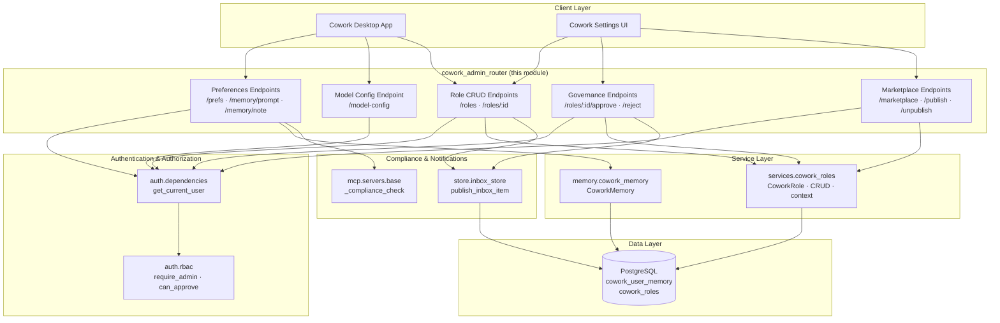
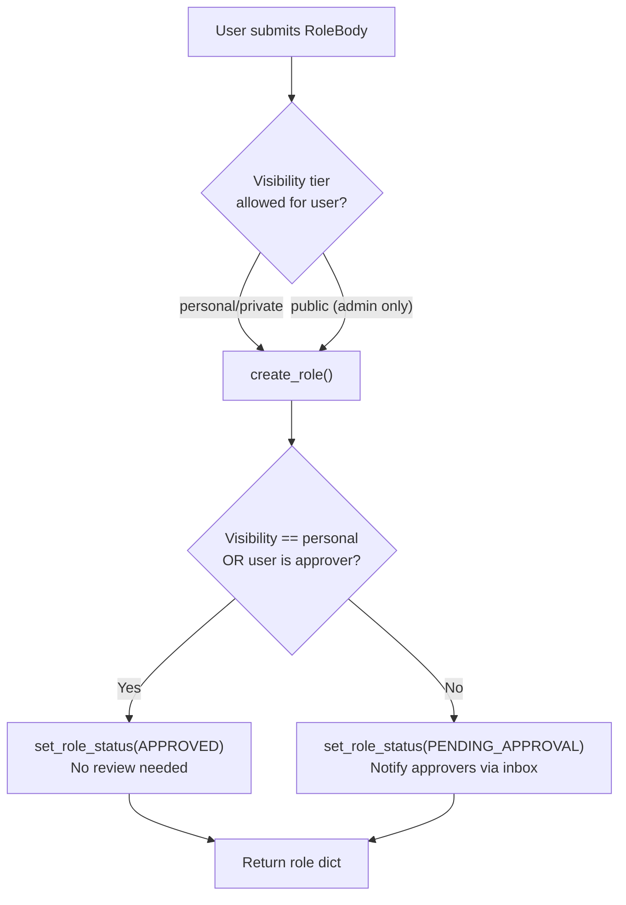
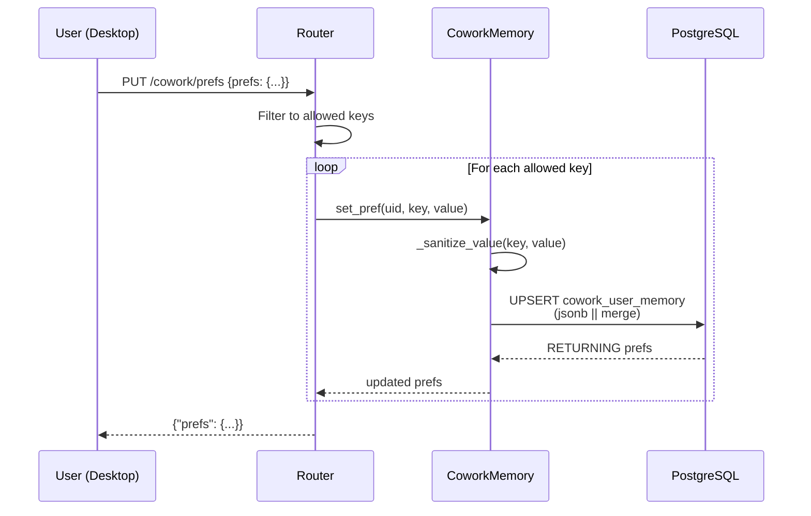
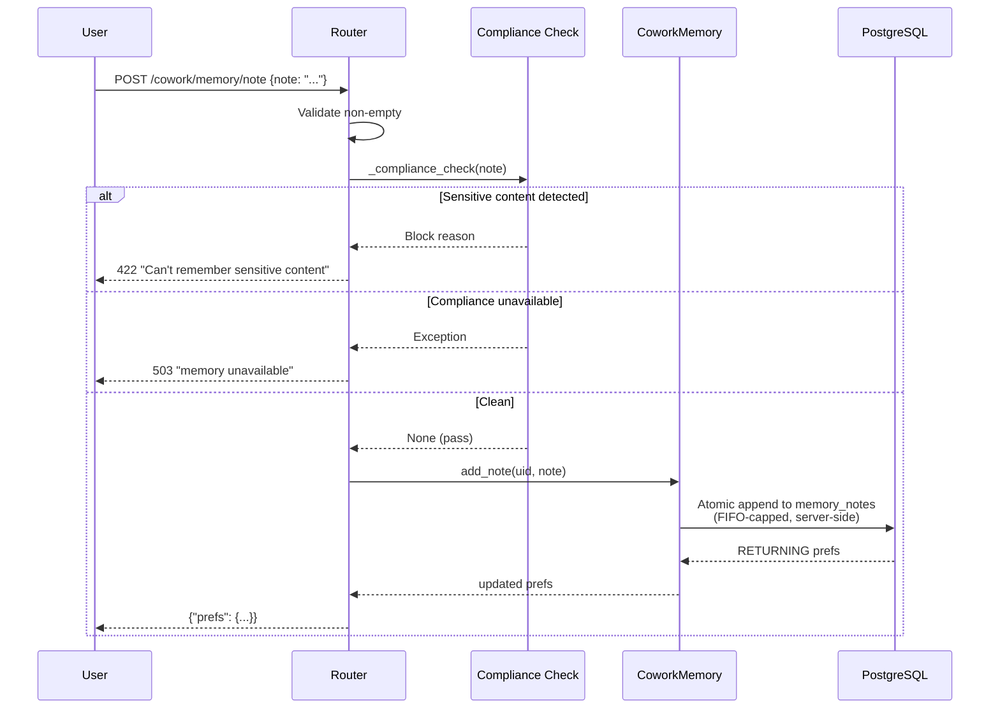
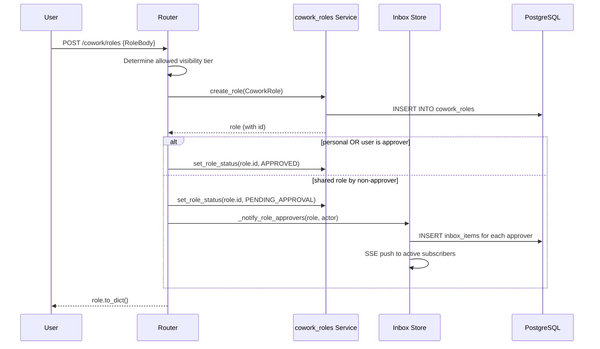
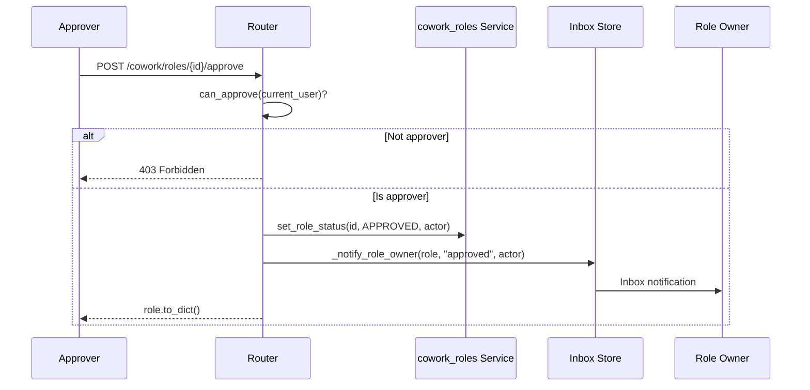
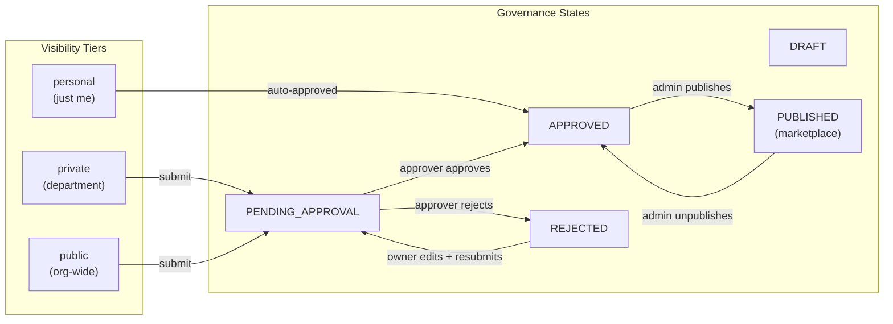
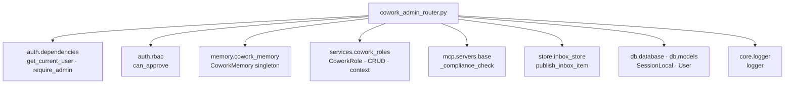
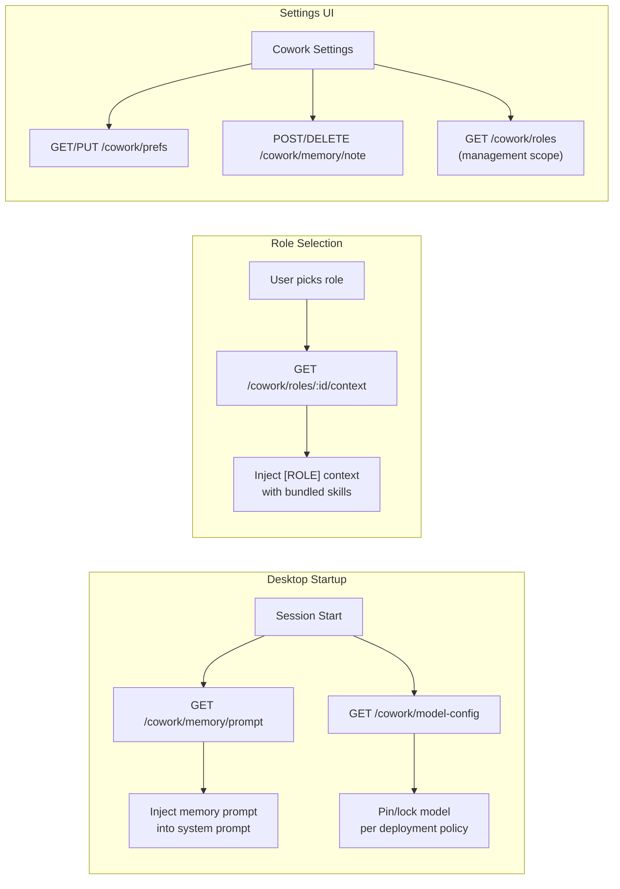

# Cowork Admin Router

## Introduction

The **Cowork Admin Router** (`routers/cowork_admin_router.py`) is a FastAPI APIRouter that exposes the REST surface for the Cowork desktop assistant's **personalization** and **role specialist** subsystems. It serves two distinct domains:

1. **Per-user personalization (self-service)** — durable preferences, memory notes, and model configuration scoped to the authenticated user's JWT `sub`. Backed by the Postgres-based `CoworkMemory` store.
2. **Role specialist packs (admin/approver-governed)** — CRUD, governance approval, and marketplace publishing for "role" bundles that combine a system prompt with connector permissions, skill SOPs, and sub-agent allowlists. Backed by the `cowork_roles` service layer.

The router is mounted under the `/cowork` prefix and is part of the broader `shared_api_routers` module family. It delegates all persistence and business logic to service-layer modules, acting purely as the HTTP boundary with authentication, authorization, and compliance enforcement.

---

## Architecture Overview



### Module Boundaries

The router strictly separates **self-service** endpoints (any authenticated user) from **governed** endpoints (admin or approver-gated). This mirrors the platform-wide pattern used by the knowledge-base and governance subsystems.

| Domain | Auth Level | Key Endpoints |
|--------|-----------|---------------|
| Personal preferences | Any authenticated user | `GET/PUT /prefs`, `GET /memory/prompt`, `POST/DELETE /memory/note` |
| Model config | Any authenticated user | `GET /model-config` |
| Role listing & context | Any authenticated user (visibility-scoped) | `GET /roles`, `GET /roles/:id/context` |
| Role create/update/delete | Owner or admin | `POST/PUT/DELETE /roles/:id` |
| Role approval | Approver (`ad_level ≤ 3` or admin) | `POST /roles/:id/approve`, `/reject` |
| Marketplace publish/unpublish | Admin only | `POST /roles/:id/publish`, `/unpublish` |
| Marketplace browse | Any authenticated user | `GET /marketplace` |

---

## Component Reference

### Request/Response Models

#### `PrefsUpdate`

```python
class PrefsUpdate(BaseModel):
    prefs: Dict[str, Any]
```

A flat dictionary of preference key-value pairs submitted by the user. Only keys in the **allowed set** are persisted; unknown keys are silently ignored:

| Allowed Key | Type | Purpose |
|-------------|------|---------|
| `email_signature` | `str` | Signature appended to drafted emails |
| `default_doc_format` | `str` | Preferred output format for documents |
| `preferred_ppt_theme` | `str` | Preferred presentation theme (stored but not injected into prompt) |
| `tone` | `str` | Preferred communication tone |
| `team_aliases` | `Dict[str, str]` | Alias → team name mappings |
| `channel_aliases` | `Dict[str, str]` | Alias → channel name mappings |
| `role` | `str` | User's role label |

#### `NoteBody`

```python
class NoteBody(BaseModel):
    note: str
```

A single durable memory fact the user wants the Cowork agent to remember across sessions. Compliance-gated before storage.

#### `RoleBody`

```python
class RoleBody(BaseModel):
    name: str
    system_prompt: str
    description: str = ""
    allowed_connectors: List[str] = []
    skill_names: List[str] = []
    subagent_allowlist: List[str] = []
    department: str = ""
    visibility: str = "private"
```

The full definition of a role specialist pack. The `visibility` field controls the governance tier:

| Visibility | Scope | Governance |
|------------|-------|------------|
| `personal` | Only the creator | Auto-approved, no review |
| `private` | Same department | Requires approver approval |
| `public` | Organization-wide | Requires approver approval; admin-only to request |

---

### Self-Service Preference Endpoints

#### `get_my_prefs`

```
GET /cowork/prefs
```

Returns the caller's complete preference dictionary from `CoworkMemory`. Returns `{"prefs": {}}` if no preferences exist.

#### `set_my_prefs`

```
PUT /cowork/prefs
```

Accepts a `PrefsUpdate` body. Iterates over submitted keys and persists only those in the allowed set via `CoworkMemory.set_pref()`. Returns the updated full preference dict. Raises `HTTP 500` on persistence failure.

#### `get_my_memory_prompt`

```
GET /cowork/memory/prompt
```

Renders the caller's durable Cowork memory (preferences + agent-saved notes) as a system-prompt snippet via `CoworkMemory.build_memory_prompt()`. The desktop Cowork agent fetches this at session start and appends it to the system prompt, ensuring remembered facts carry across tasks. Returns `{"prompt": ""}` when no memory exists.

#### `get_model_config`

```
GET /cowork/model-config
```

Returns the buddy model selection policy, driven by environment variables so the default/locked model can change per deployment without a UI rebuild:

| Env Var | Default | Purpose |
|---------|---------|---------|
| `COWORK_FORCED_MODEL` | `claude-opus-4-8` | Model ID the desktop pins to |
| `COWORK_MODEL_LOCKED` | `true` | When `true`, hides the model picker and disables switching |

Returns `{"forced_model": str, "locked": bool}`.

---

### Durable Memory Note Endpoints

#### `add_my_note`

```
POST /cowork/memory/note
```

Lets the user add a durable fact themselves (parity with the agent's `remember` tool). The note is **compliance-gated** before storage:

1. The note text is passed to `mcp.servers.base._compliance_check()`.
2. If the check detects sensitive content (secrets, PAN, PII), the note is **refused** (`HTTP 422`) and never stored.
3. If the compliance service is unavailable, the endpoint **fails closed** (`HTTP 503`) for safety.
4. Only after passing compliance is the note persisted via `CoworkMemory.add_note()`.

Returns the updated preferences dict (which includes the `memory_notes` array).

#### `delete_my_note`

```
DELETE /cowork/memory/note?note=<text>
```

Removes one durable fact by exact-text match via `CoworkMemory.delete_note()`. Idempotent — an unknown note is a no-op. Returns the updated preferences dict.

---

### Role Specialist Endpoints

#### `list_cowork_roles`

```
GET /cowork/roles?published={bool}
```

Lists role specialists visible to the caller. The `published` query parameter controls the scope:

- **`published=true`** (Picker scope): Returns only roles visible to the end-user role picker via `list_for_picker()`. This is the **governance gate** — unpublished drafts never appear to users. Uses the 3-tier visibility model:
  - **Public** (org-wide): `status='APPROVED'` — everyone
  - **Private** (department): `visibility='private'` + `status='APPROVED'` + same department
  - **Personal/own**: `created_by == caller` — any status

- **`published=false`** (default, Management scope): Returns roles based on the caller's role:
  - **Admins**: All roles via `list_all_roles()`
  - **Approvers** (`ad_level ≤ 3`): Own roles + pending queue via `list_owned()` + `list_pending()`
  - **Regular users**: Only their own roles via `list_owned()`

#### `get_role_context`

```
GET /cowork/roles/{role_id}/context
```

Renders a role specialist's full operating context for injection into a Cowork session via `services.cowork_roles.build_role_context()`. This bundles:

- The role's **system prompt** (verbatim)
- **Behavioral skills** (plain-text SOPs) — injected as instructions the agent must follow
- **Execution skills** (Python `run()` functions) — only named with descriptions; the office surface has no code sandbox, so the agent is told these exist but cannot run them directly

The desktop Cowork session fetches this at start and injects it as the `[ROLE]` context block. Returns `{"prompt": ""}` for unknown roles.

#### `create_cowork_role`

```
POST /cowork/roles
```

Creates a new role specialist. Any authenticated user can create a role. Governance is applied post-creation:



Non-admins may only request `personal` or `private` visibility. Admins may also request `public`. Approvers self-approve their own submissions (mirrors the KB governance pattern).

#### `update_cowork_role`

```
PUT /cowork/roles/{role_id}
```

Updates an existing role. Only the **owner** or an **admin** can edit (enforced by `_owns_or_admin()`). After updating fields, governance is re-evaluated:

- **Personal** roles or **approver** edits → stay `APPROVED`
- **Non-approver** editing a shared (`private`/`public`) role → reverts to `PENDING_APPROVAL` (content changed, prior approval no longer holds) and approvers are notified

#### `delete_cowork_role`

```
DELETE /cowork/roles/{role_id}
```

Deletes a role. Only the **owner** or an **admin** can delete. Returns `{"deleted": true}` or `HTTP 404` if not found.

---

### Governance Endpoints

#### `approve_cowork_role`

```
POST /cowork/roles/{role_id}/approve
```

Approves a `PENDING_APPROVAL` role, making it visible at its tier. Only **approvers** (`ad_level ≤ 3` or admin) can approve — same gate as knowledge-base approval. The role's creator is notified via inbox.

#### `reject_cowork_role`

```
POST /cowork/roles/{role_id}/reject
```

Rejects a `PENDING_APPROVAL` role, setting status to `REJECTED`. The creator is notified and can edit + resubmit. Only approvers can reject.

---

### Marketplace Endpoints

#### `cowork_marketplace`

```
GET /cowork/marketplace
```

Returns roles/plugins available to the caller: everything **published** org-wide plus the caller's own department drafts. This is the marketplace browse surface.

#### `publish_cowork_role`

```
POST /cowork/roles/{role_id}/publish
```

Publishes a role to the org marketplace. **Admin-only** (`require_admin`). Sets `status='APPROVED'`, `visibility='public'`, and stamps `published_at`/`published_by`.

#### `unpublish_cowork_role`

```
POST /cowork/roles/{role_id}/unpublish
```

Withdraws a role from the marketplace (back to private draft). **Admin-only**.

---

## Internal Helpers

### `_is_admin(u: dict) -> bool`

Checks if a user dict has `role == "admin"`.

### `_owns_or_admin(role_id: str, user: dict)`

Returns the role if the caller owns it or is an admin. Raises `HTTP 404` if the role doesn't exist, or `HTTP 403` if the caller is neither owner nor admin. Used by `update_cowork_role` and `delete_cowork_role`.

### `_notify_role_approvers(role, actor: str)`

Inbox-notifies every approver (`ad_level ≤ 3` or admin) that a role awaits approval. Queries the `User` table for approver IDs and publishes an inbox item via `store.inbox_store.publish_inbox_item()` with metadata `{"kind": "cowork_role", "role_id": ..., "visibility": ...}`. Failures are logged as warnings (non-blocking).

### `_notify_role_owner(role, outcome: str, actor: str)`

Inbox-notifies the role's creator that their submission was approved or rejected. Publishes an inbox item with metadata `{"kind": "cowork_role", "role_id": ..., "outcome": ...}`. Failures are logged as warnings (non-blocking).

---

## Data Flow

### Preference Write Flow



### Memory Note Compliance Flow



### Role Creation & Governance Flow



### Role Approval Flow



---

## Role Visibility & Governance Model

The router implements a **3-tier visibility model** with a **KB-style governance gate**:



### Picker Visibility Logic

The end-user role picker (`published=true`) uses `list_for_picker()` which applies:

| Condition | Visible? |
|-----------|----------|
| `visibility='public'` AND `status='APPROVED'` | ✅ Everyone |
| `visibility='private'` AND `status='APPROVED'` AND same department | ✅ Department members |
| `created_by == caller` | ✅ Owner (any status) |
| Everything else | ❌ Hidden |

---

## Dependencies

### Internal Module Dependencies



| Dependency | Module | Role |
|------------|--------|------|
| `get_current_user` | [authentication](authentication.md) | JWT/API-key extraction and user context enrichment |
| `require_admin` | [authentication](authentication.md) | Admin-role enforcement for marketplace endpoints |
| `can_approve` | [authentication](authentication.md) | Non-raising check for `ad_level ≤ 3` or admin |
| `CoworkMemory` | [memory_system](memory_system.md) | Postgres-backed per-user preference and note store |
| `cowork_roles` service | [services](services.md) | Role specialist CRUD, context rendering, marketplace |
| `_compliance_check` | [mcp_system](mcp_system.md) | PII/secret/PAN screening for memory notes |
| `publish_inbox_item` | [store_layer](store_layer.md) | Inbox notifications for governance events |
| `SessionLocal` / `User` | [database](database.md) | Approver lookup for role submission notifications |

### Lazy Imports

The router uses **lazy (function-level) imports** for service-layer modules (`memory.cowork_memory`, `services.cowork_roles`, `mcp.servers.base`, `store.inbox_store`, `db.database`, `db.models`). This avoids circular import issues and keeps the router lightweight at module load time.

---

## Security & Compliance

### Authentication

All endpoints require authentication via `get_current_user`, which extracts identity from:
1. `Authorization: Bearer <jwt>` — browser/CLI sessions
2. `Authorization: Bearer <api-key>` — IDE integrations
3. `auth_token` httpOnly cookie — browser sessions

### Authorization Tiers

| Tier | Check | Endpoints |
|------|-------|-----------|
| Any authenticated user | `get_current_user` | Preferences, notes, model config, role listing, marketplace browse |
| Owner or admin | `_owns_or_admin()` | Role update, delete |
| Approver (`ad_level ≤ 3` or admin) | `can_approve()` | Role approve, reject |
| Admin only | `require_admin` | Marketplace publish, unpublish |

### Compliance Gating

Memory notes are compliance-gated **before storage** using the same `_compliance_check` used across the platform. The check screens for:
- Secrets (API keys, tokens)
- PAN (card numbers)
- PII (personally identifiable information)

If sensitive content is detected, the note is **refused** (`HTTP 422`) and never persisted. If the compliance service is unavailable, the endpoint **fails closed** (`HTTP 503`) to prevent storing unvetted content.

### Preference Safety

- Only **known keys** in the allowed set are persisted; unknown keys are silently dropped.
- Values are **size-bounded** by `CoworkMemory._sanitize_value()` before storage.
- Alias dictionaries (`team_aliases`, `channel_aliases`) are capped at a maximum number of entries with per-entry length limits.
- Memory notes are **FIFO-capped** to prevent unbounded growth.

---

## Integration with Cowork Desktop

The router is the primary configuration surface for the Cowork desktop application:



The desktop reads `model-config` at startup to determine whether to show the model picker. When `locked=true`, the picker is hidden and the `forced_model` is pinned. When `locked=false`, the picker returns and users can switch models.

---

## Related Documentation

- [authentication](authentication.md) — JWT validation, RBAC, and SSO
- [memory_system](memory_system.md) — `CoworkMemory` and the broader memory service
- [services](services.md) — `cowork_roles` service layer with role CRUD and context rendering
- [store_layer](store_layer.md) — `inbox_store` for governance notifications
- [mcp_system](mcp_system.md) — MCP server base with compliance checking
- [database](database.md) — Database models and session management
- [cowork_policy_router](cowork_policy_router.md) — Connector policy and role grants for Cowork
- [cowork_usage_router](cowork_usage_router.md) — Usage tracking and spend limits for Cowork
- [cowork_tasks_router](cowork_tasks_router.md) — Scheduled task management for Cowork
- [cowork_projects_router](cowork_projects_router.md) — Project management for Cowork
- [cowork_dispatch_router](cowork_dispatch_router.md) — Dispatch and claim system for Cowork
- [cowork_conversations_router](cowork_conversations_router.md) — Conversation persistence for Cowork
- [cowork_mcp_router](cowork_mcp_router.md) — MCP tool exposure for Cowork sessions
