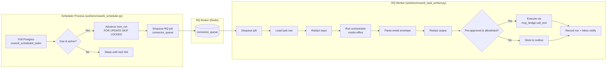
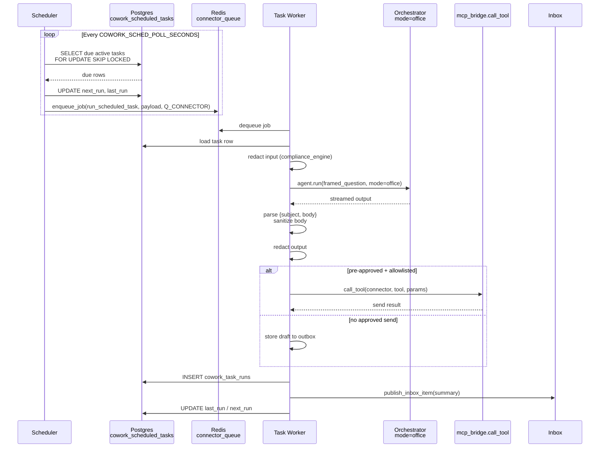

# Cowork Scheduling Workers

## Overview

The `cowork_scheduling_workers` module provides the server-side background infrastructure for **recurring Cowork tasks**. It lets users schedule agent-driven office tasks on a cron cadence (for example, *"every Monday at 9:00 AM, email me a calendar digest"*) and executes those tasks headlessly, without requiring a desktop session.

The module is deliberately split into two small, focused pieces:

1. **Scheduler** — a long-running process that polls Postgres for due tasks and enqueues them.
2. **Task Worker** — an RQ job that runs one scheduled task, composes or redacts its output, and delivers it safely.

Both components are designed around NPCI guardrails: the scheduler never executes connector writes or sends; the worker only performs pre-approved, allowlisted, compliance-gated actions. Arbitrary outbound messages are never auto-confirmed.

---

## Purpose & Core Functionality

- **Recurring task scheduling**: Reads task definitions from the `cowork_scheduled_tasks` Postgres table (cron expression, timezone, role, prompt, connectors, approved action, allowlist).
- **Safe, multi-host scheduling**: The Postgres row is the source of truth. `next_run` is advanced atomically before enqueue, so restarts or multiple scheduler instances cannot double-fire or lose an occurrence.
- **Headless agent execution**: Each due task is enqueued onto the RQ `connector_queue` and executed by `workers.cowork_task_worker.run_scheduled_task`.
- **Office-mode parity**: The worker invokes the same `agents.orchestrator.agent.run(..., mode="office")` path used by the interactive Cowork tab, so connector reads, KB retrieval, and model routing behave identically.
- **Compliance-first delivery**: Input is redacted (never blocked), output is redacted, and any write/send is routed through the same confirmed, compliance-gated connector pipeline (`connectors.mcp_bridge.call_tool`) that interactive Cowork uses.
- **Visibility**: Every run is recorded in `cowork_task_runs` and a summary is published to the user's Inbox, so headless runs are not silent.

---

## Architecture



### Data Flow



---

## Component Responsibilities

| Component | File | Responsibility |
|-----------|------|----------------|
| `main` | `workers/cowork_scheduler.py` | Entry point that selects the best available scheduling backend (rq-scheduler → APScheduler → built-in poll loop) and drives periodic `_fire_due_tasks` ticks. |
| `_fire_due_tasks` | `workers/cowork_scheduler.py` | Atomically claims due rows, bootstraps missing `next_run` values, advances schedules, and enqueues one RQ job per task. |
| `_next_run_utc` / `_compute_next_run` | `workers/cowork_scheduler.py` | Interprets cron expressions in the task's local timezone and returns the next UTC fire time. |
| `run_scheduled_task` | `workers/cowork_task_worker.py` | RQ job entry point. Loads the task, runs office-mode agent, parses/sanitizes email output, applies compliance, delivers or outboxes the result, and records the run. |
| `_maybe_deliver_preapproved` | `workers/cowork_task_worker.py` | Decides whether to execute a pre-approved connector action, send to a prompt-derived recipient, send to the user's own mailbox, or store to outbox. |
| `_compose_email_body` / `_sanitize_email_body` | `workers/cowork_task_worker.py` | Chooses and cleans the email body so agent narration, JSON envelopes, and header blocks never leak into the message. |

---

## Sub-modules

The module is divided into two sub-modules:

- **[cowork_scheduling_workers_scheduler](cowork_scheduling_workers_scheduler.md)** — Scheduler process, cron evaluation, and atomic enqueue logic.
- **[cowork_scheduling_workers_task_worker](cowork_scheduling_workers_task_worker.md)** — RQ job that executes one scheduled Cowork task end-to-end.

---

## Integration with the Rest of the System

| System Area | How this module uses it |
|-------------|------------------------|
| **Postgres** | `cowork_scheduled_tasks` is the source of truth for definitions and schedule state; `cowork_task_runs` stores run history/outbox. |
| **Redis / RQ** | Jobs are enqueued via `core.job_queue.enqueue_job` onto `Q_CONNECTOR` (`connector_queue`) and consumed by RQ workers. |
| **Agent Orchestrator** | The worker calls `agents.orchestrator.agent.run(..., mode="office")` to reuse the same planner, connector catalog, and KB retrieval path as interactive Cowork. |
| **Compliance Engine** | Input and output are redacted through `agents.compliance_engine.compliance_engine`; outbound sends go through `connectors.mcp_bridge.call_tool`, which applies the same hard-block rules as interactive sends. |
| **Connector Engine / Registry** | Recipient resolution and platform-wide `always_allow` permissions are checked via `connectors.engine.connector_engine` and `connectors.registry.connector_registry`. |
| **Inbox Store** | Every run publishes a visible Inbox item via `store.inbox_store.publish_inbox_item`. |
| **Skill Loop** | Successful recurring runs can record a signature via `store.skill_loop_store.record_run_signature` when `ENABLE_SKILL_LOOP` includes `cowork_task`. |

---

## Configuration & Operation

### Environment Variables

| Variable | Default | Purpose |
|----------|---------|---------|
| `POSTGRES_HOST`, `POSTGRES_PORT`, `POSTGRES_DB`, `POSTGRES_USER`, `POSTGRES_PASSWORD`, `POSTGRES_SCHEMA` | — | Platform database connection (task table). |
| `REDIS_HOST`, `REDIS_PORT` | — | RQ broker (db=5). |
| `COWORK_SCHED_POLL_SECONDS` | `30` | How often the scheduler evaluates due rows. |
| `COWORK_SCHED_BATCH` | `50` | Max rows claimed per tick. |
| `COWORK_SEND_ON_UNPARSED` | unset | Set to `1`/`true` to force best-effort delivery when the email body could not be confidently composed. |

### Running

```bash
python workers/cowork_scheduler.py
```

In production this is managed by PM2 (not systemd). RQ workers must be running to consume the `connector_queue`.

---

## Safety & Compliance Notes

- **No auto-execution of writes**: The scheduler only enqueues; it never calls connectors or sends messages.
- **Atomic schedule advancement**: `next_run` is updated inside the same transaction that holds the row lock, preventing double-fires.
- **Retry policy**: Enqueued jobs use `retry_count=0` for scheduled runs so a partially executed send is never silently re-run.
- **Output cap**: Headless runs are capped at 60,000 characters to prevent runaway plans from tying up workers.
- **No secrets in logs**: Prompts, connector payloads, tokens, and recipient details are never logged in full.
