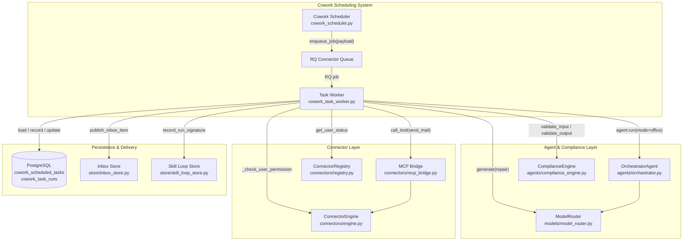
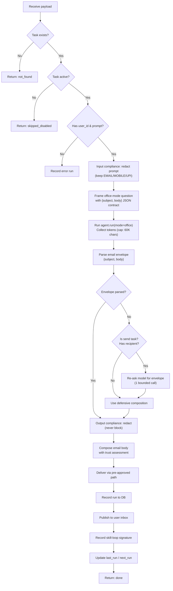
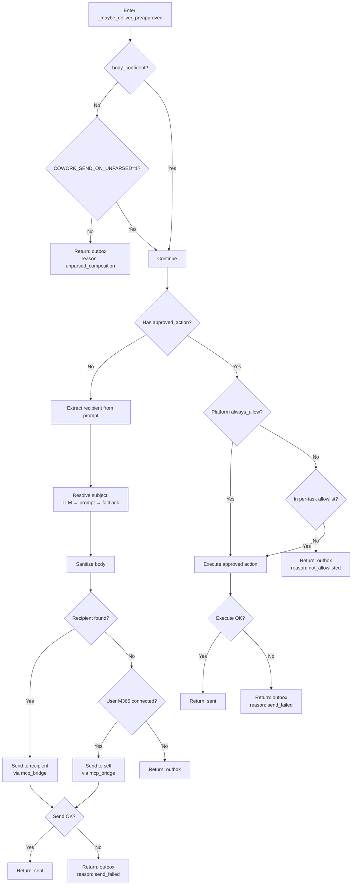
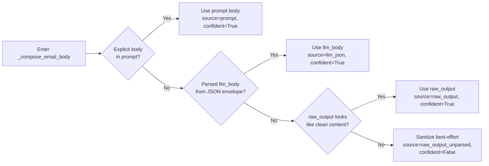
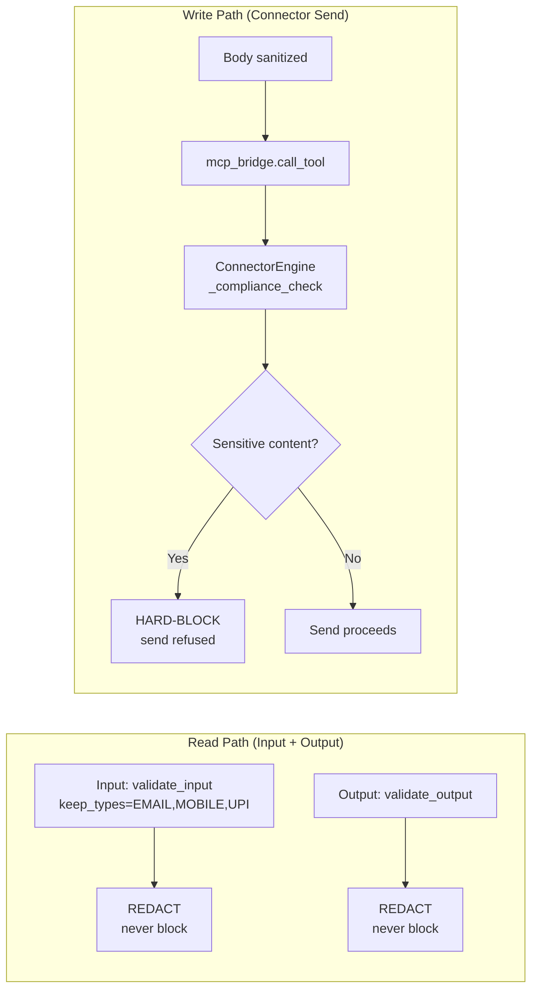
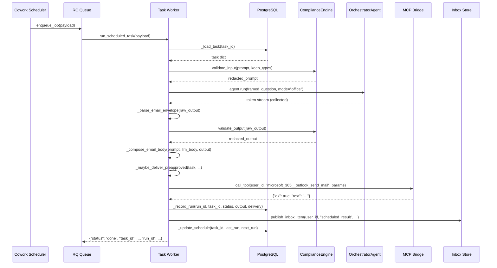

# Cowork Scheduling Workers — Task Worker

## Overview

The **Cowork Task Worker** (`workers/cowork_task_worker.py`) is the headless execution engine for scheduled Cowork tasks. When the [Cowork Scheduler](cowork_scheduling_workers_scheduler.md) determines a task is due, it enqueues a job onto the connector queue (RQ). This worker picks up that job, runs the task through the same AI office-assistant pipeline that the interactive Cowork tab uses, applies NPCI compliance guardrails, and delivers the result — either by sending an email through a pre-approved connector action or by storing the result to an outbox for later human review.

The worker is designed to **never raise** — all failures are recorded on the run row and returned as a status dict. This is critical because scheduled tasks run unattended; a crash would silently skip the task and break the recurrence chain.

---

## Architecture



### Position in the System

The task worker is one of two components in the **Cowork Scheduling Workers** subsystem:

| Component | Role |
|-----------|------|
| [Cowork Scheduler](cowork_scheduling_workers_scheduler.md) | Polls `cowork_scheduled_tasks`, advances `next_run`, enqueues due tasks |
| **Task Worker** (this module) | Executes one scheduled task headless: compliance → agent run → delivery → persistence |

The worker is started as part of the [Worker Orchestration](worker_orchestration.md) layer, which spawns RQ worker processes that consume the connector queue.

---

## Core Components

### `run_scheduled_task(payload) -> dict`

The **RQ job entry point**. Accepts either a full payload dict (from the scheduler) or a bare `task_id` string (for manual "run now" triggers). Orchestrates the entire execution lifecycle:



**Key design decisions:**

- **Input compliance uses `keep_types={"EMAIL", "MOBILE", "UPI"}`** — contact identifiers must survive redaction so that "send an email to foo@bar.com" tasks resolve the correct recipient. Secrets, keys, and card numbers are still redacted.
- **The framed question (not the bare prompt) is passed as `raw_question`** to `agent.run()`. In office mode, the final generation prompt is built from `raw_question`, so passing the bare prompt would discard the `{subject, body}` JSON envelope contract.
- **Output cap of 60,000 characters** prevents a runaway plan from tying up an agent worker indefinitely.
- **Never raises** — all exceptions are caught, recorded on the run row, and returned as a status dict.

---

### `_maybe_deliver_preapproved(task, user_id, output, ...) -> dict`

The **delivery routing brain**. Determines how the task result reaches the user through a priority chain:



**Delivery modes:**

| Mode | Meaning |
|------|---------|
| `sent` | Email/action was successfully delivered via connector |
| `outbox` | Result stored to `cowork_task_runs` for later human review |

**Permission gates (in priority order):**

1. **Platform-wide `always_allow`** — If the user has stored `always_allow=TRUE` for this `connector.tool` in `ainxt.user_connector_permissions`, execute without per-task allowlist check.
2. **Per-task allowlist** — The exact `"connector.tool"` string must appear in the task's `action_allowlist` array.
3. **No approved action** — Extract recipient from the prompt; send directly via `microsoft_365.outlook_send_mail`. Fall back to the user's own M365 mailbox.

---

### `_execute_approved_connector_action(connector, tool, params, user_id, output, key, ...) -> dict`

Executes a pre-approved connector write action. Shared by both the per-task allowlist path and the platform-wide `always_allow` path. Sanitizes the output body, resolves the subject (LLM-generated → pre-approved params → derived from prompt), and delegates to `_send_via_cowork_pipeline`.

**Compliance is enforced inside the pipeline** (via `mcp_bridge.call_tool` → `ConnectorEngine`), not separately in the worker. This ensures the scheduled send behaves identically to an interactive CoWork send.

---

### `_send_via_cowork_pipeline(user_id, connector, tool, params) -> dict`

Sends/executes a connector action through the **same pipeline** that interactive CoWork uses: `connectors.mcp_bridge.call_tool`. This is the critical design choice that makes scheduled sends behave identically to live sends — the structured `{to, subject, body}` arguments, outbound compliance HARD-BLOCK on sensitive content, recipient validation, and attachment handling are all applied by the same code path.

Returns `{"ok": bool, "text": str}` where `text` carries the pipeline's human-readable result.

---

### `_compose_email_body(prompt, llm_body, raw_output) -> tuple[str, str, bool]`

The **single source of truth** for email body selection and trust assessment. Returns `(body, source, confident)`.



**`confident=False`** is the guard that stops the historic bug where the agent's entire narrative (including "send an email to X with subject Y and body: Z") was sent as the email body. Callers must route a non-confident body to the outbox instead of sending it.

---

### `_sanitize_email_body(body, recipient, subject) -> str`

A multi-layer safety net that ensures the email body never carries send-instruction preamble, recipient addresses, subject lines, or raw JSON envelope residue. Applies five ordered transformations:

1. **Strip narration prefix** — Removes "I have sent an email to X with subject Y and body: Z" style preambles using `_NARRATION_PREFIX_RE`.
2. **Unwrap JSON envelope** — If the remaining text is `{"subject":..,"body":..}`, extracts the `body` field.
3. **Strip email header block** — Removes leading `To:`/`Cc:`/`Subject:` lines (bounded to first 6 lines, stops at first blank or non-label line).
4. **Strip wrapping quotes** — Removes a single pair of wrapping quotes left by preamble removal.
5. **Never return empty** — Falls back to the original if scrubbing would empty the body.

---

### `_parse_email_envelope(raw_output) -> dict | None`

Extracts the `{"subject": .., "body": ..}` envelope from an LLM response. Tolerant by design — tries three candidate extraction strategies:

1. The response as-is
2. Any fenced ```` ``` ```` block found anywhere (not just at position 0)
3. The outermost `{...}` span in the response

Returns the parsed dict, or `None` when the response isn't an email envelope.

---

### `_reask_email_envelope(raw_output, prompt, task_id) -> dict | None`

A **bounded second-chance** repair: when the first response carried no envelope AND the task is a real send (an explicit recipient was found in the prompt), asks the model to reshape its own prose into `{subject, body}`. Exactly one extra model call, no tools, no connector access. Any error returns `None` so the caller falls through to defensive composition. It can only ever turn an outbox into a send — never the reverse.

---

## Compliance Model

The worker honours NPCI guardrails with a clear read/write asymmetry:



| Path | Input | Output | Write/Send |
|------|-------|--------|------------|
| **Action** | Redact | Redact | HARD-BLOCK on sensitive content |
| **Block?** | Never | Never | Yes — inside `ConnectorEngine` |
| **Rationale** | Read-style result; Cowork UX parity | Read-style result | Outbound write; NPCI compliance |

---

## Data Flow



---

## Database Schema

The worker interacts with two PostgreSQL tables:

### `cowork_scheduled_tasks`

| Column | Type | Description |
|--------|------|-------------|
| `id` | text | Task identifier |
| `user_id` | text | Owning user |
| `role` | text | Cowork role persona |
| `prompt` | text | Task instruction |
| `cron` | text | Cron expression |
| `connectors` | jsonb | Connected connectors |
| `status` | text | `active` / `paused` |
| `approved_action` | jsonb | Pre-approved connector action `{connector, tool, params}` |
| `action_allowlist` | jsonb | Array of `"connector.tool"` strings |
| `last_run` | timestamptz | Last execution time |
| `last_run_status` | text | `done` / `error` |
| `next_run` | timestamptz | Next scheduled fire time |
| `tz` | text | Timezone (default UTC) |

### `cowork_task_runs`

| Column | Type | Description |
|--------|------|-------------|
| `id` | uuid | Run identifier |
| `task_id` | text | Parent task |
| `user_id` | text | Owning user |
| `status` | text | `done` / `error` |
| `output` | text | Compliance-redacted output + `[delivery: mode]` suffix |
| `error` | text | Error message (if any) |
| `created_at` | timestamptz | Run timestamp |

---

## Dependencies

### Internal Modules

| Dependency | Component | Purpose |
|------------|-----------|---------|
| [Cowork Scheduler](cowork_scheduling_workers_scheduler.md) | `_next_run_utc` | Compute next fire time from cron expression |
| [Agent System](agent_system.md) → OrchestratorAgent | `agent.run(mode="office")` | Execute the task through the office-assistant planner |
| [Agent System](agent_system.md) → ComplianceEngine | `validate_input`, `validate_output`, `redact_text` | NPCI compliance redaction |
| [Model Routing](model_routing.md) → ModelRouter | `generate(model_hint="complex")` | Re-ask envelope repair |
| [Connector Infrastructure](shared_integrations_connector_infrastructure.md) → MCP Bridge | `call_tool` | Send email via the same pipeline as interactive CoWork |
| [Connector Infrastructure](shared_integrations_connector_infrastructure.md) → ConnectorEngine | `_check_user_permission` | Platform-wide permission check |
| [Connector Infrastructure](shared_integrations_connector_infrastructure.md) → ConnectorRegistry | `get_user_status` | Resolve user's M365 email address |
| [Store Layer](store_layer.md) → Inbox Store | `publish_inbox_item` | Make headless run results visible to the user |
| [Store Layer](store_layer.md) → Skill Loop Store | `record_run_signature` | Self-improving skill loop capture |
| [Core Infrastructure](core_infrastructure.md) → Logger | `logger` | Structured logging |
| [Core Infrastructure](core_infrastructure.md) → Config | `ENABLE_SKILL_LOOP`, `SKILL_LOOP_SOURCES` | Feature flags for skill loop |
| [Database](database.md) | `SessionLocal` | PostgreSQL session factory |

### External Libraries

| Library | Purpose |
|---------|---------|
| `sqlalchemy` | Database queries (raw SQL via `sa.text`) |
| `redis` (via RQ) | Job queue infrastructure |

---

## Configuration

### Environment Variables

| Variable | Default | Description |
|----------|---------|-------------|
| `COWORK_SEND_ON_UNPARSED` | (unset) | When set to `1`/`true`, forces best-effort delivery even when the email body is not confidently composed. Without it, unconfident bodies go to the outbox. |
| `ENABLE_SKILL_LOOP` | (unset) | Master switch for the self-improving skill loop |
| `SKILL_LOOP_SOURCES` | (unset) | Comma-separated list of sources to capture (must include `cowork_task`) |

### Constants

| Constant | Value | Description |
|----------|-------|-------------|
| `_MAX_OUTPUT_CHARS` | 60,000 | Cap on collected agent output to prevent runaway plans |

---

## Error Handling

The worker follows a **fail-safe, never-raise** philosophy:

| Failure Point | Behaviour |
|---------------|-----------|
| Task not found | Returns `{"status": "not_found"}` |
| Task disabled | Returns `{"status": "skipped_disabled"}` |
| Missing user_id/prompt | Records error run, updates schedule, returns `{"status": "error"}` |
| Input compliance failure | Fail-open redact (logs warning, continues with original prompt) |
| Agent run failure | Records error run, updates schedule, returns `{"status": "error"}` |
| Output compliance failure | Fail-open (logs warning, continues with original output) |
| Email send failure | Records run with `delivery.mode=outbox`, publishes inbox notification with the real failure reason |
| Inbox publish failure | Non-fatal (logs warning, continues) |
| Skill loop capture failure | Non-fatal (logs debug, continues) |
| Schedule update failure | Non-fatal (logs warning, continues) |

---

## Observability

### Logging

All log lines are prefixed with `cowork_task_worker:` and include the `task_id` and `run_id` for traceability. Key log points:

- **`NOT_EMAILED`** — Grep handle for tasks where the email was withheld due to unconfident body composition. Includes the task ID so the regression can be traced.
- **Body composition** — Logs the source (`prompt`/`llm_json`/`raw_output`/`raw_output_unparsed`/`none`), confidence flag, and body length.
- **Delivery outcome** — Logs the mode (`sent`/`outbox`), action, and recipient mode (`to_recipient`/`self`).

### Inbox Visibility

Every run publishes an inbox item so headless runs are visible to the user:

- **Sent** → "Scheduled task ran: {title}" with the redacted output
- **Not sent** → "Scheduled task ran (not emailed): {title}" with the real failure reason and the redacted output

### Skill Loop Integration

When `ENABLE_SKILL_LOOP` is set and `cowork_task` is in `SKILL_LOOP_SOURCES`, each successful run records a signature to Redis via `record_run_signature`. This feeds the [self-improving skill loop](infrastructure_maintenance_workers.md) which detects recurring task patterns and proposes reusable skills.

---

## Relationship to Interactive CoWork

The task worker is designed to produce **identical behaviour** to the interactive Cowork tab:

| Aspect | Interactive CoWork | Scheduled Task Worker |
|--------|--------------------|-----------------------|
| Agent entry point | `agent.run(mode="office")` | Same |
| Model tier | `complex` (Claude Sonnet) | Same |
| Email send pipeline | `mcp_bridge.call_tool` | Same |
| Compliance (read) | Redact, never block | Same |
| Compliance (write) | HARD-BLOCK in ConnectorEngine | Same |
| Email body format | Structured `{to, subject, body}` | Same |
| Permission gating | Per-request prompt | Platform-wide `always_allow` or per-task allowlist |

The only differences are:
1. The worker runs **headless** (no desktop attached, no streaming UI).
2. The worker uses a **framed question** with an explicit `{subject, body}` JSON contract to ensure the LLM produces parseable email envelopes.
3. The worker has a **bounded re-ask** repair for when the first response lacks an envelope.
4. The worker has a **confidence-gated delivery** system that withholds unconfident bodies to the outbox.
