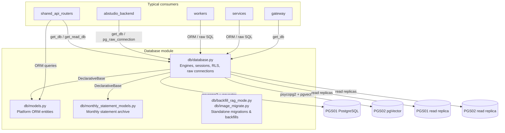
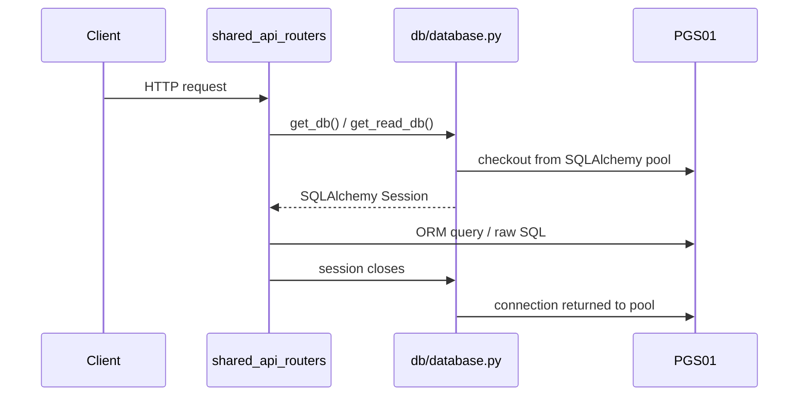
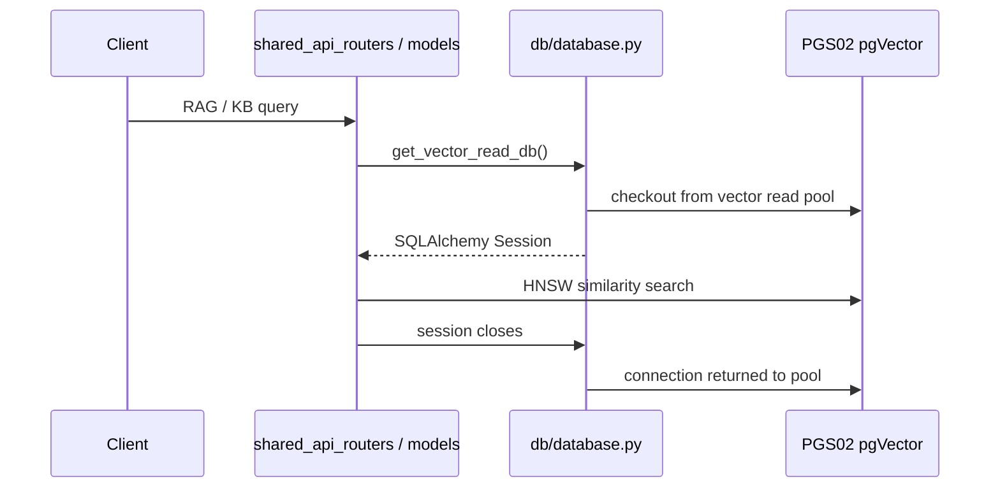

# Database Module

The **Database** module is the shared persistence layer for the AI-Nxt platform. It owns SQLAlchemy engine/session management, the ORM model definitions for the platform's transactional and vector data, and a small set of standalone migration/backfill scripts.

## Purpose

- Provide a single, pooled connection surface to the platform's PostgreSQL databases:
  - **PGS01** — primary transactional store (users, agents, workflows, SDLC runs, budget, governance, etc.).
  - **PGS02** — `pgvector` document-embedding store (RAG / knowledge-base search).
- Expose FastAPI-compatible dependencies (`get_db`, `get_read_db`, `get_vector_db`, `get_vector_read_db`) so routers and services share one connection pool instead of creating their own.
- Enforce per-request Row-Level Security (RLS) context variables for multi-tenant data access.
- Define the SQLAlchemy `Base` and all ORM entity classes under the `ainxt` schema.
- Ship idempotent, feature-specific migration scripts (e.g. `generated_images` table, `rag_mode` backfill) that can be run independently of the main Alembic flow.

> **Scope note:** This module intentionally does **not** include the `memory/postgres_memory.py` tables or ABStudio's dedicated checkpoint/agent-chat stores. Those are documented in the [memory_system](memory_system.md) and [abstudio_backend](abstudio_backend.md) modules respectively.

## Architecture Overview

### Connection topology

The module configures four SQLAlchemy engines/sessions:

| Engine | Purpose | Default pool size | Fallback |
|--------|---------|-------------------|----------|
| `engine` / `SessionLocal` | PGS01 write primary | 50 (+25 overflow) | — |
| `read_engine` / `ReadSessionLocal` | PGS01 read replica | 30 (+10 overflow) | PGS01 primary |
| `vector_engine` / `VectorSessionLocal` | PGS02 write primary | 30 (+5 overflow) | PGS01 primary |
| `vector_read_engine` / `VectorReadSessionLocal` | PGS02 read replica | 40 (+10 overflow) | PGS02 primary |

All engines set `search_path=ainxt,public` and a 60-second statement timeout. Read replicas are opt-in via `POSTGRES_READ_*` / `PGVECTOR_READ_*` environment variables; when unset they transparently fall back to the write primary, keeping dev behaviour unchanged.

### Row-Level Security

`set_rls_context(conn, user)` sets transaction-local Postgres configuration variables:

- `ainxt.current_user_id`
- `ainxt.current_user_role`
- `ainxt.current_band_level`

These variables are consumed by RLS policies on multi-tenant tables. Because the settings are `LOCAL`, they are automatically cleared at transaction end, which is safe for PgBouncer transaction-mode pools.

### Raw connection sharing

`pg_raw_connection()` is a context manager that borrows a raw `psycopg2` connection from the shared `engine` pool. This lets non-ORM code (for example ABStudio's psycopg-style repositories) participate in the same pool as the ORM layer.

## Sub-modules

The database module is split into three sub-modules:

- **database_connection** — engine, session, dependency, RLS, and raw-connection management.
- **database_models** — SQLAlchemy ORM entity definitions for the platform and the monthly-statement archive.
- **database_migrations** — standalone idempotent migration and backfill scripts.

## Data Flow Examples

### Standard API request

### Vector search request

## Environment Variables

| Variable | Default | Description |
|----------|---------|-------------|
| `POSTGRES_SCHEMA` | `ainxt` | Schema name for all application tables. |
| `POSTGRES_USER` / `POSTGRES_PASSWORD` / `POSTGRES_HOST` / `POSTGRES_PORT` / `POSTGRES_DB` | `postgres` / `postgres` / `localhost` / `5432` / `npci_memory` | PGS01 primary credentials. |
| `POSTGRES_POOL_SIZE` | `50` | PGS01 primary pool size. |
| `POSTGRES_POOL_MAX_OVERFLOW` | `25` | PGS01 primary max overflow. |
| `PGVECTOR_USER` / `PGVECTOR_PASSWORD` / `PGVECTOR_HOST` / `PGVECTOR_PORT` / `PGVECTOR_DB` | fallback to PGS01 values | PGS02 primary credentials. |
| `POSTGRES_READ_*` | fallback to PGS01 primary | PGS01 read-replica credentials. |
| `PGVECTOR_READ_*` | fallback to PGS02 primary | PGS02 read-replica credentials. |

## Related Modules

- [memory_system](memory_system.md) — chat-memory and long-term memory persistence.
- [shared_api_routers](shared_api_routers.md) — FastAPI routers that consume `get_db` / `get_read_db`.
- [abstudio_backend](abstudio_backend.md) — workflow, checkpoint, and agent-chat stores that reuse the shared pool.
- [workers](workers.md) — background jobs that read and write through these models.
