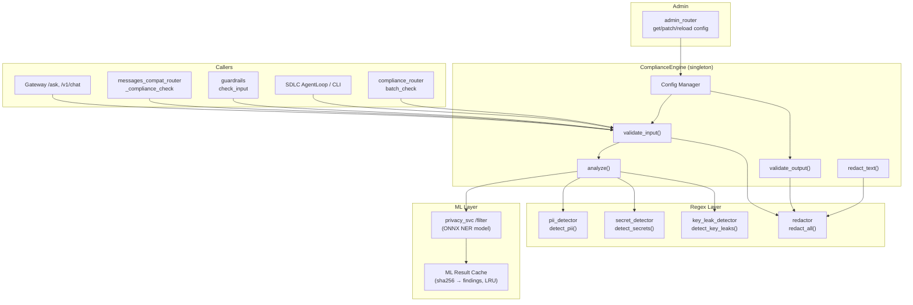
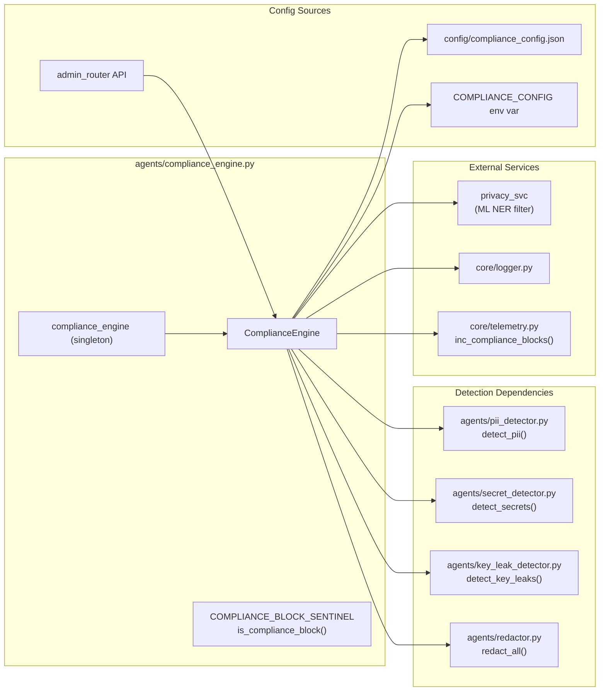
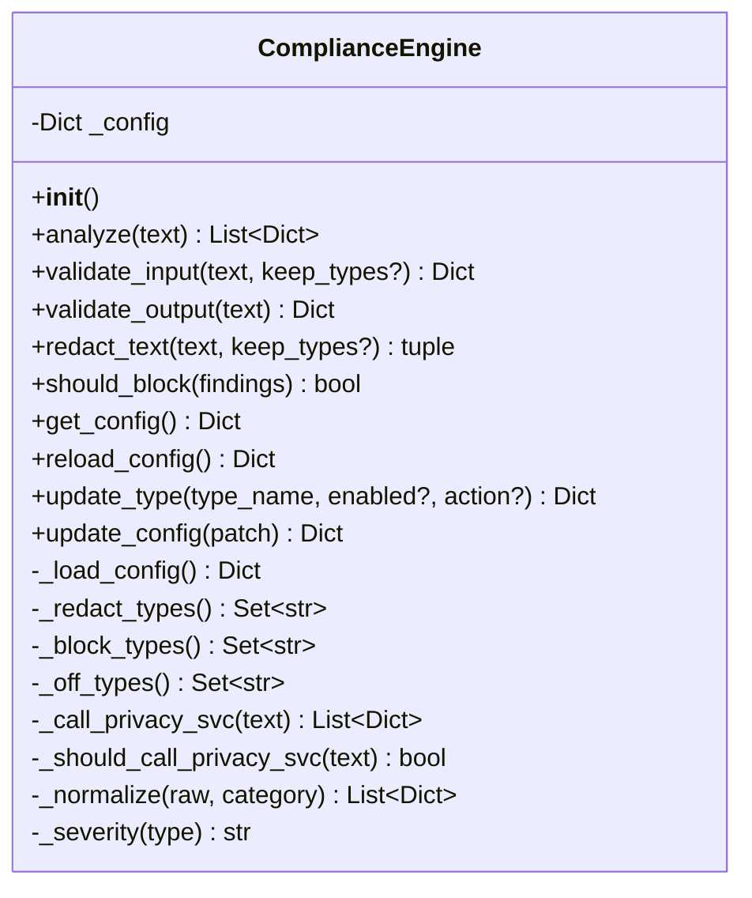
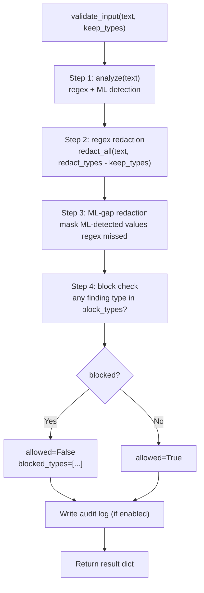
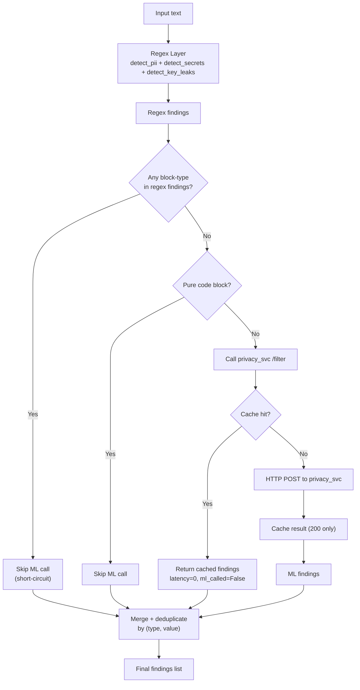
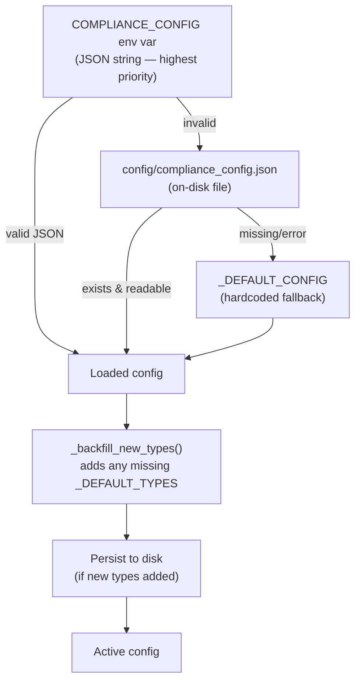
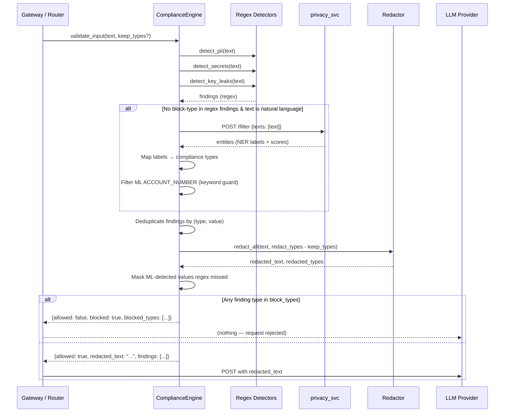
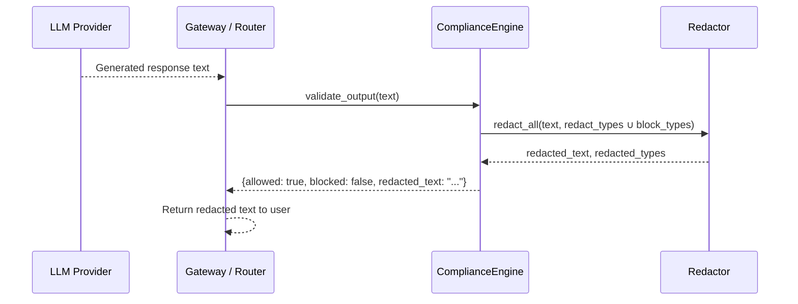
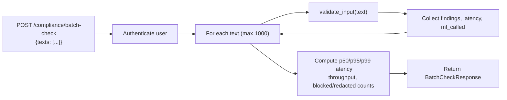

# Decision Engines — Compliance Engine

## 1. Introduction

The **Compliance Engine** (`agents/compliance_engine.py::ComplianceEngine`) is the central PCI/PII/secret-detection and redaction subsystem for the entire platform. It sits in the request path of every LLM-bound message — chat, agent, SDLC pipeline, CLI/Cowork, and OpenAI-compatible endpoints — ensuring that cardholder data, personally identifiable information, cryptographic secrets, and key material are either **redacted** before reaching the model or **blocked** entirely based on a per-type, config-driven policy.

The engine is designed around three principles:

| Principle | Implementation |
|---|---|
| **Config-driven** | Each compliance type (PAN, CVV, AADHAAR, SECRET, …) is independently toggleable as `redact`, `block`, or `off` via a JSON config file, env var, or admin API. |
| **Defence in depth** | A fast regex layer (PII/secret/key-leak detectors) is augmented by an ML privacy-filter service that catches natural-language PII the regexes miss. |
| **Fail-safe, never fail-closed** | Output is *never* blocked (only redacted). Input is blocked only for explicitly `block`-configured types. ML service failures are non-fatal — the regex layer still runs. |

---

## 2. Module Position in the System

The Compliance Engine is one of three sibling modules under the **Decision Engines** group within the shared-core agent system:

```
shared_core → agent_system → decision_engines
                                ├── decision_engines_core       (DecisionEngine — LLM-based tool selection)
                                ├── decision_engines_compliance (ComplianceEngine — PCI/PII/secret redaction & blocking)  ← this module
                                └── decision_engines_hardblock  (HardBlockEngine — AI-safety keyword blocking)
```

- **DecisionEngine** ([decision_engines_core](decision_engines_core.md)) decides *which tools* an agent should invoke.
- **ComplianceEngine** (this module) decides *what sensitive data must be redacted or blocked* before content reaches an LLM or is returned to the user.
- **HardBlockEngine** ([decision_engines_hardblock](decision_engines_hardblock.md)) decides *whether a prompt is an AI-safety violation* (jailbreak, harmful intent) using a weighted confidence-score gate.

Together they form the pre-LLM gate: HardBlock checks safety, Compliance checks data-leak, and only clean content proceeds.

---

## 3. Architecture

### 3.1 High-Level Architecture



### 3.2 Component Relationships



---

## 4. Core Component: `ComplianceEngine`

### 4.1 Class Overview



### 4.2 Key Methods

#### `analyze(text) → List[Dict]`

The full detection pipeline. Runs all three regex detectors, then optionally calls the ML privacy service. Returns a deduplicated list of finding dicts:

```python
{
    "type": "PAN",           # compliance type
    "value": "4111********1111",  # masked value
    "category": "PII",       # PII | SECRET | KEY | ML
    "severity": "CRITICAL",  # CRITICAL | HIGH | MEDIUM | LOW
    "blocked": False,        # whether this type is block-configured
}
```

**Short-circuit optimisation**: if the regex layer already found a `block`-configured type, the ML HTTP call is skipped — the request will be rejected regardless.

#### `validate_input(text, keep_types=None) → Dict`

The primary entry point for all inbound content. Executes a four-step pipeline:



The `keep_types` parameter allows callers (e.g., the Cowork/CLI tool-driven path) to preserve certain identifiers like `EMAIL`, `MOBILE`, or `UPI` that connector tool calls need to function. Card and secret types are **never** eligible for `keep_types`.

**Result dict fields:**

| Field | Type | Description |
|---|---|---|
| `allowed` | `bool` | `False` if any block-configured type was found |
| `blocked` | `bool` | Mirror of `not allowed` |
| `blocked_types` | `List[str]` | Types that triggered the block |
| `findings` | `List[Dict]` | All detection findings (regex + ML) |
| `redacted_text` | `str` | Text with sensitive values masked — use this for the LLM call |
| `was_redacted` | `bool` | Whether any redaction occurred |
| `redacted_types` | `List[str]` | Types that were redacted |
| `total_latency_ms` | `float` | End-to-end wall-clock latency |
| `privacy_svc_latency_ms` | `float` | ML service round-trip time (0.0 on cache hit) |
| `ml_called` | `bool` | Whether the ML service was actually invoked |

#### `validate_output(text) → Dict`

Redacts all configured types (both `redact` and `block` actions) from LLM output. **Output is never blocked** — `blocked` is always `False`. This ensures generated content is sanitised before reaching the user without interrupting the response.

#### `redact_text(text, keep_types=None) → (str, List[str])`

A lightweight redaction-only helper that skips detection and block logic. Used by paths that need sanitisation without the full analysis overhead (e.g., connector tool-result passthrough).

#### `should_block(findings) → bool`

Backward-compatible method that checks whether any finding's type is in the current block set.

---

## 5. Detection Layers

### 5.1 Regex Layer (Synchronous, In-Process)

Three specialised detectors run in sequence. Each returns normalised finding dicts that the engine enriches with severity and block status.

| Detector | File | Types Detected |
|---|---|---|
| `detect_pii()` | `agents/pii_detector.py` | PAN (Luhn-validated), CVV, EXPIRY (context-gated), PIN_BLOCK, INDIA_PAN, AADHAAR (Verhoeff-validated), ACCOUNT_NUMBER, ACCOUNT_NAME_COMBO, IFSC_CODE, UPI, EMAIL, MOBILE, IP_ADDRESS |
| `detect_secrets()` | `agents/secret_detector.py` | AWS_KEY, JWT_TOKEN, API_KEY, BEARER_TOKEN, STRIPE_KEY, PRIVATE_KEY |
| `detect_key_leaks()` | `agents/key_leak_detector.py` | PRIVATE_KEY_LEAK, CERTIFICATE_LEAK, SSH_KEY_LEAK, KEY_ASSIGNMENT_LEAK, PAYMENT_KEY_LEAK |

**Validation algorithms**: PAN detection uses Luhn checksum validation; Aadhaar uses Verhoeff checksum validation. Both strip inter-digit separators (`-`, `.`, `_`, spaces) before validation to catch obfuscated formats.

**Context gating**: Card expiry detection skips plain calendar dates unless a card-related keyword appears nearby. IP address detection skips RFC-1918 private ranges. Account-number detection requires a keyword anchor (`account`, `acct`, `a/c`, `acc`).

### 5.2 ML Privacy-Filter Layer (Asynchronous HTTP)

When `PRIVACY_SVC_URL` is set and the text is natural language (not pure code), the engine calls the [privacy_service](privacy_service.md) `/filter` endpoint. This service runs an ONNX NER model that detects entity groups the regexes cannot — e.g., person names in "Send money to Ramesh".

**Label mapping** (`_ML_LABEL_MAP`):

| privacy_svc `entity_group` | Compliance type | Action |
|---|---|---|
| `account_number` | `ACCOUNT_NUMBER` | Redact/block (with keyword-anchor guard) |
| `private_email` | `EMAIL` | Redact/block |
| `private_phone` | `MOBILE` | Redact/block |
| `secret` | `SECRET` | Redact/block |
| `private_person` | `ML_PRIVATE_PERSON` | Informational only (logged, not redacted) |
| `private_address` | `ML_PRIVATE_ADDRESS` | Informational only |
| `private_date` | `ML_PRIVATE_DATE` | Informational only |
| `private_url` | `ML_PRIVATE_URL` | Informational only |

**False-positive guards for ML `ACCOUNT_NUMBER`**: The NER model misclassifies short digit strings (order IDs, IFSC codes, partial Aadhaar) as account numbers. The engine requires either:
- An account keyword anchor (`account`, `acct`, `a/c`, `acc`) in the original text, **or**
- The finding is filtered out entirely in `analyze()`.

**ML result cache**: The privacy-svc call is the single most expensive step. Results are cached by `sha256(text)` in a bounded LRU `OrderedDict` (default 2048 entries, configurable via `COMPLIANCE_ML_CACHE_SIZE`). This eliminates redundant re-scans of byte-identical content — critical for the CLI agent path where the full tool-result history is re-sent every turn.

### 5.3 Layer Interaction



---

## 6. Configuration System

### 6.1 Config Hierarchy



### 6.2 Config Structure

```json
{
  "types": {
    "PAN":              { "enabled": true, "action": "redact" },
    "CVV":              { "enabled": true, "action": "redact" },
    "AADHAAR":          { "enabled": true, "action": "redact" },
    "SECRET":           { "enabled": true, "action": "redact" },
    "API_KEY":          { "enabled": true, "action": "redact" },
    "PRIVATE_KEY_LEAK": { "enabled": true, "action": "redact" }
    // ... 20+ types total
  }
}
```

Each type supports three actions:

| Action | Input behaviour | Output behaviour |
|---|---|---|
| `redact` | Value is masked; request proceeds | Value is masked; response proceeds |
| `block` | Request is rejected with `COMPLIANCE_BLOCK_SENTINEL` | Value is masked (output never blocks) |
| `off` | Type is ignored entirely | Type is ignored entirely |

### 6.3 Default Compliance Types

The engine ships with 20+ types covering PCI DSS cardholder data, Indian financial PII, secrets, and cryptographic key material:

| Category | Types |
|---|---|
| **Card data** | `PAN`, `CVV`, `EXPIRY`, `PIN_BLOCK` |
| **Indian identity** | `INDIA_PAN`, `AADHAAR` |
| **Banking** | `ACCOUNT_NUMBER`, `IFSC_CODE`, `ACCOUNT_NAME_COMBO`, `UPI` |
| **Contact** | `EMAIL`, `MOBILE`, `IP_ADDRESS` |
| **Secrets** | `SECRET`, `API_KEY`, `ACCESS_TOKEN` |
| **Key material** | `PRIVATE_KEY_LEAK`, `CERTIFICATE_LEAK`, `SSH_KEY_LEAK`, `KEY_ASSIGNMENT_LEAK`, `PAYMENT_KEY_LEAK` |

### 6.4 Severity Classification

| Severity | Types |
|---|---|
| `CRITICAL` | PAN, CVV, PIN_BLOCK, EXPIRY, INDIA_PAN, AADHAAR, ACCOUNT_NAME_COMBO, PRIVATE_KEY_LEAK, PAYMENT_KEY_LEAK |
| `HIGH` | ACCOUNT_NUMBER, IFSC_CODE, EMAIL, MOBILE, SECRET, API_KEY, ACCESS_TOKEN, CERTIFICATE_LEAK, SSH_KEY_LEAK, KEY_ASSIGNMENT_LEAK |
| `MEDIUM` | UPI |
| `LOW` | IP_ADDRESS, ML informational types |

### 6.5 Admin API

Configuration is managed at runtime through the [admin_router](admin_router.md) endpoints (requires admin flag):

| Endpoint | Method | Description |
|---|---|---|
| `/admin/compliance/config` | GET | Returns full config + summary (`redact`/`block`/`off` lists) |
| `/admin/compliance/config` | PATCH | Merges a partial config patch and persists to disk |
| `/admin/compliance/config/reload` | POST | Reloads config from disk/env (discards in-memory changes) |
| `/admin/compliance/config/reset` | POST | Resets to default config |

---

## 7. Data Flow

### 7.1 Input Validation Flow (Pre-LLM)



### 7.2 Output Validation Flow (Post-LLM)



### 7.3 Batch Compliance Check Flow

The [compliance_router](compliance_router.md) exposes a batch endpoint for bulk PII/PCI regression testing (up to 1000 texts, no LLM call):



---

## 8. Integration Points

### 8.1 Gateway (`gateway.py`)

The gateway's `/ask` and `/v1/chat/completions` endpoints call `validate_input()` on user prompts before forwarding to the LLM provider. When a block is triggered, the gateway returns the `COMPLIANCE_BLOCK_SENTINEL` string. Programmatic callers (e.g., SDLC file-read paths) use `is_compliance_block()` to detect this sentinel and drop the content rather than feeding it forward as model output.

### 8.2 Messages Compat Router (`messages_compat_router.py`)

The `_compliance_check()` function is the CLI/agent-path compliance gate. It implements critical performance optimisations:

- **Windowed scanning**: Only scans messages *after* the last assistant turn — prior messages have already passed compliance on a previous request. This reduces 169-message turns from ~107s to tens of milliseconds.
- **Hash-cache**: Each unique message body is scanned at most once per process.
- **HardBlock integration**: Runs [HardBlockEngine](decision_engines_hardblock.md) on each message before compliance, returning immediately if a safety block is triggered.
- **Findings forwarding**: Non-blocking findings are collected and forwarded to the provider gateway so it can redact without re-running `validate_input` (avoids double-validation false positives).

### 8.3 Guardrails (`guardrails/runtime_guardrails.py`)

The `check_input()` function provides NeMo Guardrails integration for AI-safety blocking. It operates as a separate layer from compliance — guardrails handle *intent* (jailbreak, harmful content), while compliance handles *data* (PCI, PII, secrets). See [guardrails](guardrails.md) for details.

### 8.4 SDLC Agent Loop (`agents/sdlc_agent_loop.py`)

The `ComplianceBlocked` exception is raised when the OpenAI-compatible `/v1/messages` endpoint returns a 400 due to PCI/PII/secret content in a tool result. The SDLC agent loop catches this and surfaces it to the pipeline rather than crashing.

### 8.5 Admin Router (`routers/admin_router.py`)

Provides authenticated REST endpoints for reading, patching, reloading, and resetting the compliance configuration at runtime. See [Section 6.5](#65-admin-api).

### 8.6 Telemetry (`core/telemetry.py`)

The `inc_compliance_blocks()` metric is incremented whenever a compliance block is triggered, exposing block counts through the Prometheus metrics endpoint.

---

## 9. Audit Logging

When the `COMPLIANCE_AUDIT_LOG` environment variable is set to a file path, every `validate_input()` call appends a JSONL record. **No raw PCI/PII is ever persisted** — the audit log stores only:

- Redacted text (not the original)
- Finding types with masked values (first 2 + last 2 characters, e.g., `41********1111`)
- Timestamp, redaction status, and block status

```json
{
  "ts": "2025-01-15T10:30:00Z",
  "input": "My card is XXXX-XXXX-XXXX-1111",
  "findings": [{"type": "PAN", "value_masked": "41********1111"}],
  "redacted": "My card is XXXX-XXXX-XXXX-1111",
  "was_redacted": true,
  "blocked": false
}
```

---

## 10. Performance Characteristics

| Aspect | Detail |
|---|---|
| **Regex layer** | Sub-millisecond for typical messages; pure Python regex with Luhn/Verhoeff validation |
| **ML layer** | 2s read timeout, 0.5s connect timeout; connection-pooled HTTP client (10 keepalive, 20 max) |
| **ML cache** | Bounded LRU (2048 entries default); cache hit = 0ms latency, `ml_called=False` |
| **Short-circuit** | If regex finds a block-type, ML call is skipped entirely |
| **Code detection** | Pure code blocks (≥2 code signals + avg token length >5) skip ML entirely |
| **Windowed scan** | CLI path scans only messages after the last assistant turn, avoiding O(N²) re-scans |

---

## 11. Environment Variables

| Variable | Default | Description |
|---|---|---|
| `COMPLIANCE_CONFIG` | — | JSON string overriding the config file (highest priority) |
| `COMPLIANCE_AUDIT_LOG` | — | File path for JSONL audit log; unset = no audit logging |
| `PRIVACY_SVC_URL` | — | Base URL of the privacy service; unset = ML layer disabled |
| `COMPLIANCE_ML_CACHE` | `true` | Enable/disable the ML result cache |
| `COMPLIANCE_ML_CACHE_SIZE` | `2048` | Maximum number of entries in the ML cache LRU |

---

## 12. Singleton & Module-Level Exports

```python
# Singleton instance — import this, not the class, in application code
from agents.compliance_engine import compliance_engine

# Block sentinel — for programmatic callers to detect blocked content
from agents.compliance_engine import COMPLIANCE_BLOCK_SENTINEL, is_compliance_block

# Backward-compat: current block-type set (evaluated at import time)
from agents.compliance_engine import BLOCKING_TYPES
```

> **Note**: `BLOCKING_TYPES` is evaluated at import time. If the config is changed at runtime via the admin API, use `compliance_engine._block_types()` for the current set.

---

## 13. Related Documentation

| Module | Relationship |
|---|---|
| [decision_engines_core](decision_engines_core.md) | Sibling — LLM-based tool selection (`DecisionEngine`) |
| [decision_engines_hardblock](decision_engines_hardblock.md) | Sibling — AI-safety keyword blocking (`HardBlockEngine`) |
| [privacy_service](privacy_service.md) | ML NER service called by the ML layer |
| [admin_router](admin_router.md) | Runtime config management API |
| [compliance_router](compliance_router.md) | Batch compliance check endpoint |
| [guardrails](guardrails.md) | NeMo Guardrails AI-safety layer (complementary) |
| [core_infrastructure](core_infrastructure.md) | Logger, telemetry, config infrastructure |
| [sdlc_pipeline_agents](sdlc_pipeline_agents.md) | `ComplianceBlocked` exception consumer |
