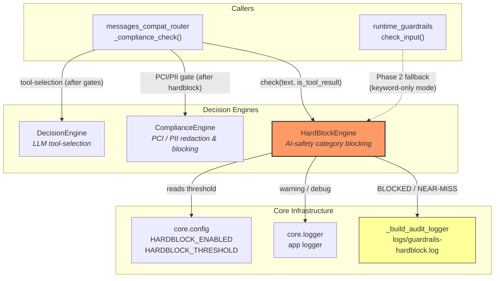
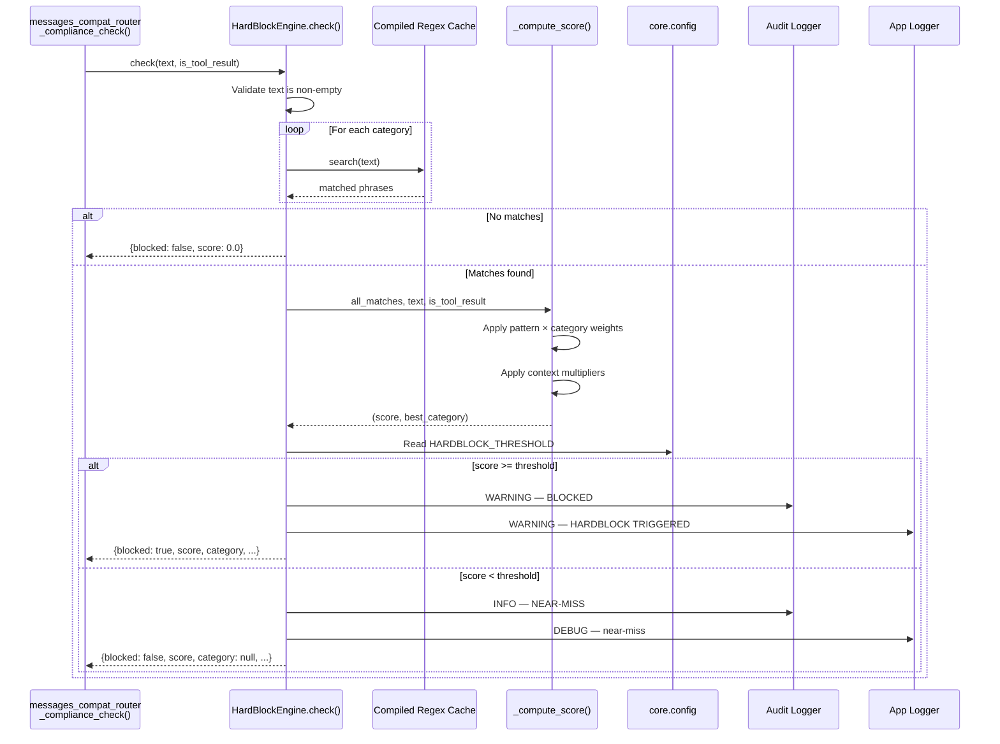
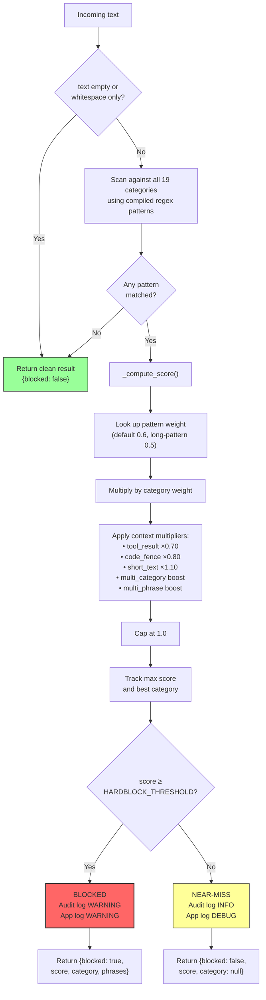
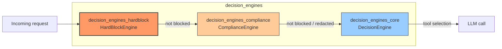

# Decision Engines — HardBlock Engine

> **Module path:** `shared_core › agent_system › decision_engines › decision_engines_hardblock`
> **Source file:** `agents/hardblock_engine.py`
> **Core components:** `HardBlockEngine`, `_build_audit_logger`

---

## 1. Introduction

The **HardBlock Engine** is a deterministic, keyword/regex-based AI-safety gate that blocks prompts requesting content in prohibited categories — weapons manufacture, malware creation, child exploitation, PCI-DSS card-data theft, social scoring, and more. It is the safety-layer member of the [decision engines](#12-relationship-to-sibling-decision-engines) triad and runs **before** any LLM call is made.

Unlike probabilistic content classifiers, the HardBlock Engine is intentionally **non-probabilistic and auditable**: every block decision is driven by compiled regex patterns and a transparent weighted scoring formula, and every decision (block *or* near-miss) is written to a dedicated audit log file.

### Design phases

| Phase | Status | Description |
|-------|--------|-------------|
| **Phase 1** (current) | ✅ Active | Keyword/regex pattern matching with weighted confidence scoring. No NeMo SDK dependency. |
| **Phase 2** (future) | 🔜 Planned | Replace `_check_keywords()` with an actual `nemoguardrails.LLMRails` call using `guardrails/config.yml`. See [guardrails_tools](guardrails_tools.md) for the Phase 2 runtime. |

---

## 2. Architecture



The HardBlock Engine sits at the **top of the request safety pipeline**. When a message arrives at the Anthropic Messages-compatible endpoint (`/v1/messages`), the compliance gate in `messages_compat_router._compliance_check()` calls `hardblock_engine.check()` on every newly-scanned user and tool-result message *before* the [ComplianceEngine](decision_engines_compliance.md) runs its PCI/PII analysis. If the hardblock gate triggers, the request is refused immediately — the LLM provider is never contacted.

---

## 3. Core Components

### 3.1 `_build_audit_logger()`

A factory that creates a dedicated `logging.Logger` instance for HardBlock audit events.

- **Log file:** `logs/guardrails-hardblock.log` (relative to the repository root)
- **Format:** `%(asctime)s | HARDBLOCK | %(levelname)s | %(message)s`
- **Timestamp:** ISO-8601 UTC (`%Y-%m-%dT%H:%M:%SZ`)
- **Propagation:** disabled (`propagate = False`) to prevent double-logging to the root logger
- **Singleton:** called once at module import; the resulting `_audit_log` logger is reused for all subsequent events

The audit logger records two event types:

| Event | Level | When |
|-------|-------|------|
| `BLOCKED` | `WARNING` | Computed score ≥ `HARDBLOCK_THRESHOLD` — request refused |
| `NEAR-MISS` | `INFO` | At least one pattern matched but score < threshold — request allowed |

Both entries include: score, threshold, category, matched phrases, all matched categories, `is_tool_result` flag, and a 120-character text excerpt (newlines replaced with spaces).

### 3.2 `HARDBLOCK_CATEGORIES`

A `Dict[str, List[str]]` mapping 19 category names to lists of trigger phrases. Phrases are compiled at module load into regex patterns with `re.IGNORECASE | re.DOTALL`. Both plain-string phrases and full regex patterns (e.g., `r"\bpipe\s*bomb\b"`) are supported.

### 3.3 Scoring weight tables

Two parallel dictionaries drive the confidence-score gate:

- **`HARDBLOCK_PATTERN_WEIGHTS`** — per-phrase specificity weights (0.3–0.95). Unlisted patterns use `HARDBLOCK_DEFAULT_WEIGHT` (0.6). Long compound patterns (>120 chars) not in the table receive a reduced default of 0.50.
- **`HARDBLOCK_CATEGORY_WEIGHTS`** — per-category severity weights (0.65–1.0).

See [§5 Scoring Model](#5-scoring-model) for details.

### 3.4 `HardBlockEngine`

The main class. A singleton instance (`hardblock_engine`) is created at module import and used by all callers.

#### Public API

```python
def check(self, text: str, is_tool_result: bool = False) -> Dict
```

Scans `text` against all HardBlock categories and returns a block decision.

**Parameters:**

| Parameter | Type | Default | Description |
|-----------|------|---------|-------------|
| `text` | `str` | — | The message body to scan |
| `is_tool_result` | `bool` | `False` | `True` when the message is a `tool`-role message (bash/file output). Applies a 0.7× dampening multiplier to reduce false positives from file content that incidentally contains trigger words |

**Returns:**

```python
{
    "blocked":         bool,          # True if score >= threshold
    "score":           float,         # aggregate confidence 0.0–1.0
    "category":        str | None,    # highest-scoring category (None if not blocked)
    "matched_phrases": list[str],     # phrases from the best category (empty if not blocked)
    "all_matches":     dict,          # {category: [phrases]} for all categories with hits
}
```

#### Internal methods

| Method | Purpose |
|--------|---------|
| `_compute_score(all_matches, text, is_tool_result)` | Computes the aggregate confidence score and returns `(score, best_category)`. Applies context multipliers (dampeners and boosters). |
| `_match_patterns(text, compiled, raw_phrases)` | Returns the raw phrase strings whose compiled regex patterns matched `text`. |
| `_clean_result()` | Returns a clean "no block" result dict for empty/blank input or no matches. |

---

## 4. Blocked Categories

The engine defines 19 prohibited categories:

| # | Category | Description | Category Weight |
|---|----------|-------------|:---------------:|
| 1 | `criminal_justice` | Risk scoring, predictive policing, recidivism assessment | 0.70 |
| 2 | `social_scoring` | Social scores, behavioural ranking, citizen scores | 0.70 |
| 3 | `housing` | Housing eligibility decisions | 0.70 |
| 4 | `education` | Scholarship / admission eligibility | 0.70 |
| 5 | `employment` | Candidate suitability / hiring decisions | 0.70 |
| 6 | `migration` | Visa / asylum eligibility | 0.70 |
| 7 | `insurance` | Insurance eligibility / coverage tiers | 0.70 |
| 8 | `profiling` | Personal-attribute profiling | 0.70 |
| 9 | `hate_ethnicity` | Hate / biased narratives about ethnicity | 0.70 |
| 10 | `illegal_drugs` | Drug cultivation, distribution, trafficking | 0.70 |
| 11 | `criminal_activity` | Counterfeiting, trafficking, weapons, explosives, chemical/bio agents, fraud, phishing | 0.95 |
| 12 | `child_safety` | CSAM, grooming, exploitation of minors | **1.00** |
| 13 | `pci_card_data` | Card data collection, skimming, carding, CVV/PAN misuse | 0.85 |
| 14 | `malware_ransomware` | Ransomware/malware creation, AV evasion | 0.90 |
| 15 | `password_cracking` | Password cracking / recovery tooling | 0.65 |
| 16 | `brute_force` | Brute force / dictionary attacks | 0.65 |
| 17 | `encryption_bypass` | Document encryption circumvention, DRM removal | 0.65 |
| 18 | `unauthorized_access` | Unauthorized access to protected content, session hijacking, privilege escalation | 0.75 |
| 19 | `offensive_security` | Offensive security tooling (dual-use exploits, RATs, C2) | 0.75 |

> **`child_safety` is zero-tolerance:** its category weight is 1.0, meaning any pattern match in this category always reaches the threshold regardless of pattern weight or context dampeners.

---

## 5. Scoring Model

A prompt is blocked **only** when its computed confidence score meets or exceeds `HARDBLOCK_THRESHOLD` (default `0.75`, env-tunable). This is not a binary keyword match — it is a weighted aggregate that balances specificity, severity, and context.

### 5.1 Score formula

For each matched phrase:

```
raw = pattern_weight × category_weight
raw = raw × context_multipliers
score = max(raw) across all matched phrases, capped at 1.0
```

### 5.2 Pattern weight tiers

| Tier | Weight | Description |
|------|:------:|-------------|
| High | 0.9 | Highly specific, near-zero false-positive risk (e.g., `"how to create ransomware"`) |
| Medium | 0.6 | Moderately specific, some dual-use risk (default) |
| Low | 0.3 | Broad / single-word, high false-positive risk (e.g., `r"\bphishing\b"`, `r"\bied\b"`) |

### 5.3 Context multipliers

Multipliers are applied to each phrase's raw score **before** taking the max:

| Signal | Multiplier | Effect | Rationale |
|--------|:----------:|--------|-----------|
| `is_tool_result=True` | ×0.70 | Dampen | File/bash output may incidentally contain trigger words (e.g., a file listing `bomb-proof-test.txt`) |
| Code fence present (` ``` `) | ×0.80 | Dampen | Developer writing/reviewing code — dual-use terms in a coding context |
| Very short text (<80 chars) | ×1.10 | Boost | Terse jailbreak prompts are typically short and direct |
| Multi-category hit (n > 1) | ×(1 + 0.15·(n−1)) | Boost | Multiple categories matching simultaneously increases malicious intent confidence |
| Multi-phrase hit (n > 1) | ×(1 + 0.10·(n−1)) | Boost | Multiple phrases from the same category reinforces intent |

### 5.4 Worked example

A 50-character user prompt containing `"build a pipe bomb"`:

| Factor | Value |
|--------|-------|
| Pattern: `r"\bpipe\s*bomb\b"` | weight = 0.80 |
| Category: `criminal_activity` | weight = 0.95 |
| Base raw | 0.80 × 0.95 = **0.76** |
| Short text boost | ×1.10 → **0.836** |
| Threshold | 0.75 |
| **Result** | **BLOCKED** (0.836 ≥ 0.75) |

The same phrase appearing inside a 500-line `tool_result` from `cat files.txt`:

| Factor | Value |
|--------|-------|
| Base raw | 0.76 |
| Tool-result dampener | ×0.70 → 0.532 |
| **Result** | **NEAR-MISS** (0.532 < 0.75) — logged but allowed |

---

## 6. Data Flow



---

## 7. Process Flow



---

## 8. Integration Points

### 8.1 `messages_compat_router._compliance_check()`

The primary caller. For each message in the scan window (messages after the last assistant turn), the router:

1. Checks `HARDBLOCK_ENABLED` — if `false`, skips the hardblock check entirely (the PCI/PII compliance gate still runs).
2. Calls `hardblock_engine.check(text, is_tool_result=(msg.role == "tool"))`.
3. If blocked, returns immediately with `"AI Safety policy violation: category={category}"` — the request is refused before reaching the LLM.
4. If not blocked, proceeds to the [ComplianceEngine](decision_engines_compliance.md) for PCI/PII redaction and blocking.

Tool-result messages are only scanned when `COMPLIANCE_SCAN_TOOL_RESULTS=true` (default `false`). The current user-typed prompt is always scanned.

> 📖 See [messages_compat_router](messages_compat_router.md) for the full request lifecycle (auth → budget → compliance → provider routing).

### 8.2 `runtime_guardrails.check_input()`

The NeMo Guardrails Phase 2 integration in [guardrails_tools](guardrails_tools.md) provides a separate keyword-only fallback (`_HARDBLOCK_PATTERNS`) when `NEMO_GUARDRAILS_ENABLED=1` but `NEMO_GUARDRAILS_LLM_ENABLED=0`. The `HardBlockEngine` is the more comprehensive deterministic engine that covers all 19 categories with weighted scoring, and is the engine used in the `messages_compat_router` compliance gate regardless of NeMo flags.

### 8.3 `core.config`

The engine reads two configuration values at check-time:

| Variable | Default | Description |
|----------|---------|-------------|
| `HARDBLOCK_ENABLED` | `false` | Master switch for the HardBlock gate in `messages_compat_router`. When `false`, the check is skipped entirely. |
| `HARDBLOCK_THRESHOLD` | `0.75` | Confidence-score threshold. A prompt is blocked only when `score >= threshold`. Range: 0.0–1.0. Lower = stricter; higher = more permissive. |

> 📖 See [core_infrastructure](core_infrastructure.md) for the full configuration reference.

### 8.4 `core.logger`

The engine imports `logger as _app_logger` from `core.logger` for application-level logging (WARNING on block, DEBUG on near-miss). This integrates with the platform's structured logging pipeline and context enrichment (request_id, user_id, etc.).

---

## 9. Configuration Reference

| Environment Variable | Default | Scope | Effect |
|---------------------|---------|-------|--------|
| `HARDBLOCK_ENABLED` | `false` | HardBlock gate | Enables/disables the HardBlock check in `messages_compat_router`. The PCI/PII compliance gate is **not** affected. |
| `HARDBLOCK_THRESHOLD` | `0.75` | HardBlock scoring | Confidence-score gate. `child_safety` always blocks regardless of this value. |
| `COMPLIANCE_SCAN_TOOL_RESULTS` | `false` | Scan scope | When `true`, tool-result messages (file/bash output) are scanned by both HardBlock and ComplianceEngine. |
| `NEMO_GUARDRAILS_ENABLED` | `0` | NeMo Phase 2 | Master switch for the NeMo Guardrails runtime. Does not affect `HardBlockEngine` directly. |
| `NEMO_GUARDRAILS_LLM_ENABLED` | `0` | NeMo Phase 2 | Controls whether `rails.generate()` (LLM-backed) is invoked. When `0`, only keyword-only fallback runs. |

---

## 10. Audit & Observability

### Audit log file

```
logs/guardrails-hardblock.log
```

Every block and near-miss is written to this file with the format:

```
2024-01-15T10:30:45Z | HARDBLOCK | WARNING | BLOCKED | score=0.836 | threshold=0.750 | category=criminal_activity | phrases=['\\bpipe\\s*bomb\\b'] | all_matches=['criminal_activity'] | is_tool_result=False | text_excerpt='how to build a pipe bomb from ...'
```

### Application logger

| Event | Level | Message pattern |
|-------|-------|-----------------|
| Block | `WARNING` | `HARDBLOCK TRIGGERED → score={score} category={category} phrases={phrases}` |
| Near-miss | `DEBUG` | `HARDBLOCK near-miss → score={score} category={category} phrases={phrases}` |

The application logger integrates with the platform's structured logging pipeline (Loki/Grafana) and is enriched with request context by `core.logger._context_processor`.

---

## 11. False-Positive Mitigation

The weighted scoring model is designed to minimise false positives while maintaining high recall for genuinely harmful prompts:

1. **Weighted patterns, not binary match** — broad single-word patterns (e.g., `r"\bphishing\b"` at 0.30, `r"\bied\b"` at 0.30) only reach threshold when combined with other matching signals (multi-category boost, multi-phrase boost, short-text boost).

2. **Context dampeners** — tool-result output (×0.70) and code-fenced content (×0.80) receive reduced scores, recognising that trigger words in file listings or code reviews are usually benign.

3. **Bounded regex patterns** — broad `.*` quantifiers are replaced with `[^\n]{0,N}` to prevent cross-line false positives on multi-line tool-result / file-listing content (since `re.DOTALL` is active globally).

4. **Compound pattern weighting** — long intent-verb constructions (e.g., "build/make/create ... bomb/explosive") that can match benign idioms like "create an explosive presentation" are given lower weights (0.45–0.65) so they only block when combined with other signals.

5. **Hyphen exclusion** — the standalone "bomb" pattern uses negative lookbehind/lookahead (`(?<!-)\bbomb(?![\w\-])\b`) to exclude compound idioms like "time-bomb chart" or "bomb-proof test suite" while still catching "build a bomb".

6. **`child_safety` exception** — the only category with weight 1.0; any match always blocks regardless of context. This is intentional zero-tolerance for child exploitation content.

---

## 12. Relationship to Sibling Decision Engines

The HardBlock Engine is one of three decision engines in the `shared_core › agent_system › decision_engines` module group:



| Engine | Module | Purpose | Blocking? |
|--------|--------|---------|:---------:|
| **HardBlockEngine** | [decision_engines_hardblock](decision_engines_hardblock.md) | AI-safety category blocking (weapons, malware, child safety, etc.) | ✅ Yes |
| **ComplianceEngine** | [decision_engines_compliance](decision_engines_compliance.md) | PCI/PII/secret detection, redaction, and blocking | ✅ Yes (block-configured types) |
| **DecisionEngine** | [decision_engines_core](decision_engines_core.md) | LLM-based tool-selection for autonomous code assistant | ❌ No (routing only) |

The HardBlock Engine and ComplianceEngine are **complementary safety gates**: HardBlock covers AI-safety content categories (what the AI is asked to *do*), while ComplianceEngine covers data-protection (what sensitive data is *present* in the prompt). Both must pass for a request to proceed.

---

## 13. Key Design Decisions

| Decision | Rationale |
|----------|-----------|
| **Weighted scoring over binary match** | A single broad keyword (e.g., "ransomware") should not block a security research question. Weighted scoring allows broad patterns to contribute signal without triggering false positives on their own. |
| **Deterministic, no ML dependency** | Safety blocks must be auditable and reproducible. No external service call means zero latency overhead and no failure mode where a down service degrades safety. |
| **Separate audit log file** | HardBlock decisions have different retention and access requirements than general application logs. A dedicated file simplifies compliance audits. |
| **`child_safety` zero-tolerance** | Category weight 1.0 ensures any match in this category always blocks, regardless of pattern weight or context. No acceptable false-negative risk for child exploitation content. |
| **Tool-result dampening** | File contents and bash output frequently contain trigger words in benign contexts (e.g., a security tool's output mentioning "ransomware detection"). The 0.70× multiplier prevents these from blocking legitimate development work. |
| **Near-miss logging** | Patterns that match but score below threshold are logged at INFO level. This allows operators to tune the threshold and pattern weights based on real-world traffic without waiting for a false positive or false negative incident. |
