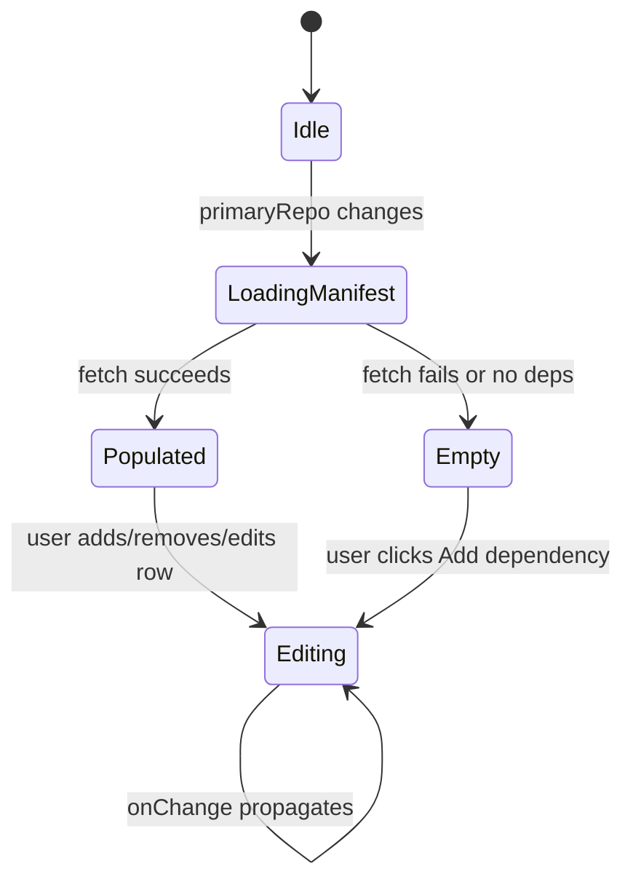
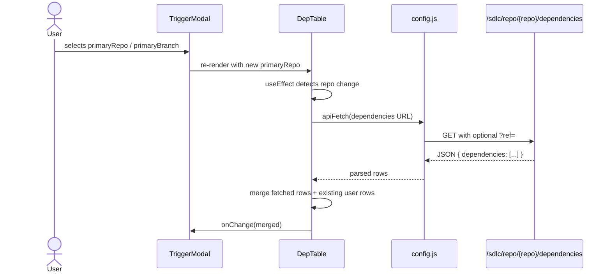
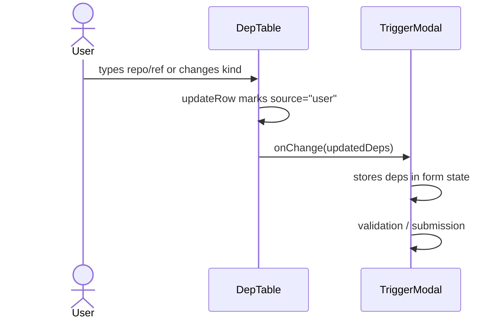
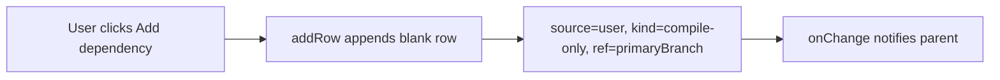
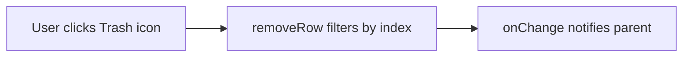
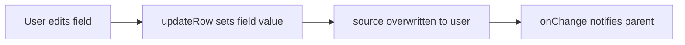

# DepTable Module

## Brief Introduction

`DepTable` is a small, focused React component in the `ai-ui` frontend that lets users declare and edit repository dependencies for multi-repo SDLC runs. It is rendered inside [`TriggerModal`](trigger_modal.md) when the feature flag `VITE_ENABLE_MULTI_REPO_SDLC` is enabled. The table supports both auto-discovered dependencies (pulled from the primary repository's manifest or build file) and manually added user entries, giving operators a clear, editable view of what repositories participate in a pipeline run.

---

## Core Functionality

### Responsibilities

1. **Display dependency rows** — Each row shows a repository path, target ref/branch, dependency kind, and a source badge.
2. **Auto-fetch manifest dependencies** — When `primaryRepo` is provided, the component calls the backend SDLC endpoint to load declared dependencies.
3. **Merge fetched and user rows** — Manifest/build-file entries are merged with any user-added rows, preserving user overrides.
4. **Validate input** — Repository paths are validated against a `group/project` style regex.
5. **Emit changes upward** — Every add, remove, or edit calls `onChange(newDeps)` so the parent form stays in sync.

### Supported Dependency Kinds

| Kind | Meaning |
|------|---------|
| `compile-only` | Dependency is needed for compilation/build but is read-only. |
| `editable` | Dependency may be modified by the pipeline (e.g., cross-repo fixes). |

### Source Badges

| Source | Badge color | Description |
|--------|-------------|-------------|
| `manifest` | blue | Loaded from the repository manifest. |
| `user` | green | Added or edited by the user. |
| `build-file` | gray | Inferred from the build file. |

---

## Architecture

### Component Placement

`DepTable` is a leaf presentational component. It is owned by [`TriggerModal`](trigger_modal.md) and consumes shared utilities from [`config`](ai_ui_frontend_config.md) for API calls.

```mermaid
flowchart TB
    subgraph "ai-ui Frontend"
        TM[TriggerModal]
        DT[DepTable]
        CFG[config.js apiFetch]
        BE[Backend SDLC API]
    end

    TM -->|renders with deps, onChange, primaryRepo, primaryBranch| DT
    DT -->|GET /sdlc/repo/{repo}/dependencies| CFG
    CFG -->|fetch| BE
    BE -->|dependencies JSON| DT
    DT -->|onChange(newDeps)| TM
```

### Internal State



---

## Component API

### Props

| Prop | Type | Required | Description |
|------|------|----------|-------------|
| `deps` | `Array<{repo, ref, kind, source}>` | yes | Current dependency list. |
| `onChange` | `(newDeps) => void` | yes | Callback invoked on every mutation. |
| `primaryRepo` | `string` | no | Repository whose manifest dependencies are auto-loaded. |
| `primaryBranch` | `string` | no | Default ref used for fetched rows and new user rows. |

### Dependency Row Shape

```javascript
{
  repo:   "group/project",   // repository path
  ref:    "main",            // branch, tag, or commit
  kind:   "compile-only",    // or "editable"
  source: "manifest"         // "manifest" | "user" | "build-file"
}
```

---

## Data Flow

### Auto-Fetch Flow



### User Edit Flow



---

## Process Flows

### Adding a Dependency



### Removing a Dependency



### Updating a Dependency



---

## Validation

Repository paths must match:

```regex
/^[a-zA-Z0-9_.-]+\/[a-zA-Z0-9_./-]+$/
```

This enforces a `group/project` or `group/subgroup/project` format. Invalid rows show a red border and a helper message.

---

## Dependencies

### Internal

| Module | Relationship |
|--------|--------------|
| [`config`](ai_ui_frontend_config.md) | Imports `API_BASE` and `apiFetch` for backend calls. |
| [`TriggerModal`](trigger_modal.md) | Parent component that renders `DepTable` and owns the form state. |

### External

| Package | Usage |
|---------|-------|
| `react` | `useState`, `useEffect`, `useRef` hooks. |
| `lucide-react` | `PlusCircle`, `Trash2`, `Loader2` icons. |

---

## How It Fits Into the System

`DepTable` is part of the multi-repo SDLC trigger experience in `ai-ui`. When a user configures an SDLC pipeline run through [`TriggerModal`](trigger_modal.md), the table:

1. Surfaces dependencies already declared in the primary repository.
2. Allows the user to supplement or override those dependencies before submission.
3. Passes the final dependency list back to the parent, which includes it in the run payload sent to the backend.

The backend endpoint consumed by this component belongs to the SDLC subsystem (see [`sdlc_router`](shared_api_routers_sdlc_router.md) / [`sdlc_pipeline`](shared_core_sdlc_pipeline.md)). The fetched dependencies are typically produced by [`agents/dep_resolver.py`](shared_core.md) or equivalent manifest parsing logic.

---

## Notes for Maintainers

- The `useEffect` that fetches dependencies intentionally ignores `deps` in its dependency array to avoid re-triggering fetches while the user is editing. It only runs when `primaryRepo` changes.
- User rows always take precedence over fetched rows with the same `repo` value during merge.
- The component is feature-gated at the parent level via `VITE_ENABLE_MULTI_REPO_SDLC`; `DepTable` itself does not check the flag.
- All styling uses Tailwind utility classes; no external CSS is required.
