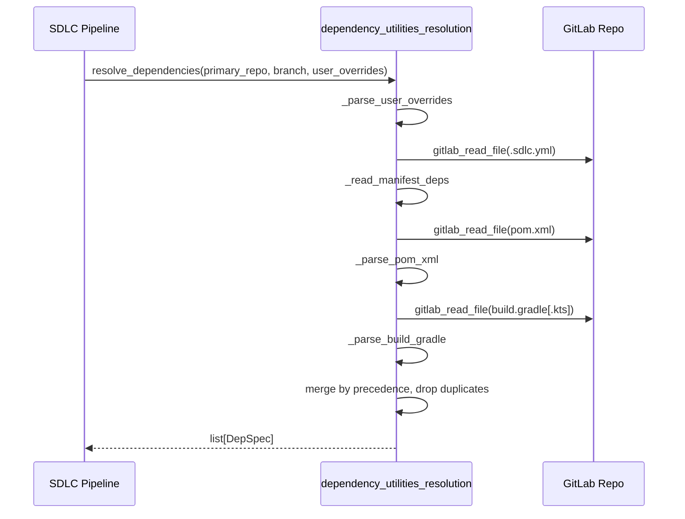
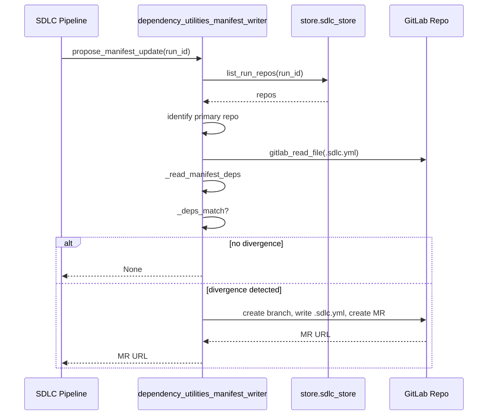

# dependency_utilities

The `dependency_utilities` module is a small, pure-function utility layer inside the broader SDLC / agent system. Its job is to answer two related questions for a multi-repo run:

1. **What repos participate in this run?** — It resolves the set of dependent repositories from three sources in strict precedence order: user overrides, the primary repo's `.sdlc.yml` manifest, and finally `pom.xml` / `build.gradle[.kts]` as a fallback.
2. **Did the run diverge from the manifest?** — After a run finishes, it can compare the as-built dependency list against the repo's `.sdlc.yml` and open a follow-up merge request to keep the manifest in sync.

The module is intentionally defensive: build-file inferences are always tagged `compile-only`, user overrides are validated but never raised, and manifest updates are best-effort (errors are logged, never blocking).

---

## Architecture Overview

```mermaid
graph TD
    subgraph "dependency_utilities"
        DR[dependency_utilities_resolution]
        MW[dependency_utilities_manifest_writer]
    end

    TRIGGER[SDLC Trigger / Pipeline] -->|primary_repo, branch, user_overrides| DR
    DR -->|read .sdlc.yml, pom.xml, build.gradle| GITLAB[GitLab via tools.gitlab_tools]
    DR -->|list[DepSpec]| ORCH[Run Orchestrator]

    ORCH -->|run_id| MW
    MW -->|list_run_repos| STORE[store.sdlc_store]
    MW -->|create branch / file / MR| GITLAB

    style DR fill:#e1f5e1
    style MW fill:#e1f5e1
```

The module is split into two focused sub-modules:

| Sub-module | File | Responsibility |
|------------|------|----------------|
| [dependency_utilities_resolution](dependency_utilities_resolution.md) | `agents/dep_resolver.py` | Resolve dependent repos for a run from user input, `.sdlc.yml`, and build files. |
| [dependency_utilities_manifest_writer](dependency_utilities_manifest_writer.md) | `agents/manifest_writer.py` | Detect manifest drift and open an MR to update `.sdlc.yml` after a run. |

Both sub-modules depend on shared platform utilities:

- `tools.gitlab_tools` — for reading files and creating branches / MRs in GitLab.
- `store.sdlc_store` — for persisting and retrieving the repo list used by a run.
- `db.models.SDLCRunRepo` — the underlying schema for run-time repo membership.

---

## Core Concepts

### `DepSpec`

A single participating repository is represented by a `DepSpec` dataclass:

- `repo` — GitLab namespace/project path, e.g. `npci/payments-sdk`.
- `ref` — branch or tag.
- `kind` — `primary` | `editable` | `compile-only`.
- `source` — `user` | `manifest` | `build-file` | `primary`.
- `build_order` — optional manual ordering override.

Only `editable` and `compile-only` dependencies are returned by the resolver; the primary repo is prepended by the caller.

### Precedence Rules

When resolving dependencies, the same repo can be mentioned by multiple sources. The resolver applies the following precedence:

1. **User overrides** — highest authority at trigger time.
2. **`.sdlc.yml` manifest** — durable repo-owned configuration.
3. **Build-file fallback** — lowest priority, inferred only when no manifest entry exists.

This guarantees that a human decision in the UI can never be silently overridden by a build file, and that build-file inferences cannot be promoted to `editable` without explicit user action.

### Internal vs. External Dependencies

Build-file parsing uses the `INTERNAL_GROUP_PREFIXES` environment variable (default: `org.npci.`) to decide which Maven/Gradle coordinates are internal NPCI artifacts. Everything else is treated as third-party and ignored by the resolver.

---

## Data Flow

### Resolving Dependencies for a Run



### Updating the Manifest After a Run



---

## Sub-module Documentation

- **[dependency_utilities_resolution](dependency_utilities_resolution.md)** — detailed documentation for `agents/dep_resolver.py`, including `DepSpec`, `resolve_dependencies`, manifest parsing, and build-file parsers.
- **[dependency_utilities_manifest_writer](dependency_utilities_manifest_writer.md)** — detailed documentation for `agents/manifest_writer.py`, including divergence detection and MR creation.

---

## Integration with the Larger System

`dependency_utilities` sits at the boundary between the SDLC trigger UI / pipeline and the GitLab-hosted source of truth. It is part of the [shared_core agent_system](shared_core.md) module tree and is used by the SDLC pipeline to:

- Expand a single primary repo into the full multi-repo workspace.
- Keep the repo manifest honest by proposing updates when runtime overrides diverge from `.sdlc.yml`.

For related functionality, see:

- [shared_core_sdlc_pipeline](shared_core_sdlc_pipeline.md) — the SDLC pipeline that consumes resolved dependencies.
- [tools.gitlab_tools](shared_integrations_gitlab_tools.md) — GitLab read/write primitives.
- [store.sdlc_store](shared_core_store_layer.md) — persistence for run-time repo membership.
