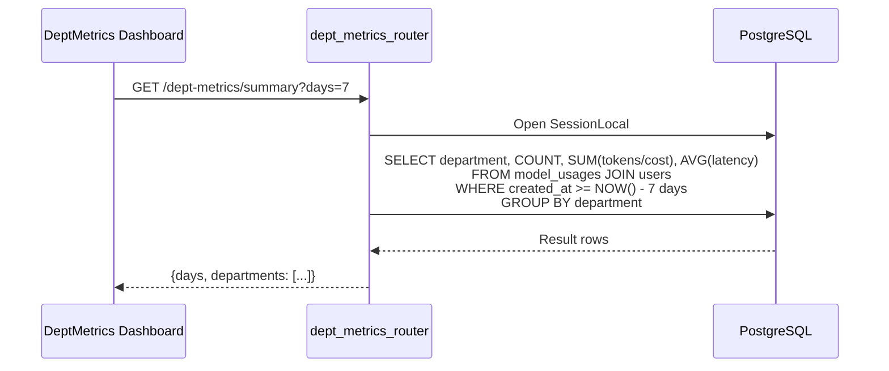
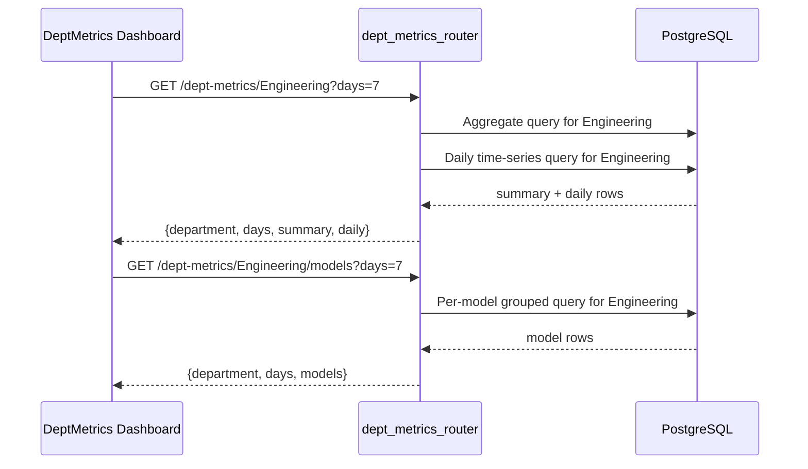

# Department Metrics Router

The `dept_metrics_router` module exposes admin-only REST endpoints for department-level usage analytics. It aggregates LLM usage data from the `model_usages` table and evaluation quality data from the `eval_scores` table, joined against the `users` table to attribute activity to organizational departments.

This router is part of the [shared_api_routers](shared_api_routers.md) layer and is consumed by dashboards such as the AI-UI [dept_metrics](ai_ui_frontend_dept_metrics.md) component to render cross-department usage summaries, per-department drill-downs, and model-level breakdowns.

---

## Core Functionality

The router provides five read-only endpoints under the `/dept-metrics` prefix:

| Endpoint | Function | Purpose |
|---|---|---|
| `GET /dept-metrics/departments` | `list_departments` | Enumerate all distinct departments known to the system. |
| `GET /dept-metrics/summary?days=N` | `dept_summary` | Cross-department rollup of requests, tokens, cost, and latency. |
| `GET /dept-metrics/{dept}?days=N` | `dept_stats` | Aggregated usage for one department plus a daily time series. |
| `GET /dept-metrics/{dept}/models?days=N` | `dept_model_breakdown` | Per-model usage breakdown within a department. |
| `GET /dept-metrics/{dept}/evals?days=N` | `dept_eval_summary` | Daily evaluation-quality averages for a department. |

All endpoints accept an optional `days` query parameter constrained to `1 <= days <= 90` (default `7`). Each endpoint is wrapped in a broad `try/except` so that schema or query failures return a graceful empty result rather than raising a 500 error.

---

## Architecture

```mermaid
flowchart TB
    subgraph Client
        A[AI-UI DeptMetrics Dashboard]
        B[Admin Reports / External Consumers]
    end

    subgraph FastAPI_Application
        R[dept_metrics_router<br/>/dept-metrics]
        D[_get_db dependency]
    end

    subgraph Data_Layer
        U[(users)]
        M[(model_usages)]
        E[(eval_scores)]
    end

    A -->|GET /summary, /{dept}, /{dept}/models| R
    B -->|GET /departments, /{dept}/evals| R
    R --> D
    D -->|SQLAlchemy SessionLocal| U
    D --> M
    D --> E
```

### Component Relationships

- **`_get_db`** — A local dependency factory that imports `SessionLocal` from [db.database](shared_core_database.md) and yields a SQLAlchemy session, ensuring it is closed after each request.
- **`list_departments`** — Queries the `users` table for distinct, non-empty `department` values. This list drives department selectors in the UI.
- **`dept_summary`** — Joins `model_usages` with `users` on `users.id::text = model_usages.user_id`, groups by department, and returns request count, token totals, cost, and average latency.
- **`dept_stats`** — Returns a single-department aggregate plus a daily breakdown of requests, tokens, and cost.
- **`dept_model_breakdown`** — Extends `dept_stats` by grouping on `model_usages.model` to show which models each department consumes.
- **`dept_eval_summary`** — Reads from `eval_scores` directly (which stores a `department` column) and returns daily averages for grounding, completeness, chunk count, and total eval count.

> **Note on attribution:** Usage attribution relies on a text cast of `users.id` to match `model_usages.user_id`. The `eval_scores` table stores `department` directly, so no join is required for evaluation summaries.

---

## Data Flow

### Department Summary Request



### Single-Department Drill-Down



---

## Endpoint Reference

### `GET /dept-metrics/departments`

Returns every non-empty department value found in the `users` table, sorted alphabetically.

**Response shape:**
```json
{
  "departments": ["Engineering", "Finance", "HR"]
}
```

### `GET /dept-metrics/summary?days={1-90}`

Cross-department rollup for the requested trailing window.

**Response shape:**
```json
{
  "days": 7,
  "departments": [
    {
      "department": "Engineering",
      "total_requests": 1200,
      "total_tokens": 4500000,
      "total_cost_usd": 12.34,
      "avg_latency_ms": 850
    }
  ]
}
```

### `GET /dept-metrics/{dept}?days={1-90}`

Single-department aggregate plus daily time series.

**Response shape:**
```json
{
  "department": "Engineering",
  "days": 7,
  "summary": {
    "total_requests": 1200,
    "total_tokens": 4500000,
    "input_tokens": 3000000,
    "output_tokens": 1500000,
    "total_cost_usd": 12.34,
    "avg_latency_ms": 850,
    "unique_users": 42
  },
  "daily": [
    {"day": "2025-01-15", "requests": 180, "tokens": 650000, "cost_usd": 1.80}
  ]
}
```

### `GET /dept-metrics/{dept}/models?days={1-90}`

Per-model breakdown for a department.

**Response shape:**
```json
{
  "department": "Engineering",
  "days": 7,
  "models": [
    {
      "model": "gpt-4o",
      "requests": 800,
      "tokens": 3500000,
      "cost_usd": 9.50,
      "avg_latency_ms": 900
    }
  ]
}
```

### `GET /dept-metrics/{dept}/evals?days={1-90}`

Daily evaluation-quality summary for a department.

**Response shape:**
```json
{
  "department": "Engineering",
  "days": 7,
  "evals": [
    {
      "day": "2025-01-15",
      "avg_grounding": 0.87,
      "avg_completeness": 0.92,
      "avg_chunks": 4.2,
      "total_evals": 56
    }
  ]
}
```

---

## Dependencies

| Dependency | Role | Related Documentation |
|---|---|---|
| `db.database.SessionLocal` | SQLAlchemy session factory | [shared_core_database](shared_core_database.md) |
| `users` table | Department membership and user identity | [db/models](shared_core_database.md) |
| `model_usages` table | Per-request LLM usage records | [telemetry](shared_core_core_infrastructure.md), [budget_router](budget_router.md) |
| `eval_scores` table | Evaluation quality scores | [evals_router](evals_router.md) |

The router does **not** currently apply its own authorization decorator; it is expected to be mounted behind an admin-scoped dependency at the application level or protected by upstream gateway rules. For role-based access patterns, see [auth/rbac](shared_core_authentication.md) and [admin_router](admin_router.md).

---

## Integration with the Wider System

- **AI-UI Dashboard** — The [DeptMetrics](ai_ui_frontend_dept_metrics.md) React component consumes `/dept-metrics/summary`, `/{dept}`, and `/{dept}/models` to render `StatCard` visualizations.
- **Budget & Cost Governance** — Cost and token totals overlap conceptually with [budget_router](budget_router.md), which manages per-user and per-department budgets, HOD caps, and allocation ledgers. The metrics router is read-only; budget enforcement happens elsewhere.
- **Model Governance** — Per-department model breakdowns complement [model_governance_router](model_governance_router.md), which controls which models a department or user is allowed to use.
- **Evaluations** — `dept_eval_summary` surfaces quality metrics produced by the evaluation pipeline; see [evals_router](evals_router.md) for result listing and trend analysis.
- **Telemetry** — `model_usages` is populated by the telemetry subsystem described in [shared_core_core_infrastructure](shared_core_core_infrastructure.md).

---

## Error Handling & Operational Notes

- All endpoints catch exceptions and return a JSON payload with an `error` field and empty data arrays/objects. This makes the dashboard resilient to transient database issues but may mask schema drift or permission problems.
- The `days` parameter is validated by FastAPI (`ge=1`, `le=90`) to bound query cost.
- Because queries use raw SQL via `sqlalchemy.text`, any change to column names in `model_usages`, `users`, or `eval_scores` must be reflected here.
- Department attribution depends on `users.department` being populated and consistent. Departments are discovered from the `users` table rather than a dedicated departments table.

---

## See Also

- [shared_api_routers](shared_api_routers.md) — Parent module containing all shared routers.
- [budget_router](budget_router.md) — Department and user budget management.
- [evals_router](evals_router.md) — Evaluation result listing and summaries.
- [model_governance_router](model_governance_router.md) — Department-level model permissions.
- [admin_router](admin_router.md) — Admin configuration and circuit-breaker controls.
- [ai_ui_frontend_dept_metrics](ai_ui_frontend_dept_metrics.md) — Frontend dashboard that consumes these endpoints.
- [shared_core_database](shared_core_database.md) — Database models and session management.
