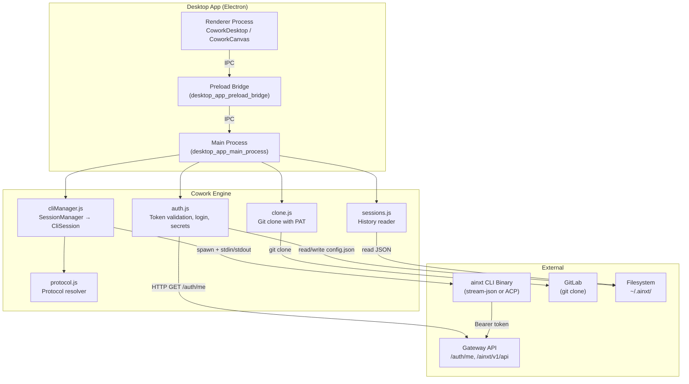
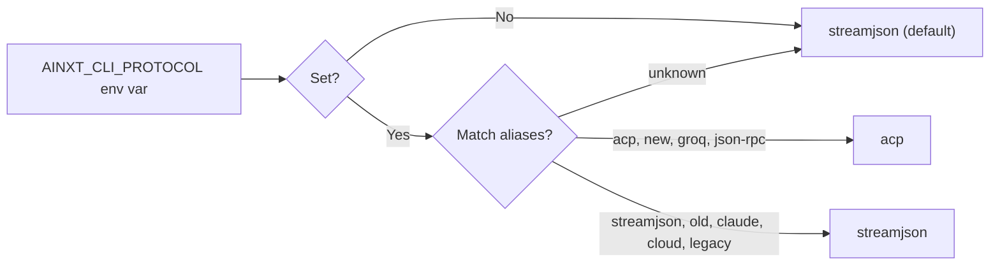
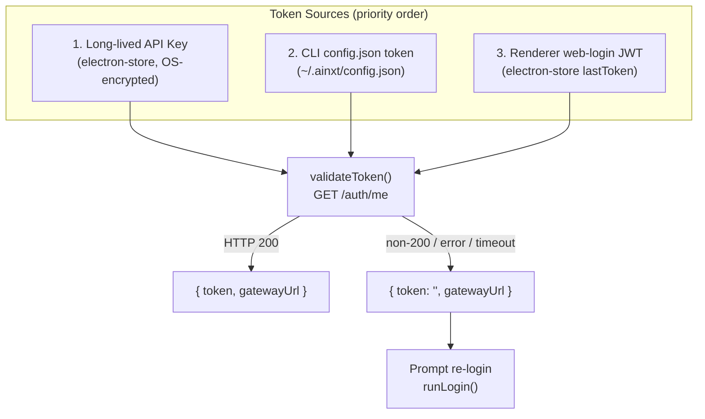
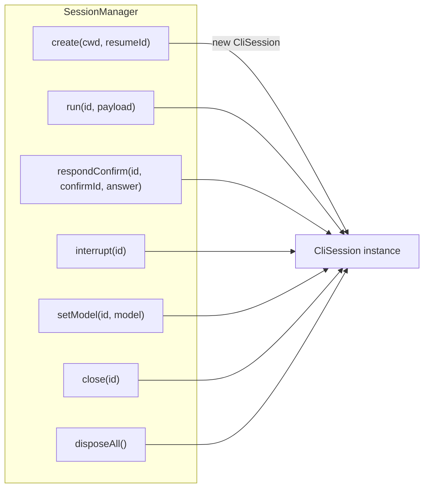
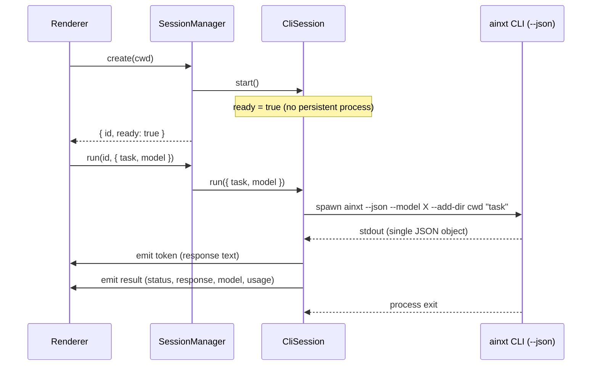
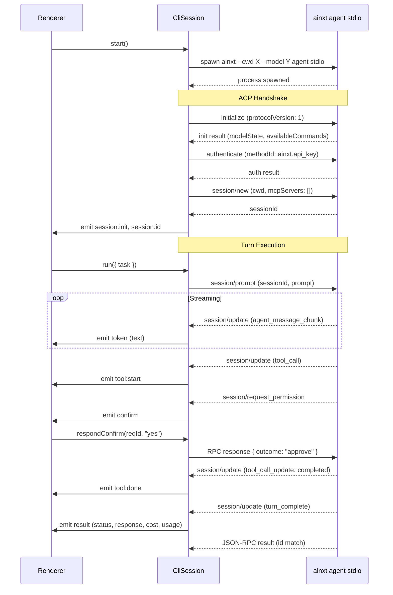
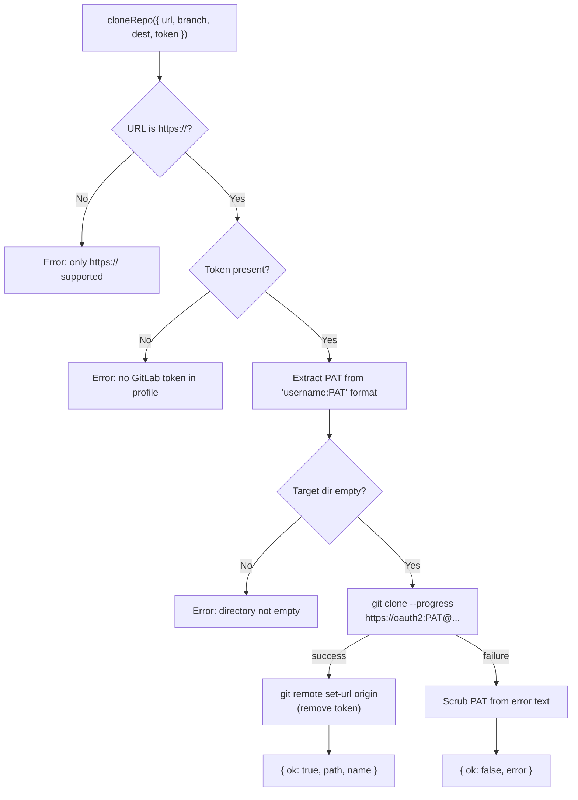
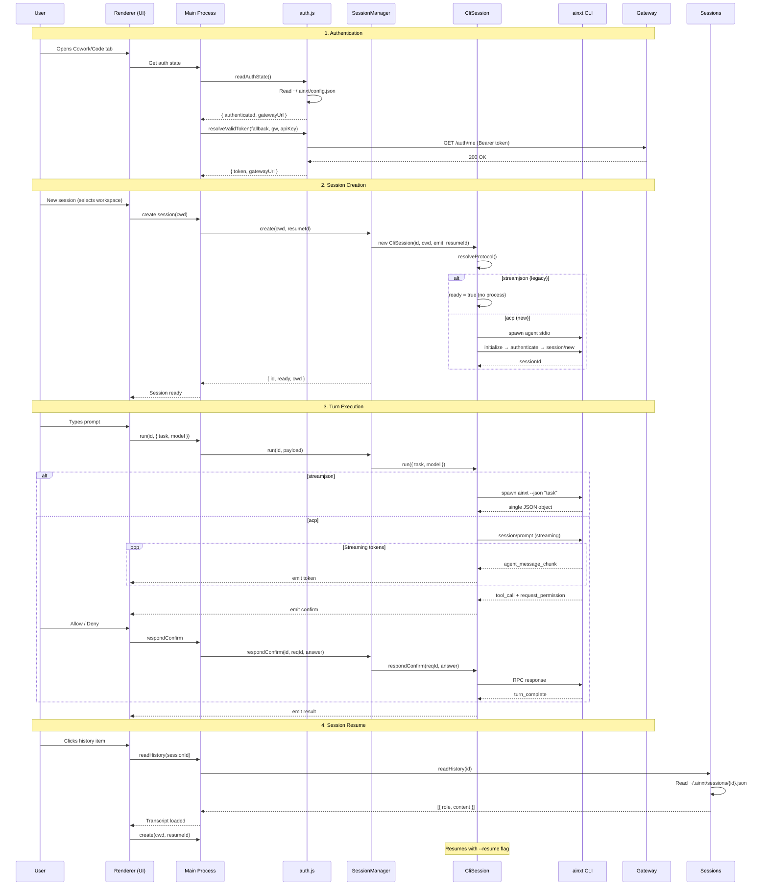
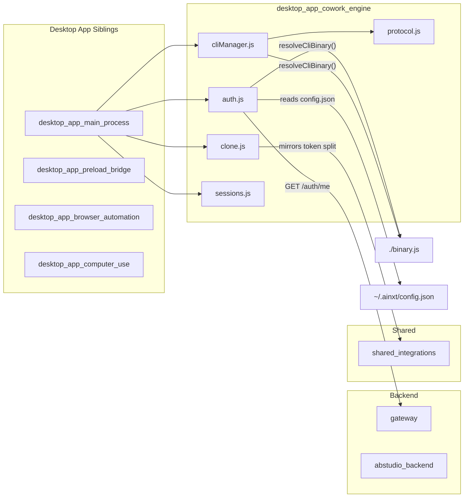

# Desktop App Cowork Engine

## Introduction

The **Desktop App Cowork Engine** is the core subsystem within the Electron desktop application that manages the lifecycle of local AI coding-agent sessions. It bridges the desktop UI (renderer process) to the `ainxt` CLI binary, handling authentication, session creation, streaming protocol communication, tool-permission gating, git repository cloning, and session history persistence.

The engine supports two distinct CLI wire protocols — a legacy **stream-json** protocol (production default) and a newer **Agent-Client-Protocol (ACP)** JSON-RPC 2.0 protocol (SIT/testing) — selected at runtime via an environment variable. This dual-protocol design allows the desktop app to work with whichever CLI binary is installed without code changes.

### Key Responsibilities

| Responsibility | Component |
|---|---|
| Gateway token validation & re-login orchestration | `auth.js` |
| CLI process spawning, protocol negotiation, streaming I/O | `cliManager.js` |
| Protocol selection (stream-json vs ACP) | `protocol.js` |
| Authenticated git clone with PAT scrubbing | `clone.js` |
| On-disk session history reading for sidebar/resume | `sessions.js` |

---

## Architecture Overview



---

## Component Documentation

### 1. `protocol.js` — Protocol Resolver

**Purpose:** Single source of truth for which CLI wire protocol the desktop app drives.

The desktop app ships with two different `ainxt` CLI binaries:

| Protocol | Binary | Wire Format | Status |
|---|---|---|---|
| `streamjson` | `ainxt-windows-x64_claude.exe` (v1.0.2-beta) | Newline-delimited stream-json, single-shot `--json` per turn | **Production default** |
| `acp` | `ainxt-windows-x64.exe` (v0.2.101) | JSON-RPC 2.0 over persistent `agent stdio` process | SIT / testing only |

**Selection mechanism:** The `AINXT_CLI_PROTOCOL` environment variable (set in the launcher script). If unset or unrecognised, defaults to `streamjson` for production safety.



**Exported functions:**
- `resolveProtocol()` → `"acp" | "streamjson"`
- `isAcp()` → `boolean`

---

### 2. `auth.js` — Authentication & Token Management

**Purpose:** Manages the CLI's gateway authentication lifecycle. The CLI owns the real auth lifecycle (JWT in `~/.ainxt/config.json` with auto-refresh); this module validates tokens, drives `ainxt login`, and manages encrypted secrets.

#### Authentication Model



#### Key Functions

| Function | Description |
|---|---|
| `readAuthState()` | Reads `~/.ainxt/config.json` to check if a token is present. Returns `{ authenticated, gatewayUrl, error }`. |
| `readToken()` | Extracts the CLI's gateway token (JWT/API key/OAuth) from config.json. |
| `writeToken(token, gatewayUrl, extraFields)` | Persists a validated token to config.json, self-healing the gateway URL and ensuring `auth_method` is set. |
| `validateToken(token, gatewayUrl)` | Hits the gateway's `/auth/me` endpoint (4s timeout). Resolves `true` only on HTTP 200. |
| `resolveValidToken(fallbackToken, gatewayUrl, apiKey)` | Tries token candidates in priority order; returns the first that validates. |
| `runLogin(onOutput)` | Spawns `ainxt login` as a subprocess, streaming stdout/stderr to the renderer. Has a configurable timeout (`COWORK_LOGIN_TIMEOUT_MS`, default 120s) and supports cancellation. |
| `cancelLogin()` | Kills the active login subprocess (process-group kill on non-Windows). |

#### Secret Management

Secrets are stored in `electron-store` using `safeStorage` (OS-backed encryption: DPAPI on Windows, Keychain on macOS). Two secrets are managed:

| Secret Key | Purpose |
|---|---|
| `coworkApiKeyEnc` | Long-lived CLI API key (no expiry, bypasses session-registry 401) |
| `ssoRefreshEnc` | Entra (SSO) refresh token |

The `_makeSecret(storeKey)` factory returns `{ read, write, clear }` with a plaintext fallback when OS encryption is unavailable.

#### TLS Handling

When `AINXT_TLS_INSECURE=1` is set (for self-signed gateway certs), the module creates a reusable `https.Agent` with `rejectUnauthorized: false`. This env var name **must match** the one the Rust CLI reads — a mismatch silently disables the desktop's TLS bypass.

#### Diagnostics

All `validateToken` outcomes (HTTP status, TLS errors, network errors, timeouts) are appended to `~/.ainxt/desktop-auth.log` for post-mortem diagnosis without DevTools.

> **Note:** The CLI's gateway token is separate from the web UI's `httpOnly` session cookie. A user may be signed into the web app but still need `ainxt login` once to enable local-agent mode.

---

### 3. `cliManager.js` — CLI Session Manager

**Purpose:** Spawns and drives the `ainxt` CLI agent headless, managing the full session lifecycle from creation through streaming output to disposal.

#### Class: `SessionManager`

A registry of active `CliSession` instances. Delegates all operations to the underlying session:



#### Class: `CliSession`

The core session driver. Its behavior bifurcates based on the resolved protocol:

##### Stream-JSON Protocol (Legacy / Production)



Each turn spawns a fresh `--json` process that outputs a single JSON object and exits. No persistent process, no handshake, no per-tool confirmations.

##### ACP Protocol (New / SIT)



#### Event Types Emitted

The `CliSession` emits the following event types to the renderer via the `emit` callback:

| Event Type | Trigger | Key Fields |
|---|---|---|
| `session:init` | Handshake complete (ACP) or available_commands_update | `model`, `slashCommands`, `tools`, `permissionMode` |
| `session:id` | ACP session/new returns sessionId | `sessionId` |
| `session:exit` | CLI process closes | `code` |
| `token` | Streaming text delta | `text` |
| `tool:start` | Tool execution begins | `name`, `detail`, `diff` |
| `tool:done` | Tool completes successfully | `name` |
| `tool:fail` | Tool fails | `name` |
| `confirm` | Permission request from CLI | `id`, `tool`, `detail`, `label` |
| `result` | Turn completes | `status`, `response`, `model`, `costUsd`, `usage`, `numTurns` |
| `context` | Context window usage update | `pct`, `tokens`, `max` |
| `error` | Fatal error | `msg` |
| `notice` | CLI stderr (info level) | `msg`, `level` |

#### Tool Name Resolution

The ACP CLI wraps every MCP tool call behind a generic `use_tool`/`search_tool` meta-tool. The `_realToolName(name, rawInput)` function unwraps these to surface the actual tool name (e.g., an MCP server's real tool name) in the UI.

#### Diff Building

The `buildDiff(name, input)` function constructs renderable diffs from mutating tool inputs:

| Tool | Diff Source |
|---|---|
| `Edit` | `old_string` → `new_string` |
| `MultiEdit` | Array of `{ old_string, new_string }` edits |
| `Write` | Full `content` (shown as all-added) |

Diffs are capped at `MAX_DIFF_LINES` (240) to prevent UI overload.

#### Bundled Skills

Creative-code skills (canvas-design, frontend-design, algorithmic-art) ship with the desktop app and are exposed to the Code agent via `--add-dir`. The `bundledSkillsDir()` function locates the skills directory in both packaged (`process.resourcesPath/code-skills`) and dev (`desktop/resources/code-skills`) modes. Code-tab only — never wired into the Cowork office agent.

#### Models Cache Version Sync

On module load, `_syncModelsCacheVersion()` patches `~/.ainxt/models_cache.json` to set `ainxt_version` to `"3.0.0-beta"` so the new CLI uses cached models instead of fetching from the gateway (which fails due to TLS cert issues).

#### CLI Protocol Tracer

When `AINXT_CLI_TRACE=1` is set, all raw stdin/stdout lines and process lifecycle events are written to `~/.ainxt/cli-trace.log` for debugging protocol-level issues.

#### Auto-Answering CLI Questions

The ACP CLI may send `_ainxt_dev/ask_user_question` (interactive questions) and `_ainxt_dev/exit_plan_mode` (plan approval) as JSON-RPC requests. Since the desktop has no interactive question UI:

- **Questions:** Auto-answered with the first (recommended) option; the user is notified via a token in the chat showing what was selected.
- **Plan approval:** Auto-approved; the plan content is shown to the user via a token.

---

### 4. `clone.js` — Git Repository Cloning

**Purpose:** Clones a GitLab repository to the user's local machine using their stored PAT, then scrubs the token from the persisted git config.



**Security measures:**
- The PAT is embedded in the clone URL only transiently during the clone operation.
- After a successful clone, the remote URL is rewritten to a token-less URL via `git remote set-url`.
- The PAT is never logged; error messages are scrubbed by replacing the token with `***`.
- `GIT_TERMINAL_PROMPT=0` ensures a bad token fails fast instead of hanging on a credential prompt.
- Only `https://` URLs are supported (no SSH).

**Token format:** The profile stores GitLab tokens as `"username:PAT"`. The module splits on the first `:` to extract just the PAT, mirroring `tools/gitlab_tools.py:set_token()` in the [shared_integrations](shared_integrations.md) module.

---

### 5. `sessions.js` — Session History Reader

**Purpose:** Reads the CLI's persisted session data for the history sidebar and session resume functionality.

#### On-Disk Layout

```
~/.ainxt/sessions/
├── index.json          # { version, sessions: [{ id, cwd, updatedAt, name, model, turnCount, source }] }
├── {sessionId}.json    # { id, cwd, turns: [{ role, content, ... }] }
└── ...
```

#### Functions

| Function | Description |
|---|---|
| `listSessions(cwd)` | Returns sessions for a given working directory (filtered), sorted newest-first. Each entry: `{ id, title, cwd, turnCount, mtime }`. |
| `readHistory(id)` | Reconstructs `[{ role, content }]` from a session's turns for transcript display. Only includes `user` and `assistant` roles with string content. |
| `sessionsDir()` | Returns the sessions directory path (`~/.ainxt/sessions/`). |

---

## Data Flow: Full Session Lifecycle



---

## Filesystem Layout

All cowork engine state is stored under `~/.ainxt/`:

```
~/.ainxt/
├── config.json              # CLI config: jwt, gateway_url, auth_method, email
├── desktop-auth.log         # Auth validation diagnostics (append-only)
├── cli-trace.log            # CLI protocol trace (when AINXT_CLI_TRACE=1)
├── models_cache.json        # Cached LLM models (version-patched on startup)
├── sessions/
│   ├── index.json           # Session index (id, cwd, name, updatedAt, turnCount)
│   └── {id}.json            # Per-session transcript turns
└── (electron-store data)    # OS-encrypted secrets (coworkApiKeyEnc, ssoRefreshEnc)
```

---

## Environment Variables

| Variable | Default | Description |
|---|---|---|
| `AINXT_CLI_PROTOCOL` | `streamjson` | Selects CLI wire protocol: `streamjson` (legacy) or `acp` (new) |
| `AINXT_TLS_INSECURE` | unset | When `1`, skips TLS verification for gateway requests (self-signed certs) |
| `AINXT_API_PREFIX` | `/ainxt/v1/api` | Gateway API path prefix |
| `AINXT_CLI_TRACE` | unset | When `1`, enables CLI protocol tracing to `~/.ainxt/cli-trace.log` |
| `COWORK_LOGIN_TIMEOUT_MS` | `120000` | Timeout for `ainxt login` subprocess (min 30s) |
| `AINXT_IS_COWORK` | unset | Set to `1` by cliManager when spawning CLI (marks cowork context) |
| `FORCE_COLOR` | unset | Set to `0` to disable color output in CLI subprocesses |

---

## Dependencies & Cross-Module References



### Related Module Documentation

- **[desktop_app_main_process](desktop_app_main_process.md)** — The Electron main process that orchestrates the cowork engine, manages windows, tray, shortcuts, and SSO flows.
- **[desktop_app_preload_bridge](desktop_app_preload_bridge.md)** — The preload script that exposes IPC bridges between the renderer and main process.
- **[desktop_app_browser_automation](desktop_app_browser_automation.md)** — Playwright-based browser automation manager for the desktop app.
- **[desktop_app_computer_use](desktop_app_computer_use.md)** — Computer-use manager for desktop automation.
- **[gateway](gateway.md)** — The backend gateway API that validates tokens (`/auth/me`) and serves agent/workflow endpoints.
- **[abstudio_backend](abstudio_backend.md)** — The ABStudio backend with agent factory, workflow engine, and CLI runtime.
- **[shared_integrations](shared_integrations.md)** — Contains `gitlab_tools.py` whose token-splitting logic is mirrored in `clone.js`.
- **[ai_ui_frontend](ai_ui_frontend.md)** — The web UI frontend; the `useDesktop.js` hook provides desktop-specific cowork APIs (`coworkListSessions`, `coworkSessionHistory`, etc.) that consume session data managed by this engine.

---

## Security Considerations

1. **Token isolation:** The CLI's gateway token (in `~/.ainxt/config.json`) is separate from the web UI's `httpOnly` session cookie. Both may coexist; the engine prefers the CLI token for local-agent mode.

2. **Secret encryption:** API keys and SSO refresh tokens are encrypted at rest using OS-backed `safeStorage` (DPAPI/Keychain). Plaintext fallback only when OS encryption is unavailable.

3. **PAT scrubbing:** Git clone embeds the PAT transiently in the clone URL, then rewrites the remote to a token-less URL. Error messages are scrubbed before surfacing to the user.

4. **TLS bypass:** The `AINXT_TLS_INSECURE` flag must match between the desktop's Node.js process and the Rust CLI. A mismatch silently disables the desktop's TLS bypass while the CLI's remains active (or vice versa).

5. **Login process isolation:** The `ainxt login` subprocess runs in its own process group (on non-Windows) so it can be killed as a unit on timeout or cancellation, preventing leaked concurrent logins.

6. **Tool permission gating:** Both protocols support per-tool confirmation. The ACP protocol uses `session/request_permission` with `approve`/`reject` outcomes; the stream-json protocol uses `control_request`/`can_use_tool` with `allow`/`deny`. The renderer surfaces these as Allow/Don't Allow dialogs.
