# Desktop App — Main Process (`desktop_app_main_process`)

## Brief Introduction

The **Desktop App Main Process** is the Electron main-process entry point for the AiNxt desktop application (`desktop/src/main.js`). It is the privileged Node.js process that owns the application lifecycle, window management, system tray, global shortcuts, local file access, a built-in MCP (Model Context Protocol) server, and two local-agent runtimes (Cowork and Cowork Office). It bridges the gateway-served web UI (loaded inside a `BrowserWindow`) with the user's local filesystem, terminal, browser, and native desktop — capabilities the server-side agent cannot reach on its own.

The main process is the security boundary: it enforces workspace-scoped file access, command allowlists, per-action confirmation dialogs, PII-redacted screenshots, and a hard kill-switch (ESC) for computer-use sessions. It also manages authentication (SSO, silent re-login, API-key persistence) so the local CLI agent can authenticate against the gateway without a second interactive login.

---

## Architecture Overview

```mermaid
graph TB
    subgraph "Electron Desktop App"
        Main["main.js<br/>(Main Process)"]

        subgraph "Window & UI"
            BW["BrowserWindow<br/>(Gateway-served SPA)"]
            TB["Custom Title Bar<br/>(_injectTitleBar)"]
            Preload["preload.js<br/>(Context Bridge)"]
        end

        subgraph "System Integration"
            Tray["System Tray<br/>(createTray)"]
            Shortcut["Global Shortcut<br/>Cmd/Ctrl+Shift+A"]
            Clip["Clipboard Monitor<br/>(startClipboardMonitor)"]
        end

        subgraph "Local MCP Server"
            Mcp["HTTP MCP Server<br/>127.0.0.1:_mcpPort"]
            McpTools["Tools: read_file, list_directory,<br/>search_files, execute_terminal,<br/>list_files, extract_document,<br/>upload_file_to_chat, browser_*, computer_*"]
        end

        subgraph "Cowork Dev Agent"
            CoworkMgr["SessionManager<br/>(_ensureCowork)"]
        end

        subgraph "Cowork Office Agent"
            CoworkOfficeMgr["CoworkSessionManager<br/>(_ensureCoworkOffice)"]
            EscKill["ESC Kill-Switch<br/>(_armCoworkEsc)"]
        end

        subgraph "Dispatch Poller"
            Dispatch["DispatchPoller<br/>(_ensureDispatchPoller)"]
        end

        subgraph "Auth"
            Auth["cowork/auth.js<br/>(SSO, silentRelogin,<br/>resolveValidToken)"]
        end
    end

    subgraph "External"
        Gateway["AiNxt Gateway<br/>(apiBase)"]
        CLI["ainxt CLI Binary<br/>(spawned subprocess)"]
        FS["Local Filesystem<br/>(watched workspaces)"]
        Browser["Playwright Browser"]
        Desktop["Native Desktop<br/>(nut.js)"]
    end

    Main --> BW
    Main --> Tray
    Main --> Shortcut
    Main --> Clip
    Main --> Mcp
    Main --> CoworkMgr
    Main --> CoworkOfficeMgr
    Main --> Dispatch
    Main --> Auth

    BW -->|loadURL| Gateway
    BW --> Preload
    Mcp --> McpTools
    McpTools --> FS
    McpTools --> Browser
    McpTools --> Desktop

    CoworkMgr -->|spawn| CLI
    CoworkOfficeMgr -->|spawn| CLI
    CLI -->|model calls| Gateway
    CLI -->|MCP --mcp-config| Mcp

    Dispatch -->|long-poll| Gateway
    Dispatch --> CoworkOfficeMgr

    Auth -->|validate /auth/me| Gateway
    Auth -->|persist config.json| CLI
```

### Module Dependencies

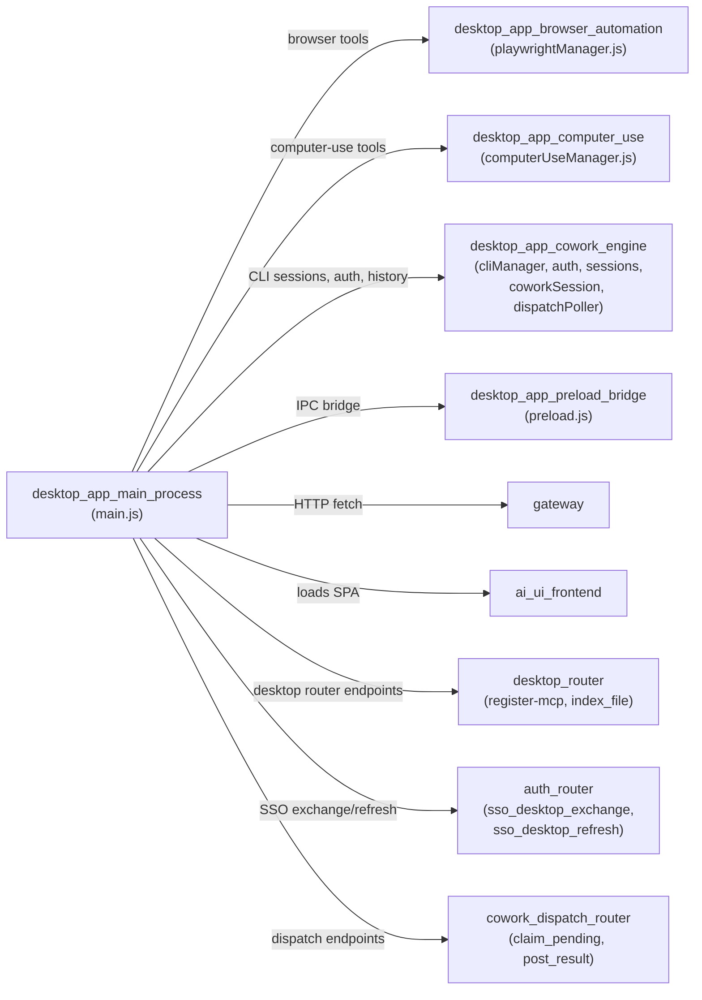

---

## Core Components

### 1. Application Lifecycle & Branding

| Component | Responsibility |
|-----------|---------------|
| `app.setName("AiNxt")` | Brands the app as "AiNxt" (not "Electron") in the macOS menu bar and About dialog. Must run before `app.ready`. |
| `app.whenReady()` | Entry point: reaps orphaned CLI processes, sets the dock icon, builds the app menu, creates the window, runs silent re-login, creates the tray, registers shortcuts, starts clipboard monitor, starts the MCP server, and restores watched folders. |
| `app.on("before-quit")` | Defers quit to give the renderer a 1.5s grace period to flush the active conversation to the server (G11). |
| `app.on("will-quit")` | Tears down all resources: unregisters shortcuts, clears clipboard timer, closes watchers, stops MCP server, disposes all Cowork sessions, stops the dispatch poller, closes the browser API. |

**Environment variables** (resolved at startup):

| Variable | Purpose |
|----------|---------|
| `AINXT_GATEWAY_URL` | Overrides the gateway URL (highest priority; enables portable builds). |
| `AINXT_API_PREFIX` | Gateway API path prefix (default `/ainxt/v1/api`). |
| `AINXT_UI_PATH` | Path where the gateway serves the SPA (default `/portal/`). |
| `AINXT_DEV` | Enables dev mode (loads Vite dev server at `localhost:5173`). |
| `AINXT_DEVTOOLS` | Opens DevTools on launch. |
| `AINXT_TLS_INSECURE` | Accepts self-signed / hostname-mismatched TLS certs (SIT/portable only; never production). Applies to both Chromium net stack and Node `https.Agent`. |

### 2. Window Management

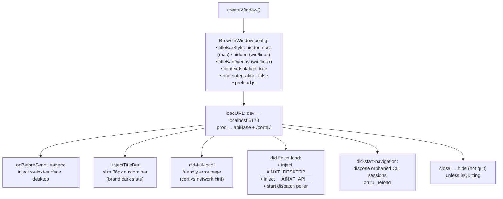

**`toggleWindowWithContext()`** — Summoned via the global shortcut (`Cmd+Shift+A` / `Ctrl+Shift+A`) or tray click. When showing the window, it attaches context (clipboard text + active app name) via `webContents.send("shortcut-context", ctx)` so the UI can pre-populate the prompt.

### 3. System Tray & App Menu

**`createTray()`** — Creates a system tray icon with a context menu providing:
- **Open AiNxt** — toggles the window
- **API Server** — switch between `localhost:8000` and a custom URL (`changeApiBase`)
- **Full power mode** — checkbox toggle for unrestricted shell/file/web access (`devToolsEnabled`)
- **Local MCP** — shows the current port and a "Restart MCP server" action
- **Version** — displays `app.getVersion()`
- **Quit AiNxt**

**`_setupAppMenu()`** — On macOS, sets a minimal branded application menu (appMenu, editMenu, viewMenu, windowMenu) to preserve Cmd+C/V/X/A, reload, and zoom shortcuts. On Windows/Linux, removes the native menu bar entirely (Claude-style minimal chrome).

**`changeApiBase()`** — Sends a `request-api-base` IPC event to the renderer, which shows a custom URL input dialog. The renderer calls back via `set-api-base` IPC, which calls `setApiBase()` to persist the URL, rebuild the tray menu, and reload the window.

### 4. Local File Access (Lite IDE)

The main process exposes a set of IPC handlers for filesystem operations, all guarded by workspace-scoping:

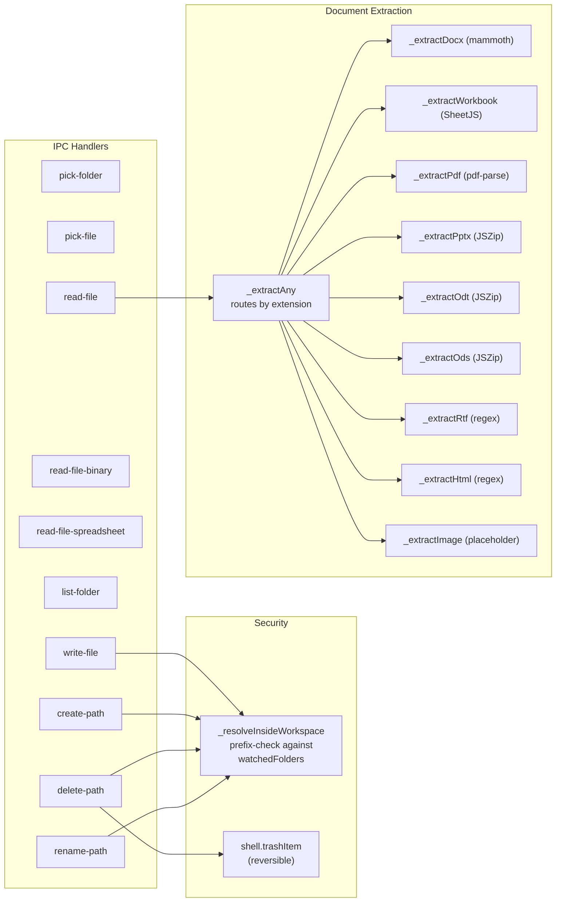

**`_resolveInsideWorkspace(target)`** — Security gate for all write/create/delete/rename operations. Resolves the target path to an absolute path and checks it starts with one of the persisted `watchedFolders` roots. Returns `null` if the path escapes the workspace (prevents directory traversal).

**Document extraction** — The `read-file` handler and MCP `read_file` tool route every supported file type through `_extractAny()`, which dispatches to format-specific extractors. This mirrors the server-side `document_parser.py` so desktop and web produce identical output. Supported formats: `.docx`, `.odt`, `.xlsx`, `.xls`, `.xlsm`, `.ods`, `.pdf`, `.pptx`, `.ppt`, `.rtf`, `.html`, `.htm`, `.svg`, `.csv`, `.tsv`, `.txt`, `.md`, `.json`, `.xml`, `.yaml`, `.yml`, `.log`, `.toml`, `.ini`, `.cfg`, `.conf`, `.env`, and images (`.png`, `.jpg`, `.jpeg`, `.gif`, `.webp`, `.bmp` — which return a descriptive placeholder since the desktop has no local vision model).

**Size limits**: 25 MB for binary formats, 2 MB for plain-text, 1 MB for unknown extensions.

### 5. Workspace Watcher

IPC handlers `watch-folder`, `unwatch-folder`, and `get-watched-folders` manage `fs.watch` recursive watchers on user-selected folders. File-change events are forwarded to the renderer via `workspace-file-changed`. Watched folders are persisted in `electron-store` and restored on app launch.

### 6. Clipboard Intelligence

**`startClipboardMonitor()`** — Polls the system clipboard every 1 second. When the clipboard content changes (and is >10 chars) while AiNxt is **not** focused, it sends a `clipboard-changed` event to the renderer with the text (truncated to 2000 chars). This enables context-aware suggestions when the user summons AiNxt via shortcut.

### 7. Local MCP Server

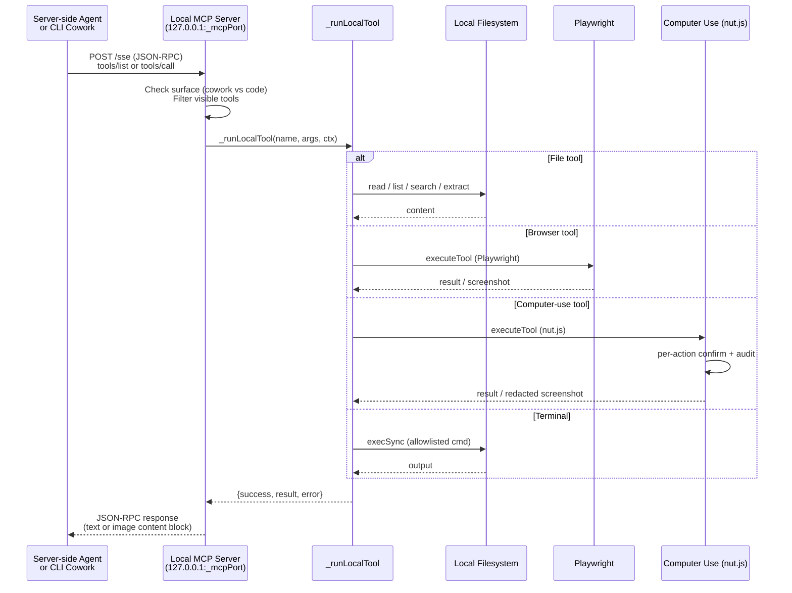

**`_startMcpServer()`** — Creates an HTTP server on `127.0.0.1` (default port 9999, persisted in `electron-store`). Supports three transport modes:

| Endpoint | Protocol | Usage |
|----------|----------|-------|
| `GET /tools` | REST | List all available tools (legacy) |
| `POST /execute` | REST | Execute a single tool (legacy) |
| `GET /sse` + `POST /message?sessionId=` | MCP SSE | MCP protocol over Server-Sent Events |
| `POST /sse` | MCP Streamable HTTP | MCP spec 2024-11-05 (CLI v0.2.101+) |

**Tool surface gating** — The `surface` query parameter (`cowork` vs `code`) controls which tools are visible:
- **Cowork (office)**: `list_files`, `extract_document`, `upload_file_to_chat` always; browser + computer-use only if `computerUseEnabled` is on. **No** `read_file`, `list_directory`, `search_files`, or `execute_terminal`.
- **Code (dev agent)**: All tools available.

**`_runLocalTool(tool, input, ctx)`** — Unified tool dispatcher used by both the REST and MCP paths. Routes to:
- `_computerUse.executeTool()` for computer-use tools (nut.js)
- `_browser.executeTool()` for browser tools (Playwright)
- Inline handlers for `read_file`, `list_directory`, `list_files`, `extract_document`, `upload_file_to_chat`, `search_files`, `execute_terminal`

**`_isSafeCommand(cmd)`** — Terminal command allowlist: `git`, `ls`, `cat`, `grep`, `find`, `echo`, `npm`, `yarn`, `mvn`, `gradle`, `pytest`, `python`, `node`, `java`, `go`, `cargo`. Only the basename is checked.

**Port conflict handling** — On `EADDRINUSE`, the server increments the port (up to 20 retries) and persists the new port. On other errors, retries with backoff (up to 5 times). A dead server object is always cleaned up so restarts are never blocked.

### 8. Cowork Dev Agent

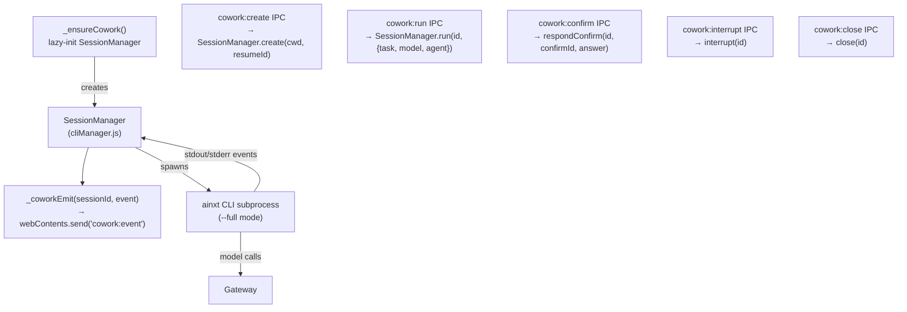

The Cowork dev agent runs the **full ainxt agent loop locally** via the CLI binary. It can edit local files, run commands, and conduct multi-turn chat — the "Claude Desktop drives Claude Code" model. The `SessionManager` (from [desktop_app_cowork_engine](desktop_app_cowork_engine.md)) manages CLI subprocess lifecycle, and events are forwarded to the renderer via `_coworkEmit()`.

### 9. Cowork Office Agent

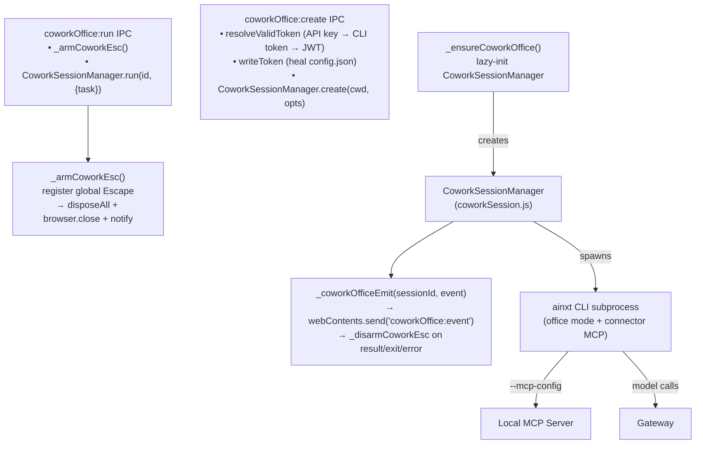

The Cowork Office agent is the desktop's office assistant. Unlike the dev agent, it:
- Connects to the local MCP server with `surface=cowork` (restricted tool set)
- Can optionally use browser automation and native computer-use (gated by `computerUseEnabled`)
- Has an **ESC kill-switch** (`_armCoworkEsc`) that aborts everything when pressed during a running turn
- Supports session resumption (`resumeId`) to continue in-progress tasks across navigation/restart
- Has a "full power mode" (`devToolsEnabled`) that removes folder jail and per-action confirms

**`_armCoworkEsc()` / `_disarmCoworkEsc()`** — Registers/unregisters a global `Escape` shortcut. When armed (only during a running turn when computer-use or full-power mode is on), pressing ESC disposes all office sessions, closes the browser, shows a notification, and disarms. This is the safety net for runaway agents.

### 10. Authentication

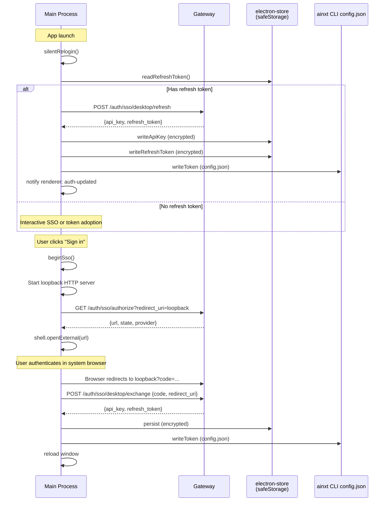

**`beginSso()`** — First-time SSO flow using the system browser (Microsoft blocks OAuth in embedded webviews). Opens a loopback HTTP server, redirects the user to the Entra ID provider via `shell.openExternal`, catches the authorization code on the loopback, exchanges it server-side via `/auth/sso/desktop/exchange`, and persists the returned API key + Entra refresh token (encrypted via `safeStorage`).

**`silentRelogin()`** — On every app launch, swaps the stored Entra refresh token for a fresh API key + rotated refresh token via `/auth/sso/desktop/refresh`. Returns `true` if the desktop is authenticated without user interaction. Only drops the stored token when Entra explicitly rejects it (`401` + `detail=invalid_grant`); transient failures preserve the credential.

**`coworkOffice:adopt-token`** — Lets the renderer adopt its existing web-session credential for local CLI use. Validates the token against `/auth/me`, fetches the user's email, and writes a complete `config.json` (jwt + gateway_url + auth_method + email). For API keys, writes to storage **before** validation so a network issue doesn't block the user.

**`resolveValidToken()`** — (from [desktop_app_cowork_engine](desktop_app_cowork_engine.md)) Priority chain: long-lived API key → CLI config token → renderer's web-login JWT. First that authenticates (HTTP 200 at `/auth/me`) wins.

**`_authLog(...parts)`** — Append-only auth diagnostics log at `~/.ainxt/desktop-auth.log`. Records the exact reason for auth failures (mint HTTP status, token validation result, TLS error) for debugging on locked-down laptops without DevTools.

### 11. Dispatch Poller

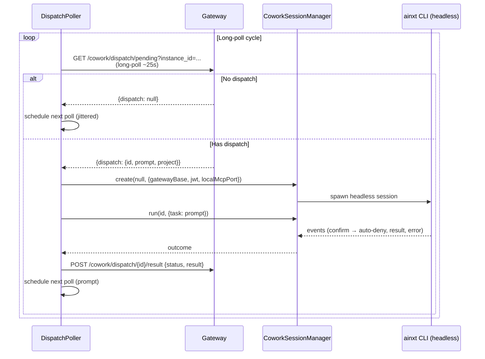

**`_ensureDispatchPoller()`** — Lazy-initializes a `DispatchPoller` (from [desktop_app_cowork_engine](desktop_app_cowork_engine.md)) that long-polls the gateway for tasks dispatched from mobile/web clients. Dispatched tasks run locally through a headless Cowork Office session where all write/computer-use confirmations are **auto-denied** (no human present). Results are posted back to the gateway.

### 12. Global Shortcuts

**`registerShortcuts()`** — Registers `Cmd+Shift+A` (macOS) or `Ctrl+Shift+A` (Windows/Linux) to call `toggleWindowWithContext()`. The shortcut summons the window with clipboard + active-app context.

### 13. IPC Handler Summary

| Category | Handlers |
|----------|----------|
| **File access** | `pick-folder`, `pick-file`, `read-file`, `read-file-binary`, `read-file-spreadsheet`, `list-folder`, `write-file`, `create-path`, `delete-path`, `rename-path` |
| **Workspace** | `watch-folder`, `unwatch-folder`, `get-watched-folders` |
| **Clipboard** | `get-clipboard`, `set-clipboard`, `get-shortcut-context` |
| **MCP** | `get-mcp-port`, `register-mcp-with-backend` |
| **Cowork (dev)** | `cowork:auth-state`, `cowork:login`, `cowork:list-sessions`, `cowork:session-history`, `cowork:hist:*` (projects, conversations, get, save, touch, delete), `cowork:create`, `cowork:run`, `cowork:confirm`, `cowork:interrupt`, `cowork:close`, `cowork:clone`, `cowork:set-model`, `cowork:set-permission-mode`, `cowork:context-usage` |
| **Cowork Office** | `coworkOffice:auth-state`, `coworkOffice:login`, `coworkOffice:cancel-login`, `coworkOffice:adopt-token`, `coworkOffice:has-valid-key`, `coworkOffice:clear-key`, `coworkOffice:begin-sso`, `coworkOffice:create`, `coworkOffice:run`, `coworkOffice:confirm`, `coworkOffice:interrupt`, `coworkOffice:close`, `coworkOffice:set-model`, `coworkOffice:set-permission-mode`, `coworkOffice:context-usage`, `coworkOffice:flush-done` |
| **Computer-use** | `computeruse:enabled`, `computeruse:set-enabled` |
| **DevTools (full power)** | `devtools:enabled`, `devtools:set-enabled` |
| **General** | `get-api-base`, `set-api-base`, `show-notification`, `open-external`, `get-version`, `save-token` |

---

## Security Model

```mermaid
graph TB
    subgraph "Security Layers"
        L1["Layer 1: Workspace Scoping<br/>_resolveInsideWorkspace<br/>(write/create/delete/rename)"]
        L2["Layer 2: Command Allowlist<br/>_isSafeCommand<br/>(execute_terminal)"]
        L3["Layer 3: Tool Surface Gating<br/>cowork vs code surface<br/>(MCP tools/list + tools/call)"]
        L4["Layer 4: Per-Action Confirm<br/>playwrightManager + computerUseManager<br/>(browser/click, computer/click/type/key)"]
        L5["Layer 5: PII Redaction<br/>screenshots redacted at gateway<br/>(OCR-based PAN/PII detection)"]
        L6["Layer 6: ESC Kill-Switch<br/>_armCoworkEsc<br/>(abort all office sessions)"]
        L7["Layer 7: Audit Logging<br/>playwrightManager._audit<br/>computerUseManager._audit"]
        L8["Layer 8: Encrypted Storage<br/>safeStorage for API keys<br/>+ refresh tokens"]
    end

    L1 --> L2 --> L3 --> L4 --> L5 --> L6 --> L7 --> L8
```

The main process implements a defense-in-depth security model:

1. **Workspace scoping** — All filesystem mutations are confined to user-selected watched folders. Path traversal is prevented via `path.resolve` + prefix check.
2. **Command allowlist** — Terminal execution is restricted to a fixed set of safe commands (git, grep, find, build tools).
3. **Tool surface gating** — Cowork (office) sessions can never access `read_file`, `list_directory`, `search_files`, or `execute_terminal`. Only folder-scoped `list_files` + `extract_document` + `upload_file_to_chat` are available, plus optionally browser/computer-use.
4. **Per-action confirmation** — Browser clicks, computer clicks/types/keys pop a native confirmation dialog before executing.
5. **PII redaction** — Screenshots are sent to the gateway for OCR-based redaction before being returned to the model. Raw screenshots are never exposed.
6. **ESC kill-switch** — A global Escape shortcut aborts all office sessions, closes the browser, and notifies the user.
7. **Audit logging** — Every browser and computer-use action is logged with tool name, input summary, success/failure, and redaction findings.
8. **Encrypted storage** — API keys and Entra refresh tokens are persisted via Electron's `safeStorage` API (OS keychain).

---

## Process Flow: App Startup

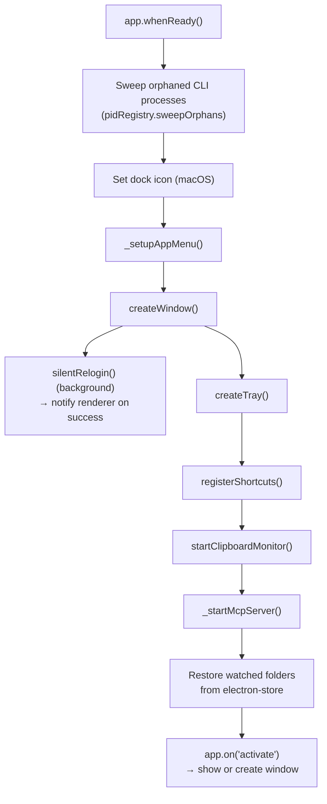

## Process Flow: Cowork Office Session

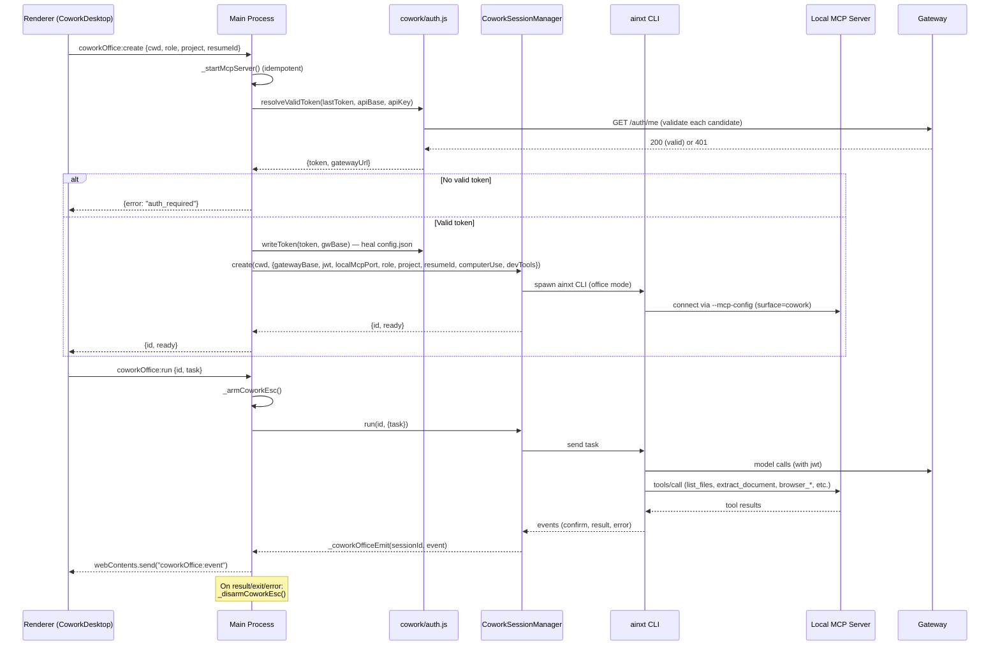

---

## Relationship to Other Modules

| Module | Relationship |
|--------|-------------|
| [desktop_app_browser_automation](desktop_app_browser_automation.md) | Provides Playwright-based browser tools (`browser_navigate`, `browser_click`, `browser_screenshot`, etc.) exposed via the local MCP server. Enforces host allowlist, per-action confirm, PII redaction, and audit. |
| [desktop_app_computer_use](desktop_app_computer_use.md) | Provides native desktop automation via nut.js (`computer_screenshot`, `computer_click`, `computer_type`, `computer_key`). Gated by `computerUseEnabled` master switch with per-action confirm and audit. |
| [desktop_app_cowork_engine](desktop_app_cowork_engine.md) | Provides `SessionManager` (dev agent), `CoworkSessionManager` (office agent), `DispatchPoller`, `auth.js` (SSO, token validation, persistence), `sessions.js`, `history.js`, `clone.js`, and `pidRegistry.js`. The main process orchestrates these via lazy initialization and IPC. |
| [desktop_app_preload_bridge](desktop_app_preload_bridge.md) | The `preload.js` context bridge that exposes a curated set of IPC channels to the renderer under `contextIsolation: true`. |
| [gateway](gateway.md) | The main process loads the gateway-served SPA, injects `x-ainxt-surface: desktop` on all requests, validates tokens via `/auth/me`, exchanges SSO codes via `/auth/sso/desktop/exchange` and `/auth/sso/desktop/refresh`, and long-polls dispatch tasks via `/cowork/dispatch/pending`. |
| [ai_ui_frontend](ai_ui_frontend.md) | The React SPA loaded inside the `BrowserWindow`. The main process injects `window.__AINXT_DESKTOP__` and `window.__AINXT_API__` globals, and communicates via IPC channels exposed through the preload bridge. |
| [auth_router](auth_router.md) | Server-side SSO endpoints (`sso_desktop_exchange`, `sso_desktop_refresh`, `sso_authorize`) called by the main process for authentication. |
| [cowork_dispatch_router](cowork_dispatch_router.md) | Server-side dispatch endpoints (`claim_pending`, `post_result`) used by the `DispatchPoller`. |
| [desktop_router](desktop_router.md) | Server-side desktop endpoints (`register-mcp`, `index_file`, `workspace_status`) called by the main process to register the local MCP server and index local files. |

---

## Configuration Reference

| Setting | Storage | Default | Description |
|---------|---------|---------|-------------|
| `apiBase` | `electron-store` + env | `http://localhost:8000` | Gateway URL. Env `AINXT_GATEWAY_URL` takes priority. |
| `mcpPort` | `electron-store` | `9999` | Local MCP server port. Auto-increments on conflict. |
| `watchedFolders` | `electron-store` | `[]` | Array of workspace folder paths. |
| `lastToken` | `electron-store` | `""` | Legacy JWT fallback token. |
| `computerUseEnabled` | `electron-store` | `false` | Master switch for native computer-use + browser tools in Cowork. |
| `devToolsEnabled` | `electron-store` | `env BUDDY_DEV_TOOLS` | Full power mode (unrestricted shell/file/web, no per-action confirm). |
| `desktopInstanceId` | `electron-store` | `desk_<timestamp>` | Unique ID for dispatch polling. |
| API key | `safeStorage` (encrypted) | — | Long-lived API key for CLI authentication. |
| Refresh token | `safeStorage` (encrypted) | — | Entra ID refresh token for silent re-login. |
