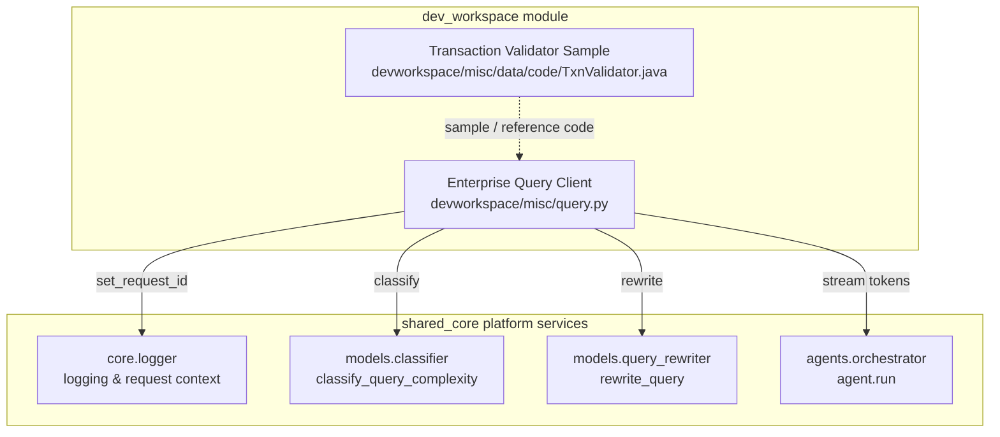
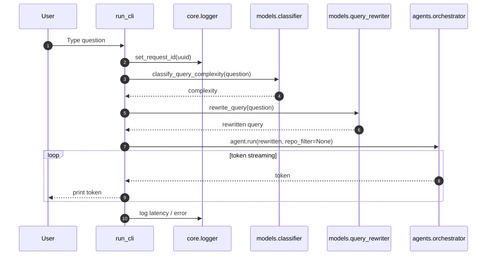
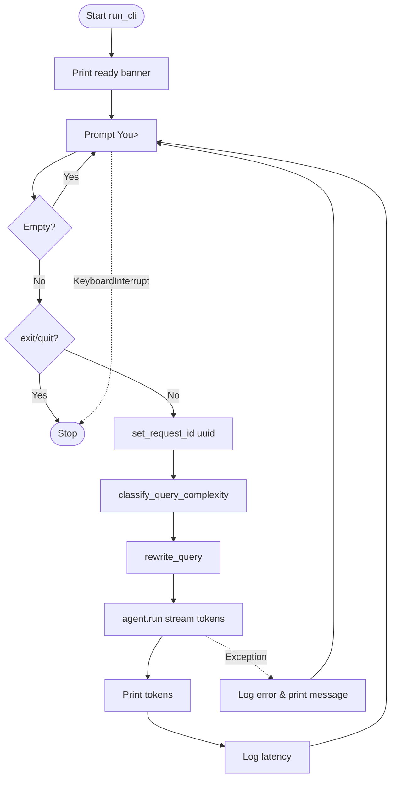

# dev_workspace Module Documentation

## Brief Introduction

The `dev_workspace` module is a lightweight, development-oriented utility space within the broader ABStudio / AI-NXT platform. It houses miscellaneous tools, sample code, and standalone CLI helpers that are not part of the main product surface but are useful for local development, prototyping, and ad-hoc experimentation.

The module currently contains two primary artifacts:

1. **Enterprise Query Client** (`devworkspace/misc/query.py`) — an interactive command-line assistant that classifies, rewrites, and routes natural-language questions through the platform's agent orchestrator.
2. **Transaction Validator Sample** (`devworkspace/misc/data/code/TxnValidator.java`) — a minimal Java reference implementation for validating transaction amounts and response codes.

Because this module is intentionally narrow, it reuses almost all of its runtime behavior from other platform modules. This document focuses on the responsibilities of the components inside `dev_workspace` and links to the modules that provide the actual AI, routing, and orchestration capabilities.

---

## Module Purpose and Core Functionality

### 1. Enterprise Query Client (`devworkspace/misc/query.py`)

`run_cli` implements a simple read-eval-print loop (REPL) for an "Enterprise AI Assistant." It is intended for local testing and demonstration rather than production serving.

Responsibilities:

- **Input handling**: Reads user questions from the terminal, with `exit` / `quit` / `Ctrl+C` handling.
- **Request tracing**: Generates a UUID per turn and binds it via `set_request_id` so logs can be correlated.
- **Complexity classification**: Calls `classify_query_complexity` to categorize the incoming question.
- **Query rewriting**: Calls `rewrite_query` to normalize or expand the user question before execution.
- **Agent execution**: Streams tokens from `agents.orchestrator.agent.run(...)` and prints them to the console.
- **Latency logging**: Records end-to-end latency and errors through the shared logger.

The CLI itself does not contain any model, classifier, or orchestration logic; it is a thin wrapper that wires terminal I/O to the platform's shared AI services.

### 2. Transaction Validator Sample (`devworkspace/misc/data/code/TxnValidator.java`)

`TxnValidator` is a small Java class that demonstrates basic validation rules for financial transactions. It is not wired into any runtime API or worker; it appears to be sample / reference code stored in the workspace.

Responsibilities:

- `validateAmount(double amount)`: Rejects non-positive amounts.
- `validateResponseCode(String code)`: Rejects the response code `"05"` (commonly a "do not honor" decline code in card processing).

---

## Architecture and Component Relationships



### Component Breakdown

| Component | File | Role |
|-----------|------|------|
| `run_cli` | `devworkspace/misc/query.py` | Interactive CLI loop that drives a single-turn assistant experience. |
| `TxnValidator` | `devworkspace/misc/data/code/TxnValidator.java` | Standalone Java sample for transaction validation rules. |

---

## Data Flow

### CLI Turn Flow



### Transaction Validation Flow

```mermaid
flowchart LR
    A[amount / responseCode] --> TV{TxnValidator}
    TV -->|amount <= 0| B[reject]
    TV -->|code == "05"| B
    TV -->|otherwise| C[accept]
```

---

## How the Module Fits into the Overall System

`dev_workspace` sits at the edge of the `shared_core` layer. It is not a production service module; instead, it acts as a **development scratchpad** and **manual integration test harness**.

- It demonstrates how to consume the shared agent orchestrator from a local Python script.
- It shows the expected pattern for binding request IDs and logging per-turn latency.
- The Java validator sample is isolated reference data, likely used for onboarding, code-generation examples, or unit-test scaffolding.

The module has no API routes, no database models, no workers, and no frontend components. Any production-grade behavior it exercises is delegated to:

- [shared_core_model_routing](shared_core_model_routing.md) for `classify_query_complexity` and `rewrite_query`.
- [shared_core_agent_system](shared_core_agent_system.md) for the `agents.orchestrator` runtime.
- [shared_core_core_infrastructure](shared_core_core_infrastructure.md) for logging and request-context management.

---

## Dependencies

### Direct Imports in `query.py`

| Import | Provided By | Purpose |
|--------|-------------|---------|
| `core.logger.logger` | `shared_core` / `core_infrastructure` | Structured logging. |
| `core.logger.set_request_id` | `shared_core` / `core_infrastructure` | Per-turn request correlation. |
| `models.query_rewriter.rewrite_query` | `shared_core` / `model_routing` | Query normalization / expansion. |
| `models.classifier.classify_query_complexity` | `shared_core` / `model_routing` | Complexity scoring. |
| `agents.orchestrator.agent` | `shared_core` / `agent_system` | Agent execution and token streaming. |

### Runtime Dependencies

- A running instance of the platform's agent runtime (orchestrator, model router, and LLM gateway) is required for the CLI to produce answers.
- The CLI does not authenticate the user; it is meant for trusted local use.

---

## Process Flow: CLI Loop



---

## Notes for Developers and Maintainers

- **No production deployment**: This module is not served by `app/main.py`, `gateway.py`, or any worker. It is a local script.
- **Error handling**: The CLI catches broad exceptions to stay alive across failures; this is acceptable for a dev tool but should not be copied into production endpoints.
- **Extensibility**: To add new dev utilities, place them under `devworkspace/misc/` or an appropriate subdirectory. If a utility grows into a real service, move it to a dedicated module (e.g., `abstudio_backend`, `workers`, or `shared_api_routers`).
- **Java sample**: `TxnValidator.java` is not compiled or invoked by the Python codebase. Keep it as plain reference data unless a build step is added.

---

## Related Documentation

- [shared_core_agent_system](shared_core_agent_system.md) — agent orchestration and multi-agent execution.
- [shared_core_model_routing](shared_core_model_routing.md) — query classification, rewriting, and model routing.
- [shared_core_core_infrastructure](shared_core_core_infrastructure.md) — logging, telemetry, and request-context utilities.
- [abstudio_backend](abstudio_backend.md) — production backend API and workflow engine.
- [gateway](gateway.md) — public gateway exposing agent, workflow, and chat endpoints.
