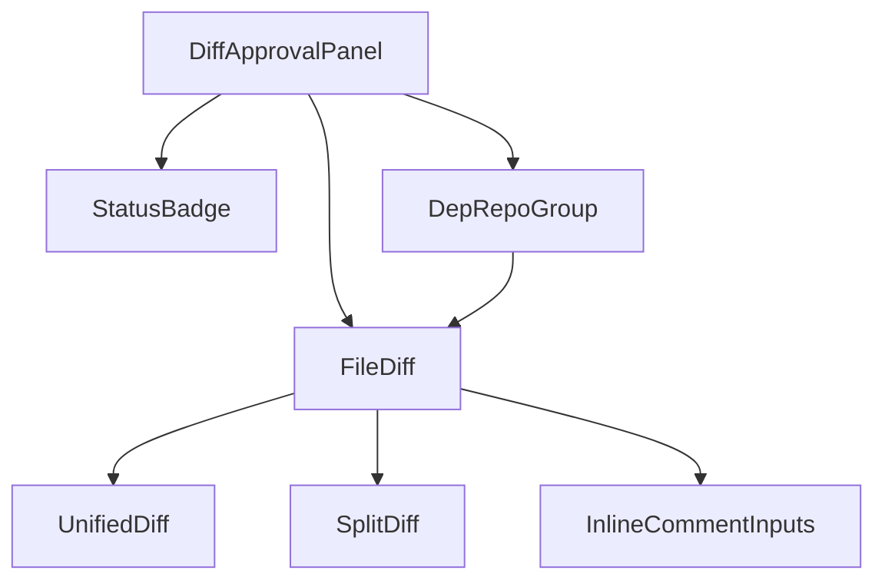
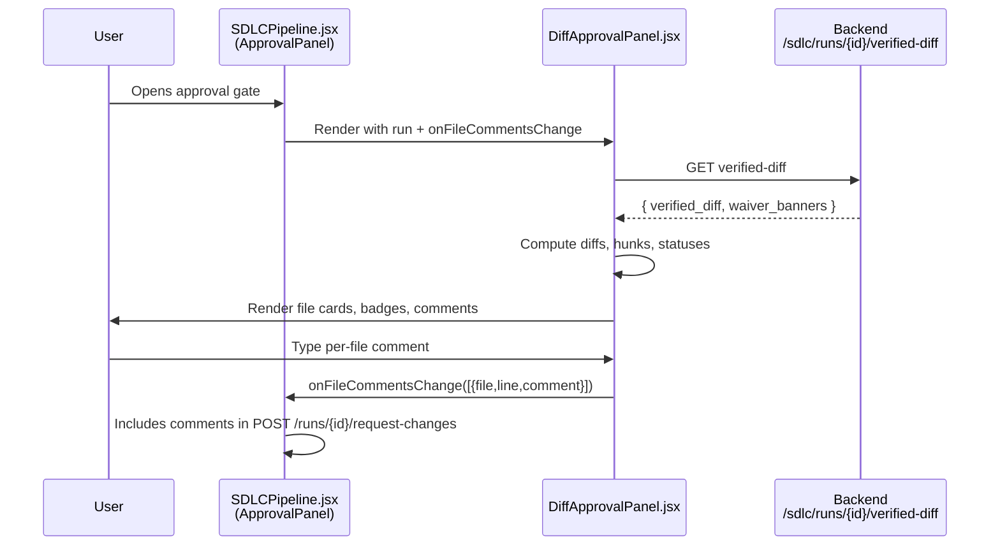
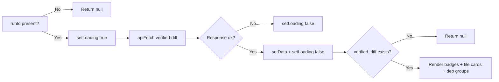
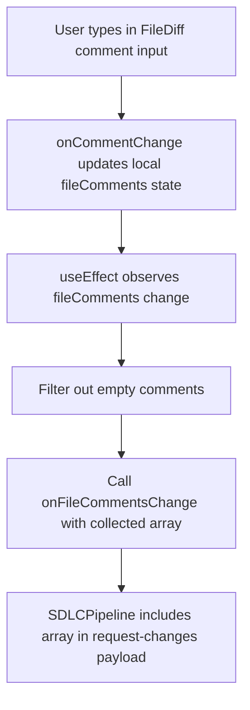
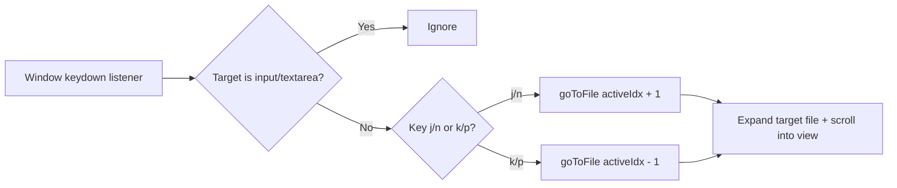

# diff_approval Module

## Brief Introduction

The `diff_approval` module is a React UI component in the `ai-ui` frontend that renders the **verified diff** for human-in-the-loop (HITL) approval gates in the SDLC pipeline. Instead of asking approvers to review an abstract JSON plan, it presents the *real, already-compiled and already-tested* code changes at gates such as `AWAITING_CODE_APPROVAL`, `AWAITING_DESIGN_APPROVAL` (legacy), and `AWAITING_PR_APPROVAL`.

The module fetches the `VERIFIED_DIFF` artifact from the backend, displays per-file `SEARCH/REPLACE` or new-file bodies, surfaces compile/test status badges, and supports per-file request-changes comments. It also visualizes dependent-repo changes that are pushed as separate sibling merge requests, keeping them distinct from the primary repo decision.

---

## Core Responsibilities

| Responsibility | Description |
| -------------- | ----------- |
| **Verified diff rendering** | Fetches and displays the `verified_diff` payload returned by `GET /sdlc/runs/{runId}/verified-diff`. |
| **Side-by-side & unified diff views** | Implements a pure-JS line-level LCS diff with both split and unified renderers. |
| **In-file change navigation** | Provides Prev/Next hunk navigation within a file and Prev/Next file navigation across the change set. |
| **Compile/test status** | Shows `compile` and `tests` badges, including skipped/waived states and waiver banners. |
| **Per-file comments** | Allows optional line-level comments per file, bubbled up to the parent approval panel via `onFileCommentsChange`. |
| **Dependent-repo context** | Renders `dep_edits_by_repo` changes as informational, visually distinct sibling-MR groups. |

---

## Architecture

```mermaid
graph TB
    subgraph "ai-ui Frontend"
        A[SDLCPipeline.jsx<br/>ApprovalPanel] -->|run + onFileCommentsChange| B[DiffApprovalPanel.jsx]
        B --> C[StatusBadge]
        B --> D[FileDiff]
        B --> E[DepRepoGroup]
        D --> F[UnifiedDiff]
        D --> G[SplitDiff]
        D --> H[diffLines / toSplitRows / hunkStartIndices]
    end

    subgraph "Backend SDLC API"
        I[GET /sdlc/runs/{runId}/verified-diff]
    end

    B -->|apiFetch| I
```

### Component Hierarchy



---

## Component Reference

### `DiffApprovalPanel` (default export)

The top-level container. It receives a `run` object and an optional `onFileCommentsChange` callback.

| Prop | Type | Purpose |
| ---- | ---- | ------- |
| `run` | object | The current SDLC run, including `id`, `state`, and `context.applying_regate_reason`. |
| `onFileCommentsChange` | function | Callback invoked with collected per-file comments when any comment input changes. |

**Key behaviors:**
- Fetches the verified diff whenever `runId` or `run.state` changes.
- Determines `canComment` based on the run state.
- Maintains `fileComments` state and forwards non-empty entries to the parent.
- Implements global `j`/`k` and `n`/`p` keyboard shortcuts for file-level navigation.
- Renders compile/test badges, waiver banners, and re-gate reasons.

### `StatusBadge`

A small pill showing pass/fail/waived status for a single check (e.g., compile, tests).

### `FileDiff`

Renders a single file change card.

| Prop | Type | Purpose |
| ---- | ---- | ------- |
| `edit` | object | Contains `path`, `is_new`, `deleted`, `kind`, `base_body`, `new_body`. |
| `canComment` | boolean | Whether to show the per-file comment inputs. |
| `comment` | object | Current `{ line, comment }` value for this file. |
| `onCommentChange` | function | Updates the parent comment state. |
| `open` / `onToggleOpen` | boolean / function | Controlled expand/collapse for primary edits. |
| `fileRef` | ref callback | Registers the card DOM node for scroll navigation. |

**Key behaviors:**
- Computes a line-level diff with `diffLines`.
- Supports `unified` and `split` modes.
- Provides in-file hunk navigation with `goToHunk`.
- Allows copying the file path to the clipboard.

### `DepRepoGroup`

Collapsible group for edits that belong to a dependent repository. These are **informational only**; the single approve/reject decision for the run does not apply to them individually.

### `UnifiedDiff` / `SplitDiff`

Presentation components that render the diff ops produced by `diffLines`.

### Diff utilities

| Function | Purpose |
| -------- | ------- |
| `diffLines(oldStr, newStr)` | Pure-JS longest-common-subsequence diff at the line level. Degrades to whole-file replace view when either file exceeds `MAX_DIFF_LINES` (4000). |
| `toSplitRows(ops)` | Pairs consecutive del/add blocks into aligned side-by-side rows. |
| `hunkStartIndices(items)` | Returns the index of the first changed row in each hunk for navigation. |

---

## Data Flow



---

## Process Flows

### Loading and Rendering the Verified Diff



### Per-File Comment Collection



### File-Level Keyboard Navigation



---

## Integration with the SDLC Pipeline

`DiffApprovalPanel` is designed to be embedded inside the HITL approval experience owned by [`SDLCPipeline.jsx`](sdlc_pipeline.md). The parent `ApprovalPanel` in `SDLCPipeline`:

- Owns the whole-run feedback textarea.
- Owns the actual `POST /runs/{id}/request-changes` call.
- Receives per-file comments from `DiffApprovalPanel` and merges them into the request payload under `file_comments`.

For details on the broader SDLC approval and governance flow, see:

- [sdlc_pipeline](sdlc_pipeline.md) — the parent pipeline component.
- [sdlc_governance_review](sdlc_governance_review.md) — governance review panel and finding triage.
- [sdlc_gate_signal](sdlc_gate_signal.md) — gate signal badges used alongside the diff.

---

## Dependencies

### Internal Frontend Modules

| Module | Relationship |
| ------ | ------------ |
| [ai_ui_frontend_app_core](ai_ui_frontend_app_core.md) | Top-level app shell that routes to the SDLC pipeline. |
| [sdlc_pipeline](sdlc_pipeline.md) | Parent component that hosts `DiffApprovalPanel` at approval gates. |
| [code_editor](code_editor.md) | Related code-editing UI; `DiffApprovalPanel` provides read-only diff visualization. |

### External Libraries

- `react` — hooks (`useState`, `useEffect`, `useRef`).
- `lucide-react` — iconography (`ChevronDown`, `ChevronRight`, `ChevronUp`, `Copy`, `Check`).
- `../config` — `API_BASE` and `apiFetch` for backend communication.

### Backend API

- `GET /sdlc/runs/{runId}/verified-diff` — returns the verified diff artifact, compile/test results, waiver banners, and dependent-repo edits.
- `POST /runs/{runId}/request-changes` — parent `SDLCPipeline` endpoint that consumes `file_comments` produced by this panel.

---

## Key Design Decisions

1. **Shift-left approval.** The panel shows the *compiled and tested* diff rather than a high-level plan, reducing the risk of approving changes that fail downstream validation.
2. **Pure-JS diff.** No external diffing dependency; the LCS implementation is self-contained and degrades gracefully for very large files.
3. **Controlled + uncontrolled `FileDiff`.** Primary edits are controlled so the parent navigator can auto-expand target files; dependent-repo diffs self-manage their open state.
4. **Informational dependent-repo changes.** Dependent-repo edits are visually distinct and do not receive individual approve/reject controls because they are pushed as separate sibling merge requests.
5. **Keyboard accessibility.** `j`/`k` and `n`/`p` shortcuts allow reviewers to navigate changes without leaving the keyboard.

---

## Notes for Maintainers

- The `MAX_DIFF_LINES` constant (4000) is a guard against expensive `O(n*m)` LCS computations. Increase with caution.
- `canComment` is intentionally limited to the pre-apply code-approval gates and the PR-approval gate. If new approval states are added, update this condition.
- The `fileComments` state shape is `{ [path]: { line?: number, comment?: string } }`. Empty or whitespace-only comments are filtered before being sent upstream.
- `DepRepoGroup` cards use amber styling to signal that they are separate sibling MRs and not part of the primary run decision.
