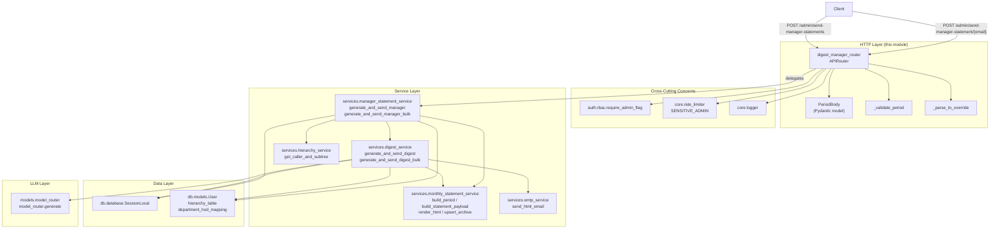
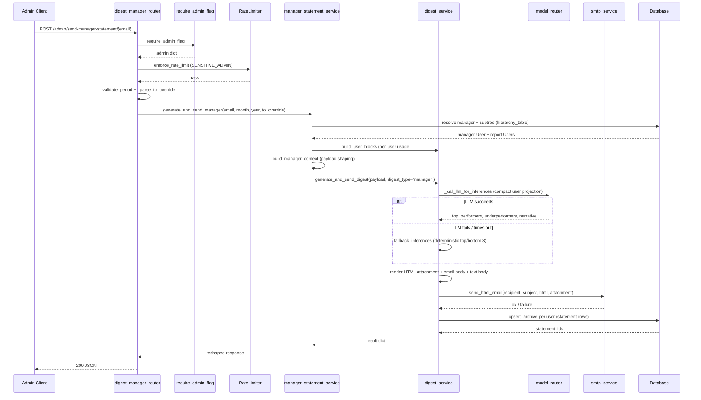
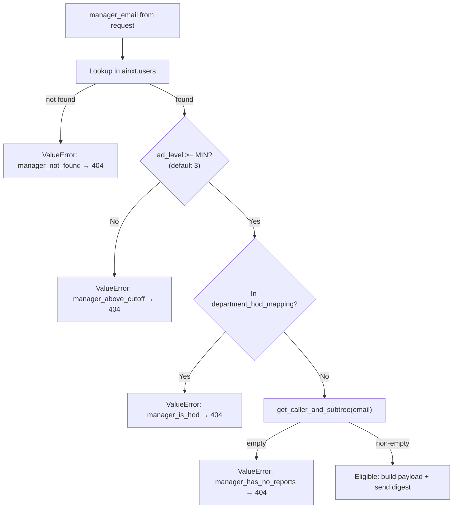

# digest_manager_router

## Introduction

The `digest_manager_router` module is a thin FastAPI APIRouter that exposes
admin-only HTTP endpoints for triggering **manager-level monthly usage digest
emails**. It is the HTTP trigger surface for the manager digest pipeline —
responsible only for request validation, authentication, rate-limiting, audit
logging, and delegating to the service layer. All domain logic (roster
resolution, payload building, LLM inference, rendering, SMTP dispatch, and
archival) lives in downstream service modules.

The router mirrors the sibling
[digest_hod_router](digest_hod_router.md) in structure and contract, the key
difference being that it targets **reporting managers** (AD-level ≥ 3) rather
than **HODs** (AD-level 2). Both routers share the same underlying pipeline in
`services/digest_service.py`, differentiated by a `digest_type` constant.

---

## Module Architecture



---

## Core Components

### `PeriodBody`

A Pydantic `BaseModel` that represents the JSON request body for both
endpoints. Fields are typed `Optional[int]` deliberately — this allows the
router to reject missing values with an explicit `HTTPException(400)` rather
than relying on Pydantic's automatic `422 Unprocessable Entity` response,
keeping the error surface consistent with the sibling HOD router.

| Field  | Type             | Description        |
|--------|------------------|--------------------|
| `month`| `Optional[int]`  | Billing month (1–12) |
| `year` | `Optional[int]`  | Billing year (2024–2100) |

---

### `admin_send_manager_one`

```
POST /admin/send-manager-statement/{manager_email}
```

Triggers a digest for a **single manager**.

**Request:**

| Part         | Source        | Type             | Required | Description |
|--------------|---------------|------------------|----------|-------------|
| `manager_email` | Path param    | `str`            | Yes      | Email of the target reporting manager |
| `body`       | JSON body      | `PeriodBody`     | Yes      | `{ "month": int, "year": int }` |
| `to`         | Query param    | `Optional[str]`  | No       | Test recipient override — redirects the email to this address while running the full production pipeline |
| `admin`      | Dependency     | `dict`           | Auto     | Injected by `require_admin_flag` |

**Guard chain (in order):**

1. **Admin auth** — `Depends(require_admin_flag)` rejects non-admin users with `403`.
2. **Rate limit** — `enforce_rate_limit_with_behaviour(request, SENSITIVE_ADMIN)` applies a 50 req/min per IP+user sliding-window limit (see [core_infrastructure](core_infrastructure.md) / `core/rate_limiter.py`).
3. **Period validation** — `_validate_period` ensures `month` and `year` are present, integer-typed, and in range.
4. **Email override validation** — `_parse_to_override` validates the optional `?to=` query param against a basic email regex; raises `400` on malformed input.

**Delegation:**

Calls `generate_and_send_manager(manager_email, month, year, to_override)` in
`services/manager_statement_service.py`. If the service raises `ValueError`
(unknown email, above AD-level cutoff, is an HOD, or has no reports), the
router maps it to `HTTPException(404)`.

**Response shape:**

```json
{
  "ok": true,
  "manager_email": "manager@org.com",
  "manager_name": "Jane Doe",
  "period": { "month": 6, "year": 2025 },
  "users_count": 8,
  "sent": true,
  "skipped_reason": null,
  "llm_used": true,
  "statement_ids": ["stmt-001", "stmt-002"],
  "recipient_used": "manager@org.com",
  "test_recipient_override": false
}
```

---

### `admin_send_manager_bulk`

```
POST /admin/send-manager-statements
```

Triggers digests for **every eligible reporting manager** in the organisation.

**Request:**

| Part    | Source    | Type         | Required | Description |
|---------|-----------|--------------|----------|-------------|
| `body`  | JSON body | `PeriodBody` | Yes      | `{ "month": int, "year": int }` |
| `admin` | Dependency| `dict`       | Auto     | Injected by `require_admin_flag` |

**Guard chain:**

1. **Admin auth** — same as single-manager endpoint.
2. **Rate limit** — same `SENSITIVE_ADMIN` behaviour.
3. **Period validation** — same `_validate_period`.
4. **`?to=` rejection** — the bulk endpoint explicitly rejects the `?to=` query param with `400`, since a single test inbox cannot represent every manager's digest.

**Delegation:**

Calls `generate_and_send_manager_bulk(month, year)` which:
1. Queries `list_manager_emails(db)` — joins `hierarchy_table` with `ainxt.users` to find all distinct root-manager emails at or above the configured AD-level cutoff (`MANAGER_DIGEST_MIN_AD_LEVEL`, default 3).
2. Passes the roster to the shared `generate_and_send_digest_bulk()` loop, which calls `generate_and_send_manager()` per manager and isolates per-manager errors into `skipped` (expected) vs `failed` (unexpected).

**Response shape:**

```json
{
  "ok": true,
  "period": { "month": 6, "year": 2025 },
  "total_managers": 42,
  "sent": 38,
  "skipped": 3,
  "skipped_reasons": {
    "manager_has_no_reports": 2,
    "manager_is_hod": 1
  },
  "failed": []
}
```

---

## Helper Functions

### `_validate_period(month, year)`

Validates that both `month` and `year` are present, are integers, and fall
within acceptable ranges:

- `month`: 1–12
- `year`: 2024–2100

Raises `HTTPException(400)` with a descriptive message on any violation.

### `_parse_to_override(to)`

Validates the optional `?to=` query parameter used for test sends. Returns
`None` when the parameter is absent or blank, the cleaned email address when
valid, or raises `HTTPException(400)` when the address is malformed. Uses a
simple regex (`^[^@\s]+@[^@\s]+\.[^@\s]+$`) consistent with the HOD and
monthly-statement routers.

---

## End-to-End Data Flow



---

## Manager Eligibility & Roster Resolution

The router itself does not determine eligibility — that logic lives in
`services/manager_statement_service.py`. However, understanding the rules is
essential for operating these endpoints:



**AD-level scheme (NPCI):**

| AD Level | Tier     | Digest Received                     |
|----------|----------|-------------------------------------|
| 0–1      | Admin    | None (excluded from this digest)    |
| 2        | HOD      | HOD digest (via [digest_hod_router](digest_hod_router.md)) |
| 3+       | Manager  | **This digest**                     |

The cutoff is configurable via the `MANAGER_DIGEST_MIN_AD_LEVEL` environment
variable, allowing ops to widen or narrow the cohort without code changes.

---

## Shared Pipeline (digest_service.py)

The router delegates to `generate_and_send_manager` / `generate_and_send_manager_bulk`
in `services/manager_statement_service.py`, which in turn call the shared
pipeline in `services/digest_service.py`. The shared pipeline performs four
steps:

```mermaid
flowchart LR
    subgraph Step1["1. LLM Inference"]
        Compact["Compact user projection"]
        CallLLM["model_router.generate<br/>(120s timeout)"]
        Validate["Validate JSON schema"]
        Fallback["Deterministic fallback<br/>(top/bottom 3 by cost)"]
    end
    subgraph Step2["2. Rendering"]
        Attachment["HTML attachment<br/>(digest_attachment.html)"]
        EmailHTML["Email body HTML<br/>(digest_email_body.html)"]
        EmailText["Email body text<br/>(digest_email_body.txt)"]
    end
    subgraph Step3["3. SMTP Dispatch"]
        Send["send_html_email<br/>with attachment"]
    end
    subgraph Step4["4. Archival"]
        PerUser["Per-user HTML render"]
        Upsert["upsert_archive per user"]
    end

    Step1 --> Step2 --> Step3 --> Step4
```



The `digest_type="manager"` constant is threaded through to the Jinja
templates so they can switch branding (title, header, HOD vs Manager label)
while sharing the same template files with the HOD digest.

---

## Audit Logging

Both endpoints emit structured `logger.info` audit markers that distinguish
manual admin triggers from the automated monthly cron run:

| Trigger Source | Log Pattern |
|----------------|-------------|
| Manual single  | `manager_statement: trigger=manual admin={email} manager={email} month={m} year={y} to={override}` |
| Manual bulk    | `manager_statement: trigger=manual admin={email} bulk=true month={m} year={y}` |
| Cron (monthly) | `manager_statement: trigger=cron` (emitted by `services/digest_service.py:_job_team_digest`) |

When `?to=` is set on the single-manager endpoint, an additional TEST marker
is logged inside `generate_and_send_manager`:

```
manager_statement: trigger=manual TEST recipient_override={addr} real_manager_email={addr}
```

---

## Dependencies

### Direct imports from this module

| Import | Module | Purpose |
|--------|--------|---------|
| `require_admin_flag` | `auth.rbac` | Admin-only access control (403 on non-admin) |
| `enforce_rate_limit_with_behaviour`, `SENSITIVE_ADMIN` | `core.rate_limiter` | Rate limiting (50 req/min per IP+user) |
| `logger` | `core.logger` | Structured audit logging |
| `generate_and_send_manager`, `generate_and_send_manager_bulk` | `services.manager_statement_service` | Service-layer delegation |

### Transitive service-layer dependencies

| Module | Purpose |
|--------|---------|
| `services.digest_service` | Shared end-to-end pipeline (LLM, render, SMTP, archive, bulk loop) |
| `services.monthly_statement_service` | Per-user usage aggregation, Jinja templates, archive upsert |
| `services.hierarchy_service` | Manager subtree resolution (`get_caller_and_subtree`) |
| `services.smtp_service` | Email dispatch (`send_html_email`) |
| `models.model_router` | LLM inference routing (Claude / OpenAI / Gemini / Local) |
| `db.database` / `db.models` | SQLAlchemy session and `User` model |

For deeper documentation on the shared infrastructure (rate limiter, logger,
RBAC), see [core_infrastructure](core_infrastructure.md). For the HOD
counterpart, see [digest_hod_router](digest_hod_router.md). For the monthly
statement user-facing endpoints, see [monthly_statement_router](monthly_statement_router.md).

---

## Configuration

| Environment Variable | Default | Description |
|---------------------|---------|-------------|
| `MANAGER_DIGEST_MIN_AD_LEVEL` | `3` | Minimum AD level for manager digest eligibility |
| `MANAGER_STATEMENT_LLM_MODEL` | *(falls back to `HOD_STATEMENT_LLM_MODEL`)* | Model hint for LLM inference (raw model ID or tier alias) |
| `HOD_STATEMENT_LLM_MODEL` | `""` | Fallback model hint when manager-specific model is unset |
| `RATE_LIMIT_ENABLED` | `false` | Master switch for rate limiting (set `true` in production) |
| `TEAM_USAGE_DIGEST_CRON_ENABLED` | `true` | Kill switch for the automated monthly cron run |
| `TEAM_USAGE_DIGEST_CRON_TIME` | `18:00` | Cron fire time (HH:MM, 24h, IST) |
| `TEAM_USAGE_DIGEST_CRON_DAY` | `last` | Cron fire day (`last` or 1–31) |
| `TEAM_USAGE_DIGEST_CRON_TZ` | `Asia/Kolkata` | Cron timezone (IANA name) |

---

## Error Handling Summary

| HTTP Status | Condition | Source |
|-------------|-----------|--------|
| `403` | Non-admin caller | `require_admin_flag` |
| `429` | Rate limit exceeded or behaviour anomaly | `enforce_rate_limit_with_behaviour` |
| `400` | Missing/invalid `month` or `year` | `_validate_period` |
| `400` | Malformed `?to=` email override | `_parse_to_override` |
| `400` | `?to=` present on bulk endpoint | Explicit rejection in `admin_send_manager_bulk` |
| `404` | Manager not found / above cutoff / is HOD / has no reports | `ValueError` from `_resolve_manager` mapped to `404` |
| `500` | Unexpected service-layer exception | Propagated (not caught by router) |
