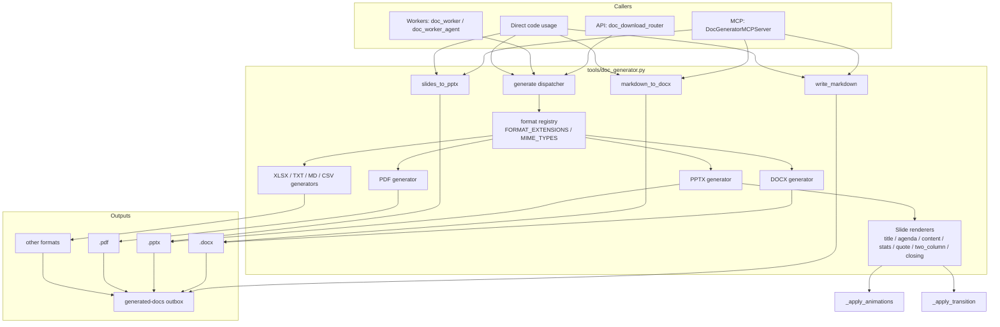
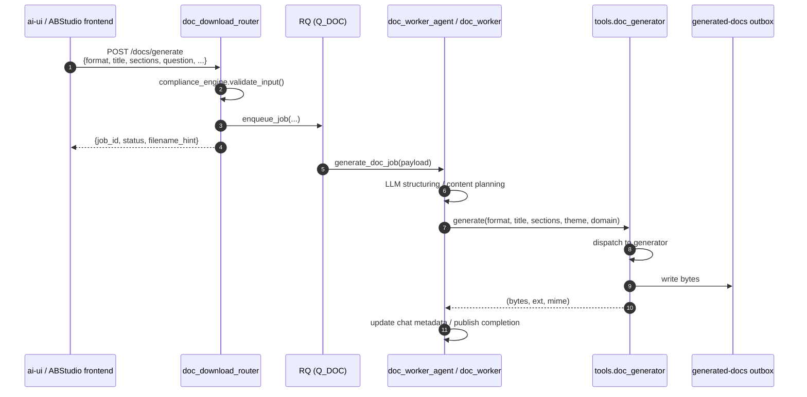
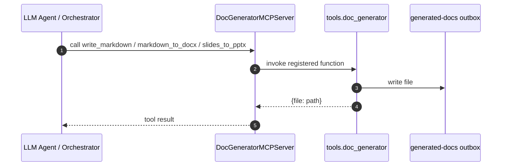
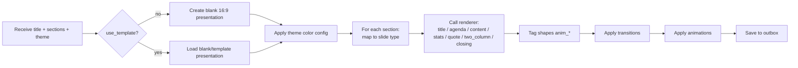

# `doc_generator` Module Documentation

## Brief Introduction

The `doc_generator` module is the central document and presentation generation engine of the AiNxt platform. Located at `tools/doc_generator.py`, it transforms structured content (sections, slides, markdown) into branded, downloadable artifacts across multiple formats: **DOCX**, **PPTX**, **PDF**, **XLSX**, **TXT**, **MD**, and **CSV**.

It is designed to be consumed both as a direct Python utility and as an MCP (Model Context Protocol) toolset, enabling agents, chat workers, and API endpoints to produce polished documents without requiring each caller to implement low-level Office/Open XML manipulation.

---

## Core Responsibilities

| Responsibility | Description |
|----------------|-------------|
| **Multi-format generation** | Dispatch to the correct generator based on a user-friendly format hint (`word`, `pptx`, `pdf`, etc.). |
| **Branded PPTX rendering** | Render slide decks with a consistent visual identity: dark/light themes, gradients, accent bars, imagery, animations, and transitions. |
| **Markdown → DOCX** | Convert simple Markdown (headings, bullets, paragraphs) into `.docx` files. |
| **Slides → PPTX** | Convert a lightweight slide JSON structure into `.pptx` files. |
| **Theming & domain palettes** | Support theme selection for presentations and domain-based color palettes for documents/PDFs. |
| **Outbox persistence** | Write generated files to a configured `generated-docs` outbox for downstream download. |

---

## Architecture Overview



---

## Component Reference

### Public API

#### `generate(format_raw, title, sections, use_template=False, theme="dark_executive", domain=None) -> tuple`

Main dispatcher. Returns `(bytes, ext, mime_type)`.

- `format_raw`: user-friendly format hint such as `word`, `pptx`, `pdf`, `excel`, `txt`, `md`, `csv`.
- `title`: document or presentation title.
- `sections`: structured content sections (used by DOCX/PDF/XLSX/TXT/MD/CSV and PPTX generators).
- `use_template`: whether to use a PPTX template layout.
- `theme`: PPTX theme id — `dark_executive`, `light_modern`, or `vibrant_tech`.
- `domain`: industry/domain keyword used to select a color palette for DOCX/PDF outputs (e.g. `payments`, `ai`, `healthcare`).

The function normalizes the format via `FORMAT_EXTENSIONS`, selects the matching generator, and returns the binary payload with the correct MIME type.

#### `write_markdown(filename, content) -> dict`

Writes raw Markdown content to the `generated-docs` outbox as a `.md` file. Exposed as the MCP tool `write_markdown`.

#### `markdown_to_docx(filename, markdown_content, title="") -> dict`

Renders simple Markdown (`#`/`##`/`###` headings, `-`/`*` bullets, plain paragraphs) into a `.docx` file. Exposed as the MCP tool `markdown_to_docx`.

#### `slides_to_pptx(filename, slides) -> dict`

Renders a lightweight slide structure into a `.pptx` file. Each slide is expected as:

```json
{
  "title": "Slide title",
  "bullets": ["point 1", "point 2"],
  "notes": "optional speaker notes"
}
```

Exposed as the MCP tool `slides_to_pptx`.

---

### PPTX Slide Renderers

The PPTX generator supports a set of canonical slide layouts. Each renderer receives the `slide`, `data` (slide payload), `prs_title`, `prs` (Presentation object), and an optional theme config `tc`.

| Renderer | Layout | Key fields |
|------------|--------|------------|
| `_render_title` | Full-bleed title slide with optional background image, dark overlay, heading, key message, icon, footer. | `heading`, `key_message`, `icon`, `_image_bytes` |
| `_render_agenda` | Numbered agenda with navy header and orange badges. | `heading`, `bullets` |
| `_render_content` | Standard content slide with optional right-panel image, header, key message, bullets. | `heading`, `key_message`, `bullets`, `icon`, `_image_bytes` |
| `_render_stats` | Dark metrics slide with up to 3 large stat cards. | `heading`, `stats` (list of `{value, label}`), `key_message` |
| `_render_quote` | Centered quote with attribution on dark background. | `heading`, `quote`, `attribution` |
| `_render_two_column` | Side-by-side comparison with vertical divider. | `heading`, `two_col_left`, `two_col_right` |
| `_render_closing` | Closing / thank-you slide with optional image. | `heading`, `key_message`, `bullets`, `icon` |

Each renderer tags shapes with names like `anim_0`, `anim_1`, or `anim_click_NN` so that `_apply_animations` can build the correct `<p:timing>` XML.

---

### Visual & Animation Helpers

| Helper | Purpose |
|--------|---------|
| `_set_gradient_bg` | Apply a gradient background to a slide. |
| `_add_rect` | Add a colored rectangle shape (used for bands, accents, overlays). |
| `_set_alpha` | Set fill opacity on a shape. |
| `_add_textbox` | Add a styled textbox with font, alignment, and anchor controls. |
| `_add_bullets` | Populate a text frame with bullet paragraphs. |
| `_add_bg_image` | Place an image as a full-bleed background, z-ordered behind other shapes. |
| `_add_right_panel_image` | Place an image as a right-side content panel. |
| `_add_decorative_circles` / `_add_light_grid_pattern` | Geometric accents when no image is provided. |
| `_apply_transition` | Inject `<p:transition>` XML based on a per-slide-type transition map. |
| `_apply_animations` | Build `<p:timing>` XML for auto-play and on-click fade-in animations. |

---

## Data Flow

### Structured document request (API → worker → doc_generator)



### MCP tool invocation



---

## Dependencies

### Direct runtime dependencies

- `python-pptx` — PowerPoint generation and Open XML manipulation.
- `python-docx` — DOCX generation (used by `markdown_to_docx` and the DOCX generator path).
- `lxml` / `etree` — direct XML injection for transitions, animations, and advanced shape manipulation.
- Standard library: `io`, `os`, `re`, `uuid`, etc.

### Upstream callers

| Module | Relationship |
|--------|--------------|
| [doc_download_router](doc_download_router.md) | API endpoint that enqueues document jobs and derives filename hints using `smart_filename` and `FORMAT_EXTENSIONS`. |
| [doc_worker](doc_worker.md) / [doc_worker_agent](doc_worker_agent.md) | RQ workers that orchestrate LLM-based content planning and call `generate()`. |
| [DocGeneratorMCPServer](DocGeneratorMCPServer.md) | MCP server exposing `write_markdown`, `markdown_to_docx`, and `slides_to_pptx`. |
| [generate_docs](generate_docs.md) | Helper utilities in `ABStudio/generate_docs.py` for building DOCX tables, paragraphs, code blocks, and bullets. |

### Downstream consumers

| Module | Relationship |
|--------|--------------|
| [ai-ui DocWorkflowCard](DocWorkflowCard.md) / [DocLivePreview](DocLivePreview.md) / [DocPreviewCard](DocPreviewCard.md) | Frontend components that display doc generation status, previews, and download actions. |
| [DocGenSpinner](DocGenSpinner.md) | Loading indicator used while documents are being generated. |

---

## How It Fits into the Overall System

The `doc_generator` module sits at the **output boundary** of the platform's content-generation pipeline:

1. **User intent** is captured in the frontend ([ai-ui](ai-ui.md) or [ABStudio](abstudio_frontend.md)).
2. The request is validated and enqueued by [doc_download_router](doc_download_router.md).
3. A background worker ([doc_worker](doc_worker.md) or [doc_worker_agent](doc_worker_agent.md)) plans, structures, and sometimes rewrites content using LLMs.
4. The worker delegates the final file rendering to `tools.doc_generator.generate()` or one of its convenience functions.
5. The resulting file lands in the `generated-docs` outbox, where it can be polled, downloaded, or attached to chat messages.

In addition, agents can invoke document-generation capabilities directly through the [DocGeneratorMCPServer](DocGeneratorMCPServer.md), making the module a reusable building block across chat, workflow, and agent-runtime contexts.

---

## Process Flow: Generating a Branded PPTX



---

## Configuration & Theming

- **PPTX themes** are selected by `theme` (`dark_executive`, `light_modern`, `vibrant_tech`). Each theme provides gradient stops, angles, and accent colors passed to the renderers via `tc`.
- **Domain palettes** for DOCX/PDF are resolved through a `get_palette(domain)` helper; unknown domains fall back to `default`.
- **Transitions** are controlled by `_TRANSITION_MAP`, mapping slide types to transition XML fragments and durations.
- **Animations** are generated dynamically based on shape names:
  - `anim_0`, `anim_1`, … → auto-play fade-in with 400 ms stagger.
  - `anim_click_NN`, … → on-click entrance (Fade, presetID=10).

---

## Error Handling & Observability

- Renderers wrap non-fatal failures (e.g., gradient background injection, transition injection, animation injection) in `try/except` blocks and log warnings via the platform logger.
- The dispatcher logs the resolved format, title, and domain at `INFO` level.
- Upstream workers are responsible for retry policy, timeout, and chat-status updates; `doc_generator` itself does not retry.

---

## Related Documentation

- [doc_download_router](doc_download_router.md) — API surface for document generation requests.
- [doc_worker](doc_worker.md) / [doc_worker_agent](doc_worker_agent.md) — Background workers that drive `doc_generator`.
- [DocGeneratorMCPServer](DocGeneratorMCPServer.md) — MCP tool registration for agent access.
- [generate_docs](generate_docs.md) — Low-level DOCX helper utilities.
- [DocWorkflowCard](DocWorkflowCard.md), [DocLivePreview](DocLivePreview.md), [DocPreviewCard](DocPreviewCard.md), [DocGenSpinner](DocGenSpinner.md) — Frontend document UX.
