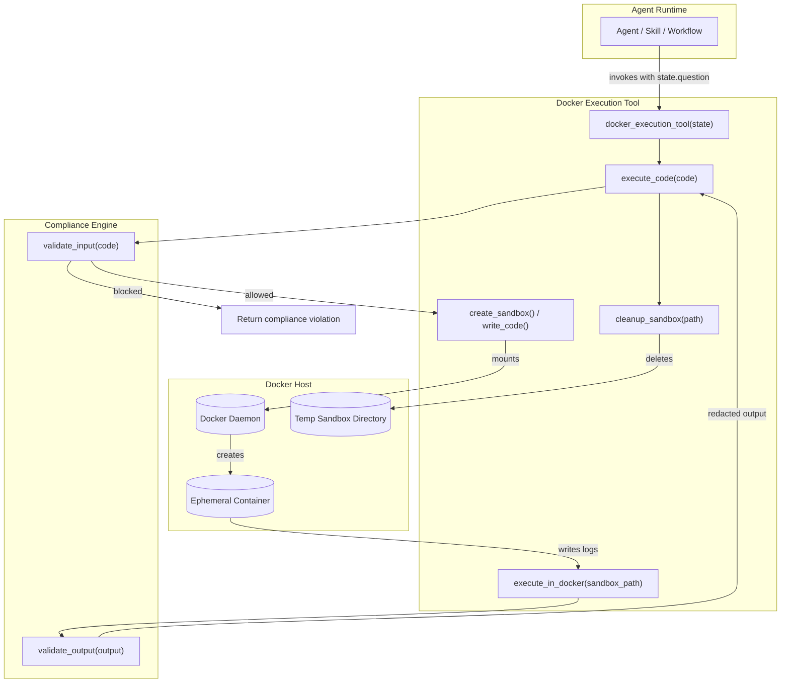
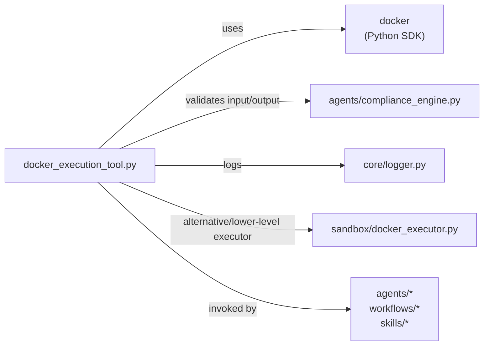
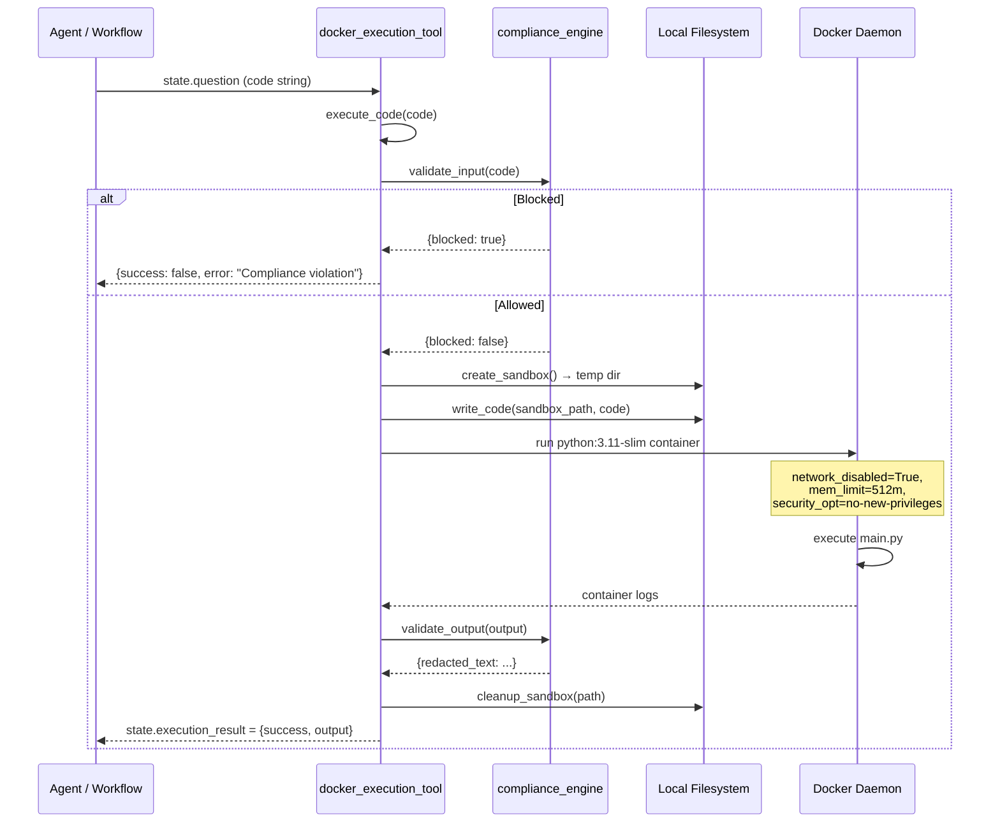
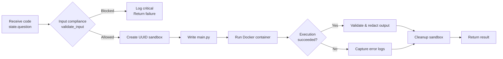

# Docker Execution Tool

## Brief Introduction

The **Docker Execution Tool** provides a secure, isolated sandbox for executing arbitrary Python code on behalf of AI agents. It is the runtime backbone for agentic workflows that need to run untrusted code—such as autonomous bug fixing, test execution, build scripts, or general code evaluation—without exposing the host system or leaking secrets.

The tool wraps the Docker SDK for Python to spin up ephemeral containers, mounts a temporary sandbox directory, runs the submitted code with strict resource and security constraints, and then tears everything down. Before and after execution, the tool consults the platform's compliance engine to validate both input code and generated output.

---

## Core Responsibilities

| Responsibility | Description |
| -------------- | ----------- |
| **Isolated Code Execution** | Runs user/agent-supplied Python code inside a disposable Docker container. |
| **Sandbox Lifecycle** | Creates a unique temporary directory per execution, writes the code into it, mounts it into the container, and cleans it up afterward. |
| **Security Hardening** | Disables network access, forbids privilege escalation, and limits container memory. |
| **Compliance Gatekeeping** | Validates code before execution and redacts sensitive content from output after execution. |
| **Observability** | Logs initialization, execution attempts, failures, and compliance blocks via the platform logger. |

---

## Architecture

### Component Breakdown

| Component | File | Role |
| --------- | ---- | ---- |
| `docker_execution_tool` | `tools/docker_execution_tool.py` | Public entry point invoked by agents/workflows. Extracts code from `state.question`, runs it, and stores the result in `state.execution_result`. |
| `execute_code` | `tools/docker_execution_tool.py` | Orchestrates the full execution lifecycle: compliance check → sandbox creation → Docker run → output validation → cleanup. |
| `create_sandbox` | `tools/docker_execution_tool.py` | Generates a UUID-based temporary directory to hold the code file. |
| `write_code` | `tools/docker_execution_tool.py` | Writes the submitted code to `main.py` inside the sandbox directory. |
| `execute_in_docker` | `tools/docker_execution_tool.py` | Runs a `python:3.11-slim` container with the sandbox mounted read-write, then waits for completion and returns decoded logs. |
| `cleanup_sandbox` | `tools/docker_execution_tool.py` | Removes the temporary sandbox directory after execution. |
| `compliance_engine` | `agents/compliance_engine.py` | Validates input code for policy violations and redacts sensitive content from output. See [compliance_engine](compliance_engine.md). |
| `logger` | `core/logger.py` | Structured logging for the execution lifecycle. See [logger](logger.md). |

---

## Dependencies

### External Dependencies

- **`docker`** — Python SDK for Docker; used to create, run, wait for, and remove containers.
- **`uuid`** — Generates unique sandbox identifiers.
- **`os` / `tempfile` / `shutil`** — Temporary directory creation and cleanup.

### Internal Dependencies

- **[compliance_engine](compliance_engine.md)** — Policy enforcement and output redaction.
- **[logger](logger.md)** — Execution observability.
- **[sandbox/docker_executor](sandbox.md)** — Lower-level Docker and subprocess execution primitives used elsewhere in the platform. The Docker Execution Tool is the higher-level, agent-facing wrapper.

---

## Data Flow

---

## Execution Process Flow

---

## Security Model

The Docker Execution Tool is designed around defense in depth. Each layer reduces the blast radius of malicious or accidental code.

| Layer | Control | Implementation |
| ----- | ------- | -------------- |
| **Input Policy** | Block dangerous code before it runs | `compliance_engine.validate_input(code)` |
| **Container Isolation** | No host filesystem access except the mounted sandbox | Docker volumes bind only the temp directory |
| **Network Isolation** | Prevent egress / data exfiltration | `network_disabled=True` |
| **Privilege Restriction** | Prevent privilege escalation | `security_opt=["no-new-privileges"]` |
| **Resource Limits** | Contain denial-of-service | `mem_limit="512m"` |
| **Timeout** | Limit execution duration | `EXECUTION_TIMEOUT = 60` seconds |
| **Ephemeral Storage** | Minimize persistent attack surface | UUID-named temp directory removed after run |
| **Output Policy** | Redact secrets from returned logs | `compliance_engine.validate_output(output)` |

---

## Configuration

| Constant | Default | Purpose |
| -------- | ------- | ------- |
| `DOCKER_IMAGE` | `python:3.11-slim` | Base image used for the execution container. |
| `EXECUTION_TIMEOUT` | `60` seconds | Maximum time to wait for the container to finish. |

These values are module-level constants and can be adjusted for different environments or workload requirements.

---

## Error Handling

- **Compliance block**: Returns `{success: False, error: "Compliance violation"}` and logs at critical level.
- **Docker failure**: Catches exceptions in `execute_in_docker`, logs the error, and returns the error string as output.
- **Cleanup failure**: Cleanup errors are swallowed so they do not mask the original execution result.

---

## Integration with the Broader System

The Docker Execution Tool sits in the **shared integrations** layer and is consumed by agentic components across the platform:

- **[agent_builder](agent_builder.md)** and **[react_engine](react_engine.md)** may invoke it as a code-execution tool.
- **[sdlc_coder_tools](sdlc_coder_tools.md)** and **[sdlc_state_machine](sdlc_state_machine.md)** use sandboxed execution for coding and testing tasks.
- **[sandbox/docker_executor](sandbox.md)** provides the underlying executor abstractions (`DockerExecutor`, `SubprocessExecutor`) that complement this tool.
- **[compliance_engine](compliance_engine.md)** supplies the policy checks that gate both input and output.

---

## References

- [compliance_engine](compliance_engine.md)
- [logger](logger.md)
- [sandbox](sandbox.md)
- [agent_builder](agent_builder.md)
- [react_engine](react_engine.md)
- [sdlc_coder_tools](sdlc_coder_tools.md)
- [sdlc_state_machine](sdlc_state_machine.md)
