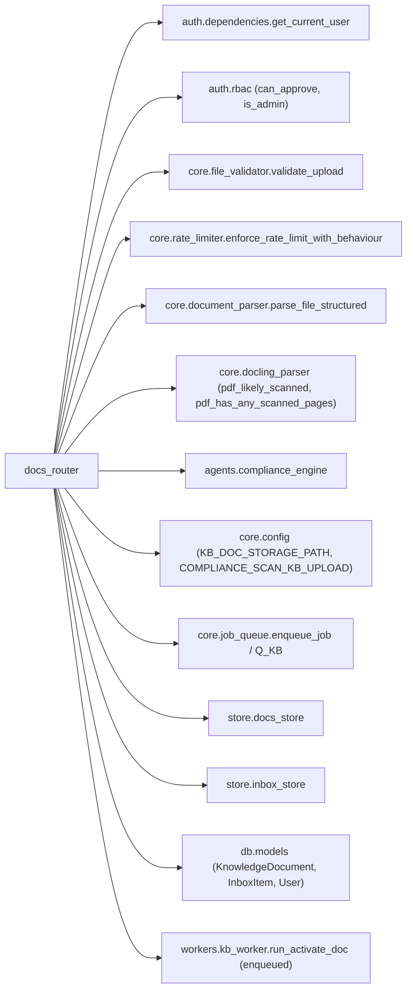
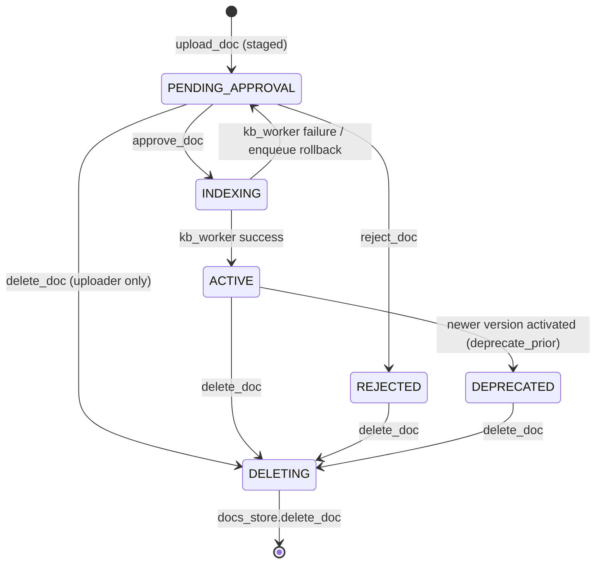
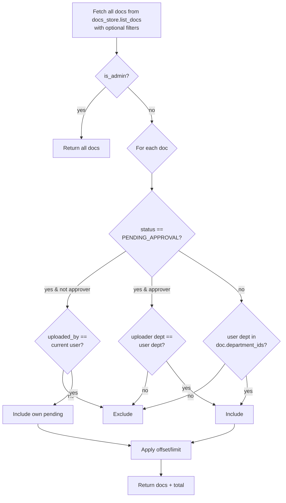
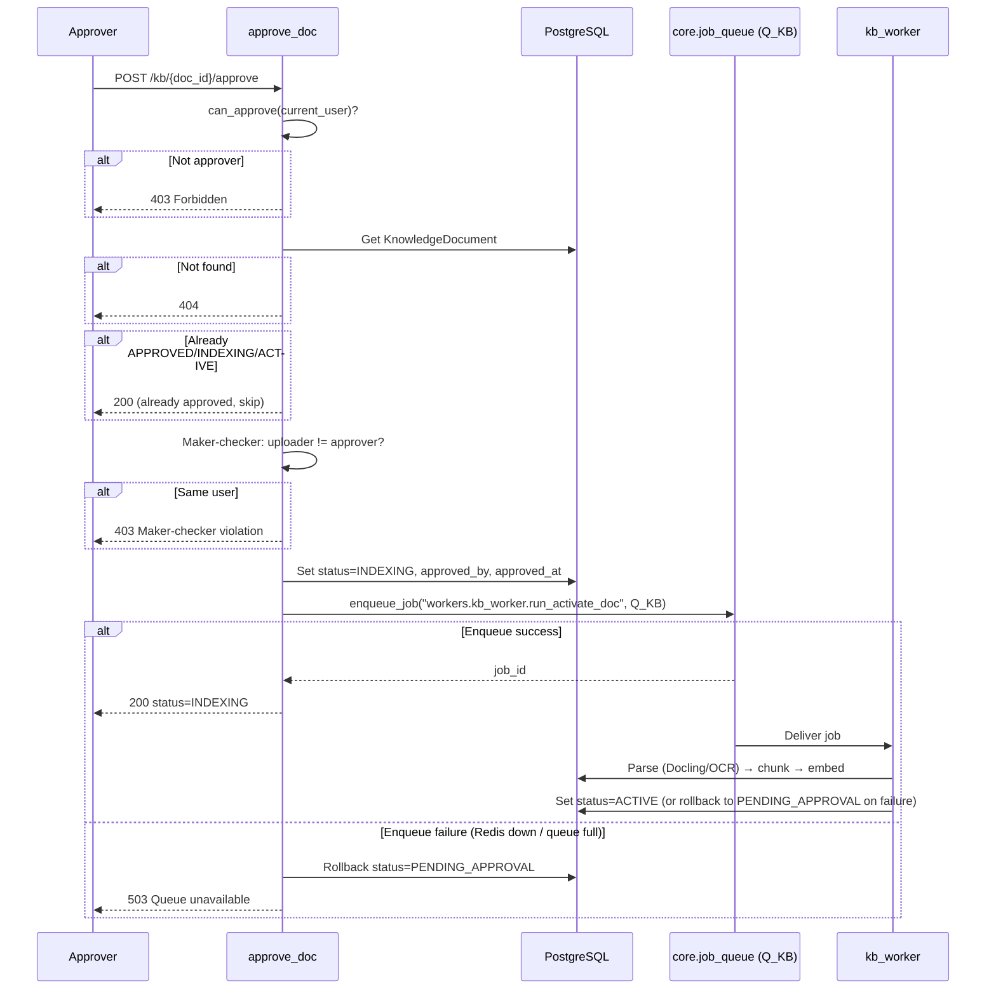
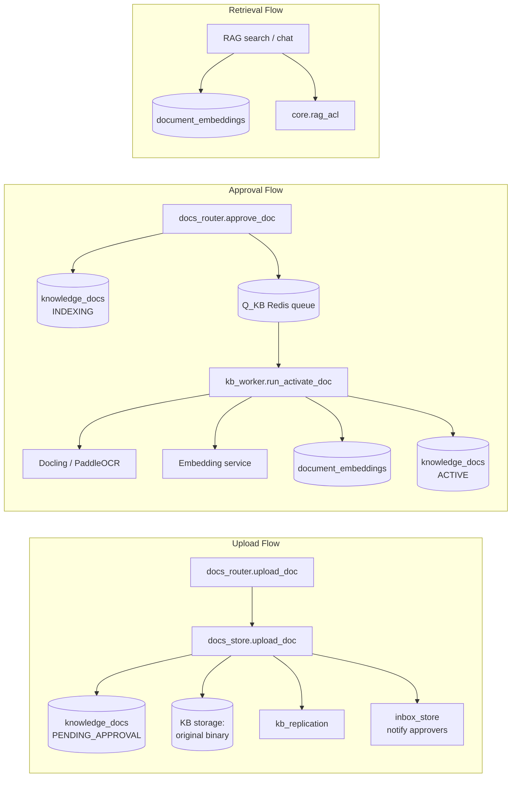

# docs_router — Document Knowledge Base API

## 1. Introduction

The `docs_router` module is a FastAPI `APIRouter` (prefix `/kb`, tag `docs`) that
serves as the HTTP entry point for the **Knowledge Base document lifecycle**. It
allows users to upload documents for RAG ingestion, lists and retrieves document
metadata, drives a maker-checker **approval workflow**, and delegates the heavy
parsing/embedding work to background workers.

Key responsibilities:

- **Upload & stage** documents with validation, lightweight parsing, optional
  compliance redaction, and deduplication — *without* writing to pgvector.
- **Approval workflow** — approvers approve or reject staged documents; approved
  documents are enqueued for background indexing (Docling/PaddleOCR → chunk →
  embed → pgvector).
- **RBAC-filtered listing** — visibility is scoped by role, department, and
  approval status.
- **Lifecycle management** — delete documents (DB + pgvector + filesystem +
  replicas), reject with uploader notification, and stream retained original
  binaries for citation verification.
- **Cross-node file replication** — internal endpoints used by other nodes to
  write/delete original-file replicas in the local KB storage.

> **Design principle:** Unapproved content is never RAG-searchable. Embeddings
> are written only after an approver approves, ensuring a human gate before any
> document enters the vector store.

---

## 2. Module Architecture

```mermaid
graph TB
    subgraph Clients
        UI["Knowledge Base UI<br/>(ai-ui / abstudio_frontend)"]
        GW["Gateway / API consumers"]
        Internal["Internal cluster nodes<br/>(replica endpoints)"]
    end

    subgraph docs_router["docs_router (FastAPI APIRouter /kb)"]
        Upload["upload_doc"]
        List["list_docs / get_doc"]
        Approve["approve_doc"]
        Reject["reject_doc"]
        Delete["delete_doc"]
        Original["get_doc_original"]
        Replica["replicate_file_internal<br/>delete_replica_file_internal"]
    end

    subgraph shared_core["shared_core"]
        Auth["auth.dependencies<br/>auth.rbac"]
        Validator["core.file_validator"]
        RateLimiter["core.rate_limiter"]
        Parser["core.document_parser"]
        Docling["core.docling_parser"]
        Compliance["agents.compliance_engine"]
        Config["core.config"]
        JobQueue["core.job_queue"]
        Logger["core.logger"]
    end

    subgraph store_layer["store layer"]
        DocsStore["store.docs_store"]
        InboxStore["store.inbox_store"]
    end

    subgraph database["database"]
        PG["PostgreSQL (PGS01)<br/>knowledge_docs"]
        PGVector["pgvector (PGS02)<br/>document_embeddings"]
    end

    subgraph workers["workers"]
        KBWorker["kb_worker.run_activate_doc"]
    end

    UI -->|POST /kb/upload| Upload
    UI -->|GET /kb| List
    UI -->|GET /kb/{id}| List
    UI -->|POST /kb/{id}/approve| Approve
    UI -->|POST /kb/{id}/reject| Reject
    UI -->|DELETE /kb/{id}| Delete
    UI -->|GET /kb/original/{id}| Original
    Internal -->|POST /kb/internal/*| Replica
    GW --> List

    Upload --> Auth
    Upload --> Validator
    Upload --> RateLimiter
    Upload --> Parser
    Upload --> Docling
    Upload --> Compliance
    Upload --> DocsStore
    Upload --> Config

    List --> Auth
    List --> DocsStore

    Approve --> Auth
    Approve --> PG
    Approve --> JobQueue
    JobQueue --> KBWorker

    Reject --> Auth
    Reject --> PG
    Reject --> InboxStore

    Delete --> Auth
    Delete --> PG
    Delete --> DocsStore

    Original --> Auth
    Original --> DocsStore

    Replica --> Config
    Replica --> Logger

    DocsStore --> PG
    DocsStore --> PGVector
    KBWorker --> PG
    KBWorker --> PGVector
```

---

## 3. Endpoint Reference

| Method | Path | Component | Description |
|--------|------|-----------|-------------|
| `POST` | `/kb/upload` | `upload_doc` | Upload one or more documents; validate, parse (legacy), detect scanned PDFs, optional compliance redaction, stage in DB. |
| `GET` | `/kb` | `list_docs` | List documents filtered by namespace, status, and spec-scope metadata; RBAC-filtered. |
| `GET` | `/kb/namespaces` | `list_namespaces` | List all known KB namespaces. |
| `GET` | `/kb/{doc_id}` | `get_doc` | Retrieve a single document's metadata. |
| `POST` | `/kb/{doc_id}/approve` | `approve_doc` | Approve a staged document and enqueue background indexing. |
| `POST` | `/kb/{doc_id}/reject` | `reject_doc` | Reject a staged document and notify the uploader. |
| `DELETE` | `/kb/{doc_id}` | `delete_doc` | Delete a document, its embeddings, on-disk files, and replicas. |
| `GET` | `/kb/original/{doc_id}` | `get_doc_original` | Stream the retained original binary (PDF/DOCX/etc.) for citation. |
| `POST` | `/kb/internal/replicate-file` | `replicate_file_internal` | Internal: write a file replica to local KB storage. |
| `POST` | `/kb/internal/delete-replica-file` | `delete_replica_file_internal` | Internal: delete a file replica from local KB storage. |

---

## 4. Dependency Map



All dependencies above live in the **shared_core** and **workers** modules. See
[shared_core.md](shared_core.md) for details on auth, core utilities, store
layer, and database models, and [workers.md](workers.md) for the background
worker that performs activation/indexing.

---

## 5. Document Lifecycle & State Machine



| Status | Meaning |
|--------|---------|
| `PENDING_APPROVAL` | Uploaded and staged; awaiting approver action. Not RAG-searchable. |
| `INDEXING` | Approved; `kb_worker` is parsing (Docling/OCR), chunking, and embedding. |
| `ACTIVE` | Fully indexed; embeddings in pgvector; RAG-searchable. |
| `REJECTED` | Rejected by an approver; never indexed. Uploader notified. |
| `DEPRECATED` | Superseded by a newer version (lineage via `parent_doc_id`). |
| `DELETING` | Transitional state set by `docs_store.delete_doc` before cleanup. |

---

## 6. Core Component Documentation

### 6.1 `upload_doc` — Upload & Stage

`POST /kb/upload`

This is the most complex endpoint. It processes a list of files through a
multi-step pipeline, returning per-file results.

```mermaid
flowchart TD
    Start([Request received]) --> RateLimit[Rate limit check<br/>20 uploads / 5 min / user+IP]
    RateLimit --> ParseForm[Parse form fields:<br/>namespace, visibility, department_ids,<br/>spec-scope metadata, source_type]
    ParseForm --> VisRules[Apply visibility rules:<br/>PUBLIC → org-wide dept_ids=[]<br/>PRIVATE non-approver → uploader dept only]
    VisRules --> Loop{For each file}

    Loop --> Read[Read file bytes]
    Read --> Validate[validate_upload:<br/>extension whitelist, max 25 MB,<br/>magic-byte check, HTML script scan]
    Validate -->|invalid| FailVal[Append error result]
    Validate -->|valid| Parse[parse_file_structured<br/>skip_docling=True<br/>legacy parsers only]

    Parse --> ParseCheck{Starts with<br/>parser error prefix?}
    ParseCheck -->|yes| FailParse[Append parser error]
    ParseCheck -->|no| ScanDetect{PDF &<br/>no text?}

    ScanDetect -->|yes| LikelyScanned[pdf_likely_scanned]
    LikelyScanned -->|scanned| FlagScanned[Flag is_scanned_pdf=true<br/>OCR deferred to activation]
    LikelyScanned -->|not scanned| FailScan[Reject: no extractable text]
    ScanDetect -->|no| MixedDetect{PDF &<br/>has text?}

    MixedDetect -->|yes| MixedScan[pdf_has_any_scanned_pages]
    MixedScan -->|mixed| FlagMixed[Flag has_mixed_scanned_pages=true]
    MixedScan -->|not mixed| Compliance
    MixedDetect -->|no| Compliance

    FlagScanned --> Compliance
    FlagMixed --> Compliance

    Compliance{COMPLIANCE_SCAN_KB_UPLOAD<br/>enabled?}
    Compliance -->|yes & text| CompScan[compliance_engine.validate_input<br/>PII/PCI scan + redaction]
    CompScan -->|blocked| FailComp[Append blocked result]
    CompScan -->|ok| Store
    Compliance -->|no| Store[docs_store.upload_doc<br/>pre_parsed_text=redacted_text]

    Store --> Result[Append result]
    Result --> Loop
    FailVal --> Loop
    FailParse --> Loop
    FailScan --> Loop
    FailComp --> Loop

    Loop --> Done([Return single result or results array])
```

**Key design decisions:**

- **Docling is skipped at upload** (`skip_docling=True`). The expensive
  Docling/PaddleOCR parse is deferred to `activate_doc()` after approval, so
  documents deleted before approval never incur the cost.
- **Scanned PDF detection** — if a PDF yields zero text, `pdf_likely_scanned()`
  checks whether >80% of pages are image-only. If so, the upload proceeds with
  `is_scanned_pdf=True` and OCR is deferred. Mixed PDFs (some scanned pages)
  are flagged via `pdf_has_any_scanned_pages()` for partial OCR at activation.
- **Compliance is optional** — gated by `COMPLIANCE_SCAN_KB_UPLOAD` (default
  OFF). When ON, PII/PCI findings are redacted and blocking types reject the
  upload. When OFF, redaction happens at retrieval time for cloud models.
- **Visibility rules** — `PUBLIC` uploads are org-wide (department_ids forced to
  `[]`). `PRIVATE` uploads by non-approvers are locked to the uploader's own
  department.
- **All uploads go through approval** — `_auto_approve` is always `False` in the
  router; even approvers must have their uploads reviewed by a different
  approver (maker-checker).

**Accepted file types:** `pdf`, `docx`, `md`, `ppt`, `pptx`, `html`, `txt`
(max 25 MB per file).

**Spec-scope metadata** (Phase 1 lineage):

| Field | Purpose |
|-------|---------|
| `product_id` | UUID of the product this doc belongs to |
| `domain` | e.g. "Tech", "HR", "Finance" |
| `spec_version` | e.g. "v3", "2025.1" |
| `version_date` | ISO date string |
| `deprecate_prior` | If `true`, deprecate prior versions on activation |
| `parent_doc_id` | Prior version's doc_id (lineage pointer) |
| `source_type` | `BRD`, `FSD`, `TPMC_DECISION`, `RBI_CIRCULAR`, `ARCHITECTURE`, `SPEC`, `OTHER` |

---

### 6.2 `list_docs` — RBAC-Filtered Listing

`GET /kb`

Delegates to `store.docs_store.list_docs` for raw data, then applies
role-based filtering:



**Filters supported:** `namespace`, `status`, `product_id`, `domain`,
`spec_version`, `limit`, `offset`.

---

### 6.3 `approve_doc` — Approve & Enqueue Indexing

`POST /kb/{doc_id}/approve`



**Key behaviours:**

- **Maker-checker** — the user who uploaded a document cannot approve it.
- **Idempotency** — if the doc is already `APPROVED`, `INDEXING`, or `ACTIVE`,
  the endpoint returns success without re-enqueuing.
- **Rollback on enqueue failure** — if Redis/RQ is unavailable, the status is
  rolled back to `PENDING_APPROVAL` so the approver can retry.
- **No RQ hard timeout** — `timeout=None` allows long OCR/embedding jobs;
  stage-level timeouts inside the worker still apply.
- **Retry** — one retry after 120 seconds on transient failure.

---

### 6.4 `reject_doc` — Reject & Notify

`POST /kb/{doc_id}/reject`

- Requires `can_approve` permission.
- Sets status to `REJECTED`, discards staged chunks (`chunks = None`), and
  stores an optional rejection reason.
- Notifies the uploader via `store.inbox_store.publish_inbox_item` with type
  `kb_approval`, including the rejecter's email, timestamp (IST), and reason.

---

### 6.5 `delete_doc` — Delete & Cleanup

`DELETE /kb/{doc_id}`

```mermaid
flowchart TD
    Start([DELETE /kb/{doc_id}]) --> GetDoc[Fetch KnowledgeDocument]
    GetDoc --> Found{Exists?}
    Found -->|no| Err404[404 Not found]
    Found -->|yes| PendingCheck{status ==<br/>PENDING_APPROVAL?}
    PendingCheck -->|yes| OwnerCheck{uploader ==<br/>current user?}
    OwnerCheck -->|no| Err403[403 Only uploader can retract]
    OwnerCheck -->|yes| Delete
    PendingCheck -->|no| Delete[docs_store.delete_doc]
    Delete --> Cleanup[If was_pending:<br/>delete InboxItem rows<br/>type=kb_approval source_id=doc_id]
    Cleanup --> Return[Return result]
```

> **Note:** The ownership check is applied only to `PENDING_APPROVAL`
> documents. For documents in any other status, the router delegates deletion
> directly to `docs_store.delete_doc` without further ownership validation.

`docs_store.delete_doc` performs:

1. Invalidates the shared doc cache.
2. Marks status `DELETING`.
3. Removes on-disk files (`<doc_id>.md`, `<doc_id>.<original_ext>`) and
   triggers replica deletion.
4. Deletes pgvector rows from `document_embeddings`.
5. Deletes the `KnowledgeDocument` DB record.
6. Removes the namespace from the KV cache if no embeddings remain.

---

### 6.6 `get_doc_original` — Stream Original Binary

`GET /kb/original/{doc_id}`

- **ACL:** Reuses the `list_docs` read path — any user who can see the document
  in `GET /kb/{doc_id}` can fetch its original.
- Resolves the file path via `docs_store.get_original_path(doc_id, original_ext)`.
- Returns a `FileResponse` with the correct MIME type and a suggested filename.
- Returns 404 if the original was not retained (legacy upload before Part U13)
  or the file is missing on disk.

---

### 6.7 `replicate_file_internal` & `delete_replica_file_internal` — Internal Replication

`POST /kb/internal/replicate-file` and `POST /kb/internal/delete-replica-file`

These endpoints are called by other cluster nodes to keep file replicas in
sync across the KB storage filesystem. They do **not** use the
`get_current_user` dependency; access is intended to be restricted at the
network/API-gateway layer.

- **Input validation:** `doc_id` must match `^[0-9a-fA-F-]{32,36}$` (UUID);
  `ext` must match `^[A-Za-z0-9]{1,16}$`.
- **Atomic write:** data is written to a `.tmp` file then `os.replace`d to the
  final path (`<KB_DOC_STORAGE_PATH>/<doc_id>.<ext>`).
- **Delete:** removes the file if it exists; returns `deleted: true/false`.
- Both endpoints log structured `[KB_REPLICA]` entries with `doc_id`, `ext`,
  `kind`, `path`, `bytes`, and `source_node`.

---

## 7. RBAC Matrix

| Action | Admin | Approver (ad_level ≤ 3) | Regular user |
|--------|-------|------------------------|--------------|
| Upload document | ✅ | ✅ | ✅ |
| List all docs | ✅ | ❌ (dept-scoped) | ❌ (dept-scoped) |
| See own pending docs | ✅ | ✅ | ✅ |
| See others' pending docs | ✅ | ✅ (same dept only) | ❌ |
| Approve document | ✅ | ✅ (not own upload) | ❌ |
| Reject document | ✅ | ✅ | ❌ |
| Delete pending doc | ✅ | ❌ (uploader only) | ✅ (own only) |
| Delete active/rejected doc | ✅ | ✅ | ✅* |
| Download original | ✅ | ✅ (if visible) | ✅ (if visible) |

\* The router currently only enforces the uploader-only restriction on
`PENDING_APPROVAL` documents. Deletion of `ACTIVE`/`REJECTED` documents is
allowed for any authenticated caller; stricter access control is expected at
the API gateway or service-mesh layer.

> RBAC helpers `is_admin` and `can_approve` are defined in `auth.rbac`. See
> [shared_core.md](shared_core.md) for the full authentication and
> authorization model.

---

## 8. Configuration

The router reads the following configuration values from `core.config`:

| Config key | Default | Purpose |
|------------|---------|---------|
| `KB_DOC_STORAGE_PATH` | — | Filesystem root for KB document storage (`.md` and original binaries). |
| `COMPLIANCE_SCAN_KB_UPLOAD` | `False` | When `True`, PII/PCI compliance scan + redaction runs at upload time. |

**Router-level constants:**

| Constant | Value | Purpose |
|----------|-------|---------|
| `_ALLOWED_DOC_EXTENSIONS` | `pdf, docx, md, ppt, pptx, html, txt` | Whitelist of accepted file types. |
| `_KB_MAX_SIZE_BYTES` | 25 MB (26,214,400) | Maximum file size per document. |
| `DOCS_UPLOAD` (rate limiter) | 20 / 5 min | Rate limit bucket for KB uploads. |

---

## 9. Error Handling

| Scenario | HTTP Status | Behaviour |
|----------|-------------|-----------|
| Invalid file type / size / magic mismatch | 200 (per-file `success: false`) | Error message in result array; other files continue. |
| Parser error (bracketed error string) | 200 (per-file `success: false`) | Parser error message returned to client. |
| Scanned PDF with no text, not flagged as scanned | 200 (per-file `success: false`) | "No text could be extracted from this file." |
| Compliance block (PII/PCI) | 200 (per-file `success: false`, `blocked: true`) | `block_reason` and `compliance_reasons` returned. |
| Approve without permission | 403 | "Only approvers (ad_level ≤ 3) can approve documents." |
| Maker-checker violation | 403 | "Maker-checker violation: the user who uploaded this document cannot approve it." |
| Enqueue failure on approve | 503 | Status rolled back to `PENDING_APPROVAL`; "Indexing queue is temporarily unavailable." |
| Document not found | 404 | "Document not found." |
| Delete pending doc by non-uploader | 403 | "Only the uploader can retract a pending document." |
| Invalid replica `doc_id` / `ext` | 400 | "Invalid doc_id" / "Invalid extension". |

---

## 10. Integration Points



- **`store.docs_store`** — the canonical store layer for all KB document CRUD,
  chunking, deduplication, and file management. See [shared_core.md](shared_core.md).
- **`workers.kb_worker.run_activate_doc`** — background worker that performs
  Docling/PaddleOCR parsing, structured chunking, embedding, and pgvector
  insertion. See [workers.md](workers.md).
- **`store.inbox_store`** — delivers approval/rejection notifications to user
  inboxes. See [shared_core.md](shared_core.md).
- **`core.job_queue` / `Q_KB`** — RQ-backed job queue with back-pressure and
  retry. See [shared_core.md](shared_core.md).
- **`agents.compliance_engine`** — PII/PCI detection and redaction. See
  [shared_core.md](shared_core.md).
- **`core.document_parser` / `core.docling_parser`** — legacy and advanced
  document parsing, scanned-PDF detection. See [shared_core.md](shared_core.md).

---

## 11. Related Documentation

- [shared_core.md](shared_core.md) — Auth/RBAC, core utilities, store layer,
  database models, job queue, document parsing, compliance engine.
- [workers.md](workers.md) — Background workers including `kb_worker` for
  document activation and indexing.
- [gateway.md](gateway.md) — Main API gateway that mounts shared API routers
  and handles retrieval-time compliance redaction.
- [shared_api_routers.md](shared_api_routers.md) — Sibling router modules
  (chat, inbox, kb_router, knowledge_graph, etc.).
