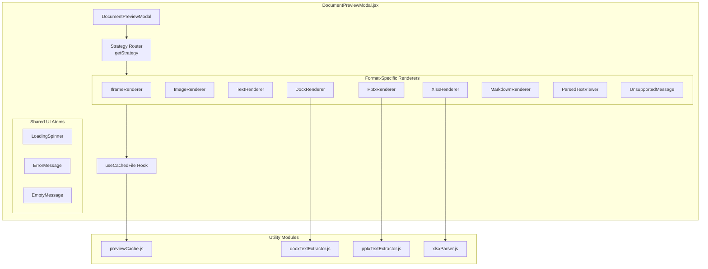
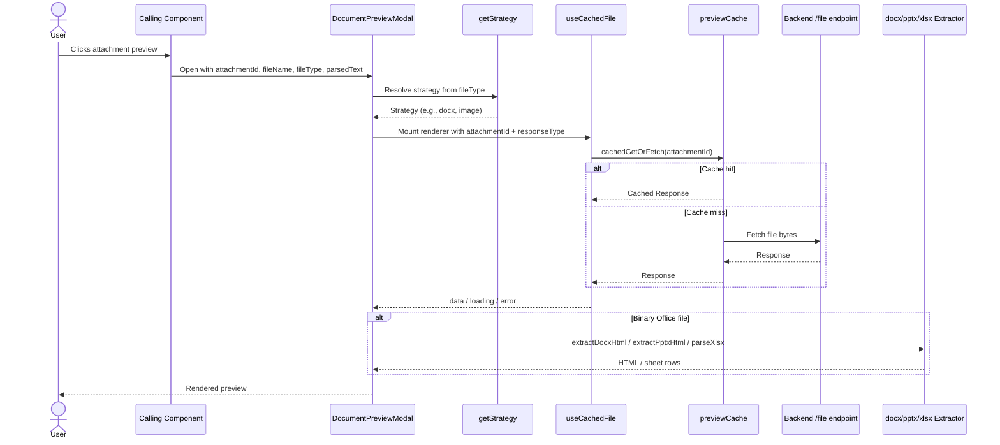
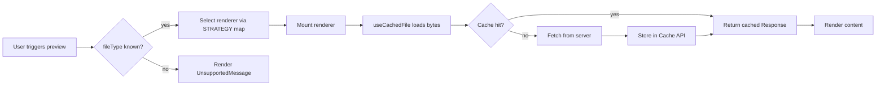

# Document Preview Module

## Brief Introduction

The **Document Preview** module provides a browser-side modal viewer for uploaded attachments in the AI UI frontend. It renders a wide range of file types directly in the browser without requiring server-side conversion, using a combination of native browser capabilities, pure-JavaScript Office Open XML extractors, and the browser Cache API for fast, cache-first preview loads.

The module is implemented as a single React component file: `ai-ui/src/components/DocumentPreviewModal.jsx`.

---

## Core Responsibilities

1. **Modal Overlay Rendering** — Display a centered, full-screen modal with a file header, download action, and close control.
2. **File Type Routing** — Map file extensions to the appropriate rendering strategy.
3. **Cache-First File Loading** — Fetch file bytes through the browser Cache API (`previewCache`) so repeated previews are instant and reduce backend load.
4. **Multi-Format Rendering** — Support PDF, images, plain text, HTML, Markdown, DOCX, XLSX/XLS, PPTX, and parsed-text fallbacks for PPT/RTF.
5. **User Experience** — Show loading states, error messages, unsupported-file warnings, and keyboard-driven close behavior.

---

## Architecture

### High-Level Component Architecture



### Rendering Strategy Matrix

| File Type | Strategy | Renderer | Implementation |
|-----------|----------|----------|----------------|
| PDF | `iframe` | `IframeRenderer` | Native browser PDF viewer via blob URL |
| PNG, JPG, JPEG, GIF, WEBP, BMP | `image` | `ImageRenderer` | Native `` tag |
| TXT, CSV, JSON, XML | `text` | `TextRenderer` | `<pre>` wrapped plain text |
| HTML, HTM | `html` | `IframeRenderer` | Sandboxed `<iframe>` |
| DOCX | `docx` | `DocxRenderer` | Pure-JS ZIP/XML extractor |
| XLSX, XLS | `xlsx` | `XlsxRenderer` | Pure-JS ZIP/XML parser |
| MD | `markdown` | `MarkdownRenderer` | `react-markdown` + `remark-gfm` |
| PPTX | `pptx` | `PptxRenderer` | Pure-JS ZIP/XML extractor |
| PPT, RTF | `parsed` | `ParsedTextViewer` | Pre-rendered parsed text prop |
| Unknown | `unsupported` | `UnsupportedMessage` | Warning with download suggestion |

---

## Component Reference

### `DocumentPreviewModal`

The default export. Renders the modal shell and delegates content rendering based on `fileType`.

**Props:**

| Prop | Type | Description |
|------|------|-------------|
| `attachmentId` | `string` | UUID of the attachment; used as the cache key and fetch identifier |
| `fileName` | `string` | Display name shown in the modal header and used for downloads |
| `fileType` | `string` | File extension (e.g., `"pdf"`, `"docx"`) used to select the renderer |
| `parsedText` | `string` | Pre-extracted text content for PPT/RTF fallback |
| `onClose` | `function` | Callback invoked when the modal should close |

**Behavior:**
- Closes when the user presses `Escape` or clicks the backdrop.
- Offers a download button that reads from the cache first.
- Renders an info banner for PPT/RTF parsed-text fallbacks.

### `useCachedFile(attachmentId, responseType)`

Custom hook that abstracts cache-first file retrieval.

**Parameters:**
- `attachmentId` — cache key / file identifier.
- `responseType` — one of `"text"`, `"blob"`, `"arraybuffer"`.

**Returns:** `{ data, loading, error }`

Uses `cachedGetOrFetch` from [previewCache](previewCache.md) to load the `Response` object from the browser Cache API, falling back to a server fetch on the first request. The hook converts the response body to the requested type.

### `IframeRenderer`

Renders PDFs and HTML files in an `<iframe>`. For HTML, the `sandbox` prop is enabled to restrict scripting.

### `ImageRenderer`

Renders image attachments with object-fit containment, loading spinner, and error handling.

### `TextRenderer`

Renders plain text, CSV, JSON, and XML in a scrollable `<pre>` block.

### `DocxRenderer`

Dynamically imports `docxTextExtractor.js` and converts the DOCX archive into simplified HTML. Displays a fidelity disclaimer because complex formatting may differ from the original document.

### `PptxRenderer`

Dynamically imports `pptxTextExtractor.js` and converts the PPTX archive into a per-slide text outline. Visuals and images are intentionally not rendered.

### `XlsxRenderer`

Dynamically imports `xlsxParser.js`, parses all sheets, and renders the active sheet as an HTML table. Supports tab switching when multiple sheets are present.

### `MarkdownRenderer`

Renders Markdown files using `ReactMarkdown` with GitHub-flavored Markdown support.

### `ParsedTextViewer`

Displays pre-extracted text for legacy PowerPoint and RTF files where no browser renderer exists.

### `UnsupportedMessage`

Fallback UI for file types that cannot be previewed.

---

## Data Flow



---

## Dependencies

### Internal Dependencies

| Module | File | Purpose |
|--------|------|---------|
| [previewCache](previewCache.md) | `ai-ui/src/utils/previewCache.js` | Browser Cache API wrapper (`cachedGet`, `cachedGetOrFetch`) |
| [xlsxParser](xlsxParser.md) | `ai-ui/src/utils/xlsxParser.js` | Pure-JS XLSX parser used by `XlsxRenderer` |
| `docxTextExtractor.js` | `ai-ui/src/utils/docxTextExtractor.js` | Pure-JS DOCX-to-HTML extractor |
| `pptxTextExtractor.js` | `ai-ui/src/utils/pptxTextExtractor.js` | Pure-JS PPTX-to-HTML extractor |

### External Dependencies

| Package | Usage |
|---------|-------|
| `react` | Component model, hooks (`useState`, `useEffect`, `useCallback`, `useRef`) |
| `react-markdown` | Markdown rendering |
| `remark-gfm` | GitHub-flavored Markdown plugin |
| `lucide-react` | Iconography (`X`, `Download`, `FileText`, `Loader2`, `AlertCircle`, `Info`, `AlertTriangle`) |

### Related UI Modules

The Document Preview modal is typically invoked from file-handling surfaces in the AI UI:

- [documents](documents.md) — `DocsPanel`, `DocPickerCard`, `DocPreviewCard`, `DocWorkflowCard`, `DocLivePreview`
- [chat](chat.md) — message attachments and file chips
- [kb_chat](kb_chat.md) — knowledge-base chat file uploads

---

## Process Flows

### Opening a Preview



### Download Flow


### Error Handling

```mermaid
flowchart TD
    A[Error during load/render] --> B{Is cache/expiry error?}
    B -->|yes| C[Show "Preview no longer available"<br/>with 7-day cache explanation]
    B -->|no| D[Show generic error message]
```

---

## Browser Cache Strategy

The module relies on the browser Cache API rather than in-memory state or HTTP caching headers. This provides two benefits:

1. **Instant repeat previews** — Once a file is cached, reopening the preview does not hit the server.
2. **Large file support** — The Cache API can hold binary blobs without bloating React state or memory.

The cache TTL and eviction policy are managed by [previewCache](previewCache.md). If a file is missing from the cache, the module shows an expiration message because the attachment only exists in browser storage.

---

## Security Considerations

- **HTML previews** are rendered inside an `<iframe>` with `sandbox="allow-same-origin"` to disable scripts and prevent XSS.
- **Office documents** are parsed client-side with pure-JavaScript extractors; no macros or active content are executed.
- **Object URLs** are revoked on unmount to avoid memory leaks.
- **Download fallback** is cache-only; there is no secondary unauthenticated server fallback, reducing exposure of attachment URLs.

---

## Extending the Module

To add support for a new file type:

1. Add the extension and strategy name to the `STRATEGY` map.
2. Implement a renderer component (or reuse an existing one).
3. If the format requires parsing, add a utility extractor under `ai-ui/src/utils/` and dynamically import it inside the renderer to keep the initial bundle small.
4. Update this documentation and the strategy matrix.

---

## Notes

- DOCX, PPTX, and XLSX renderers are **best-effort text previews**; they intentionally trade visual fidelity for speed and security.
- PPT and RTF rely on pre-extracted `parsedText` because the browser cannot natively render these legacy formats.
- The modal dimensions are fixed at `96vw` by `94vh` and include a backdrop blur for focus management.
