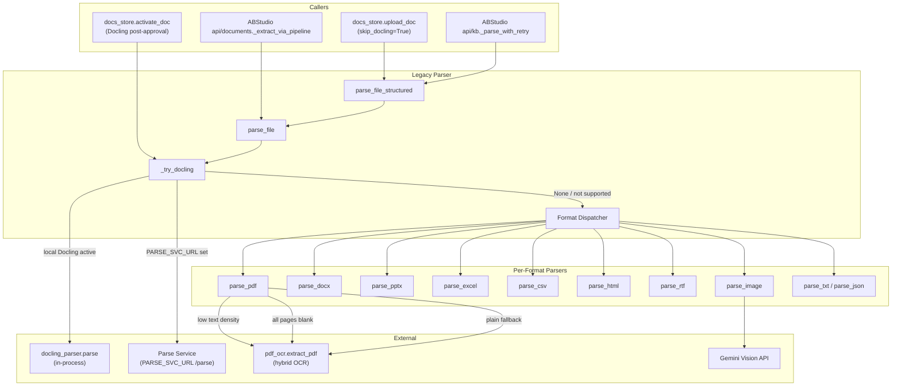
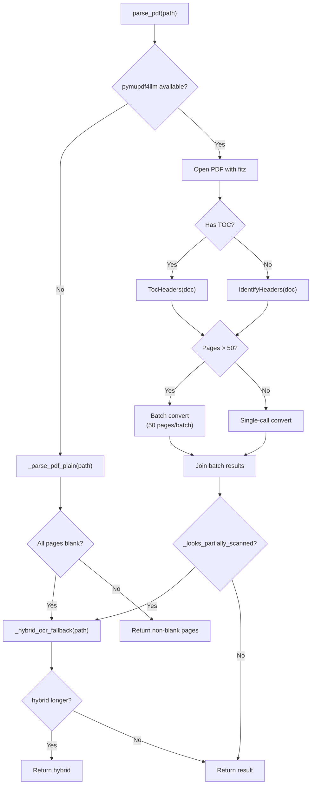
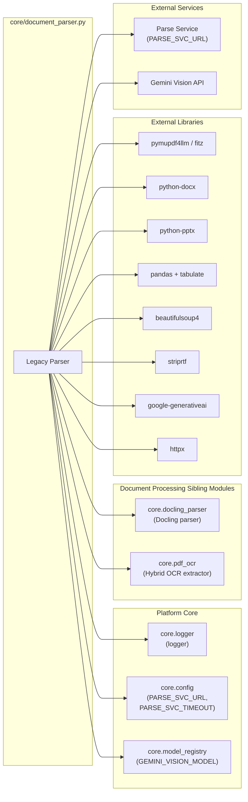
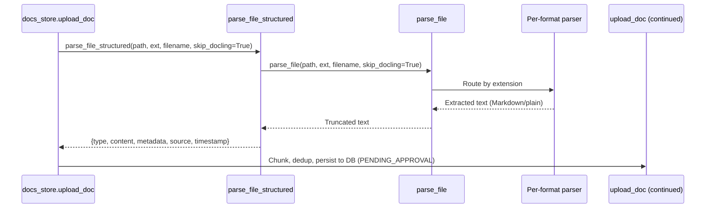
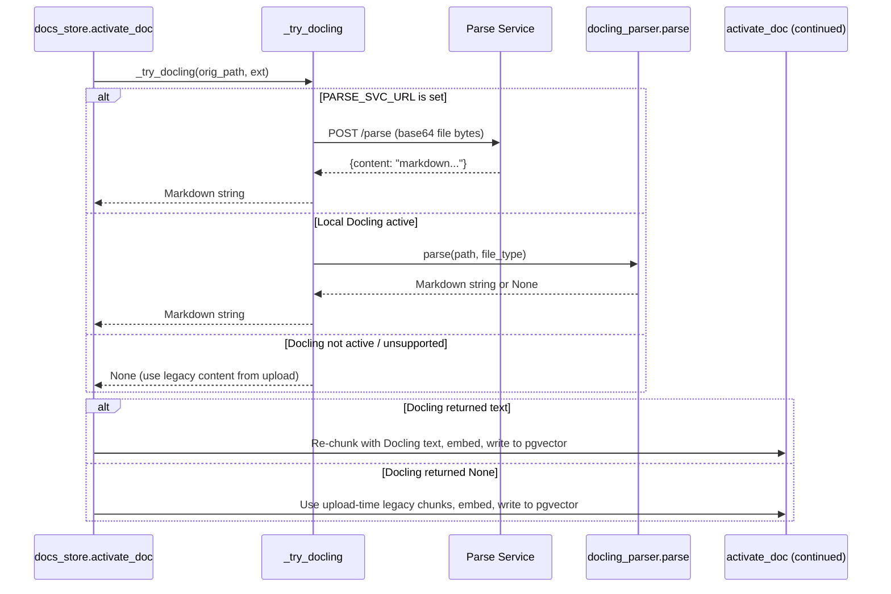
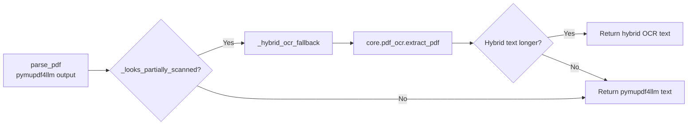
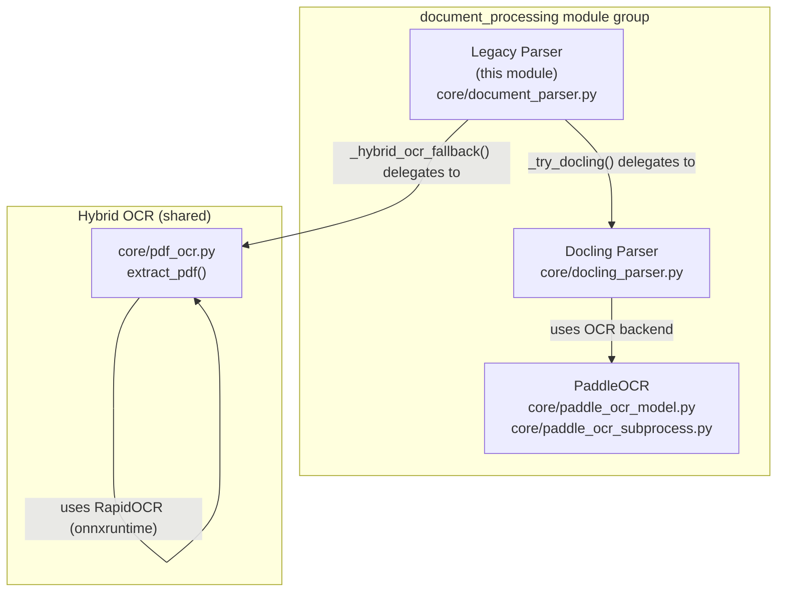
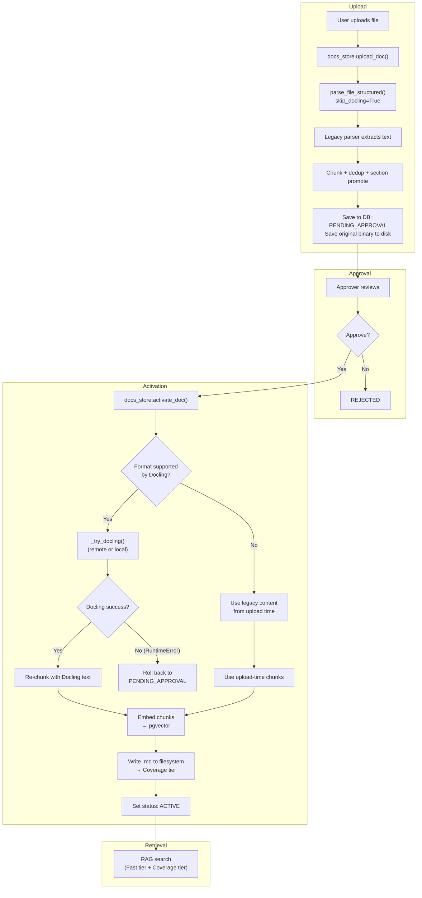

# Document Processing — Legacy Parser

## 1. Introduction

The **Legacy Parser** (`core/document_parser.py`) is the original, per-format
document-extraction engine for the AiNxt platform. It converts uploaded files
(PDF, DOCX, PPTX, Excel, CSV, HTML, RTF, images, plain text, JSON, XML) into
clean Markdown or plain text that downstream RAG chunking, embedding, and
retrieval pipelines can consume.

Although the platform has since introduced a more advanced
[Docling-based parser](document_processing_docling_parser.md), the legacy
parser remains the **universal fallback** and the **default parser at upload
time**. It is also the sole parser for formats Docling does not support
(XLSX, CSV, RTF, images, TXT, JSON, XML).

### Key responsibilities

| Responsibility | Detail |
|---|---|
| **Format dispatch** | Routes by file extension to the correct per-format extractor. |
| **Docling integration** | Tries Docling first for supported formats (when enabled), falling back to legacy parsers on `None`. |
| **Scanned-PDF recovery** | Detects low text-density PDFs and invokes the hybrid OCR extractor (`core.pdf_ocr`). |
| **Structured output** | `parse_file_structured()` returns a standardised enterprise document object with metadata. |
| **Output truncation** | Caps extracted text at `_MAX_CHARS` (2 000 000 chars) to protect downstream systems. |
| **Graceful degradation** | Every parser returns a human-readable placeholder string on missing-dependency or parse errors — never raises to the caller. |

---

## 2. Architecture Overview



---

## 3. Core Components

### 3.1 `parse_file(path, file_type, filename, skip_docling=False) → str`

The **primary dispatcher**. It normalises the file type, optionally tries
Docling first, then routes to the correct per-format legacy parser.

**Docling fast-path logic:**

```
if NOT skip_docling AND file_type ∈ {pdf, docx, html, htm, pptx}:
    result = _try_docling(path, file_type)
    if result is not None:          # Docling succeeded
        return truncate(result)
    # result is None → fall through to legacy parser
```

The `skip_docling` parameter is `True` at **upload time** so that Docling only
runs after a document is approved (inside `activate_doc()`). This avoids
wasted parse calls for documents deleted before approval.

**Supported format routing:**

| Extension(s) | Parser function | Output format |
|---|---|---|
| `pdf` | `parse_pdf` | Markdown (pymupdf4llm) / plain text / hybrid OCR |
| `docx` | `parse_docx` | Markdown (headings, tables, lists) |
| `pptx` | `parse_pptx` | Markdown (slide-by-slide) |
| `ppt` | — | Unsupported placeholder message |
| `xlsx`, `xls` | `parse_excel` | Markdown tables (multi-sheet) |
| `csv` | `parse_csv` | GitHub-flavoured Markdown table |
| `html`, `htm` | `parse_html` | Stripped plain text |
| `rtf` | `parse_rtf` | Plain text |
| `png`, `jpg`, `jpeg`, `gif`, `webp`, `bmp` | `parse_image` | Gemini Vision description |
| `json` | `parse_json` | Pretty-printed JSON |
| `xml`, `txt`, `md` | `parse_txt` | Raw text |
| *unknown* | `parse_txt` | Best-effort plain text |

All outputs are truncated to `_MAX_CHARS` (2 000 000 characters).

---

### 3.2 `parse_file_structured(path, file_type, filename, skip_docling=False) → dict`

Wraps `parse_file()` and returns a **standardised enterprise document object**:

```python
{
    "type":      "pdf|docx|excel|image|...",
    "content":   "<extracted text>",
    "metadata":  {
        "filename":   "...",
        "size_bytes": 12345,
        "pages":      42        # PDF only; None otherwise
    },
    "source":    "<filename>",
    "timestamp": "<ISO-8601 UTC>"
}
```

This is the entry point used by `docs_store.upload_doc()` and the ABStudio KB
upload API (`_parse_with_retry`).

---

### 3.3 `_try_docling(path, file_type) → Optional[str]`

The **Docling integration bridge**. It has two execution paths, selected by
whether `PARSE_SVC_URL` is configured:

#### Remote path (PARSE_SVC_URL is set)

Sends file bytes (base64-encoded) to the parse service's `POST /parse`
endpoint via `httpx`. Docling + PaddleOCR run on the embed server, offloading
heavy ML models from the gateway worker.

- **Returns** the parsed Markdown string on success (always non-empty).
- **Raises `RuntimeError`** on any failure — timeout, network error, empty
  content, or model error. The caller (`activate_doc`) treats this as a **hard
  failure** and does **not** fall back to the legacy parser, because
  legacy-parsed embeddings for Docling-supported formats produce incorrect
  chunking quality.
- **HTTP 422** handling distinguishes between:
  - Page-level conversion failure (`detail` is a string) → surfaced verbatim
    to the user with exact failed page ranges.
  - Request-validation error (`detail` is a list/dict) → generic user-facing
    message; raw payload is logged only.

#### Local path (PARSE_SVC_URL is empty)

Runs Docling in-process via `core.docling_parser.parse()`.

- **Returns `None`** when Docling is not active (`USE_DOCLING_PARSER=off`) or
  the format is unsupported — signalling the caller to fall back to legacy
  parsers.
- **Returns** the Markdown string on success.
- **Raises `RuntimeError`** on conversion failure or empty output — same
  hard-failure semantics as the remote path.

> **Critical contract:** `None` means "fall back to legacy"; a raised
> `RuntimeError` means "hard failure, do NOT fall back." This distinction is
> essential for `activate_doc()` to decide whether to roll back a document to
> `PENDING_APPROVAL` or proceed with legacy content.

---

### 3.4 `_looks_partially_scanned(text, page_count) → bool`

A **mixed-PDF guard** that detects when `pymupdf4llm` extracted only the text
layer but some pages were image-only (scanned). It uses a density threshold:

```python
_MIN_CHARS_PER_PAGE = 400

def _looks_partially_scanned(text: str, page_count: int) -> bool:
    if page_count <= 0:
        return False
    return (len(text) / page_count) < _MIN_CHARS_PER_PAGE
```

Real circulars, contracts, and RFPs typically run 1 500–3 000 chars per page.
Anything under 400 chars/page strongly suggests scanned pages were silently
dropped. When triggered, `parse_pdf` invokes `_hybrid_ocr_fallback()` to
recover the scanned pages via `core.pdf_ocr.extract_pdf()`.

---

### 3.5 Per-Format Parser Details

#### `parse_pdf(path) → str`

The most complex parser, with a multi-layered fallback chain:



Key behaviours:
- **Header/footer stripping**: `header=False, footer=False` removes repeated
  page headers/footers so they don't pollute every RAG chunk.
- **Consistent heading levels**: `IdentifyHeaders` or `TocHeaders` is built
  once before the batch loop, ensuring consistent heading levels across all
  batches and avoiding O(N²) full-doc scans.
- **Batched processing**: PDFs > 50 pages are processed in 50-page batches to
  avoid a single multi-minute blocking call that trips HTTP/worker timeouts.
  All pages are always processed — no early-stop.
- **Plain-text fallback**: `_parse_pdf_plain()` uses raw `page.get_text()`,
  filters blank/image-only pages, and delegates to hybrid OCR if all pages
  are blank.

#### `parse_docx(path) → str`

Converts DOCX to Markdown preserving:
- **Heading styles** → `#`–`######` (Heading 1–6, Title, Subtitle)
- **Tables** → GitHub-flavoured pipe tables
- **Lists** → `-` bullet items
- **Bold-heading detection**: Paragraphs that use bold Normal-style text
  instead of Word heading styles are detected and promoted to `##` or `###`
  based on font size (≥14pt → `##`, otherwise `###`). This handles policy
  manuals and similar documents where authors use bold formatting instead of
  proper heading styles.

#### `parse_pptx(path) → str`

Extracts text from PowerPoint slide-by-slide using `python-pptx`:
- Slide titles → `##` headings
- Body text → bullet items (nested by paragraph level)
- Tables → pipe tables
- Each slide prefixed with `### Slide N`

#### `parse_excel(path) → str`

Converts Excel to Markdown tables using `pandas` + `tabulate`. Multi-sheet
workbooks get a `## SheetName` heading before each sheet's table.

#### `parse_image(path, filename) → str`

Sends the image to **Gemini Vision** (`GEMINI_VISION_MODEL` from
`core.model_registry`) with a prompt to describe all visible text, numbers,
charts, diagrams, and visual elements. Falls back to a placeholder string if
Gemini is unavailable or `GOOGLE_API_KEY` is not set.

#### Other parsers

- `parse_csv` — CSV → Markdown table via `pandas` + `tabulate`
- `parse_html` — BeautifulSoup, strips `<script>`, `<style>`, `<head>`,
  `<meta>`, `<noscript>` before text extraction
- `parse_rtf` — `striprtf` library
- `parse_txt` — Raw UTF-8 read with `errors="ignore"`
- `parse_json` — Pretty-printed JSON

---

## 4. Dependency Map



### Configuration parameters

| Parameter | Source | Default | Purpose |
|---|---|---|---|
| `PARSE_SVC_URL` | `core.config` | `""` (empty) | When set, `_try_docling` delegates to the remote parse service instead of in-process Docling. |
| `PARSE_SVC_TIMEOUT` | `core.config` | `1800.0` (30 min) | Read timeout for a single `/parse` HTTP call. Connect timeout is always 10 s. |
| `USE_DOCLING_PARSER` | env var | `off` | Controls in-process Docling activation: `off` / `on` / `shadow`. Only used on the local path. |
| `GOOGLE_API_KEY` | env var | — | Required for `parse_image` (Gemini Vision). |
| `_MAX_CHARS` | module constant | `2_000_000` | Output truncation limit. |
| `_PDF_PAGE_BATCH` | module constant | `50` | Pages per pymupdf4llm batch for large PDFs. |
| `_MIN_CHARS_PER_PAGE` | module constant | `400` | Density threshold for the mixed-PDF guard. |

---

## 5. Data Flow

### 5.1 Upload-time flow (legacy parser only)

At upload time, `skip_docling=True` is always passed, so Docling is bypassed
entirely. Only the lightweight legacy parser runs — for compliance redaction
and chunking. Docling is deferred to `activate_doc()` post-approval.



### 5.2 Activation-time flow (Docling with legacy fallback)

When a document is approved, `activate_doc()` calls `_try_docling()` directly
(not `parse_file`). For Docling-supported formats, Docling **must** succeed —
there is no fallback to the legacy parser. For unsupported formats, the
legacy-parsed content from upload time is reused.



### 5.3 Scanned-PDF recovery flow

When `parse_pdf` detects low text density (mixed born-digital + scanned PDF),
it invokes the hybrid OCR extractor to recover scanned pages:



The hybrid extractor (`core.pdf_ocr`) processes each page independently:
born-digital pages use fast text extraction; scanned pages are rasterised and
OCR'd with RapidOCR. Results are merged in page order under `## Page N`
headings. See [document_processing_paddle_ocr](document_processing_paddle_ocr.md)
for OCR engine details.

---

## 6. Error Handling & Failure Semantics

The legacy parser follows a **never-raise** contract for `parse_file` and
`parse_file_structured`: all per-format parsers catch their own exceptions and
return a human-readable placeholder string (e.g., `"[PDF parse error: ...]"`).

The **exception** to this contract is `_try_docling()`, which has different
semantics depending on the caller:

| Scenario | `_try_docling` returns | Caller behaviour |
|---|---|---|
| Docling not active / format unsupported | `None` | Fall back to legacy parser |
| Docling succeeds | Markdown string | Use Docling output |
| Docling fails (timeout, service down, empty output, conversion error) | Raises `RuntimeError` | **Hard failure** — `activate_doc` rolls back to `PENDING_APPROVAL`; `parse_file` falls back to legacy (upload-time only, since `skip_docling=True` at upload) |

This dual semantics ensures:
- **Upload never breaks** because of Docling — `skip_docling=True` means
  `_try_docling` is never called at upload time.
- **Activation quality is never silently degraded** — if Docling fails for a
  supported format, the document is rolled back rather than indexed with
  lower-quality legacy content.

---

## 7. Relationship to Other Modules

### Within the `document_processing` group



- **[Docling Parser](document_processing_docling_parser.md)** — The newer,
  ML-based parser. The legacy parser's `_try_docling()` function is the sole
  bridge between the two. Docling handles PDF/DOCX/HTML/PPTX with superior
  structure recovery; the legacy parser handles everything else.
- **[PaddleOCR](document_processing_paddle_ocr.md)** — The OCR backend used
  by the Docling parser for scanned PDFs. The legacy parser's hybrid OCR
  fallback (`core.pdf_ocr`) uses RapidOCR, not PaddleOCR, but both serve the
  same purpose of recovering text from image-only pages.

### Callers

| Caller | Module | Function called | Context |
|---|---|---|---|
| `docs_store.upload_doc` | `store/docs_store.py` | `parse_file_structured(skip_docling=True)` | KB upload — lightweight parse for chunking + dedup |
| `docs_store.activate_doc` | `store/docs_store.py` | `_try_docling()` directly | Post-approval — Docling parse for RAG-quality embeddings |
| `_parse_with_retry` | `ABStudio/backend/app/api/kb.py` | `parse_file_structured()` | ABStudio KB upload with serialised lock + retry |
| `_extract_via_pipeline` | `ABStudio/backend/app/api/documents.py` | Uses `ocr_pipeline` (not legacy parser directly) | ABStudio document extraction |
| `_extract_scanned_pdf_text` | `ABStudio/backend/app/api/documents.py` | `parse_image()` + `core.pdf_ocr.extract_pdf()` | ABStudio scanned-PDF fallback |

### External dependencies

- **Parse Service** (`PARSE_SVC_URL`) — Remote Docling + PaddleOCR service
  hosted on the embed server. See `core.config` for configuration.
- **Gemini Vision API** — Used by `parse_image()` for image description.
  Model configured via `GEMINI_VISION_MODEL` in `core.model_registry`.
- **Embed Service** (`EMBED_SVC_URL`) — Not called directly by this module,
  but consumes the parsed text downstream during `activate_doc()`.

---

## 8. Process Flow: Complete Document Lifecycle

The following diagram shows how the legacy parser fits into the complete
document lifecycle from upload to RAG-searchable activation:



---

## 9. Key Design Decisions

### 9.1 Why `skip_docling` at upload time?

Docling is expensive (ML model warm-up, OCR, table detection). Running it at
upload time for every document — including those that will be deleted before
approval — wastes compute. By deferring Docling to `activate_doc()`, the
platform only pays the Docling cost for documents that are actually approved
and will become RAG-searchable.

### 9.2 Why no fallback from Docling to legacy at activation time?

Legacy-parsed embeddings for Docling-supported formats (PDF, DOCX, HTML, PPTX)
produce **incorrect chunking quality** — missing heading structure, lost
tables, garbled lists. Silently falling back would embed low-quality chunks
that mislead RAG retrieval. Instead, a Docling failure rolls the document back
to `PENDING_APPROVAL` so the approver can retry after fixing the issue
(e.g., increasing `PARSE_SVC_TIMEOUT`, fixing the file, or restarting the
embed service).

### 9.3 Why the mixed-PDF density guard?

`pymupdf4llm` only extracts the text layer. If a PDF mixes born-digital and
scanned pages, the result is suspiciously short relative to the page count.
The `_looks_partially_scanned()` function detects this (chars/page < 400) and
triggers the hybrid OCR extractor, which OCRs only the scanned pages and
merges per-page — recovering content that would otherwise be silently lost.

### 9.4 Why batch large PDFs?

A single `pymupdf4llm.to_markdown()` call on a 200+ page PDF can take several
minutes, tripping HTTP request timeouts and worker kill signals. Processing in
50-page batches keeps individual calls under ~30 seconds while still
processing all pages (no early-stop). The `hdr_info` object is built once and
reused across batches, ensuring consistent heading levels and avoiding
O(N²) full-doc scans.

### 9.5 Why bold-heading detection in DOCX?

Many enterprise documents (policy manuals, circulars, RFPs) use bold
Normal-style text for section headings instead of Word's "Heading 1/2/3"
styles. Without detection, these paragraphs would be treated as body text,
producing flat Markdown with no heading hierarchy. The downstream structured
chunker (`docs_store._chunk_document_structured`) relies on `##` headings to
attach `section_path` metadata to each chunk — so promoting bold headings is
essential for correct RAG chunking.
