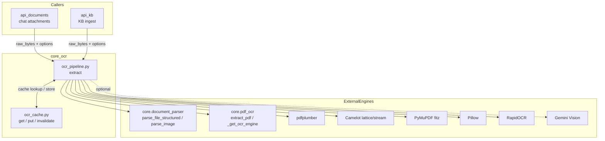
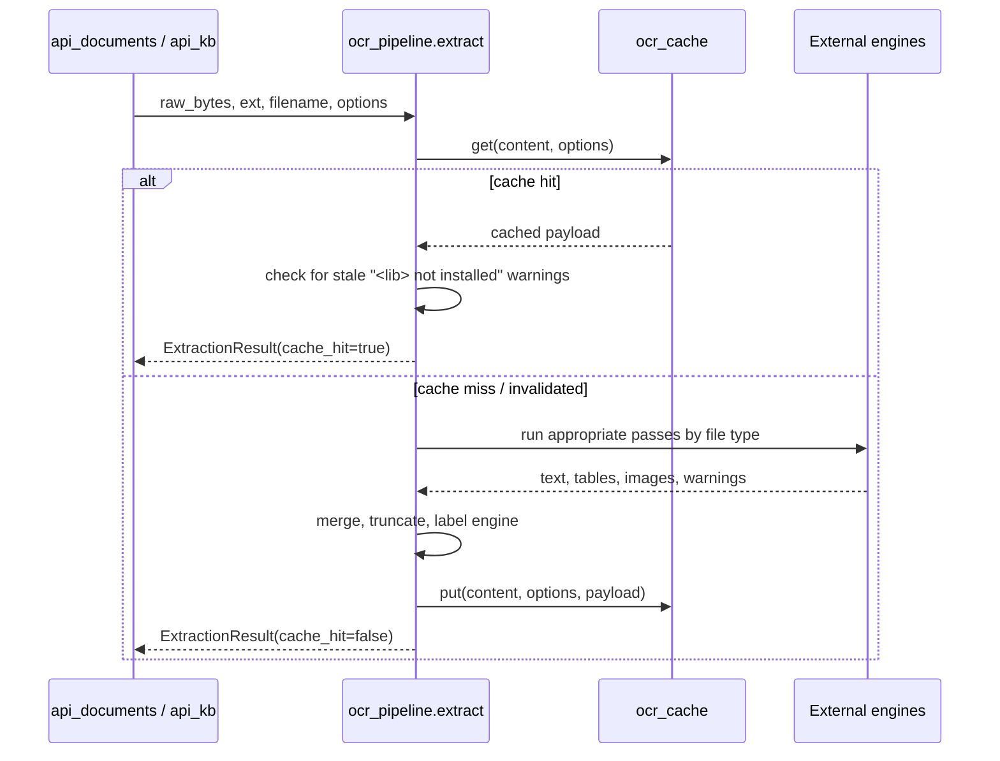
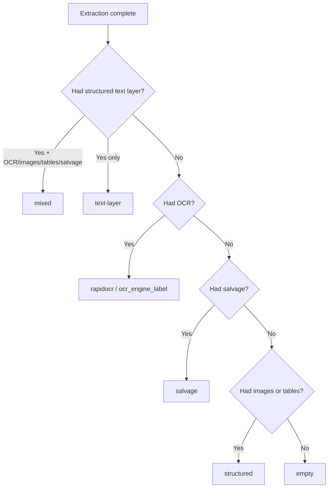

# core_ocr

## Overview

`core_ocr` is the hybrid OCR and document-extraction module for the ABStudio backend. It provides a single, import-safe entry point for turning uploaded files into structured text, and it caches the results so identical re-uploads do not re-run expensive OCR.

The module is intentionally small and cohesive: it contains only two files that work together as one pipeline.

- **`ocr_pipeline.py`** — the orchestrator that decides which extraction engines to run, merges their outputs, and returns a rich result envelope.
- **`ocr_cache.py`** — a content-hash on-disk cache keyed by SHA-256 of the raw file bytes plus the OCR options that influence output.

Upstream callers include:

- [`api_documents`](../api/api_documents.md) — transient chat attachments.
- [`api_kb`](../api/api_kb.md) — persistent knowledge-base ingest.

The module is designed to degrade gracefully: every optional dependency (pdfplumber, Camelot, PyMuPDF, Pillow, RapidOCR, Gemini Vision, and the parent-platform `core.*` packages) is imported lazily. A missing library becomes a warning on the result, never a hard 500.

---

## Architecture

### Design principles

1. **Single entry point.** `extract()` is the only function callers need. It accepts raw bytes, extension, filename, and options, and always returns an `ExtractionResult`.
2. **Content-hash caching.** `ocr_cache` keys results by SHA-256 of the file bytes plus a fingerprint of the options that change output (`force_ocr`, `describe_visuals`, `ocr_lang`, `extract_images`, `extract_tables`).
3. **Best-effort everything.** Cache I/O, optional imports, and per-page extraction are wrapped in broad exception handlers. Failures are recorded as warnings.
4. **Multi-engine cascade.** PDFs run through structured text, table extraction, embedded-image OCR, scanned-page OCR, and a whole-page salvage pass as needed.
5. **Image-first class.** Standalone images (PNG, JPG, TIFF, BMP, WEBP) are normalized, preprocessed, and OCR'd directly.

---

## Data flow

---

## Core components

### `ocr_pipeline.py`

#### `extract(...)`
The single public entry point. It writes the bytes to a temporary file, dispatches by extension (image / PDF / structured), applies a final truncation cap, and returns an `ExtractionResult`.

#### `supported_extensions(text_formats)`
Merges the caller's structured-text allow-list with the image extensions the pipeline can handle (`png`, `jpg`, `jpeg`, `tiff`, `tif`, `bmp`, `webp`). Routes use this so they do not need to hard-code image formats.

#### `_stale_missing_lib_warnings(warnings)`
Detects cache entries that were saved when an optional OCR library was missing but is now importable. Returns those stale warnings so the pipeline can invalidate the entry and re-extract from scratch.

#### Dataclasses

| Dataclass | Purpose |
|-----------|---------|
| `ExtractionOptions` | User-overridable knobs: `force_ocr`, `describe_visuals`, `ocr_lang`, `extract_images`, `extract_tables`, `no_cache`. |
| `ExtractionResult` | Final envelope with text, engine label, per-page info, images, tables, warnings, and cache status. |
| `PageInfo` | Per-page metadata: source engine, char count, table/image counts, warnings. |
| `ImageInfo` | Metadata for one extracted image including OCR text and optional vision description. |
| `TableInfo` | Metadata for one extracted table including engine and Markdown rendering. |

#### Extraction passes

| Pass | When it runs | Engine |
|------|--------------|--------|
| Structured text | Always for non-image files | `core.document_parser.parse_file_structured` |
| pdfplumber tables | PDFs, `extract_tables=True`, not fully scanned | pdfplumber |
| Camelot lattice tables | PDFs, `extract_tables=True`, not fully scanned | Camelot |
| Camelot stream tables | PDFs, `extract_tables=True`, not fully scanned | Camelot |
| Embedded image OCR | PDFs, `extract_images=True`, not fully scanned | PyMuPDF + RapidOCR |
| Scanned PDF OCR | `force_ocr`, missing text layer, or looks scanned | `core.pdf_ocr.extract_pdf` / RapidOCR |
| Unstructured salvage | Low chars/page and no OCR recovered | PyMuPDF + RapidOCR |
| Gemini Vision | Low-text images/charts when `describe_visuals=True` | `core.document_parser.parse_image` |

### `ocr_cache.py`

#### `get(content, options)`
Looks up a cached extraction payload by content hash and options fingerprint. On hit it touches the file's `atime` for LRU bookkeeping. Returns `None` on miss or any error.

#### `put(content, options, payload)`
Persists a result using an atomic-ish tempfile-and-rename pattern, then triggers LRU eviction if the cache exceeds `_MAX_ENTRIES` (500).

#### `invalidate(content, options)`
Deletes a single cache entry. Used by the pipeline when it detects stale missing-library warnings.

#### `clear()`
Removes all cache entries. Exposed for tests and a future admin endpoint.

---

## Engine selection logic

The pipeline labels each result with the dominant engine that produced it:

---

## Cache details

- **Location:** `backend/runtime_artifacts/ocr_cache/`
- **Key format:** `{sha256}_{options_fingerprint}.json`
- **Eviction:** Simple LRU based on file `atime` when entries exceed 500.
- **Atomic writes:** A tempfile is written inside the cache directory and renamed into place.
- **Best-effort:** All cache operations are wrapped in broad exception handlers; a cache failure is logged at debug level and treated as a miss.

---

## Dependencies

### Required
- `core.logger` — structured logging.
- `app.core.parser_errors` — sentinel parser-error detection.

### Optional (lazy-imported)
- `core.document_parser` — structured parsing and image vision.
- `core.pdf_ocr` — scanned-PDF OCR and RapidOCR singleton.
- `pdfplumber` — table extraction.
- `camelot` — lattice/stream table extraction.
- `fitz` (PyMuPDF) — PDF page iteration, embedded images, salvage rasterisation.
- `PIL` (Pillow) — image normalization and preprocessing.
- `rapidocr` or `rapidocr_onnxruntime` — OCR engine.
- `GOOGLE_API_KEY` environment variable — enables Gemini Vision fallback.

---

## Integration with the rest of the system

- **Callers:** [`api_documents`](../api/api_documents.md) and [`api_kb`](../api/api_kb.md) pass uploaded file bytes through `extract()`.
- **Document parsing:** Delegates structured-file and vision parsing to the parent platform's [`document_processing`](../reference/shared_core.md#document_processing) components (`core.document_parser`).
- **PDF OCR:** Delegates scanned-PDF handling to the parent platform's [`document_processing`](../reference/shared_core.md#document_processing) components (`core.pdf_ocr`).
- **Configuration:** No direct dependency on [`core_config`](../infrastructure/core_config.md); behavior is driven by the `ExtractionOptions` passed by the caller and environment variables such as `GOOGLE_API_KEY`.

---

## Notes for maintainers

- Keep `_MISSING_LIB_WARNING_PROBES` in `ocr_pipeline.py` in sync with the exact warning strings emitted by the table and image extraction helpers.
- The cache deliberately omits `no_cache` from the options fingerprint because it controls cache *use*, not cache *content*.
- The salvage pass is bounded to 50 pages to avoid runaway latency on large, low-quality PDFs.
- Embedded-image OCR deduplicates by image xref so a shared logo across pages is only processed once.
