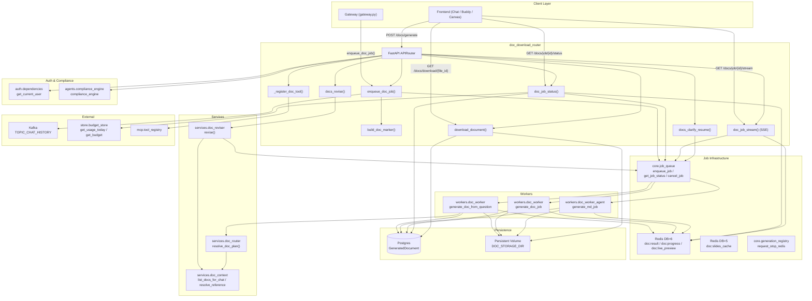
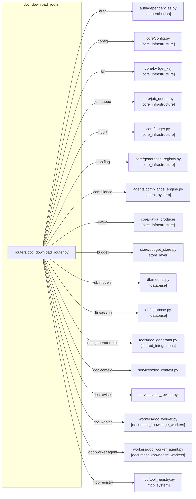
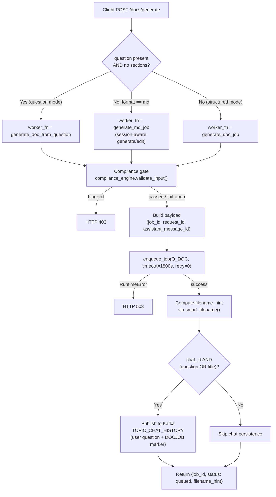
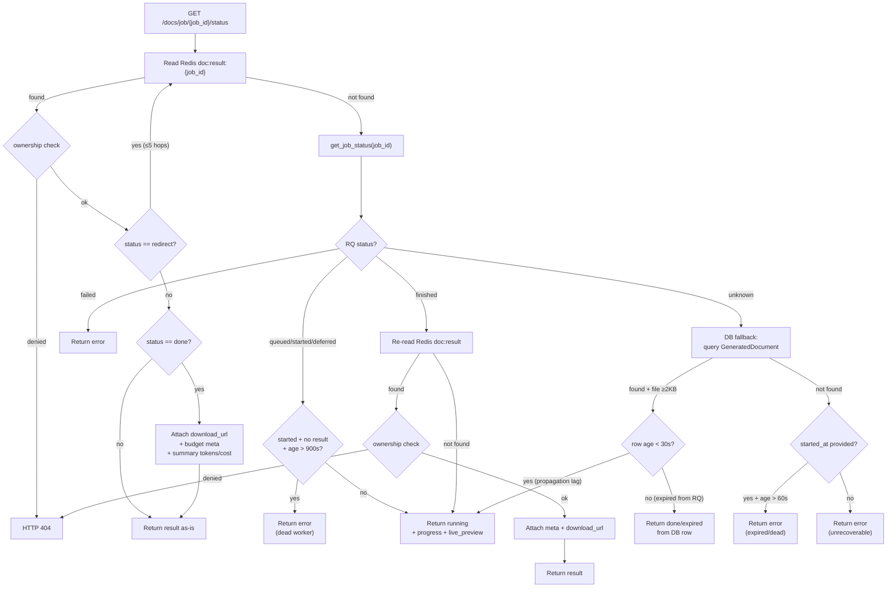
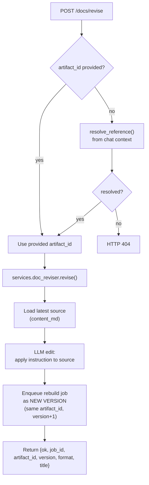
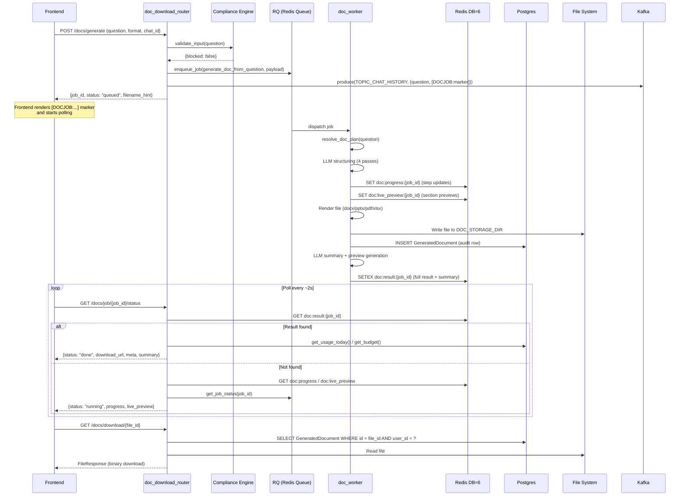
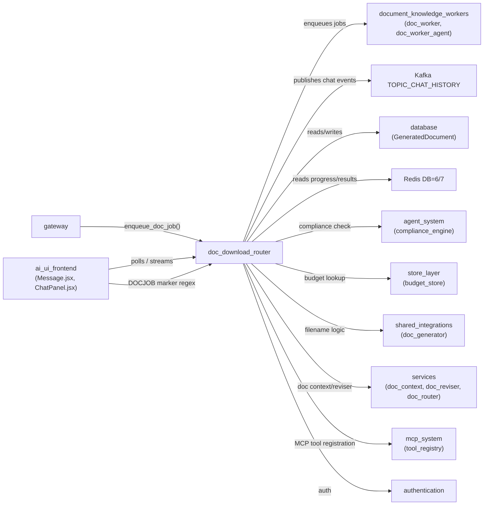

# Document Download Router (`doc_download_router`)

## Overview

The `doc_download_router` module is a FastAPI APIRouter that serves as the primary HTTP interface for **asynchronous document generation, delivery, versioning, and revision** within the platform. It exposes endpoints that allow authenticated users to submit document-generation jobs (Word `.docx`, PowerPoint `.pptx`, PDF, Excel `.xlsx`, Markdown `.md`, or plain text `.txt`), poll or stream their progress, download completed files, browse generation history, preview rendered pages, manage document versions, and revise existing documents through natural-language instructions.

The router acts as a **thin orchestration layer**: it validates input, runs a compliance gate, enqueues background jobs via RQ (Redis Queue), publishes chat-history events to Kafka, and then serves results from Redis (live) or Postgres (persistent fallback). The heavy lifting — LLM structuring, file rendering, OCR, sandboxed conversion — is delegated to worker processes.

---

## Architecture

---

## Module Dependencies

> **Note:** Module references in brackets (e.g. `[core_infrastructure]`, `[database]`) point to sibling documentation files. See [core_infrastructure](../core/core_infrastructure.md), [database](../storage/database.md), [agent_system](../agents/agent_system.md), [store_layer](../storage/store_layer.md), [mcp_system](../mcp/mcp_system.md), [document_knowledge_workers](../workers/document_knowledge_workers.md), and [shared_integrations](../skills/shared_integrations.md) for details on those subsystems.

---

## Core Components

### Request / Response Schemas (Pydantic Models)

| Model | Purpose |
|---|---|
| `DocSection` | A single document section with `heading`, `content`, `bullets`, and `level`. Used in structured generation mode. |
| `DocGenerateRequest` | The primary request body for `POST /docs/generate`. Supports three modes: **question-driven** (LLM structures content), **structured** (pre-built sections), and **markdown** (session-aware generate/edit). Carries `artifact_id` for versioning, `doc_intent` for pre-classification, `attachment_ids` for uploaded files, and `chat_context`/`chat_last_response` for conversation-aware generation. |
| `ThemedDocRequest` | Request for `POST /docs/generate-themed` — generates a PPTX from pre-computed slides cached in Redis with a specific visual theme. |
| `DocReviseRequest` | Request for `POST /docs/revise` — revises an existing document by `artifact_id` (or fuzzy reference) using a natural-language `instruction`. Supports `target_format` for format conversion. |
| `DocClarifyResumeRequest` | Request for `POST /docs/clarify-resume` — resumes a document request after the user answers a clarification question. `choice_value` is either an `artifact_id` (pin target) or `"__new__"` (force fresh generation). |

### Shared Helper Functions

#### `enqueue_doc_job()`

A **single code path** shared by the `POST /docs/generate` REST endpoint and the gateway's `/ask` doc-router. It:

1. Generates a `job_id` (or accepts a caller-supplied override for pre-allocated sibling jobs).
2. Builds a payload with all context (question, format, chat context, attachments, model hints, intent, artifact handle, sibling formats for multi-format fan-out).
3. Enqueues the job to the `Q_DOC` RQ queue targeting `workers.doc_worker_agent.generate_doc_from_question`.
4. Computes a filename hint via `_filename_hint_for()`.
5. Builds a `[DOCJOB:job_id:ext:filename]` marker string.
6. Optionally publishes the chat turn (user question + assistant marker) to Kafka `TOPIC_CHAT_HISTORY` so the chat bubble survives page refresh.

Returns `{job_id, filename_hint, ext, marker}`.

#### `build_doc_marker()` / `doc_marker_for()`

Single source of truth for the `[DOCJOB:job_id:ext:filename]` marker string. Mirrors the frontend's `buildDocJobMarker()` / `DOCJOB_RE` regex in `Message.jsx` so the gateway, worker, and router all emit identical markers.

#### `_filename_hint_for()`

Computes a sensible filename **before** the worker finishes, so the download button shows a meaningful title immediately. Mirrors the worker's final-name logic:
- **Follow-up/update** (`prev_doc_name` set) → versions the previous name (`-v2`, `-v3`, etc.).
- **New doc from chat content** → defers to the LLM-generated title.
- **New doc from question** → uses `smart_filename()` from `tools/doc_generator`.

---

## Endpoints

### 1. `POST /docs/generate` — Submit Async Doc-Gen Job

**Key design decisions:**
- **No retry (`retry_count=0`)**: A killed work-horse means OOM/timeout; retrying immediately wastes another worker slot and produces the same failure.
- **30-minute timeout**: Multi-pass LLM structuring (4 passes × ~3 min) + file generation.
- **Compliance fail-open**: If the compliance engine itself errors, document generation proceeds (non-fatal).
- **Chat persistence**: The assistant bubble with the `[DOCJOB:...]` marker is round-tripped to `chat_messages` via Kafka so it survives page refresh. The worker later updates the row with real model metadata.

### 2. `GET /docs/job/{job_id}/status` — Poll Job Status

This endpoint implements a **multi-layer resolution strategy** to handle the full lifecycle of a document job:

**Critical timing guards:**
- **Stall detection**: If RQ says `"started"` but no Redis result exists after 900s (configurable via `DOC_JOB_STALL_SECONDS`), the job is treated as dead (OOM/SIGKILL) and an error is surfaced.
- **DB fallback recency guard**: A DB row created <30s ago with RQ status `"unknown"` means the job is still propagating through the queue — keep polling rather than returning a stale row.
- **File size guard**: The DB fallback requires the file to be ≥2048 bytes to be considered complete, preventing premature "done" responses during the write window.
- **"finished" ≠ "done"**: RQ marks a job "finished" when the worker process exits, but the worker writes `doc:result` *after* a post-build LLM summary call (3–8s). The endpoint keeps polling until Redis has the full result.
- **Redirect chains**: A `"redirect"` status means the worker delegated to another job (e.g., a revise spawned a versioned rebuild). The endpoint transparently follows up to 5 hops.
- **Budget metadata**: On `"done"`, the endpoint attaches the user's daily usage/budget from `store.budget_store` so the frontend can show remaining quota.

### 3. `GET /docs/job/{job_id}/stream` — SSE Progress Stream

An **additive** SSE-push variant of the status endpoint (Track B optimization). Instead of blind polling, the client opens a persistent SSE connection and receives:

| Event | Payload | Description |
|---|---|---|
| `open` | `{t: "open", job_id}` | Connection established |
| `progress` | `{t: "progress", progress: {...}}` | Step-by-step progress (6 labelled steps from the worker) |
| `live_preview` | `{t: "live_preview", live_preview: {...}}` | Incremental section previews as the LLM authors them |
| `__meta__` | `{__meta__: {...}}` | Terminal frame — same JSON `doc_job_status()` would return for done/error/clarify |

**Design notes:**
- The worker **already publishes** progress and preview to Redis (`doc:progress:{job_id}`, `doc:live_preview:{job_id}`) on every job — this endpoint is pure delivery, requiring no worker changes.
- Polls Redis at 1s intervals (configurable via `DOC_STREAM_POLL_SEC`), pushing only on change.
- Hard ceiling of 1800s (configurable via `DOC_STREAM_MAX_SEC`) to prevent indefinite connections.
- Follows the same redirect-chain and ownership logic as the polling endpoint.
- The polling endpoint (`doc_job_status`) remains fully functional for clients that don't opt into streaming.

### 4. `POST /docs/job/{job_id}/cancel` — Cancel Job

Two-level cancellation:
1. **Level 1**: `cancel_job()` — cancels the RQ job if still queued.
2. **Level 2**: `request_stop_redis()` — sets a Redis stop flag (`gen:stop:{job_id}`) so an in-progress worker checks and bails out.

Then writes a cancelled result to `doc:result:{job_id}` so the frontend polling loop terminates cleanly. If the job is already done, the cancel is silently ignored (returns `cancelled: false, reason: "already_done"`).

### 5. `GET /docs/download/{file_id}` — Download Completed File

Looks up the `GeneratedDocument` row by `id` (UUID) scoped to the requesting user. Returns a `FileResponse` with the correct MIME type from `workers.doc_worker.MIME_TYPES`. Returns 404 if not found, 410 if the file has been purged from disk (retention sweep).

### 6. `GET /docs/history` — List User's Generated Documents

Queries `GeneratedDocument` rows for the user, newest first, with a configurable limit (default 20, max 100). Each entry includes `download_url`, `created_at`, and an `exists` flag indicating whether the binary is still on disk.

### 7. `GET /docs/preview/{file_id}` and `GET /docs/preview/{file_id}/{page}` — Document Preview

- **`/docs/preview/{file_id}`**: Returns the count of available JPEG preview pages (`{file_id}.page-N.jpg` files alongside the document).
- **`/docs/preview/{file_id}/{page}`**: Serves a single JPEG preview page as `image/jpeg`.

Both endpoints validate `file_id` format (UUID regex) and enforce ownership (user must own the document or be admin).

### 8. `GET /docs/by-chat/{chat_id}` — Conversation Document Memory

Lists the **latest version** of every document generated in a conversation (newest first). Powers "recall the doc I made earlier" and follow-up revisions in both Chat and Buddy. Delegates to `services.doc_context.list_docs_for_chat()`. Optional `include_source=true` also returns `content_md`.

### 9. `GET /docs/{artifact_id}/versions` — Version History

Returns the full version chain of one logical document (all builds sharing `artifact_id`), oldest→newest. Each version includes `file_id`, `filename`, `format`, `created_at`, `exists`, and capped `content_md` (200KB). Powers the CoworkCanvas version rail and preview.

**Note**: One-shot docs default `artifact_id` to their own `file_id`, so this endpoint also resolves when a plain `file_id` is passed.

### 10. `POST /docs/revise` — Revise Existing Document

The reviser loads the stored Markdown source (not regenerating from scratch), applies the natural-language edit via a cloud authoring model, and enqueues a render-only rebuild job that versions the same logical document. The revision LLM's token/cost metadata is carried downstream so the turn is properly billed.

### 11. `POST /docs/clarify-resume` — Resume After Clarification

When the doc-router's `resolve_doc_plan()` determines a request is ambiguous (e.g., "revise that doc" when multiple docs exist, or a compare needing a second source), it returns a `clarify` status with options. After the user picks, this endpoint re-enqueues the original question with the ambiguity resolved:

- `choice_value == "__new__"` → force fresh generation (for compare intent, keeps the compare intent so the worker still produces a comparison once both sources are present).
- `choice_value == artifact_id` → pins that artifact so the worker revises/converts that specific document.

### 12. `POST /docs/generate-themed` — Themed PPTX Generation

Generates a PPTX from **pre-computed slides** (cached in Redis DB=5 by `chat_worker`) with a specific visual theme. Validates the theme ID against `workers.doc_worker.PPTX_THEMES`, then enqueues a `generate_doc_job` with the theme and slide structure.

### 13. `GET /docs/templates` — List PPTX Themes

Returns the list of available PPTX presentation themes from `workers.doc_worker.PPTX_THEMES`.

### 14. `_register_doc_tool()` — MCP Tool Registration

On module load, registers a `generate_document` tool definition with the MCP `tool_registry`. This makes document generation available as a callable tool for MCP-connected agents. The tool's input schema mirrors the structured-generation path (`format`, `title`, `sections`, `content_md`, `use_template`). Registration is non-fatal if the registry isn't available yet.

---

## Data Flow: End-to-End Document Generation

---

## Redis Key Schema

The router and workers communicate through a well-defined set of Redis keys on DB=6:

| Key Pattern | TTL | Purpose |
|---|---|---|
| `doc:result:{job_id}` | 3600s | Terminal result JSON (`status`, `file_id`, `meta`, `summary`, `preview`) |
| `doc:progress:{job_id}` | — | Live progress object (6 labelled steps) |
| `doc:live_preview:{job_id}` | — | Incremental section previews as LLM authors them |
| `doc:slides_cache:{slides_key}` | — | Pre-computed slide structure for themed PPTX (DB=5) |
| `gen:stop:{job_id}` | — | Stop flag for in-progress worker cancellation (DB=7) |

---

## Ownership & Security Model

- **Authentication**: All endpoints require `get_current_user` (JWT, API key, or httpOnly cookie). See [authentication](../auth/authentication.md).
- **Ownership scoping**: Status, download, preview, history, and version endpoints filter by `user_id` so users can only access their own documents. Mismatches return 404 (not 403) to avoid leaking file existence.
- **Admin override**: Users with `role == "admin"` can access any user's documents (used for support/debugging).
- **Compliance gate**: `POST /docs/generate` runs `compliance_engine.validate_input()` on the question or title+content. Blocked content returns HTTP 403. Compliance engine failures fail-open (non-fatal).
- **File ID validation**: Preview endpoints validate `file_id` against a UUID regex and bound page numbers (1–200).

---

## Error Handling Strategy

| Scenario | HTTP Status | Behavior |
|---|---|---|
| Compliance blocked | 403 | Lists blocked finding types |
| Missing question AND title | 422 | Validation error |
| RQ unavailable | 503 | `RuntimeError` from `enqueue_job` |
| Job not found (unknown + no DB row + no `started_at`) | 200 | Returns `{status: "error"}` with recovery message |
| Dead worker (started > 900s, no result) | 200 | Returns `{status: "error"}` with retry suggestion |
| File purged from disk | 410 | "Document has expired or been deleted" |
| Ownership mismatch | 404 | "Job not found" / "Document not found" |

---

## Relationship to Other Modules

### Key Integration Points

1. **Gateway (`gateway.py`)**: The gateway's `/ask` flow calls `enqueue_doc_job()` directly (not via the REST endpoint) when it detects a document-generation intent, so intent→generation behaves identically whether triggered from chat or the REST API. The gateway also uses `doc_marker_for()` to pre-allocate `[DOCJOB:...]` markers for multi-format fan-out.

2. **Frontend (`ai_ui_frontend`)**: The `Message.jsx` component contains the `DOCJOB_RE` regex that parses `[DOCJOB:job_id:ext:filename]` markers from assistant messages and renders download cards. It polls `GET /docs/job/{id}/status` on an interval. The `ChatPanel.jsx` `FileDownloadCard` component handles the download UI. See [message](../chat/message.md) and [chat](../chat/chat.md) for frontend details.

3. **Workers (`document_knowledge_workers`)**: The `doc_worker` and `doc_worker_agent` modules are the RQ job entry points. `doc_worker_agent` is a thin dispatcher that routes `md` format to `generate_md_job` and delegates everything else to `doc_worker`. See [document_knowledge_workers](../workers/document_knowledge_workers.md).

4. **Services (`doc_context`, `doc_reviser`, `doc_router`)**: 
   - `doc_context` provides conversation document memory (`list_docs_for_chat`, `resolve_reference`) for "that doc" disambiguation.
   - `doc_reviser` handles the LLM-based edit-and-rebuild flow for `POST /docs/revise`.
   - `doc_router.resolve_doc_plan()` is the authoritative intent classifier used by the worker to decide generate/revise/convert/summarize/compare/extract.

5. **Database (`GeneratedDocument`)**: The persistent audit record. Each row stores `job_id`, `user_id`, `chat_id`, `format`, `title`, `filename`, `file_path`, `content_md` (permanent audit trail), `artifact_id` (version grouping), and `version`. See [database](../storage/database.md).

6. **MCP System**: On module load, `_register_doc_tool()` registers a `generate_document` tool with the MCP tool registry, making document generation available to MCP-connected agents. See [mcp_system](../mcp/mcp_system.md).

---

## Configuration

| Environment Variable | Default | Description |
|---|---|---|
| `DOC_STORAGE_DIR` | — | Persistent volume path for generated documents (NOT `/tmp`) |
| `RDB_STREAM` | — | Redis DB number for document result delivery (DB=6) |
| `RDB_QUEUE` | — | Redis DB number for queue/state (DB=5) |
| `DOC_JOB_STALL_SECONDS` | `900` (15 min) | Hard ceiling for "started" status before treating as dead worker |
| `DOC_STREAM_POLL_SEC` | `1.0` | SSE stream Redis poll interval |
| `DOC_STREAM_MAX_SEC` | `1800` (30 min) | SSE stream hard connection ceiling |
| `REDIS_CLIENT_CONFIG_DB6` | — | Redis client config for DB=6 (document results) |
| `REDIS_CLIENT_CONFIG_DB7` | — | Redis client config for DB=7 (stop flags) |
