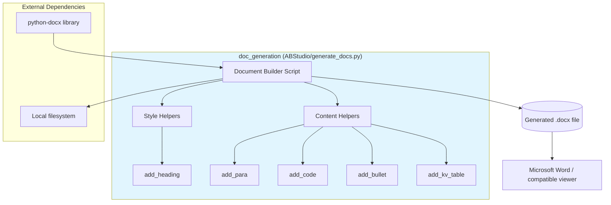
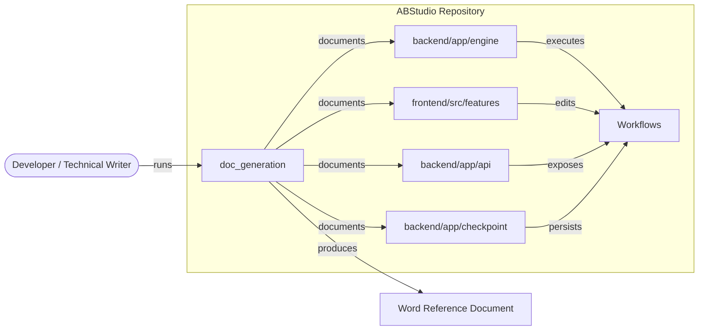
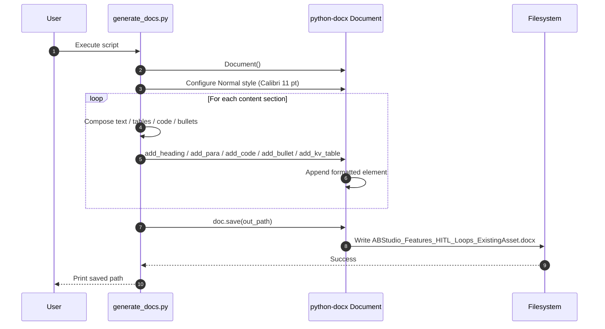
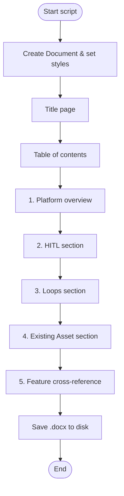
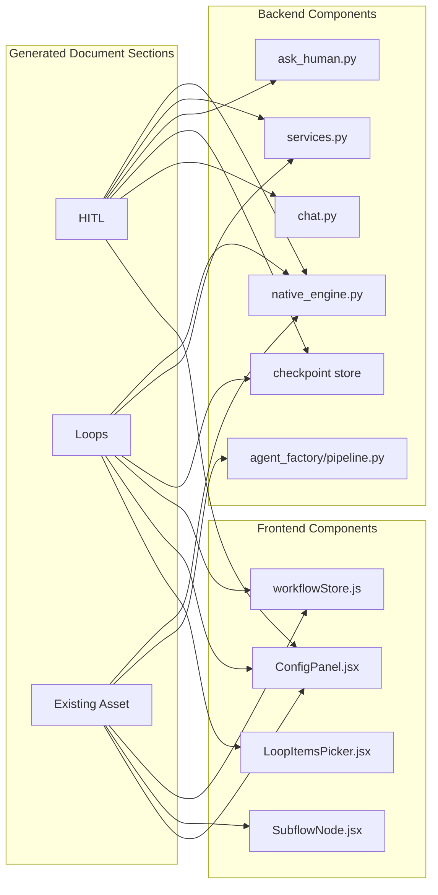

# doc_generation Module Documentation

## Brief Introduction

The `doc_generation` module is a standalone documentation-generation utility located in `ABStudio/generate_docs.py`. Its purpose is to produce a structured Microsoft Word (`.docx`) reference document that describes three core ABStudio workflow-engine features—**Human-in-the-Loop (HITL)**, **Loops**, and **Existing Asset (Sub-flow)**—strictly based on the current implementation rather than proposing new design.

The module is intentionally simple: a collection of small helper functions that wrap `python-docx` to enforce consistent styling (headings, paragraphs, code blocks, bullets, and key-value tables), followed by a long imperative script that assembles the content sections and saves the resulting document to disk. It is not a runtime service, API, or frontend component; it is a developer/maintainer tool for producing offline reference material.

---

## Comprehensive Documentation

### 1. Module Purpose and Scope

`doc_generation` exists to:

1. **Capture implementation truth** for complex workflow-engine features in a human-readable, shareable format.
2. **Provide worked examples** (data-flow walk-throughs, SSE event traces, configuration tables) that help developers and support engineers understand how HITL, Loops, and Sub-flows behave in production.
3. **Cross-reference** the backend engine, frontend store/editor, checkpointing, and API layers so readers can navigate the codebase.

The generated document is divided into five major sections:

| Section | Content |
|---------|---------|
| Title page & metadata | Document title, subtitle, version, date |
| Table of contents | Numbered outline of all sections |
| Platform overview | High-level description of ABStudio's graph-based execution model |
| HITL | What it does, implementation files, modes, data flow, worked example |
| Loops | Loop node behavior, modes, confidence-score contract, SSE events, examples |
| Existing Asset | Sub-flow node behavior, agent vs. workflow dispatch, recursion guard, example |
| Feature cross-reference | Summary table mapping each feature to surface, core code, and key SSE events |

---

### 2. Architecture

#### 2.1 Component Overview



#### 2.2 Helper Functions

| Function | Responsibility |
|----------|----------------|
| `add_heading(text, level=1)` | Adds a styled heading with a fixed dark-blue color (`RGBColor(0x1F, 0x3A, 0x68)`). |
| `add_para(text, bold=False, italic=False)` | Adds a normal paragraph in Calibri 11 pt with optional bold/italic. |
| `add_code(text)` | Adds a monospaced (Consolas 9.5 pt) paragraph with left indentation, used for JSON snippets and SSE traces. |
| `add_bullet(text)` | Adds a `List Bullet` style paragraph. |
| `add_kv_table(rows, headers=("Field", "Description"))` | Adds a styled two-column (or N-column) table with a header row. |

These helpers are thin wrappers around `python-docx` primitives. They centralize typography so the rest of the script can focus on content.

---

### 3. How the Module Fits into the System

`doc_generation` sits at the edge of the ABStudio repository as a **shared-core utility**. It does not import production backend or frontend code; instead, it *documents* those components by name and path. This keeps the script lightweight and free of runtime dependencies such as FastAPI, React, or the database layer.



For detailed behavior of the components that `doc_generation` references, see the dedicated module documentation:

- native_engine.md — graph walker, HITL pause/resume, loop driver, sub-flow dispatch.
- [services.md](../workers/services.md) — HITL mode parsing, condition DSL, and helper functions.
- [checkpoint.md](../agents/checkpoint.md) — pause snapshots and per-node output persistence.
- [chat.md](../chat/chat.md) — SSE chat endpoint that delivers `hitl_interrupt` events.
- workflowStore.md — frontend execution payload and node defaults.
- [ConfigPanel.md](../ui/ConfigPanel.md) — UI editor for HITL mode, loop config, and asset references.
- AgentRunner.md — runner reused when an Existing Asset node dispatches an agent.

---

### 4. Data Flow and Process Flow

#### 4.1 Document Generation Process



#### 4.2 Content Structure Flow



---

### 5. Component Interactions

The `doc_generation` module interacts with the rest of the system only through **documentation references**. The following diagram shows which production components are cited inside the generated document and why.



---

### 6. Key Concepts Documented

The following concepts are explained in the generated Word document. They are summarized here with pointers to the modules that actually implement them.

#### 6.1 Human-in-the-Loop (HITL)

- **Surface**: Per-Agent node configuration via `hitlMode`.
- **Modes**: `off`, `after_response`, `before_tool`, `both`.
- **Implementation**: The engine intercepts `ask_human` tool calls and pauses execution; the checkpoint store persists a snapshot; the `/chat` endpoint streams `hitl_interrupt` events; the frontend renders approval cards.
- **See**: native_engine.md, [services.md](../workers/services.md), [checkpoint.md](../agents/checkpoint.md), [chat.md](../chat/chat.md), [ConfigPanel.md](../ui/ConfigPanel.md).

#### 6.2 Loops

- **Surface**: Standalone `loop` node with `body` and `exit` handles.
- **Modes**: `for_each`, `while`, `count`.
- **Confidence-score contract**: In `while` mode, the body agent must emit a final JSON line `{"score": <0..1>, "changes": "..."}` so the engine can evaluate continuation cases.
- **SSE events**: `loop_iteration_start`, `loop_condition_eval`, `loop_iteration_summary`, `loop_iteration_end`, `loop_final_summary`, `loop_complete`.
- **See**: native_engine.md, [services.md](../workers/services.md), workflowStore.md, [ConfigPanel.md](../ui/ConfigPanel.md).

#### 6.3 Existing Asset (Sub-flow)

- **Surface**: Standalone `subflow` node (UI label "Existing Asset").
- **Configuration**: `kind` (`agent` or `workflow`), `refId`, `refName`.
- **Dispatch**: Agent assets run through `AgentRunner`; workflow assets run via recursive `engine.execute`.
- **Safety**: A per-run `subflow_stack` detects cyclic sub-flow references.
- **See**: native_engine.md, AgentRunner.md, workflowStore.md, SubflowNode.md.

---

### 7. Usage

Run the script directly with a Python interpreter that has `python-docx` installed:

```bash
python ABStudio/generate_docs.py
```

The script writes the output to a hardcoded path:

```text
D:/ainxt-platform/ABStudio/ABStudio_Features_HITL_Loops_ExistingAsset.docx
```

> **Note**: The output path is currently hardcoded. If the repository is moved to a different drive or directory structure, update `out_path` in `ABStudio/generate_docs.py` before running.

---

### 8. Maintenance Considerations

- **Content drift**: Because the script documents implementation details by hand, it must be updated whenever the referenced backend/frontend behavior changes (e.g., new HITL modes, new loop SSE events, changes to the confidence-score contract).
- **No automated extraction**: The module does not parse docstrings, OpenAPI specs, or source code. It is a manually curated reference.
- **Styling is centralized**: All visual formatting is handled by the helper functions, so global style changes (fonts, colors, indentation) can be made in one place.
- **Extensibility**: New sections can be added by calling the existing helpers; new helper functions can be introduced for additional elements (e.g., numbered lists, images) without affecting existing content.

---

### 9. References

- native_engine.md
- [services.md](../workers/services.md)
- [checkpoint.md](../agents/checkpoint.md)
- [chat.md](../chat/chat.md)
- workflowStore.md
- [ConfigPanel.md](../ui/ConfigPanel.md)
- [LoopItemsPicker.md](../ui/LoopItemsPicker.md)
- SubflowNode.md
- AgentRunner.md
