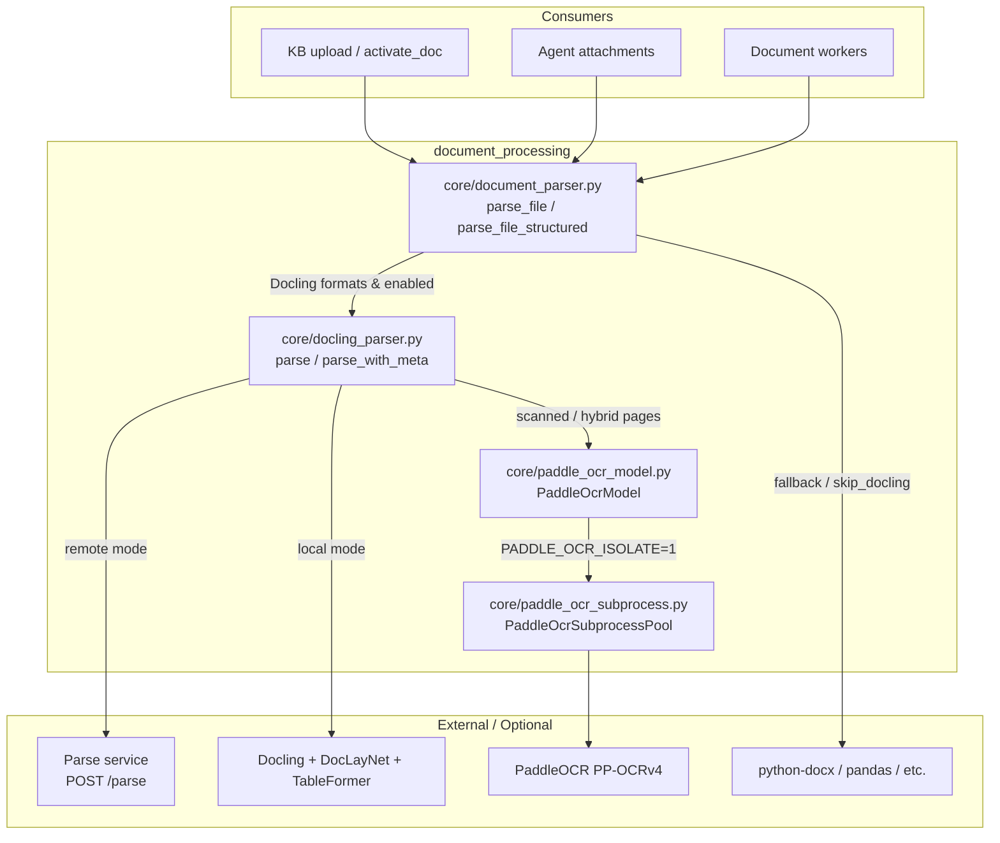
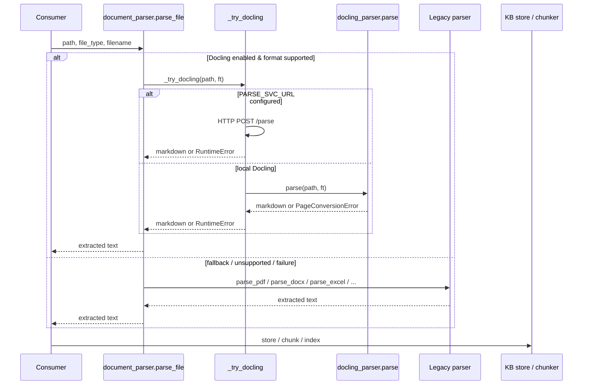

# Document Processing Module

## Overview

The `document_processing` module is responsible for extracting clean, structured text from uploaded files so that downstream knowledge-base (KB), RAG, and agent workflows can consume them. It sits in the `shared_core` layer of the system and is invoked by KB upload/activation flows, agent attachment flows, and document-generation workers.

The module provides two complementary extraction stacks:

1. **Docling-based extraction** (`core/docling_parser.py`) — an ML-aware pipeline that uses IBM Docling to recover document structure (headings, tables, lists) and PaddleOCR to read scanned or image-heavy PDF pages.
2. **Legacy per-format extraction** (`core/document_parser.py`) — a dispatcher that routes files to dedicated parsers such as `python-docx`, `pandas`, `BeautifulSoup`, and Gemini Vision.

A central design goal is **safe, gradual rollout**: Docling can be enabled, shadowed, or disabled via environment variables, and every Docling failure falls back to the legacy parser so uploads are never broken by an experimental flag. When a remote parse service (`PARSE_SVC_URL`) is configured, heavy ML work is offloaded from the gateway worker to that service.

## Architecture

### Key architectural decisions

- **Dual-stack routing**: `parse_file()` tries Docling first for supported formats (`pdf`, `docx`, `html`, `pptx`) and falls back to legacy parsers on any failure. `skip_docling=True` lets callers bypass Docling entirely (used at upload time before approval).
- **Remote vs. local Docling**: `_try_docling()` routes to a dedicated parse service when `PARSE_SVC_URL` is set; otherwise it runs Docling in-process.
- **Per-page PDF strategy**: Docling classifies each PDF page as `ocr`, `hybrid`, `text`, or `blank` and routes it to the appropriate converter, avoiding wasted OCR on born-digital pages while recovering text embedded in images on mixed pages.
- **PaddleOCR isolation**: Because `paddlepaddle` 2.6.x accumulates corrupt native state, OCR can be run inside spawn-based child processes via `PaddleOcrSubprocessPool`.

## Sub-modules

| Sub-module | File(s) | Responsibility | Documentation |
|------------|---------|----------------|---------------|
| Docling Parser | `core/docling_parser.py` | ML-based document extraction with layout/table models and per-page OCR/hybrid/text routing. | [document_processing_docling_parser](document_processing_docling_parser.md) |
| Legacy Document Parser | `core/document_parser.py` | Per-format dispatcher and fallback parsers for PDF, DOCX, PPTX, Excel, CSV, HTML, images, etc. | document_processing_legacy_parser |
| PaddleOCR Integration | `core/paddle_ocr_model.py`, `core/paddle_ocr_subprocess.py` | Docling OCR backend using PaddleOCR, with optional subprocess isolation for stability. | [document_processing_paddle_ocr](document_processing_paddle_ocr.md) |

## Data Flow

## Configuration & Environment Variables

| Variable | Default | Effect |
|----------|---------|--------|
| `USE_DOCLING_PARSER` | `0` (off) | `1` = use Docling for supported formats; `shadow` = run Docling in parallel but return legacy output; `0` = legacy only. |
| `PARSE_SVC_URL` | empty | When set, `_try_docling()` delegates to the remote parse service instead of running Docling in-process. |
| `PARSE_SVC_TIMEOUT` | `1800` | Read timeout in seconds for the remote parse service. |
| `DOCLING_ARTIFACTS_PATH` | empty | Local path to Docling model weights (for air-gapped deployments). |
| `PADDLEOCR_MODELS_PATH` | empty | Local path to PaddleOCR `det/`, `rec/`, `cls/` model dirs. |
| `PADDLE_OCR_ISOLATE` | `0` | Set to `1` to run PaddleOCR inside spawn-isolated child processes. `docling_parser.py` sets this automatically. |
| `PADDLE_OCR_POOL_SIZE` | `3` | Number of isolated PaddleOCR child processes. |
| `PADDLE_OCR_ISOLATE_RECYCLE` | `20` | Recycle each child after this many successful OCR calls. |
| `PADDLE_OCR_ISOLATE_TIMEOUT` | `60` | Hard timeout per OCR call in seconds. |
| `PDF_IMAGE_AREA_THRESHOLD` | `0.60` | Minimum image-area fraction to trigger full-page OCR. |
| `PDF_MIN_NATIVE_CHARS` | `100` | Pages with at least this many native chars never go to full-page OCR. |
| `PDF_HYBRID_ENABLED` | `1` | Enable region-OCR for pages with both native text and significant images. |
| `PDF_HYBRID_MIN_IMAGE_AREA` | `0.03` | Minimum image-area fraction for a page to be considered hybrid. |
| `PDF_HYBRID_MAX_PAGES` | `0` | Cap on document length for hybrid processing (`0` = unlimited). |
| `PDF_BOILERPLATE_IMAGE_RATIO` | `0.50` | Ignore images appearing on more than this fraction of pages when classifying hybrid pages. |
| `PDF_SMART_PARALLEL_ENABLED` | `1` | Enable parallel batch conversion for large PDFs. |
| `PDF_SMART_PARALLEL_THRESHOLD` | `50` | Page-count threshold for parallel conversion. |
| `PDF_SMART_BATCH_SIZE` | `25` | Batch size for text-only PDF pages. |
| `PDF_SMART_OCR_BATCH_SIZE` | `1` | Batch size for full-page OCR pages. |
| `PDF_SMART_HYBRID_BATCH_SIZE` | `2` | Batch size for hybrid region-OCR pages. |
| `PDF_SMART_MAX_WORKERS` | `10` | Max thread-pool workers for parallel text batches. |
| `PDF_OCR_MAX_CONCURRENCY` | pool size | Semaphore limit for concurrent OCR conversions. |

## Integration with the Rest of the System

- **KB / document ingestion**: `store/docs_store.py` and KB workers call `parse_file_structured()` during document activation. `skip_docling=True` is used at upload time so Docling only runs after approval.
- **Agent attachments**: The agent editor and agent runner use document extraction to make uploaded files available to agents.
- **Document generation workers**: `workers/doc_worker.py`, `workers/doc_worker_agent.py`, and `workers/presenton_worker.py` may invoke parsing utilities when processing source documents.
- **Embedding service**: When `PARSE_SVC_URL` points at the embed service, Docling and PaddleOCR run there rather than in the gateway worker, mirroring how embeddings are offloaded via `EMBED_SVC_URL`.

## Failure Handling

- **Docling unavailable or unsupported format**: `docling_parser.parse()` returns `None`; `parse_file()` falls back to the legacy parser.
- **Docling conversion error or empty output**: Local Docling raises a user-friendly `RuntimeError`; remote Docling returns HTTP 422/5xx with sanitized messages. `parse_file()` only falls back when Docling explicitly returns `None` (not on hard failures).
- **Partial PDF conversion (`PageConversionError`)**: Raised when one or more page batches fail after retry. This propagates to `activate_doc()` so the document can be rolled back to `PENDING_APPROVAL` with the exact failed page ranges stored in `parse_error`.
- **PaddleOCR native-state corruption**: Mitigated by subprocess isolation; a failing child is recycled before the next call.

## Operational Notes

- Docling model weights are loaded lazily on first use. The first conversion after worker startup incurs a one-time warm-up cost of a few seconds.
- PaddleOCR models are also loaded lazily. In air-gapped environments, pre-stage `DOCLING_ARTIFACTS_PATH` and `PADDLEOCR_MODELS_PATH` to avoid runtime downloads.
- Shadow mode (`USE_DOCLING_PARSER=shadow`) is useful for validating output quality before enabling Docling for users: Docling runs and logs diffs, but the legacy result is returned.
- Large PDFs are automatically batched to keep peak memory bounded and avoid worker timeouts.
