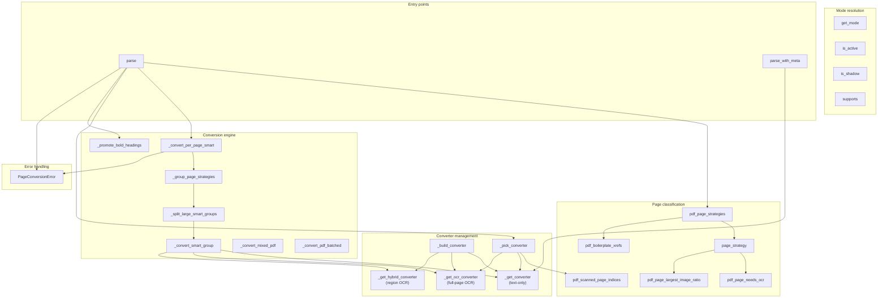
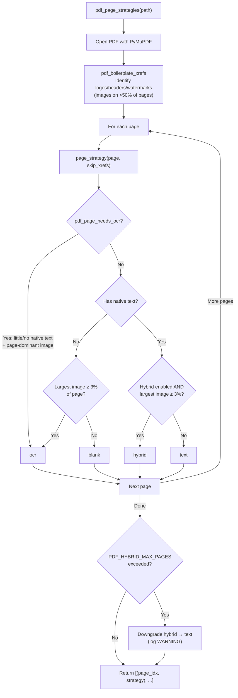
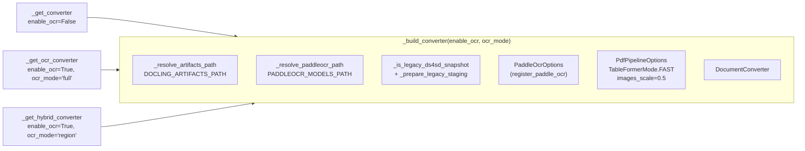
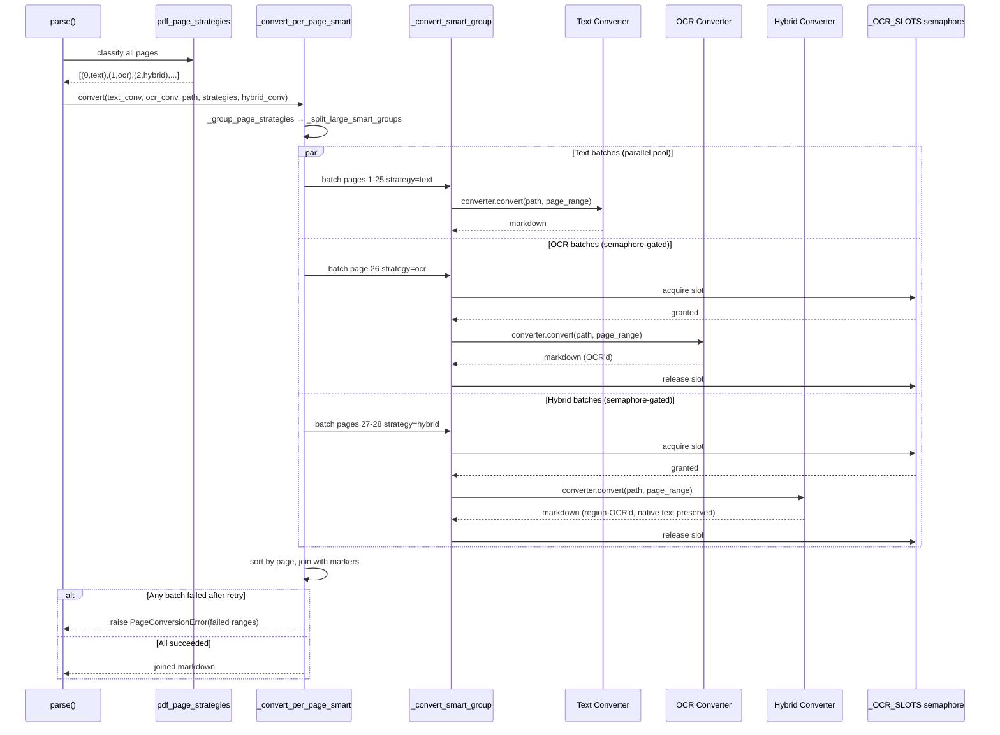
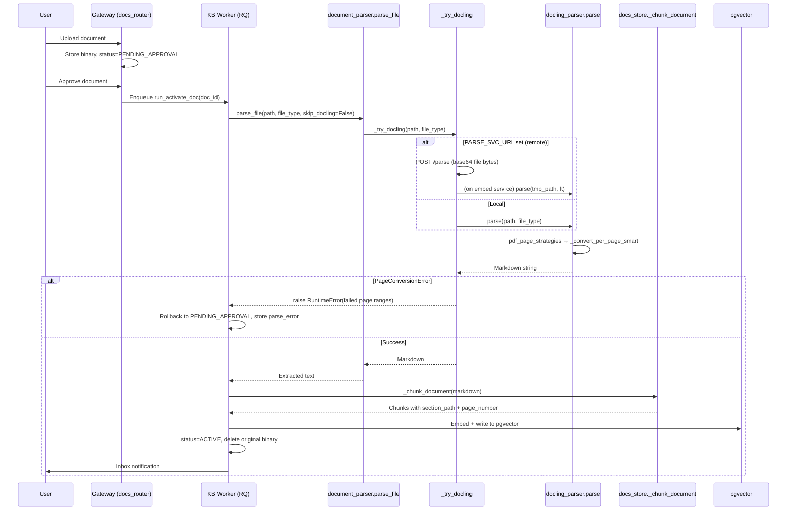
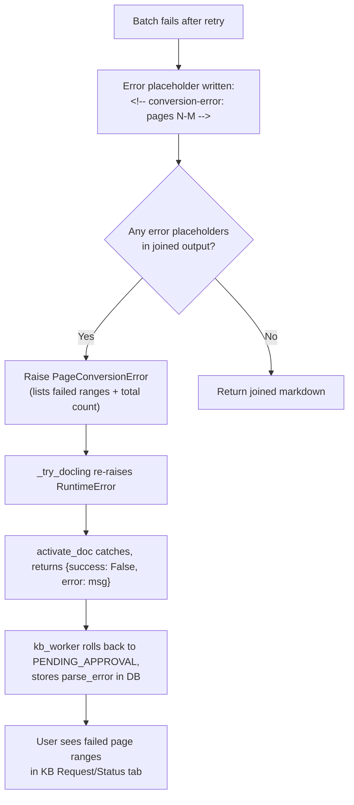
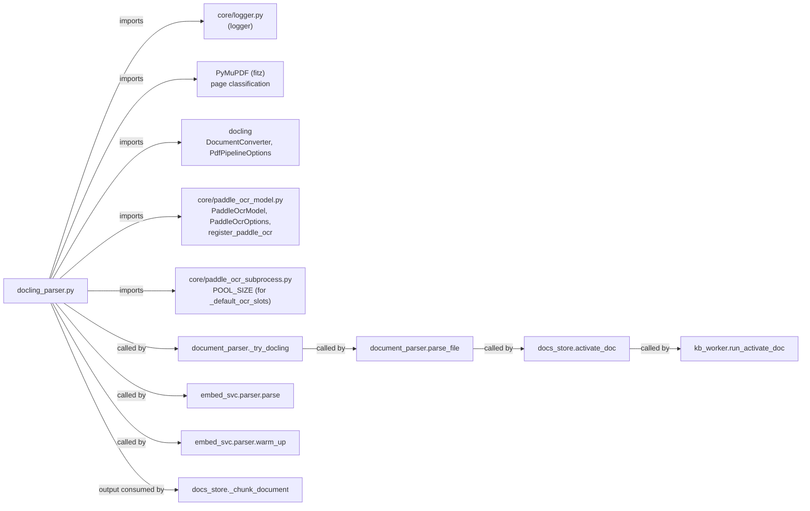
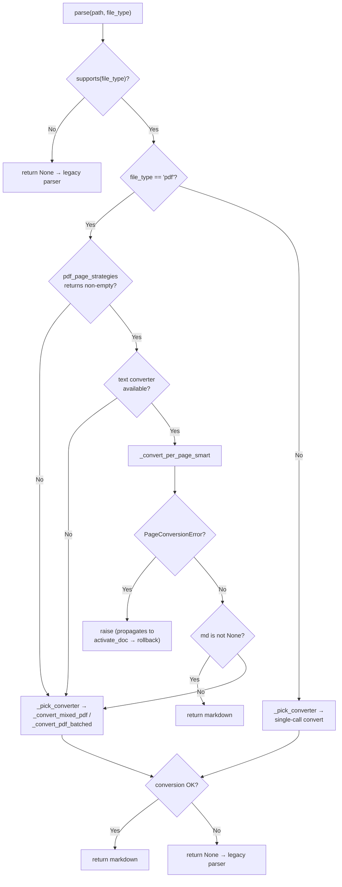

# Document Processing — Docling Parser

> **Module:** `core/docling_parser.py`
> **Parent module:** [document_processing](document_processing.md)
> **Sibling modules:** [document_processing_legacy_parser](document_processing_legacy_parser.md), [document_processing_paddle_ocr](document_processing_paddle_ocr.md)

## 1. Introduction

The Docling parser is an **alternative document-extraction backend** that wraps
[IBM Docling](https://github.com/docling-project/docling) to produce clean,
structure-rich Markdown from PDF, DOCX, HTML, and PPTX uploads. It exists
alongside the legacy per-format parsers in
[`core/document_parser.py`](document_processing_legacy_parser.md) because the
legacy parsers (pymupdf4llm, python-docx, BeautifulSoup) only recover document
structure when the source uses explicit heading styles. Docling runs ML layout
(DocLayNet) and table (TableFormer) models to reconstruct section hierarchy,
tables, and headings even when the source document uses plain bold text or
inconsistent fonts — restoring the `##` headings that downstream chunkers need
to attach `section_path` metadata to each chunk.

The module is **opt-in and fail-safe**: it is controlled by the
`USE_DOCLING_PARSER` environment variable, supports a shadow mode for safe
rollout, and falls back silently to the legacy parser on any failure (import
error, model init failure, conversion error, timeout). Uploads never break
because Docling is off, missing, or buggy.

### Key capabilities

| Capability | Description |
|---|---|
| **Structure recovery** | DocLayNet layout model + TableFormer reconstruct `##`/`###` headings and table grids from documents that lack explicit Word heading styles. |
| **Scanned-PDF OCR** | PaddleOCR (PP-OCRv4) recovers text from image-only pages via a custom `PaddleOcrModel` registered into Docling's OCR factory. |
| **Mixed-PDF handling** | Per-page strategy classification routes each page to the correct converter: `text` (fast), `ocr` (full-page scan), `hybrid` (region-OCR for pages with both native text and embedded images), or `blank`. |
| **Bold-heading promotion** | Post-processing promotes bold Normal-style paragraphs to proper Markdown headings when Docling produced fewer than 3 headings. |
| **Air-gapped deployment** | `DOCLING_ARTIFACTS_PATH` and `PADDLEOCR_MODELS_PATH` point at local model directories so no network access is required. |
| **Batched + parallel conversion** | Large PDFs are split into bounded page batches; text batches run on a thread pool while OCR batches are gated by a semaphore matching the PaddleOCR child-pool size. |
| **Page-level error reporting** | `PageConversionError` carries the exact failed page ranges so the user sees precisely which pages could not be extracted. |

---

## 2. Architecture

### 2.1 Module position in the system

```mermaid
flowchart LR
    subgraph Upload["Upload / Approval flow"]
        UF["docs_router.upload_doc<br/>(gateway)"]
        AD["docs_store.activate_doc"]
    end

    subgraph KB["KB Worker (RQ)"]
        KW["kb_worker.run_activate_doc"]
    end

    subgraph Parse["Parse dispatch"]
        PF["document_parser.parse_file"]
        TD["_try_docling"]
    end

    subgraph Docling["Docling Parser (this module)"]
        DP["docling_parser.parse"]
        PS["pdf_page_strategies"]
        CS["_convert_per_page_smart"]
        BH["_promote_bold_headings"]
    end

    subgraph OCR["PaddleOCR subsystem"]
        POM["paddle_ocr_model.PaddleOcrModel"]
        POSP["paddle_ocr_subprocess.PaddleOcrSubprocessPool"]
    end

    subgraph Embed["Embed Service (optional remote)"]
        EP["embed_svc.parser.parse"]
        ED["embed_svc.main.parse_doc"]
    end

    subgraph Chunk["Chunking & Embedding"]
        CD["docs_store._chunk_document"]
        PG["pgvector write"]
    end

    UF --> AD --> KW --> PF
    PF -->|Docling formats| TD
    TD -->|PARSE_SVC_URL set| ED --> EP --> DP
    TD -->|local| DP
    DP --> PS --> CS
    CS -->|ocr/hybrid pages| POM --> POSP
    CS --> BH
    DP -->|markdown| CD --> PG
```



The Docling parser sits between the **parse dispatch layer**
(`document_parser.parse_file` → `_try_docling`) and the **chunking layer**
(`docs_store._chunk_document`). It can run either **in-process** (gateway
worker) or **remotely** on the embed service when `PARSE_SVC_URL` is set — the
remote path offloads heavy ML models from the gateway worker, mirroring how
embedding was offloaded to `EMBED_SVC_URL`.

### 2.2 Component map



---

## 3. Core Components

### 3.1 Mode resolution

| Function | Purpose |
|---|---|
| `get_mode()` | Returns `"off"`, `"on"`, or `"shadow"` by reading `USE_DOCLING_PARSER`. Re-reads the env var on every call so admins can flip the flag without restarting workers. |
| `is_active()` | `True` when mode is `"on"` — Docling output replaces legacy parsers. |
| `is_shadow()` | `True` when mode is `"shadow"` — Docling runs in parallel but legacy output is returned (for safe rollout / diff logging). |
| `supports(file_type)` | `True` for `pdf`, `docx`, `html`, `htm`, `pptx`. All other formats always use the legacy parser. |

### 3.2 Page classification (PDF only)

The per-page strategy system is the heart of the module. It replaces the old
60-character heuristic with direct image-block detection, correctly handling
mixed PDFs where some pages are born-digital and others are scanned.



**Strategy meanings:**

| Strategy | Converter used | When | Behavior |
|---|---|---|---|
| `text` | Text-only (`_get_converter`) | Native text, no significant image | Fast path, no OCR. |
| `ocr` | Full-page OCR (`_get_ocr_converter`) | Little/no native text + page-dominant image (genuine scan) | Full page rasterized and OCR'd; native text cells discarded (correct for scans). |
| `hybrid` | Region-OCR (`_get_hybrid_converter`) | Native text AND significant image (flowchart, infographic, chart) | Only image rectangles are OCR'd; `_filter_ocr_cells()` drops OCR cells overlapping native text — native text always wins. |
| `blank` | None | No text and no significant image | Page marker emitted, no conversion call. |

**Key detection functions:**

- **`pdf_page_needs_ocr(page)`** — Two complementary detectors: (1)
  `page.get_text("blocks")` with `block_type == 1` (image block), and (2)
  `page.get_images(full=True)` + `page.get_image_rects(xref)` for XObject-embedded
  scans (Word "Print to PDF", scanner drivers, img2pdf). A page needs OCR when
  either detector finds an image covering ≥ `PDF_IMAGE_AREA_THRESHOLD` (default
  0.60) of the page area. A **native-text gate** (`PDF_MIN_NATIVE_CHARS`,
  default 100) prevents pages with substantial extractable text from being
  routed to full-page OCR, which would discard that text.

- **`pdf_boilerplate_xrefs(doc)`** — Groups images by MD5 hash of decoded bytes
  and returns xrefs appearing on more than `PDF_BOILERPLATE_IMAGE_RATIO`
  (default 0.50) of pages. These are logos/headers/watermarks that carry no
  per-page information and are excluded from hybrid classification.

- **`pdf_page_largest_image_ratio(page, skip_xrefs)`** — Returns the largest
  single embedded-image area as a fraction of page area, excluding boilerplate
  xrefs. Uses the largest single image (not combined coverage) because
  overlapping placements can sum past 100%.

### 3.3 Converter management

Three lazily-initialized singletons cache `DocumentConverter` instances per
worker process:



| Singleton | OCR | `force_full_page_ocr` | Used for |
|---|---|---|---|
| `_get_converter()` | Disabled | N/A | Born-digital PDFs, all DOCX/HTML/PPTX |
| `_get_ocr_converter()` | PaddleOCR (full) | `True` | Fully scanned pages (`ocr` strategy) |
| `_get_hybrid_converter()` | PaddleOCR (region) | `False` | Pages with native text + significant images (`hybrid` strategy) |

Each converter is built only when first needed — a pure-text PDF never pays the
PaddleOCR warm-up cost. Init failures are cached (`_converter_init_failed`,
etc.) so the module doesn't retry a known-broken init on every upload.

**Model location:**
- `DOCLING_ARTIFACTS_PATH` → DocLayNet + TableFormer weights. When the path
  matches the legacy `ds4sd/docling-models` snapshot layout,
  `_prepare_legacy_staging()` creates a sibling directory with
  `docling-project--docling-layout-old/` and `docling-project--docling-models/`
  junctions/symlinks so Docling 2.x's directory-naming expectations are met
  without restructuring the model mirror.
- `PADDLEOCR_MODELS_PATH` → directory with `det/`, `rec/`, `cls/` subdirs for
  PP-OCRv4. When unset, PaddleOCR auto-downloads from its CDN.

**PaddleOCR integration** is handled by
[`core/paddle_ocr_model.py`](document_processing_paddle_ocr.md), which registers
`PaddleOcrModel` into Docling's OCR factory and patches
`PdfPipelineOptions.ocr_options` to a `Union` that preserves
`PaddleOcrOptions` instances through Pydantic revalidation. The subprocess
isolation pool (`PaddleOcrSubprocessPool`) is documented in
[document_processing_paddle_ocr](document_processing_paddle_ocr.md).

### 3.4 Conversion engine

#### Primary path: `_convert_per_page_smart`

This is the main PDF conversion path. It:

1. Groups consecutive same-strategy pages (`_group_page_strategies`).
2. Splits large groups into bounded batches (`_split_large_smart_groups`):
   - `text`: 25 pages/batch
   - `ocr`: 1 page/batch (expensive, small blast radius)
   - `hybrid`: 2 pages/batch
3. Runs text/blank batches on a `ThreadPoolExecutor` (up to
   `PDF_SMART_MAX_WORKERS`, default 10) when the document exceeds
   `PDF_SMART_PARALLEL_THRESHOLD` (default 50 pages).
4. Runs OCR-bearing batches (`ocr` + `hybrid`) on a separate lane gated by
   `_OCR_SLOTS` — a `threading.Semaphore` sized to match the PaddleOCR
   child-pool size (`_default_ocr_slots()`). This bounds concurrent OCR
   conversions so waiting threads don't hold rasterized page images in memory.
5. Each batch is converted by `_convert_smart_group`, which retries once on
   failure (2-second backoff) before writing an error placeholder.
6. Results are sorted by page number and joined. `<!-- page:N -->` markers are
   prepended so the chunker can populate `DocumentEmbedding.page_number`.
7. If any batch failed even after retry, `PageConversionError` is raised with
   the exact failed page ranges — the document is **not** served as a partial
   result.



#### Legacy fallback path

When the primary path is unavailable (non-PDF format, `pdf_page_strategies`
returned `[]`, or all batches produced no content), `parse()` falls back to
`_pick_converter()` → `_convert_mixed_pdf()` or `_convert_pdf_batched()`:

- **`_pick_converter`** — Routes by file type and scanned-page detection:
  non-PDF → text-only; born-digital PDF → text-only; fully scanned (>80%
  pages) → OCR; mixed → returns both converters as a tuple.
- **`_convert_mixed_pdf`** — Builds contiguous ranges of digital and scanned
  pages, runs the appropriate converter on each, and merges in page order.
- **`_convert_pdf_batched`** — Splits large PDFs (>25 pages) into 10-page
  batches to bound peak memory (prevents `std::bad_alloc` on image-heavy PDFs).

> **Note:** `PageConversionError` is **never** caught in the legacy fallback —
> it propagates up through `_try_docling()` → `activate_doc()` so the document
> is rolled back to `PENDING_APPROVAL` with the exact failed page ranges in
> `parse_error`. Legacy parsing must not silently replace a partial Docling
> result.

### 3.5 Bold-heading promotion

`_promote_bold_headings(md, file_type)` post-processes Docling's Markdown
output. Many real-world documents (policy manuals, SOPs, dispute guides) use
bold Normal-style paragraphs as section titles instead of Word Heading 1/2/3
styles. Docling's Word backend does not classify these as `section_header`
items, so `export_to_markdown()` emits them as `**bold**` text — producing 0
headings and breaking downstream chunking.

**Promotion rules** (all must hold):
1. The entire line is wrapped in `**...**`.
2. Text is ≤ 120 characters.
3. Text does not end with sentence-ending punctuation (`. ! ? , : ;`).
4. The document currently has fewer than 3 `#` headings (if Docling already
   produced headings, trust its output).

Short bold lines (≤ 60 chars) → `##` (major section); longer → `###`
(sub-section).

### 3.6 Diagnostic helpers

`parse_with_meta(path, file_type)` runs the text-only converter and returns
structural metadata alongside the Markdown:

```python
{
    "markdown":      "...",
    "heading_count": {1: 1, 2: 12, 3: 4},
    "table_count":   8,
    "page_count":    7,
}
```

Used by the structure quality scorer and shadow-mode diffing against the legacy
parser without re-running conversion.

---

## 4. Configuration

All configuration is via environment variables, read at call time so changes
take effect without restarting workers.

### 4.1 Activation

| Variable | Default | Values | Description |
|---|---|---|---|
| `USE_DOCLING_PARSER` | unset (`off`) | `0`/unset/`off`, `1`/`on`/`true`/`yes`, `shadow` | Controls Docling activation. `shadow` runs Docling alongside the legacy parser, logs diffs, but returns legacy output. |

### 4.2 Model paths (air-gapped deployment)

| Variable | Default | Description |
|---|---|---|
| `DOCLING_ARTIFACTS_PATH` | unset (HF download) | Absolute path to DocLayNet + TableFormer weights. Legacy `ds4sd/docling-models` snapshots are auto-staged. |
| `PADDLEOCR_MODELS_PATH` | unset (auto-download) | Absolute path to a directory with `det/`, `rec/`, `cls/` subdirs for PP-OCRv4. |

### 4.3 Page classification tuning

| Variable | Default | Range | Description |
|---|---|---|---|
| `PDF_IMAGE_AREA_THRESHOLD` | `0.60` | 0.0–1.0 | Min image-area/page-area ratio to trigger full-page OCR. Raised from 0.05 to avoid misclassifying born-digital pages with banner diagrams. |
| `PDF_MIN_NATIVE_CHARS` | `100` | int | Min native (selectable) characters for a page to be treated as born-digital, regardless of image content. |
| `PDF_HYBRID_ENABLED` | `1` | `0`/`1` | Enable hybrid (region-OCR) processing. `0` collapses hybrid pages to text. |
| `PDF_HYBRID_MIN_IMAGE_AREA` | `0.03` | 0.0–1.0 | Min single-image area for a page with text to be considered hybrid. |
| `PDF_HYBRID_BITMAP_THRESHOLD` | `0.03` | 0.0–1.0 | `bitmap_area_threshold` passed to Docling in region mode. |
| `PDF_HYBRID_MAX_PAGES` | `0` (disabled) | int | Above this page count, hybrid pages are downgraded to text (safety valve for very large documents). |
| `PDF_BOILERPLATE_IMAGE_RATIO` | `0.50` | 0.0–1.0 | Images appearing on more than this fraction of pages are treated as boilerplate. |

### 4.4 Parallelism & batching

| Variable | Default | Range | Description |
|---|---|---|---|
| `PDF_SMART_PARALLEL_ENABLED` | `1` | `0`/`1` | Enable parallel batch conversion. |
| `PDF_SMART_PARALLEL_THRESHOLD` | `50` | 1–5000 | Min page count to trigger parallel text-batch conversion. |
| `PDF_SMART_BATCH_SIZE` | `25` | 1–200 | Pages per text batch. |
| `PDF_SMART_OCR_BATCH_SIZE` | `1` | 1–25 | Pages per OCR batch. |
| `PDF_SMART_HYBRID_BATCH_SIZE` | `2` | 1–25 | Pages per hybrid batch. |
| `PDF_SMART_MAX_WORKERS` | `10` | 1–16 | Max threads for text/blank batch conversion. |
| `PDF_OCR_MAX_CONCURRENCY` | `_default_ocr_slots()` | 1–16 | Max concurrent OCR-bearing conversions (semaphore size). Defaults to the PaddleOCR child-pool size. |

---

## 5. Data Flow

### 5.1 End-to-end document activation flow



### 5.2 Page marker propagation

`_convert_per_page_smart` prepends `<!-- page:N -->` markers to each batch's
output. The chunker in `docs_store._chunk_document` uses these markers to
populate `DocumentEmbedding.page_number` for every chunk, enabling page-level
citations in RAG responses.

### 5.3 Error propagation



---

## 6. Dependencies



### Internal dependencies

| Dependency | Relationship |
|---|---|
| [`core/logger.py`](../infrastructure/core_infrastructure.md) | Provides the `logger` used throughout for structured logging. |
| [`core/document_parser.py`](document_processing_legacy_parser.md) | `_try_docling` is the caller that invokes `docling_parser.parse()` / `is_active()` / `supports()`. `parse_file` routes Docling-supported formats to `_try_docling` first. |
| [`core/paddle_ocr_model.py`](document_processing_paddle_ocr.md) | Provides `PaddleOcrModel`, `PaddleOcrOptions`, and `register_paddle_ocr()` — the custom OCR backend registered into Docling's factory. |
| [`core/paddle_ocr_subprocess.py`](document_processing_paddle_ocr.md) | Provides `POOL_SIZE` (via `_default_ocr_slots()`) to size the `_OCR_SLOTS` semaphore. The subprocess pool isolates PaddleOCR's corruptible native state. |
| [`store/docs_store.py`](../knowledge/shared_core_knowledge_base.md) | `_chunk_document` consumes the Markdown output (with `##` headings and `<!-- page:N -->` markers) to produce section-aware chunks. `activate_doc` orchestrates the full parse → chunk → embed pipeline. |
| [`workers/kb_worker.py`](../workers/document_knowledge_workers.md) | `run_activate_doc` is the RQ entry point that calls `activate_doc`, catches failures, and rolls back to `PENDING_APPROVAL` with `parse_error`. |
| [`services/embed_svc/parser.py`](../knowledge/embedding_service.md) | Remote parse wrapper: writes bytes to a temp file, calls `docling_parser.parse()`, propagates `PageConversionError` as HTTP 422. |
| [`services/embed_svc/main.py`](../knowledge/embedding_service.md) | `parse_doc` endpoint and `lifespan` warm-up that pre-loads converters. |

### External dependencies

| Package | Purpose |
|---|---|
| `docling` | IBM Docling — `DocumentConverter`, `PdfFormatOption`, `PdfPipelineOptions`, `LayoutOptions`, `TableStructureOptions`, `DOCLING_LAYOUT_V2`. |
| `pymupdf` (`fitz`) | Page-level text extraction and image-block detection for strategy classification. |
| `paddleocr` / `paddlepaddle` | PP-OCRv4 OCR engine for scanned pages (via `PaddleOcrModel`). |
| `threading` | `_OCR_SLOTS` semaphore for OCR admission control. |
| `concurrent.futures` | `ThreadPoolExecutor` for parallel batch conversion. |

---

## 7. Failure Modes & Fallback Strategy

The module is designed so that **Docling is never a single point of failure**
for document uploads:



| Failure | Behavior |
|---|---|
| `docling` not installed | `_get_converter()` returns `None`, logs a warning. `parse()` returns `None`. Caller falls back to legacy parser. |
| Model init failure | Cached as `_converter_init_failed`. Subsequent calls return `None` without retrying. |
| `pdf_page_strategies` fails (corrupt PDF, fitz unavailable) | Returns `[]`. `parse()` falls back to `_pick_converter` legacy path. |
| All smart batches fail (no content at all) | `_convert_per_page_smart` returns `None`. `parse()` falls back to legacy path. |
| Some batches fail after retry | `PageConversionError` raised with failed page ranges. Propagates to `activate_doc` → document rolled back to `PENDING_APPROVAL` with `parse_error`. **No silent partial result.** |
| OCR converter unavailable | OCR/hybrid pages degrade to text-only converter. Warning logged. Image text may be missed but document is not lost. |
| Conversion exception (non-PCE) | `parse()` catches, logs warning, returns `None`. Caller falls back to legacy parser. |

---

## 8. Related Documentation

- [document_processing](document_processing.md) — Parent module overview.
- [document_processing_legacy_parser](document_processing_legacy_parser.md) — `core/document_parser.py`: per-format parsers (pymupdf4llm, python-docx, BeautifulSoup), `parse_file`, `_try_docling`, and the fallback chain.
- [document_processing_paddle_ocr](document_processing_paddle_ocr.md) — `core/paddle_ocr_model.py` and `core/paddle_ocr_subprocess.py`: PaddleOCR model registration, subprocess isolation pool, and `PaddleOcrOptions`.
- [shared_core_knowledge_base](../knowledge/shared_core_knowledge_base.md) — `store/docs_store.py`: `activate_doc`, `_chunk_document`, and the full parse → chunk → embed pipeline.
- [document_knowledge_workers](../workers/document_knowledge_workers.md) — `workers/kb_worker.py`: `run_activate_doc` RQ worker and rollback logic.
- [embedding_service](../knowledge/embedding_service.md) — `services/embed_svc/`: remote `/parse` endpoint, `parser.py` wrapper, and warm-up lifecycle.
- [core_infrastructure](../infrastructure/core_infrastructure.md) — `core/logger.py`, `core/config.py`: logging and configuration infrastructure.
