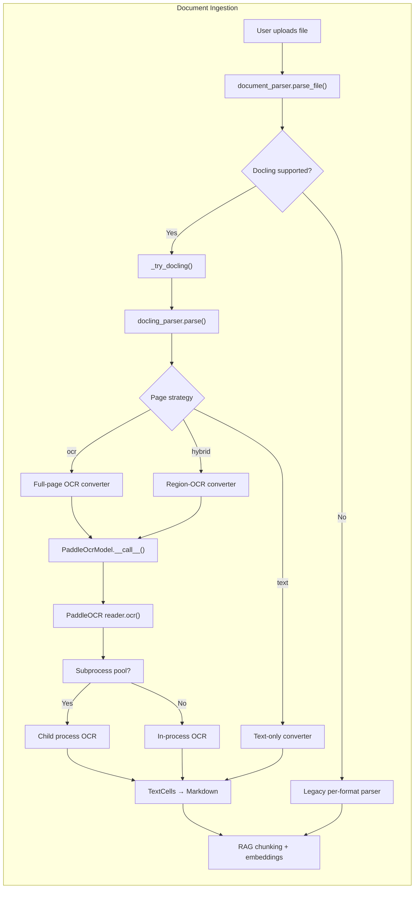
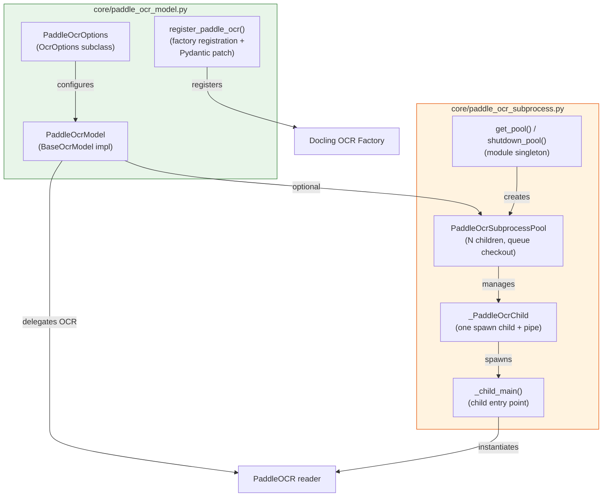
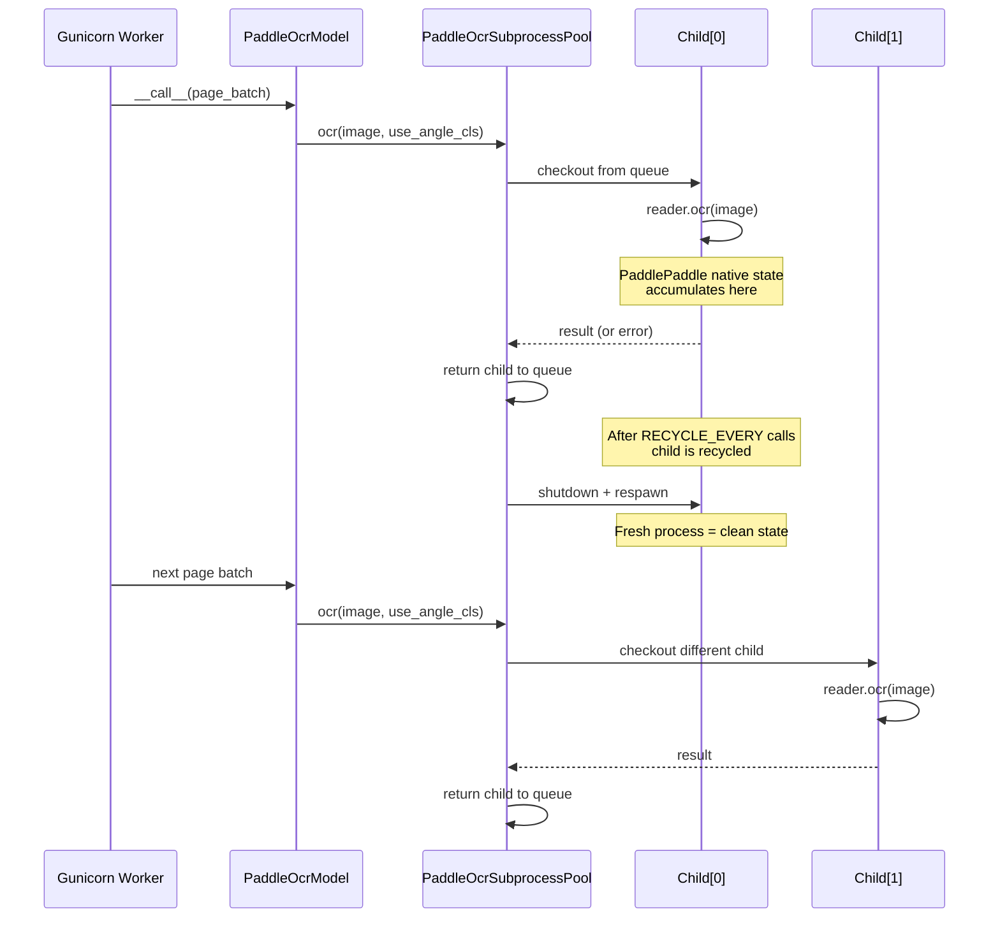
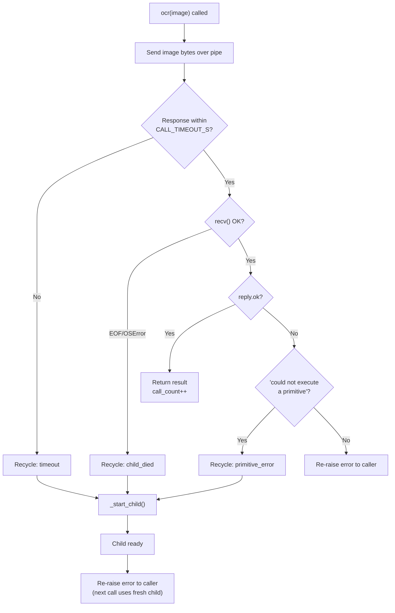
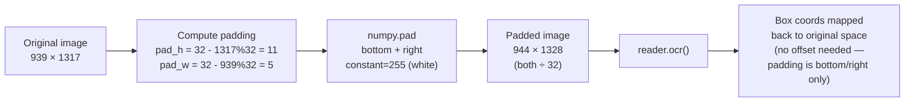
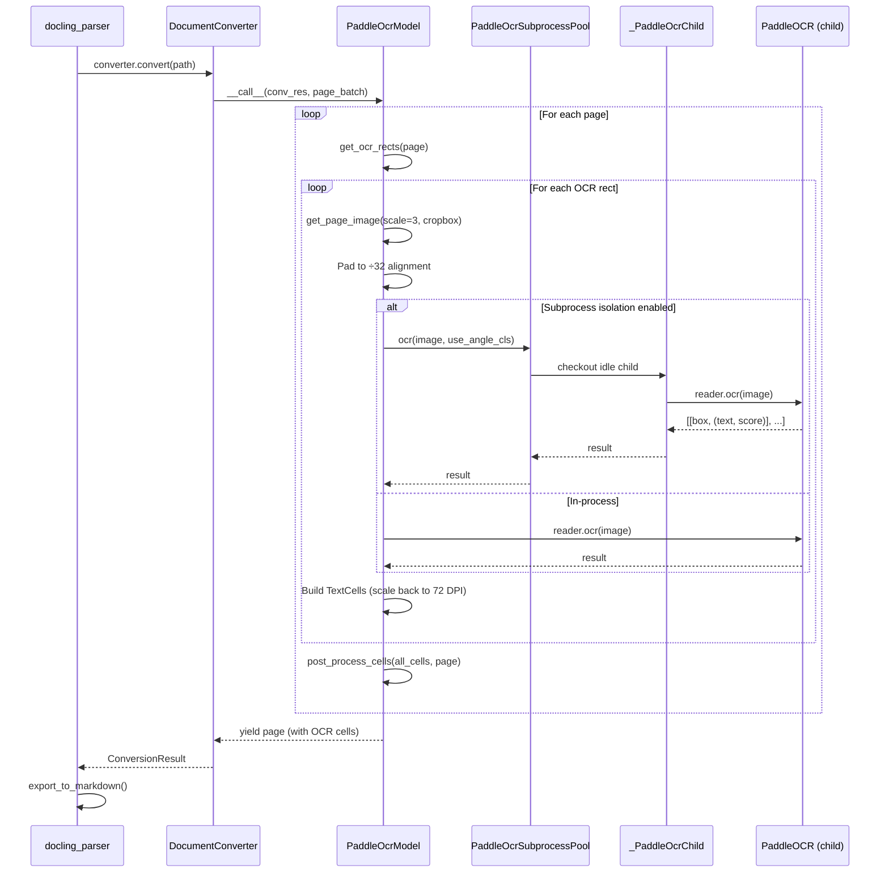

# Document Processing — PaddleOCR Backend

> **Module ID:** `document_processing_paddle_ocr`
> **Source files:** `core/paddle_ocr_model.py`, `core/paddle_ocr_subprocess.py`
> **Parent module:** [document_processing](document_processing.md)

---

## 1. Introduction

The `document_processing_paddle_ocr` module provides the OCR (Optical Character
Recognition) engine used by the platform's document ingestion pipeline. It
implements a [Docling](https://github.com/docling-project/docling) `BaseOcrModel`
backend that delegates to the [PaddleOCR](https://github.com/PaddlePaddle/PaddleOCR)
package (PP-OCRv4 models), and ships a subprocess-isolation layer that makes
PaddleOCR safe to run inside long-lived server processes.

### What it does

| Capability | Detail |
|---|---|
| **OCR engine** | PaddleOCR PP-OCRv4 (detection + recognition + optional angle classification) |
| **Docling integration** | Registered as a custom `BaseOcrModel` via Docling's OCR factory (`kind="paddleocr"`) |
| **Deployment modes** | Online (auto-download from PaddleOCR CDN) or air-gapped (local model directories) |
| **Process isolation** | Optional multi-child subprocess pool that bounds PaddlePaddle native-state corruption |
| **Shape normalization** | Automatic 32-pixel alignment padding to work around a PaddlePaddle 2.6.x kernel-selection bug |
| **Pydantic patch** | Runtime widening of `PdfPipelineOptions.ocr_options` so subclass instances survive revalidation |

### Why it exists

PaddlePaddle 2.6.x on Linux CPU accumulates corrupt state inside its native
inference session (OneDNN primitive cache + OMP thread pool) after a variable
number of OCR calls within the same process. Once corrupted, subsequent calls
raise `RuntimeError: could not execute a primitive` on inputs that would have
succeeded moments earlier. This module provides three layers of defense:

1. **Shape normalization** — pad image dimensions to multiples of 32 so the
   broken internal-resize code path is never hit.
2. **Subprocess isolation** — run every `reader.ocr()` call inside a
   throwaway child process so native state cannot accumulate across calls.
3. **Conservative threading knobs** — set `OMP_NUM_THREADS=1`,
   `FLAGS_use_mkldnn=false`, etc. *inside* the child to reduce crash rate.

---

## 2. Architecture

### 2.1 Module position in the document pipeline



The PaddleOCR backend is invoked **only** when a page is classified as
`"ocr"` (scanned, little/no native text) or `"hybrid"` (native text plus
significant embedded images). Pure-text pages never pay the PaddleOCR
warm-up cost. See [document_processing_docling_parser](document_processing_docling_parser.md)
for the page-strategy classification logic.

### 2.2 Component overview



### 2.3 Key classes and functions

#### `PaddleOcrOptions` (OcrOptions subclass)

Configuration dataclass for the PaddleOCR engine. Key fields:

| Field | Default | Purpose |
|---|---|---|
| `kind` | `"paddleocr"` | Discriminator for Docling's OCR factory |
| `lang` | `["en"]` | Language code(s) |
| `use_gpu` | `False` | GPU inference toggle (requires `paddlepaddle-gpu`) |
| `use_angle_cls` | `True` | Text-direction classification (rotated text) |
| `confidence_threshold` | `0.5` | Minimum recognition confidence to keep a cell |
| `enable_mkldnn` | `False` | Intel OneDNN backend — **disabled by default** due to a known paddlepaddle 2.6.x bug |
| `det_model_dir` / `rec_model_dir` / `cls_model_dir` | `None` | Local model paths for air-gapped deployment |

#### `PaddleOcrModel` (BaseOcrModel implementation)

The Docling OCR backend. Its `__call__` method processes a batch of pages:

1. **`get_ocr_rects(page)`** — find bitmap regions needing OCR
2. **`get_page_image(scale=3, cropbox=rect)`** — rasterize each region at 216 DPI
3. **Shape normalization** — pad height/width to the next multiple of 32
4. **`reader.ocr(im)`** — run PaddleOCR (in-process or via subprocess pool)
5. **Build `TextCell` list** — map polygon boxes back to page coordinates
6. **`post_process_cells()`** — merge OCR cells with existing selectable-text cells

#### `register_paddle_ocr()`

Idempotent factory registration that:
- Registers `PaddleOcrModel` into Docling's OCR factory with
  `allow_external_plugins=True`
- **Patches** `PdfPipelineOptions.ocr_options` field annotation to a
  `Union[PaddleOcrOptions, EasyOcrOptions, ...]` so Pydantic v2 preserves
  `PaddleOcrOptions` instances instead of silently downcasting to the base
  `OcrOptions` class
- Verifies the patch with a round-trip probe

#### Subprocess isolation components

| Component | Role |
|---|---|
| `_child_main(conn, options)` | Entry point inside the spawned child; sets fork-safety env vars, instantiates one `PaddleOCR` reader, services `ocr`/`shutdown` requests over a pipe |
| `_PaddleOcrChild` | Parent-side wrapper for one child process + pipe; serializes requests with an `RLock`, handles timeouts, recycles on crash |
| `PaddleOcrSubprocessPool` | Pool of N independent children with a `queue.Queue` checkout model for genuine N-way parallelism |
| `get_pool(options)` | Module-level singleton accessor (double-checked locking) |
| `shutdown_pool()` | Clean teardown of all children |
| `is_enabled()` | Returns `True` when `PADDLE_OCR_ISOLATE=1` |

---

## 3. Subprocess Isolation Design

### 3.1 Why subprocess isolation is needed



### 3.2 Tunables

All tunables are environment-variable configurable:

| Env var | Default | Purpose |
|---|---|---|
| `PADDLE_OCR_ISOLATE` | `0` | Master switch for subprocess isolation |
| `PADDLE_OCR_ISOLATE_RECYCLE` | `20` | Recycle child after N successful calls |
| `PADDLE_OCR_ISOLATE_TIMEOUT` | `60` | Hard timeout per `ocr()` call (seconds) |
| `PADDLE_OCR_ISOLATE_STARTUP` | `45` | Wait for child readiness (seconds) |
| `PADDLE_OCR_POOL_SIZE` | `3` | Number of independent child processes (1–8) |
| `PADDLEOCR_MODELS_PATH` | unset | Local model directory for air-gapped deployment |

> **Note:** `docling_parser._build_converter()` sets `PADDLE_OCR_ISOLATE=1`
> automatically before registering `PaddleOcrModel`, so production deployments
> do not need to set the env var manually.

### 3.3 Thread safety

Each `_PaddleOcrChild` serializes its request/response cycle with a
`threading.RLock`. This is critical because sending a multi-megabyte page
image over a `multiprocessing.Pipe` is not atomic — it involves ~207
sequential 64 KB `write()` syscalls. Without the lock, a concurrent
`_recycle()` call can close the pipe mid-transfer, corrupting every
in-flight caller and triggering a self-sustaining recycle storm.

The `PaddleOcrSubprocessPool` additionally hands out one child per caller
via a `queue.Queue`, so in normal operation the per-child lock is
uncontended — it is the correctness backstop, not the throughput mechanism.

### 3.4 Error handling and recycling



On any failure (timeout, child death, PaddlePaddle crash), the child is
recycled *before* the error is re-raised to the caller. This ensures the
next OCR call starts on clean state. The caller (Docling's per-page
fallback path) handles the re-raised exception gracefully.

---

## 4. Shape Normalization

PaddleOCR's DB detector uses a ResNet backbone with 5 downsampling stages,
so it internally resizes inputs to `/32`-aligned tensors. On paddlepaddle
2.6.x CPU, that internal resize trips a kernel-selection bug on certain
non-aligned shapes (observed: 939×1317, 789×1107 — neither dimension
divisible by 32), raising `could not execute a primitive` from
`predict_det`.

The fix is applied at the `PaddleOcrModel` layer: before calling
`reader.ocr()`, the image is padded with white pixels (value 255) on the
bottom and right edges so both height and width become multiples of 32.



**Why bottom/right padding only:**
1. Every original pixel keeps its exact `(x, y)` coordinate
2. Existing coordinate-remapping math stays correct
3. The detector sees no new text-shaped features in the added margin
4. The recognizer only sees crops from the original pixel region

---

## 5. Pydantic Field-Annotation Patch

Docling's `PdfPipelineOptions.ocr_options` field is annotated as the base
`OcrOptions` class (not a discriminated union). Pydantic v2 revalidates any
instance assigned to that field *as* `OcrOptions`, which silently strips
every subclass field — including the `kind` discriminator. This causes
Docling's pipeline to fall back to its default OCR engine at
`converter.convert()` time, even though `PaddleOcrOptions` was constructed
correctly.

`register_paddle_ocr()` patches the field annotation at runtime:

```python
new_ann = Union[
    PaddleOcrOptions,      # first — pydantic prefers it when kind matches
    EasyOcrOptions,
    TesseractCliOcrOptions,
    TesseractOcrOptions,
    RapidOcrOptions,
    OcrMacOptions,
    OcrAutoOptions,
    KserveV2OcrOptions,
    OcrOptions,            # base — fallback
]
_field.annotation = new_ann
PdfPipelineOptions.model_rebuild(force=True)
```

A round-trip probe verifies that `PdfPipelineOptions(ocr_options=PaddleOcrOptions())`
preserves the subclass instance. The patch is idempotent — it skips if
`PaddleOcrOptions` is already in the annotation's `__args__`.

---

## 6. Data Flow

### 6.1 End-to-end OCR call



### 6.2 Coordinate mapping

PaddleOCR returns 4-point polygon boxes in the padded image's pixel space
(216 DPI). `PaddleOcrModel` maps them back to page coordinates (72 DPI):

```
page_x = box_x / scale + ocr_rect.l
page_y = box_y / scale + ocr_rect.t
```

Where `scale = 3` (216 ÷ 72) and `ocr_rect.l/t` is the top-left corner of
the OCR region within the page. Only corners `[0]` (top-left) and `[2]`
(bottom-right) of the 4-point polygon are used to construct an
axis-aligned `BoundingRectangle`.

---

## 7. Integration Points

### 7.1 Upstream: Docling parser

The PaddleOCR backend is wired into Docling by
[`docling_parser._build_converter()`](document_processing_docling_parser.md):

```python
os.environ["PADDLE_OCR_ISOLATE"] = "1"
register_paddle_ocr()
ocr_options = PaddleOcrOptions(
    lang=["en"], use_gpu=False, use_angle_cls=False,
    force_full_page_ocr=...,  # True for "ocr" mode, False for "region" mode
    det_model_dir=..., rec_model_dir=..., cls_model_dir=...,
)
pdf_opts = PdfPipelineOptions(
    ocr_options=ocr_options,
    allow_external_plugins=True,  # REQUIRED for external plugin acceptance
    ...
)
```

Two OCR modes are supported:

| Mode | `force_full_page_ocr` | Use case |
|---|---|---|
| `"full"` | `True` | Genuinely scanned pages — entire page rasterized and OCR'd, native text discarded |
| `"region"` | `False` | Mixed pages with embedded images — only image rectangles OCR'd, native text preserved |

### 7.2 Downstream: RAG pipeline

OCR-extracted text flows into the standard document processing pipeline:

```
PaddleOcrModel → TextCells → DoclingDocument → Markdown → chunking → embeddings
```

See [document_processing](document_processing.md) for the full pipeline.

### 7.3 Sibling modules

| Module | Relationship |
|---|---|
| [document_processing_docling_parser](document_processing_docling_parser.md) | Parent — calls `register_paddle_ocr()` and constructs `PaddleOcrOptions` |
| [document_processing_legacy_parser](document_processing_legacy_parser.md) | Fallback — used when Docling/PaddleOCR is unavailable or fails |
| [core_infrastructure](../infrastructure/core_infrastructure.md) | Provides `core.logger` used for structured logging |

---

## 8. Configuration Reference

### 8.1 Environment variables

| Variable | Default | Description |
|---|---|---|
| `PADDLE_OCR_ISOLATE` | `0` | Enable subprocess isolation (`1` = on). Auto-set by `docling_parser`. |
| `PADDLE_OCR_POOL_SIZE` | `3` | Number of OCR child processes (1–8). Each uses ~500 MB RSS. |
| `PADDLE_OCR_ISOLATE_RECYCLE` | `20` | Recycle child after N successful calls |
| `PADDLE_OCR_ISOLATE_TIMEOUT` | `60` | Per-call hard timeout (seconds) |
| `PADDLE_OCR_ISOLATE_STARTUP` | `45` | Child readiness wait (seconds) |
| `PADDLEOCR_MODELS_PATH` | unset | Directory containing `det/`, `rec/`, `cls/` subdirs for air-gapped use |
| `DOCLING_ARTIFACTS_PATH` | unset | Docling layout/table model directory (see [document_processing_docling_parser](document_processing_docling_parser.md)) |

### 8.2 Fork-safety knobs (set inside child only)

These are applied *inside* `_child_main()` before importing `paddleocr`,
so they do not affect the parent gunicorn worker's threading:

| Variable | Value | Purpose |
|---|---|---|
| `KMP_INIT_AT_FORK` | `FALSE` | Prevent Intel runtime fork issues |
| `KMP_AFFINITY` | `disabled` | Disable thread pinning |
| `OMP_NUM_THREADS` | `1` | Single-threaded OpenMP |
| `MKL_NUM_THREADS` | `1` | Single-threaded MKL |
| `MKL_THREADING_LAYER` | `SEQUENTIAL` | Sequential MKL backend |
| `FLAGS_use_mkldnn` | `false` | Disable OneDNN (avoids primitive-cache bug) |

### 8.3 Resource sizing

| Pool size | RSS | Throughput | Notes |
|---|---|---|---|
| 1 | ~500 MB | Baseline | No parallelism (previous behavior) |
| 3 (default) | ~1.5 GB | ~3× | Recommended for most deployments |
| 4 | ~2.0 GB | ~4× | For high-volume ingestion servers |

> Keep pool size ≤ physical cores available to the service and within its
> memory budget.

---

## 9. Operational Notes

### 9.1 Logging

All components use `core.logger` (the platform's structlog-wired logger).
Key log prefixes for grep-ability:

| Prefix | Source | Meaning |
|---|---|---|
| `[PaddleOCR]` | `PaddleOcrModel` | Per-page OCR processing |
| `[PaddleOCR][SUBPROC]` | `_PaddleOcrChild` | Child lifecycle (spawn, recycle, ready) |
| `[PaddleOCR][POOL]` | `PaddleOcrSubprocessPool` | Pool initialization and shutdown |
| `PaddleOcrModel:` | `PaddleOcrModel.__init__` | Reader initialization |
| `[PaddleOCR] Pydantic patch` | `register_paddle_ocr` | Field-annotation patching |

### 9.2 Failure modes and recovery

| Failure | Detection | Recovery |
|---|---|---|
| Child crash (SIGSEGV) | `recv()` raises `EOFError` | Recycle child, re-raise to caller |
| "could not execute a primitive" | Error string match in reply | Recycle child, re-raise to caller |
| Call timeout | `conn.poll(timeout)` returns `False` | Kill + respawn child, re-raise |
| Pipe broken mid-send | `BrokenPipeError` / `TypeError` | Recycle child, re-raise |
| Child not alive at call time | `proc.is_alive()` check | Auto-respawn before sending |
| PaddleOCR import failure | `ImportError` in `__init__` | Propagated to caller (Docling falls back) |
| Pydantic patch failure | Exception in `register_paddle_ocr` | Logged as error; OCR falls back to default engine |

### 9.3 Graceful shutdown

`shutdown_pool()` is safe to call multiple times. It sends a `shutdown`
message to each child, waits up to 3 seconds, then force-kills any
remaining process. The queue is drained to prevent stale references from
being handed out. Children are daemon processes, so they die with the
parent on gunicorn reload — no zombies.

---

## 10. Cross-References

| Topic | Document |
|---|---|
| Docling parser (page strategy, converter construction) | [document_processing_docling_parser](document_processing_docling_parser.md) |
| Legacy document parser (fallback path) | [document_processing_legacy_parser](document_processing_legacy_parser.md) |
| Document processing overview | [document_processing](document_processing.md) |
| Core infrastructure (logger, config) | [core_infrastructure](../infrastructure/core_infrastructure.md) |
| ABStudio OCR cache and pipeline | [core_ocr](core_ocr.md) |
