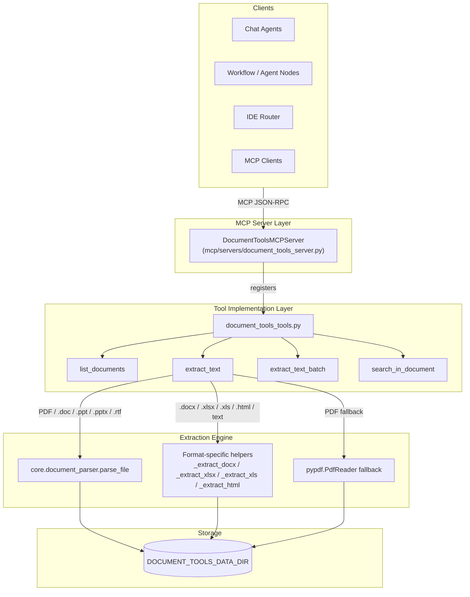
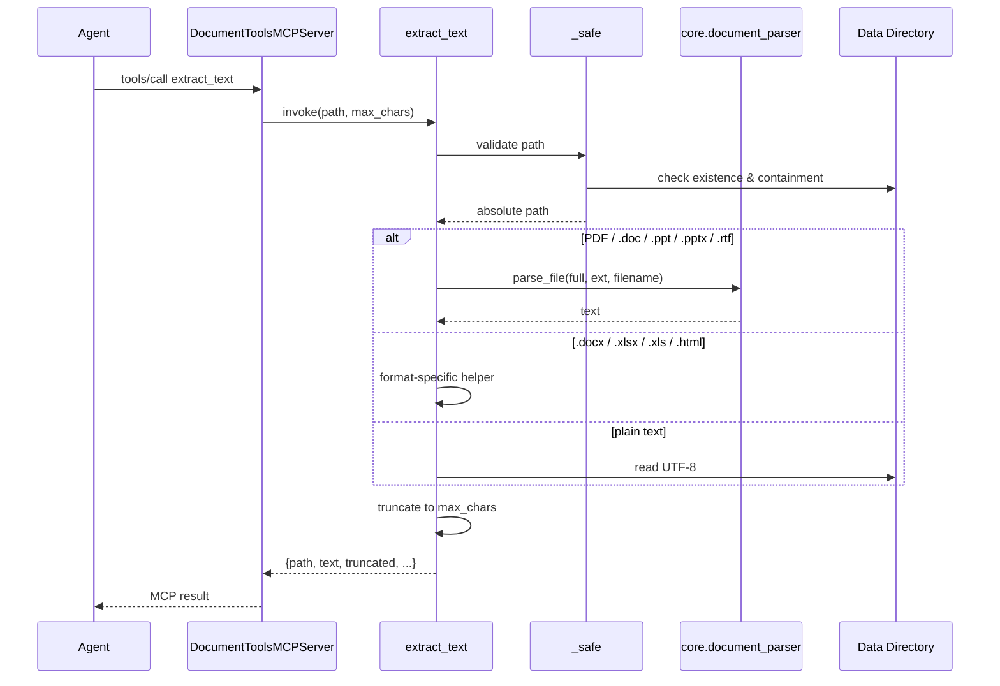
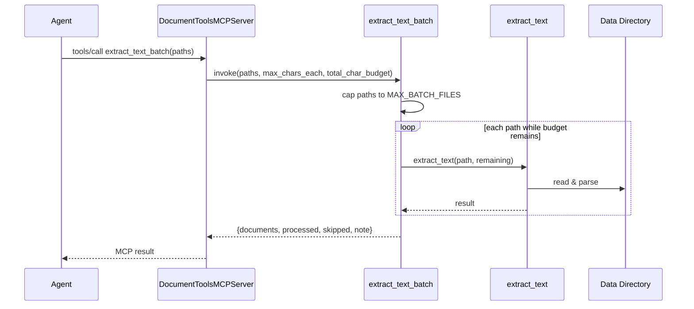
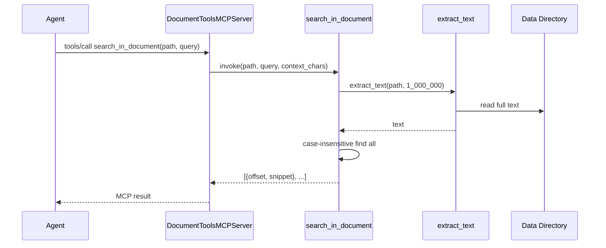

# document_tools

## Introduction

`document_tools` is a lightweight, file-system-based document extraction toolset exposed as [MCP](https://modelcontextprotocol.io/) tools. It lives in the `shared_integrations` layer and provides agents with read-only access to plain-text content from a configured local document root. The module deliberately avoids summarisation or reasoning — it only extracts and returns raw text, leaving interpretation to the calling agent.

The toolset is designed for high-throughput agent workflows: it supports single-document reads, batched reads across hundreds of files, and case-insensitive search with surrounding context. It is the default implementation behind the `document_tools` MCP server and is consumed by chat agents, the IDE router, and workflow/agent nodes that need to read local documents.

---

## Architecture Overview

The module is intentionally thin: the MCP server wraps plain Python functions, and those functions delegate complex parsing to the shared [`core.document_parser`](../core_document_parser.md). This avoids duplicating parsing logic across the codebase and ensures that agent reads produce the same text as the knowledge-base ingestion pipeline.

---

## Core Components

### `DocumentToolsMCPServer`

Located in [`mcp/servers/document_tools_server.py`](../mcp/mcp_servers.md), this class extends [`BaseMCPServer`](../mcp/mcp_servers.md) and registers four tools from `document_tools_tools.py`:

- `list_documents`
- `extract_text`
- `extract_text_batch`
- `search_in_document`

It handles JSON-RPC dispatch, input/output compliance scanning, and audit logging through the shared MCP base class. See the [MCP server documentation](../mcp/mcp_servers.md) for transport details (stdio, SSE, streamable HTTP).

### `list_documents(subfolder: str = "") -> List[dict]`

Recursively lists all supported documents under the configured document root. Optionally restricts the scan to a subfolder. Each returned item contains the relative path and file size in bytes.

**Supported extensions:** `.pdf`, `.md`, `.txt`, `.csv`, `.eml`, `.json`, `.log`, `.html`, `.htm`, `.docx`, `.xlsx`, `.xls`, `.doc`, `.ppt`, `.pptx`, `.rtf`

### `extract_text(path: str, max_chars: int = 20000) -> dict`

Extracts plain text from a single document path (relative to `DOCUMENT_TOOLS_DATA_DIR`). Returns a dictionary with:

| Field | Description |
|-------|-------------|
| `path` | The requested relative path |
| `text` | Extracted text, truncated to `max_chars` |
| `truncated` | `true` if the full text exceeded `max_chars` |
| `pages` | Total PDF pages (PDF only) |
| `pages_extracted` | Pages actually read (PDF only, capped by `DOCUMENT_TOOLS_MAX_PAGES`) |

Extraction strategy by format:

| Format | Primary extractor | Fallback |
|--------|-------------------|----------|
| PDF, `.doc`, `.ppt`, `.pptx`, `.rtf` | [`core.document_parser.parse_file`](../core_document_parser.md) | `pypdf.PdfReader` for PDF only |
| `.docx` | `python-docx` paragraphs + tables | — |
| `.xlsx` | `openpyxl` | — |
| `.xls` | `xlrd` | `pandas` with `xlrd` engine |
| `.html`, `.htm` | `BeautifulSoup` visible text | regex strip |
| `.md`, `.txt`, `.csv`, `.eml`, `.json`, `.log` | UTF-8 read | — |

### `extract_text_batch(paths: List[str], max_chars_each: int = 4000, total_char_budget: int = 120000) -> dict`

Reads many documents in a single call to avoid exhausting agent turn budgets. Enforces two caps:

- **File-count cap:** `DOCUMENT_TOOLS_MAX_BATCH_FILES` (default `200`). Excess paths are reported in `skipped`.
- **Character budget cap:** `total_char_budget`. Once reached, remaining paths are skipped.

Returns:

| Field | Description |
|-------|-------------|
| `documents` | List of `{path, text, truncated, error?}` |
| `processed` | Number of documents processed |
| `skipped` | Paths that exceeded batch or budget limits |
| `total_requested` | Original number of paths requested |
| `note` | Human-readable skip explanation |

Per-file errors are surfaced inline rather than failing the entire batch.

### `search_in_document(path: str, query: str, context_chars: int = 300) -> List[dict]`

Performs a case-insensitive substring search inside a document and returns up to 20 hits with surrounding context. Useful for agents that need to locate specific clauses, identifiers, or values without reading the entire file.

### Format-specific helpers

These private functions are used when the shared parser is not selected or unavailable:

- `_extract_docx(full: str) -> str` — paragraph and table text via `python-docx`.
- `_extract_xlsx(full: str) -> str` — sheet-by-sheet tab-separated rows via `openpyxl`.
- `_extract_xls(full: str) -> str` — legacy Excel via `xlrd`, falling back to `pandas`.
- `_extract_html(full: str) -> str` — visible text via `BeautifulSoup` or regex.

---

## Data Flow

### Single-document extraction

### Batch extraction

### Search flow

---

## Configuration

| Environment Variable | Default | Description |
|----------------------|---------|-------------|
| `DOCUMENT_TOOLS_DATA_DIR` | `/data/documents` | Root directory containing readable documents |
| `DOCUMENT_TOOLS_MAX_PAGES` | `50` | Maximum PDF pages to extract per single-document call |
| `DOCUMENT_TOOLS_MAX_BATCH_FILES` | `200` | Maximum files processed in one `extract_text_batch` call |

All paths passed to the tools are resolved relative to `DOCUMENT_TOOLS_DATA_DIR` and validated to prevent directory traversal.

---

## Security

- **Path containment:** The `_safe(path)` helper normalises the requested path and rejects any path that resolves outside `DOCUMENT_TOOLS_DATA_DIR`.
- **Read-only:** The toolset performs no writes, deletes, or modifications.
- **Compliance gating:** The MCP server base class runs input and output through the shared compliance scanner before returning results.
- **Audit logging:** Tool calls marked for PCI audit are persisted via the base class audit logger.

---

## Error Handling

- **Path escape:** raises `ValueError`.
- **Missing file:** raises `FileNotFoundError`.
- **Missing optional dependency:** raises `RuntimeError` with a clear install hint (e.g. `python-docx`, `openpyxl`, `xlrd`).
- **Shared parser failure:** For PDFs, falls back to `pypdf.PdfReader`. For other core-parser formats (`.doc`, `.ppt`, `.pptx`, `.rtf`), the error is propagated because no local fallback exists.
- **Batch failures:** Individual file errors are captured in the `error` field of the corresponding document; the rest of the batch continues.

---

## Dependencies

| Dependency | Role | Documentation |
|------------|------|---------------|
| `core.document_parser` | High-quality parsing for PDF, Office, RTF, HTML, images | [core_document_parser.md](../core_document_parser.md) |
| `mcp/servers/base.py` | MCP server base class, transport, compliance, audit | [mcp_servers.md](../mcp/mcp_servers.md) |
| `mcp/servers/document_tools_server.py` | MCP server registration for these tools | [mcp_servers.md](../mcp/mcp_servers.md) |
| `pypdf` | PDF fallback reader | — |
| `python-docx` | `.docx` extraction | — |
| `openpyxl` | `.xlsx` extraction | — |
| `xlrd` / `pandas` | Legacy `.xls` extraction | — |
| `beautifulsoup4` | HTML visible-text extraction | — |

---

## Integration Points

- **MCP registration:** `DocumentToolsMCPServer` registers the four tools during server initialisation. The server is typically exposed through the shared [MCP registry](../mcp/mcp_system.md).
- **API documents layer:** The backend API for document uploads and agent-runner attachments uses the same [`core.document_parser`](../core_document_parser.md) pipeline, ensuring consistency between interactive uploads and agent reads. See [api_documents.md](../api/api_documents.md).
- **Knowledge base ingestion:** Documents approved for the knowledge base are parsed with the same shared parser, so agent-extracted text and RAG chunks originate from identical extraction logic.

---

## When to Use

Use `document_tools` when an agent needs to:

- Browse a local corpus of files (`list_documents`).
- Read one or many files as plain text (`extract_text`, `extract_text_batch`).
- Locate specific terms inside a file (`search_in_document`).

For document *generation* (DOCX, PPTX, XLSX), use [`doc_generator`](doc_generator.md). For knowledge-base upload and approval workflows, use the [documents API](../api/api_documents.md) and [docs router](../api/docs_router.md).
