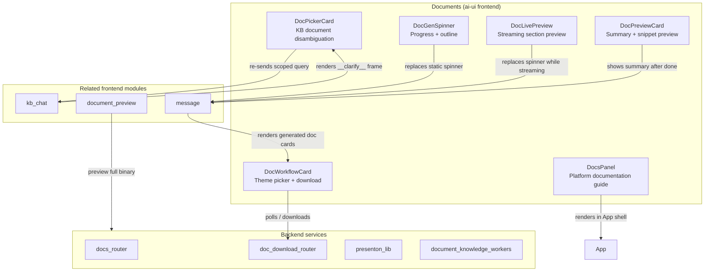
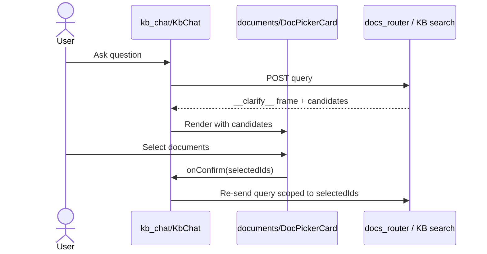
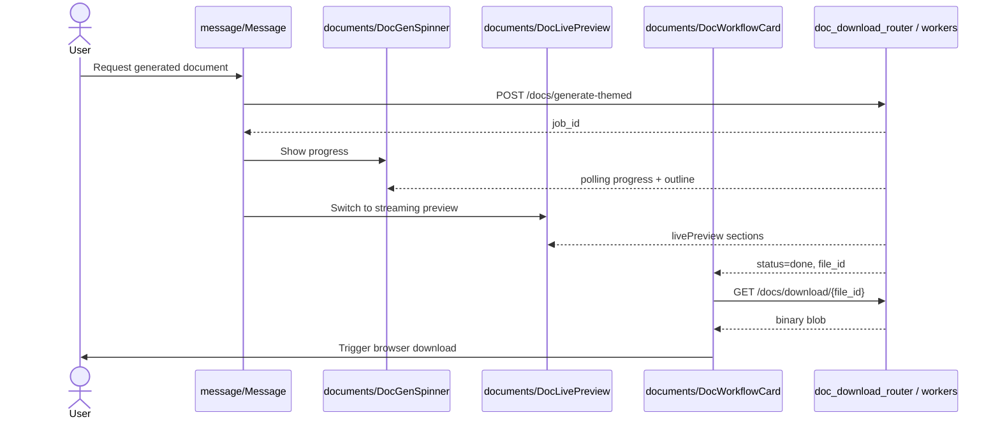

# Documents Module

The **Documents** module is a React-based UI layer in the `ai-ui` frontend that surfaces document-related experiences across the AiNxt platform. It covers three distinct responsibilities:

1. **In-app platform documentation** — a navigable user guide that explains every major AiNxt capability (Chat, Agents, Workflows, SDLC, Monitoring, etc.) to end users.
2. **Knowledge-base document disambiguation** — interactive cards inside chat threads that let users pick which uploaded documents should scope a RAG query.
3. **Generated document UX** — live progress, previews, theme selection, and download flows for AI-generated documents such as PPTX presentations, DOCX reports, and PDFs.

The module is intentionally frontend-only; the actual parsing, generation, and storage of documents is handled by backend services and workers (see [api_documents](../api/api_documents.md), [doc_download_router](../api/doc_download_router.md), [document_knowledge_workers](../workers/document_knowledge_workers.md), and [presenton_lib](../reference/presenton_lib.md)). This module renders the user-facing surfaces that call those backends.

---

## Architecture Overview

### Component Responsibilities

| Component | Responsibility |
|-----------|----------------|
| `DocsPanel` | Left-nav documentation browser with module overviews, use cases, and step-by-step guides. |
| `DocPickerCard` | Inline chat card for selecting one or many KB documents when the backend returns a `__clarify__` frame. |
| `DocPreviewCard` | Collapsible summary card showing bullets, intro, and section snippets for a generated document. |
| `DocLivePreview` | Claude-artifacts-style live preview that materializes document sections as the LLM streams them. |
| `DocGenSpinner` | Buddy-style progress indicator with step counter, elapsed time, and live section outline. |
| `DocWorkflowCard` | Theme picker for PPTX generation; handles job submission, polling, and download. |

---

## Sub-modules

The Documents module is split into four sub-modules based on user journey and rendering context:

- **[documents_guide](documents_guide.md)** — `DocsPanel`, the in-app platform documentation browser.
- **[documents_chat](../chat/documents_chat.md)** — `DocPickerCard`, document disambiguation inside chat threads.
- **[documents_preview](documents_preview.md)** — `DocPreviewCard` and `DocLivePreview`, summary and streaming preview surfaces.
- **[documents_generation](documents_generation.md)** — `DocGenSpinner` and `DocWorkflowCard`, progress and theme-selection UI for generated documents.

---

## Data Flow

### 1. Platform Documentation

`DocsPanel` is a self-contained static guide. It keeps a `MODULES` array in memory and renders a two-pane layout: a left navigation rail and a detail pane with overview cards, department-specific use cases, and optional step-by-step instructions. No backend calls are made.

### 2. Document Disambiguation in Chat

When a user asks a question in `KbChat` and the backend finds multiple matching KB documents, it emits a `__clarify__` SSE frame. `KbChat` renders a `DocPickerCard` with all candidate documents. The user selects one or more documents (or all), and the original question is re-sent scoped to the selected `doc_id`s.

### 3. Generated Document Flow

A generated document (PPTX, DOCX, PDF, etc.) is produced asynchronously. The frontend first shows a `DocGenSpinner` with live progress and section outline. Once structured content begins streaming, `DocLivePreview` takes over and renders sections as they arrive. After generation completes, `DocPreviewCard` may show a summary, and `DocWorkflowCard` offers theme selection and download for PPTX outputs.

---

## Dependencies

### Internal (ai-ui)

| Dependency | Purpose |
|------------|---------|
| `config.js` (`authFetch`) | Authenticated HTTP requests for polling job status and downloading files. |
| `BrandMark` | Animated brand logo used in `DocGenSpinner`. |
| `DocPreviewCard` | Reused inside `DocWorkflowCard/InlineDownloadButton` to show post-generation summary. |
| `KbChat` / `Message` | Host components that render document cards inside chat threads. |

### External

| Dependency | Purpose |
|------------|---------|
| `react` / `react-dom` | Component state and effects. |
| `lucide-react` | Consistent iconography. |
| `react-markdown` + `remark-gfm` | Markdown rendering in `DocLivePreview`. |

### Backend

| Service | Purpose |
|---------|---------|
| `doc_download_router` | Async document generation, status polling, and download endpoints. |
| `docs_router` | KB document listing, upload, approval, and namespace management. |
| `presenton_lib` | PPTX layout registry and streaming (used by PPTX generation backend). |
| `document_knowledge_workers` | Background workers that build, convert, and index documents. |

---

## Related Modules

- [kb_chat](../knowledge/kb_chat.md) — hosts `DocPickerCard` and document-scoped chat.
- [message](../chat/message.md) — renders generated document cards and download buttons.
- [document_preview](document_preview.md) — full binary preview modal for documents.
- [api_documents](../api/api_documents.md) — backend attachment and image-asset extraction for agents.
- [doc_download_router](../api/doc_download_router.md) — backend async document generation API.
- [presenton_lib](../reference/presenton_lib.md) — PPTX layout and streaming library.
- [document_knowledge_workers](../workers/document_knowledge_workers.md) — background document processing workers.
