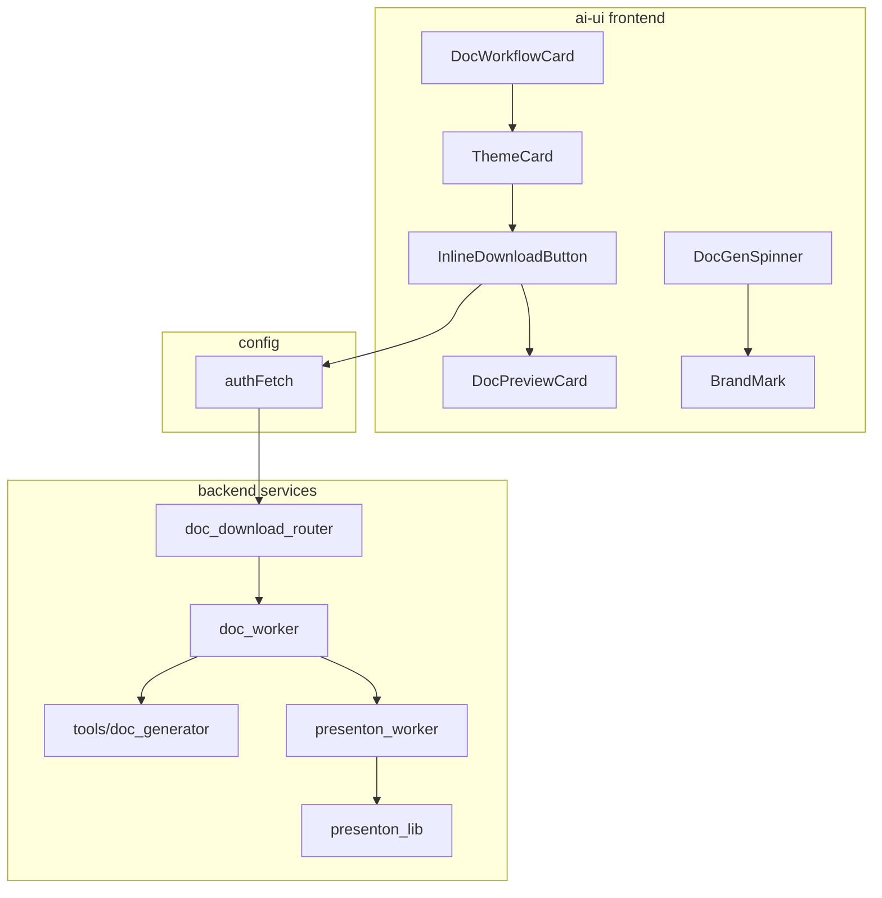
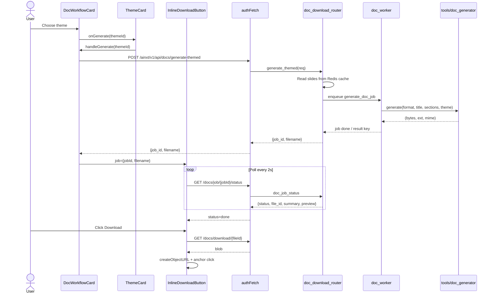
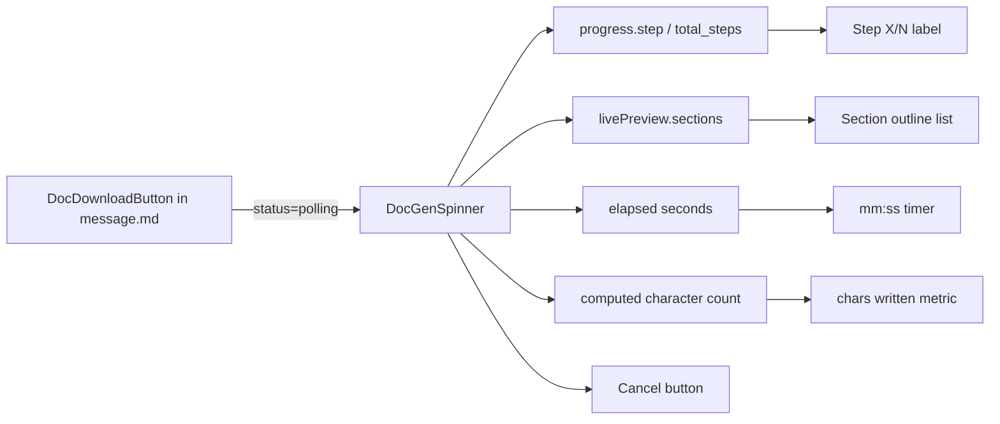

# documents_generation

The `documents_generation` module provides the **live, interactive UI layer** for generating documents and presentations in the `ai-ui` frontend. It turns the backend's asynchronous document-generation jobs into a visible, cancellable, and theme-aware user experience.

The module is intentionally small and focused: it does not generate documents itself, but renders progress, surfaces live previews, lets users pick visual themes for slide decks, and coordinates polling/download once a job finishes. All heavy lifting is delegated to backend workers and related document/presentation subsystems.

---

## Core Functionality

| Capability | Description |
|------------|-------------|
| **Live progress feedback** | `DocGenSpinner` shows step counters, elapsed time, running character counts, and a live section outline while a document is being drafted. |
| **Theme-aware PPTX generation** | `DocWorkflowCard` renders visual theme cards and triggers generation for a selected theme using pre-computed slide content. |
| **Polling download** | `InlineDownloadButton` polls a backend job status endpoint and exposes a download button (plus summary/preview) when the job completes. |
| **Cancel control** | `DocGenSpinner` exposes a cancel action that the parent can wire to the backend's job-cancel endpoint. |

---

## Architecture



### Component Responsibilities

- **`DocWorkflowCard`** — Container that lists available PPTX themes and tracks per-theme generation jobs.
- **`ThemeCard`** — Renders a single theme preview, a Generate button, and swaps to `InlineDownloadButton` once a job is started.
- **`InlineDownloadButton`** — Polls `/ainxt/v1/api/docs/job/{jobId}/status` every 2 seconds, then downloads the file via `/ainxt/v1/api/docs/download/{fileId}`.
- **`DocGenSpinner`** — Pure presentational component for in-progress document generation; consumed by `DocDownloadButton` in [message.md].

---

## Component Interactions



---

## Data Flow

### Themed PPTX Generation Flow

```mermaid
flowchart LR
    A[User selects theme] --> B[DocWorkflowCard.handleGenerate]
    B --> C[POST /docs/generate-themed]
    C --> D[doc_download_router.generate_themed]
    D --> E[Read doc:slides_cache:{key} from Redis]
    E --> F[Enqueue workers.doc_worker.generate_doc_job]
    F --> G[doc_worker calls tools.doc_generator.generate]
    G --> H[Generate PPTX with selected theme]
    H --> I[Store result in Redis / Postgres]
    I --> J[InlineDownloadButton polls status]
    J --> K[Render DocPreviewCard + Download]
```

### Live Progress Flow



---

## Key Props & Interfaces

### DocGenSpinner

| Prop | Type | Purpose |
|------|------|---------|
| `progress` | `{ step, total_steps, label, detail }` | Backend progress payload. |
| `livePreview` | `{ title, sections:[{heading, content, bullets}], done }` | Section-by-section draft preview. |
| `elapsed` | `number` | Seconds since job started. |
| `format` | `"pdf" \| "docx" \| "pptx" \| ...` | Output format label. |
| `mode` | `"generate" \| "edit"` | Action verb to display. |
| `onCancel` | `() => void` | Cancel callback. |
| `cancelling` | `boolean` | Disables cancel button while request in flight. |

### DocWorkflowCard

| Prop | Type | Purpose |
|------|------|---------|
| `title` | `string` | Presentation title. |
| `fmt` | `string` | Output format (typically `"pptx"`). |
| `filename` | `string` | Base filename for download. |
| `slidesKey` | `string` | Redis key for cached slide structure. |
| `nSlides` | `number` | Number of slides (display only). |
| `themes` | `Theme[]` | Available themes from `PPTX_THEMES`. |

### ThemeCard

| Prop | Type | Purpose |
|------|------|---------|
| `theme` | `{ id, name, description }` | Theme metadata. |
| `slidesKey` / `title` / `fmt` / `filename` | — | Passed through to generation request. |
| `onGenerate` | `(themeId) => void` | Triggered when user clicks Generate. |
| `job` | `{ jobId, filename } \| null` | If set, shows `InlineDownloadButton`. |

### InlineDownloadButton

| Prop | Type | Purpose |
|------|------|---------|
| `jobId` | `string` | Backend job id to poll. |
| `filename` | `string` | Suggested download filename. |
| `format` | `string` | Format label (display only). |

---

## Theming

`DocWorkflowCard` hard-codes visual metadata for three PPTX themes that must stay in sync with `PPTX_THEMES` in [doc_generator.md] / [doc_worker.md]:

| Theme ID | Gradient | Accent | Badge |
|----------|----------|--------|-------|
| `dark_executive` | `#060D1A → #003366` | `#FF6600` | orange |
| `light_modern` | `#1A2744 → #F0F4FF` | `#1A73E8` | blue |
| `vibrant_tech` | `#050F1E → #003355` | `#00AACC` | cyan |

The backend `generate_themed` endpoint validates the requested `theme_id` against the same `PPTX_THEMES` constant before enqueuing the job.

---

## Integration with the System

### Upstream Consumers

- **[message.md]** — `DocDownloadButton` is the primary consumer of `DocGenSpinner`. It handles the full document-generation lifecycle (clarify, polling, preview, download, expiry, Canvas edit) and delegates the polling spinner state to `DocGenSpinner`.
- **[documents_preview.md]** — `InlineDownloadButton` renders `DocPreviewCard` when the backend returns a summary or preview.
- **[documents.md]** / **[documents_guide.md]** — The broader Documents panel surfaces generated documents and can launch theme selection.

### Downstream Dependencies

- **[config.md]** — Uses `authFetch` for all authenticated HTTP calls.
- **[doc_download_router.md]** — Backend router exposing `/docs/generate-themed`, `/docs/job/{id}/status`, `/docs/download/{fileId}`, and `/docs/preview/{fileId}/{page}`.
- **[doc_generator.md]** — Core document-generation tool that produces DOCX, PPTX, PDF, XLSX, TXT, MD, and CSV outputs.
- **[doc_worker.md]** — RQ worker that runs `generate_doc_job` and publishes terminal status/results.
- **[presenton_worker.md]** / **[presenton_lib.md]** — For template-based or outline-driven PPTX generation (separate from the themed path).
- **[ppt_wizard.md]** — End-user PPT creation wizard that may feed slide outlines into the same backend pipeline.

---

## Process: Generating a Themed Presentation

```mermaid
flowchart TB
    Start([User opens DocWorkflowCard]) --> ListThemes[Render ThemeCard for each theme]
    ListThemes --> Select[User clicks Generate on a theme]
    Select --> Validate{Already triggered?}
    Validate -->|yes| Ignore[Ignore duplicate click]
    Validate -->|no| Post[POST generate-themed]
    Post --> SetJob[Store jobId in local state]
    SetJob --> ShowIDB[ThemeCard renders InlineDownloadButton]
    ShowIDB --> Poll[Poll /docs/job/{id}/status]
    Poll --> Running{status?}
    Running -->|running| Poll
    Running -->|done| ShowPreview[Show DocPreviewCard + Download]
    Running -->|error| ShowError[Show error message]
    ShowPreview --> Download[User clicks Download]
    Download --> Blob[Fetch blob from /docs/download/{fileId}]
    Blob --> Save[Trigger browser save]
```

---

## Error & Edge-Case Handling

| Scenario | Handling |
|----------|----------|
| Duplicate theme click | `DocWorkflowCard` ignores if `jobs[themeId]` already exists. |
| HTTP error on generate | Logged to console; UI remains on Generate button. |
| Job status error | `InlineDownloadButton` shows `errMsg` in red. |
| Missing slide cache | Backend returns `404`; frontend does not special-case it. |
| File expired/410 on download | Handled by parent `DocDownloadButton` in [message.md] (not by `InlineDownloadButton`). |
| Cancel | `DocGenSpinner` disables the button and calls `onCancel`; parent posts to `/docs/job/{id}/cancel`. |

---

## Notes for Maintainers

- Keep `THEME_META` in `DocWorkflowCard` in sync with `PPTX_THEMES` in the backend ([doc_worker.md] / [doc_generator.md]). Adding a new theme requires updates on both sides.
- `InlineDownloadButton` polls every 2 seconds and does not implement a timeout. Long-running PPTX builds (especially via LibreOffice) rely on this generous polling.
- `DocGenSpinner` is intentionally presentational: it does not fetch data, manage intervals, or know about job ids. All state is supplied by props.
- The live section outline in `DocGenSpinner` only shows the last 8 sections to avoid overflowing the chat message area.
