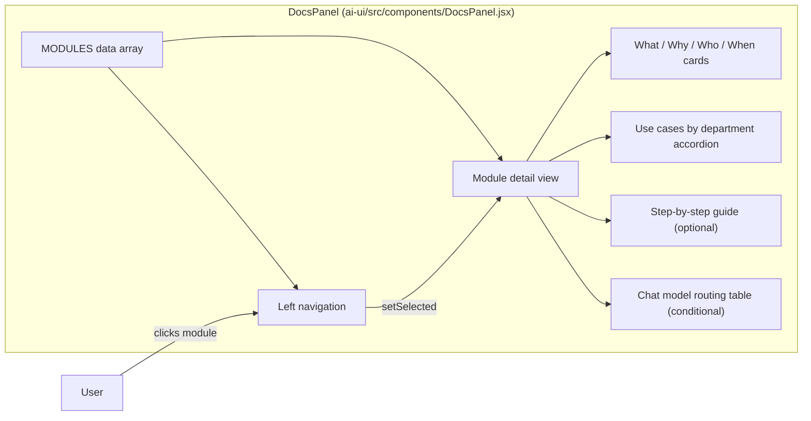
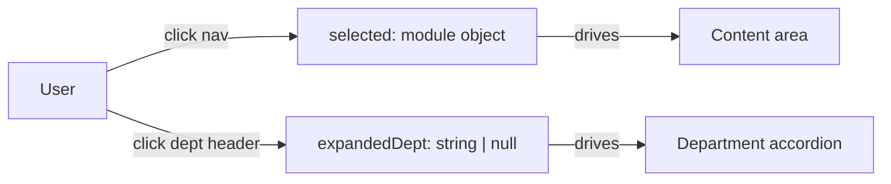
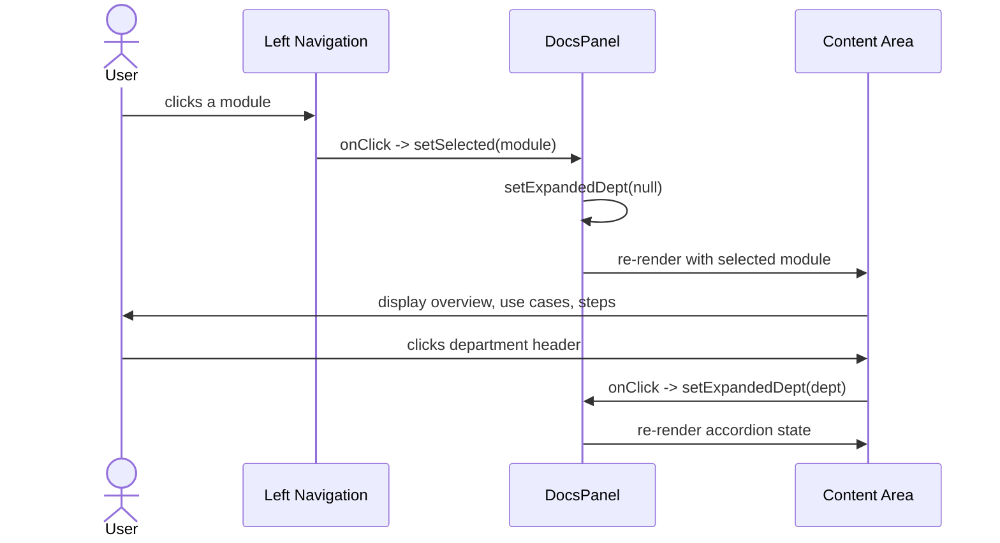

# documents_guide

The **Documents Guide** module is the in-application user documentation surface of the AiNxt platform. It is implemented as a single React component, `DocsPanel`, embedded in the `ai-ui` frontend. The panel provides a structured, searchable-by-browsing guide for every major platform capability, explaining what each module does, why it exists, who should use it, when to use it, and real-world examples grouped by department.

This module does not contain business logic, data fetching, or backend integration. Its sole responsibility is to render curated educational content that helps end users discover and adopt platform features.

---

## Core Components

| Component | File | Responsibility |
|-----------|------|----------------|
| `DocsPanel` | `ai-ui/src/components/DocsPanel.jsx` | Renders the documentation shell, navigation, module detail cards, use-case accordions, and step-by-step guides. |

---

## Module Purpose

`DocsPanel` answers three user questions:

1. **What can the platform do?** — A left navigation lists every major capability (Chat, Agents, Workflows, Skills, Codebase, Projects, Threads, Marketplace, Budget, SDLC Pipeline, Monitoring, Analytics, Coach).
2. **Why should I care?** — Each module explains the problem it solves and the value it provides.
3. **How do I use it?** — Department-scoped use cases and numbered steps translate abstract features into concrete actions.

The component is intentionally static: module metadata is declared in a `MODULES` array and rendered declaratively. This keeps the guide lightweight, fast, and easy to update without backend changes.

---

## Architecture

### High-level layout



### State management



- `selected` — the currently active module object from `MODULES`.
- `expandedDept` — the department whose use-case list is currently expanded; only one department can be open at a time.

Both values are local `useState` hooks; no global store, URL routing, or persistence is used.

---

## Data Model

Each entry in `MODULES` follows a consistent schema:

| Field | Type | Description |
|-------|------|-------------|
| `id` | `string` | Stable identifier, also used for conditional rendering (e.g., the Chat model-routing table). |
| `icon` | `LucideIcon` | Icon rendered in the navigation and header. |
| `label` | `string` | Human-readable module name. |
| `what` | `string` | One-sentence definition of the module. |
| `why` | `string` | Problem statement / value proposition. |
| `who` | `string` | Target audience. |
| `when` | `string` | Usage trigger. |
| `useCases` | `Array<{dept, icon, examples[]}>` | Department-specific examples. |
| `steps` | `string[]` (optional) | Numbered procedural guide rendered as an ordered list. |

A small `DEPT_ICONS` map maps department names to icons so every use-case block uses a consistent visual language.

---

## UI Structure

### Left navigation

- Fixed-width sidebar (`w-56`) with a scrollable list of all modules.
- Active module is highlighted with an indigo background and left border.
- Clicking a module updates `selected` and collapses any open department accordion.

### Content area

1. **Header** — module icon, title, and subtitle.
2. **Overview grid** — four cards covering *What it is*, *Why it exists*, *Who should use it*, and *When to use it*.
3. **Use cases by department** — accordion sections grouped by department (Engineering, Security, Operations, HR, Risk, Monitoring). Each section lists concrete example prompts or tasks.
4. **Step-by-step guide** — rendered only for modules that define `steps` (currently SDLC Pipeline, Monitoring, Analytics, and Coach).
5. **Chat model routing** — a conditional table shown only when `selected.id === "chat"`, describing how queries are routed across local and cloud models.

---

## Covered Platform Modules

The guide surfaces documentation for the following capabilities. Each entry links to the corresponding functional module documentation rather than duplicating implementation details.

| Guide Entry | Functional Module | What it covers in the app |
|-------------|-------------------|---------------------------|
| **Chat** | [chat](../chat/chat.md) | RAG chat over indexed codebases. |
| **Agents** | [agents_catalog](../agents/agents_catalog.md) | Building and running autonomous AI agents. |
| **Agent Chains** | [workflows_feature](../workflows/workflows_feature.md) | DAG-based multi-step automation pipelines. |
| **Skills** | [skills_feature](../skills/skills_feature.md) | Reusable Python tool functions for agents. |
| **Codebase** | [shared_core_knowledge_base](../knowledge/shared_core_knowledge_base.md) | Repository indexing and semantic retrieval. |
| **Projects** | [projects](../products/projects.md) | Scoped AI workspaces for teams. |
| **Threads** | [threads](../chat/threads.md) | Team discussions with `@AiNxt` mentions. |
| **Tool Marketplace** | [marketplace_router](../products/marketplace_router.md), [mcp_system](../mcp/mcp_system.md) | MCP tool registry and external tool registration. |
| **Budget** | [budget_router](../llm/budget_router.md), [budget_manager](../llm/budget_manager.md) | Per-user LLM cost tracking and budget enforcement. |
| **SDLC Pipeline** | [sdlc_pipeline](../sdlc/sdlc_pipeline.md), [shared_core_sdlc_pipeline](../sdlc/shared_core_sdlc_pipeline.md) | Autonomous ticket-to-PR software development lifecycle. |
| **Monitoring** | [monitoring](../observability/monitoring.md) | Platform health, circuit breakers, job queues, Prometheus metrics. |
| **Analytics** | [agent_analytics](../agents/agent_analytics.md) | Per-agent performance and cost analytics. |
| **AiNxt Coach** | [coach](../coach/coach.md), coach_evaluator | AI-usage coaching and prompt-practice scoring. |

---

## Dependencies

### Runtime dependencies

- **React** — component rendering and local state (`useState`).
- **lucide-react** — all icons used in the navigation, headers, department blocks, and model-routing table.

### Upstream functional dependencies

`DocsPanel` is a pure presentation component and does not import code from other modules. However, the content it documents is owned by the modules listed in the table above. When those modules change their behavior, the corresponding `MODULES` entry should be reviewed for accuracy.

---

## Data Flow



---

## How It Fits into the System

`DocsPanel` is part of the `ai_ui_frontend/documents` subtree, specifically the `documents_guide` leaf. It is rendered inside the main `ai-ui` application shell (see [ai_ui_frontend_app_core](../ui/ai_ui_frontend_app_core.md)) and is reachable through the application sidebar navigation.

Because it is a read-only guide, it sits outside the platform's request/response paths. It does not depend on the gateway, LLM proxy, workers, or backend routers. Its value is in discoverability: it bridges the gap between powerful backend capabilities (agents, workflows, SDLC pipelines) and end-user understanding.

---

## Process Flow: Rendering a Module Page

```mermaid
flowchart TD
    A[DocsPanel mounts] --> B[Default selected = MODULES[0] Chat]
    B --> C[Render left nav with all modules]
    B --> D[Render content for selected module]
    D --> E[Show What/Why/Who/When cards]
    D --> F[Show department use-case accordions]
    D --> G{Module has steps?}
    G -->|yes| H[Render numbered step list]
    G -->|no| I[Skip steps]
    D --> J{selected.id === chat?}
    J -->|yes| K[Render model routing table]
    J -->|no| L[Skip routing table]
    M[User clicks nav] --> N[Update selected state]
    N --> D
    O[User clicks dept] --> P[Toggle expandedDept state]
    P --> F
```

---

## Maintenance Notes

- **Adding a new module** — append a new object to `MODULES` with `id`, `icon`, `label`, `what`, `why`, `who`, `when`, and `useCases`. Add `steps` if a procedural guide is appropriate.
- **Updating examples** — edit the `examples` array inside the relevant `useCases` department block.
- **Conditional content** — the only conditional blocks are `selected.steps` and `selected.id === "chat"`. New special-case sections should be added sparingly to keep the UI predictable.
- **Icons** — import new icons from `lucide-react` and add them to `DEPT_ICONS` if a new department is introduced.

---

## Related Documentation

- [ai_ui_frontend_app_core](../ui/ai_ui_frontend_app_core.md) — main application shell that hosts `DocsPanel`.
- [chat](../chat/chat.md) — RAG chat capability.
- [agents_catalog](../agents/agents_catalog.md) — agent catalog and chat.
- [workflows_feature](../workflows/workflows_feature.md) — workflow/agent-chain builder.
- [skills_feature](../skills/skills_feature.md) — skills dashboard and factory chat.
- [shared_core_knowledge_base](../knowledge/shared_core_knowledge_base.md) — codebase indexing and retrieval.
- [projects](../products/projects.md) — scoped project workspaces.
- [threads](../chat/threads.md) — threaded team discussions.
- [marketplace_router](../products/marketplace_router.md) — tool marketplace API.
- [mcp_system](../mcp/mcp_system.md) — MCP tool registry.
- [budget_router](../llm/budget_router.md) — budget management API.
- [budget_manager](../llm/budget_manager.md) — budget UI.
- [sdlc_pipeline](../sdlc/sdlc_pipeline.md) — SDLC pipeline UI.
- [shared_core_sdlc_pipeline](../sdlc/shared_core_sdlc_pipeline.md) — SDLC pipeline backend.
- [monitoring](../observability/monitoring.md) — platform monitoring dashboard.
- [agent_analytics](../agents/agent_analytics.md) — agent analytics dashboard.
- [coach](../coach/coach.md) — AI-usage coaching UI.
- coach_evaluator — coaching rule evaluation engine.
