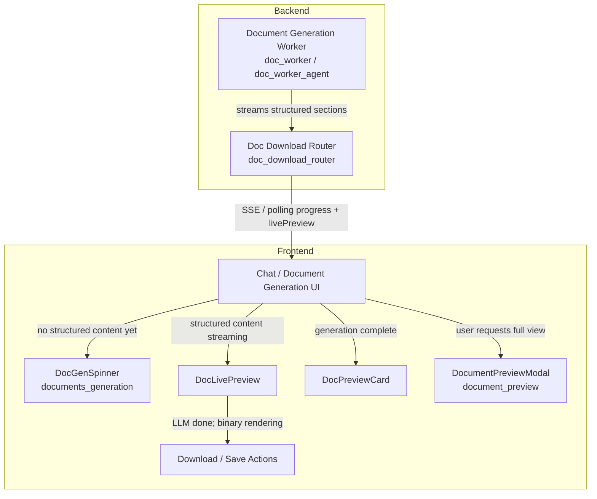
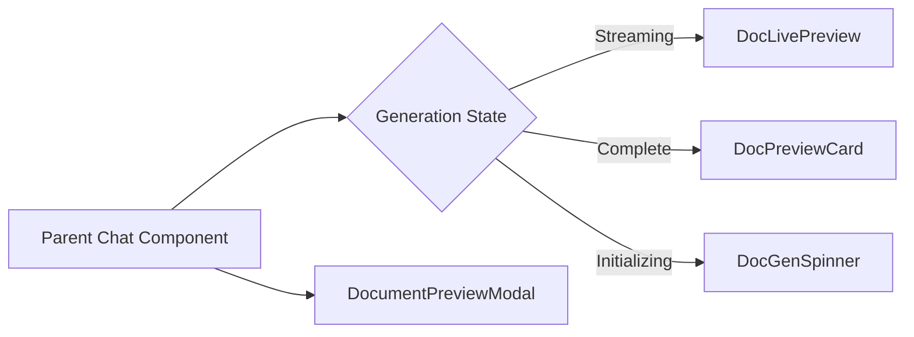
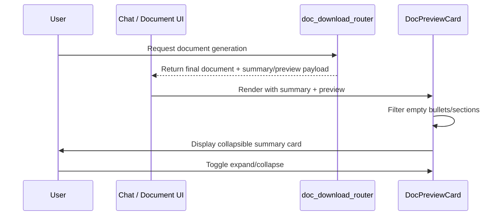
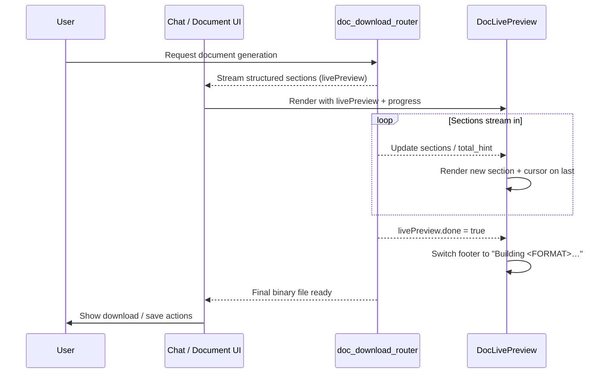
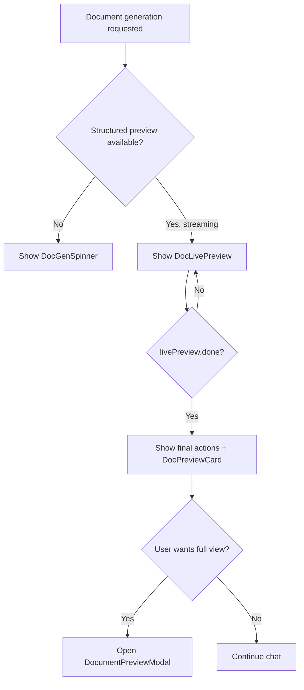
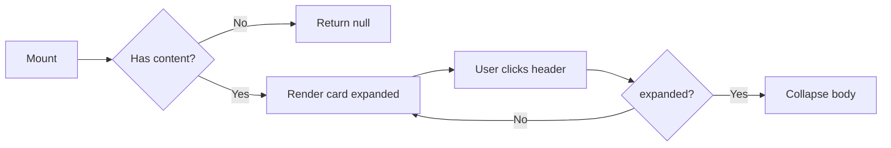

# Documents Preview Module

## Brief Introduction

The **Documents Preview** module provides lightweight, inline preview experiences for AI-generated documents within the `ai-ui` frontend. It sits between the raw generation stream and the final downloadable artifact, giving users immediate visibility into document structure, summaries, and section drafts without leaving the chat interface.

The module is composed of two React components:

- **`DocPreviewCard`** — A compact, collapsible summary card that displays a high-level TL;DR and short snippets from a completed document.
- **`DocLivePreview`** — A streaming, artifact-style live preview that renders document sections as they are produced by the LLM, including progress indicators, placeholders, and cancellation controls.

Together, these components improve perceived performance and user trust by surfacing document content early and continuously during generation.

---

## Core Functionality

### DocPreviewCard

`DocPreviewCard` is a **post-generation** preview component. It is intended to be embedded directly into a chat message or result panel after a document has been generated.

**Responsibilities:**

- Render up to five plain-language summary bullets.
- Display an optional introductory paragraph.
- Render a list of section previews, each with a heading and a short snippet.
- Indicate when additional sections exist but are not shown (`truncated`).
- Collapse/expand to keep chat threads tidy.
- Return `null` when no previewable content is provided, so callers do not need conditional guards.

**Props:**

| Prop | Type | Description |
|------|------|-------------|
| `summary` | `string[]` | Up to 5 plain-language bullets. Empty or missing values are filtered out. |
| `preview` | `object \| null` | `{ title, intro, sections: [{ heading, snippet }], truncated }` |

### DocLivePreview

`DocLivePreview` is a **during-generation** preview component. It replaces the loading spinner once the backend begins streaming structured document content.

**Responsibilities:**

- Render document sections incrementally as they arrive from the streaming JSON payload.
- Show a blinking cursor on the most recently streamed section.
- Display placeholder outlines for sections that have not yet arrived, based on `total_hint`.
- Switch the footer message from "Drafting…" to "Building `<FORMAT>`…" once the LLM stream completes (`livePreview.done`).
- Provide a cancel button that invokes `onCancel` while disabling during the cancellation round-trip.
- Render Markdown body content safely using `ReactMarkdown` with GitHub-flavored Markdown support.

**Props:**

| Prop | Type | Description |
|------|------|-------------|
| `progress` | `object` | Polling progress from the server: `{ step, total_steps, label, detail }`. |
| `livePreview` | `object` | `{ title, domain, sections: [{ heading, content, bullets, callout }], total_hint, done }` |
| `format` | `string` | Target file format: `"pdf"`, `"docx"`, `"pptx"`, `"xlsx"`, `"md"`, etc. |
| `mode` | `"generate" \| "edit"` | Changes header verb and icon. |
| `onCancel` | `function` | Callback invoked when the user clicks the cancel button. |
| `cancelling` | `boolean` | Disables the cancel button while cancellation is in flight. |

---

## Architecture

The Documents Preview module is a pure **presentation-layer** concern in the `ai-ui` frontend. It does not perform generation itself; it consumes structured preview data produced by backend document-generation workers and rendered by parent chat or document-generation components.

### Component Hierarchy

---

## Data Flow

### Post-Generation Preview Flow (DocPreviewCard)

### Live Preview Flow (DocLivePreview)

---

## Component Interactions

### With Document Generation

- `DocLivePreview` is designed to replace `DocGenSpinner` from the [documents_generation](documents_generation.md) module as soon as structured content becomes available.
- `DocPreviewCard` is shown after generation completes, often alongside download buttons provided by `DocWorkflowCard` (also in [documents_generation](documents_generation.md)).

### With Full Document Preview

- `DocPreviewCard` and `DocLivePreview` provide **inline** previews.
- For a full-page or modal preview of the rendered document (DOCX, PPTX, XLSX, PDF), the application uses `DocumentPreviewModal` from the [document_preview](document_preview.md) module.

### With Chat Components

- Both preview components are typically rendered inside message bubbles by `Chat` ([chat](../chat/chat.md)) or `KbChat` ([kb_chat](../knowledge/kb_chat.md)).
- `DocPreviewCard` uses the same collapsible pattern as `AnswerCards` from [common_components](../ui/common_components.md).

### With Backend APIs

- The structured preview payloads consumed by `DocLivePreview` are produced by backend document-generation workers and exposed through the [doc_download_router](../api/doc_download_router.md).
- For presentation-specific generation, the [presenton_lib](../reference/presenton_lib.md) and [ppt_wizard](../reference/ppt_wizard.md) modules may provide analogous streaming previews.

---

## Process Flows

### Rendering Decision Flow

### DocPreviewCard Collapse Flow

---

## Design Decisions

1. **Null-safe rendering** — `DocPreviewCard` returns `null` when both `summary` and `preview` are empty, simplifying parent components.
2. **Streaming-first UX** — `DocLivePreview` shows content as soon as a single section is parseable, rather than waiting for the full document.
3. **Format-agnostic** — Both components accept a generic preview structure, allowing reuse across PDF, DOCX, PPTX, XLSX, and Markdown generation flows.
4. **Markdown support** — `DocLivePreview` uses `ReactMarkdown` with `remarkGfm` so streamed section bodies can include rich formatting.
5. **Controlled collapse** — `DocPreviewCard` manages its own expanded state locally, avoiding unnecessary parent re-renders.

---

## Dependencies

### Runtime Dependencies

- `react` — Component state and effects.
- `react-markdown` — Markdown rendering in `DocLivePreview`.
- `remark-gfm` — GitHub-flavored Markdown plugin.
- `lucide-react` — Icons (`FileText`, `ChevronDown`, `ChevronUp`, `X`).

### Related Modules

| Module | Relationship |
|--------|--------------|
| [documents_generation](documents_generation.md) | Provides `DocGenSpinner` and `DocWorkflowCard` for generation loading and download actions. |
| [document_preview](document_preview.md) | Provides `DocumentPreviewModal` for full rendered document preview. |
| [documents_chat](../chat/documents_chat.md) | Provides `DocPickerCard` for document selection in chat. |
| [documents_guide](documents_guide.md) | Provides `DocsPanel` for document guidance and management. |
| [doc_download_router](../api/doc_download_router.md) | Backend router exposing document generation, streaming, and download endpoints. |
| [presenton_lib](../reference/presenton_lib.md) | Library for presentation-specific generation and layout handling. |
| [ppt_wizard](../reference/ppt_wizard.md) | Presentation wizard UI that may use live preview patterns. |
| [chat](../chat/chat.md) | Primary chat UI that hosts inline document previews. |
| [kb_chat](../knowledge/kb_chat.md) | Knowledge-base chat UI that may host document previews. |

---

## How It Fits Into the System

The Documents Preview module is part of the larger **Documents** feature area in `ai-ui`. It bridges the gap between the user's request and the final downloadable artifact:

- **Before generation:** The user interacts with `DocPickerCard` or chat inputs.
- **During generation:** `DocGenSpinner` is shown first; as soon as structured content streams in, `DocLivePreview` takes over to provide real-time feedback.
- **After generation:** `DocPreviewCard` summarizes the result, and `DocWorkflowCard` / `DocumentPreviewModal` provide download and full-view capabilities.

By surfacing content early and continuously, the module reduces perceived latency and helps users confirm that the generated document matches their intent before downloading.
