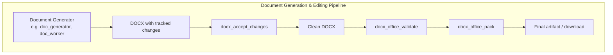
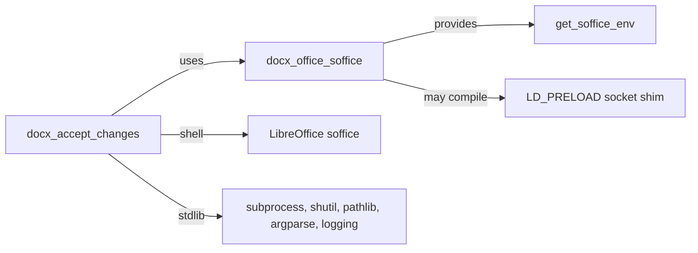
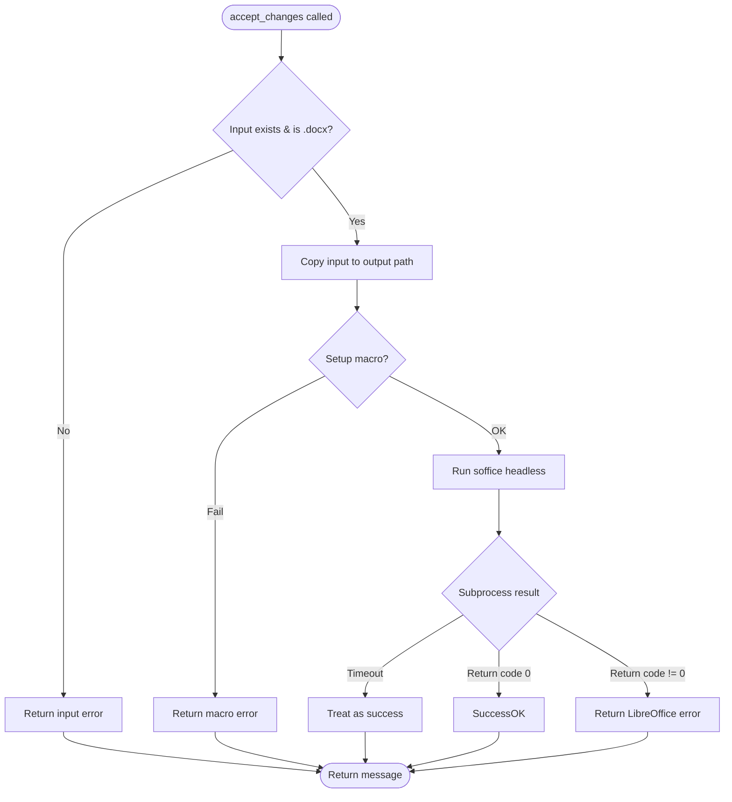

# docx_accept_changes

## Brief Introduction

`docx_accept_changes` is a legacy DOCX post-processing utility in the `ainxt_docskills` skill family. Its single responsibility is to **accept all tracked changes** inside a `.docx` file and produce a clean output document with no remaining revision marks.

The module does not manipulate the Open XML directly. Instead, it drives **LibreOffice (soffice)** in headless mode and executes a built-in Basic macro that invokes the `.uno:AcceptAllTrackedChanges` dispatcher command. This approach guarantees that Word-compatible tracked changes (insertions, deletions, moves, and formatting revisions) are resolved exactly as a desktop word processor would resolve them.

> **Scope note:** This module is a narrow, stateless file-to-file transformer. It is intentionally separate from document generation, redline simplification, validation, and packaging. Those concerns are handled by sibling modules in the same skill family.

---

## Where It Fits in the System



`docx_accept_changes` is typically invoked after a DOCX has been produced or edited by an agent and before the file is validated, repacked, and delivered to the user. It can also be used as a standalone CLI tool.

---

## Core Components

### `accept_changes(input_file, output_file)`

The public entry point. It validates inputs, copies the source file to the destination, ensures the LibreOffice macro is installed, and runs LibreOffice headlessly to accept every tracked change.

**Returns:**

- A tuple `(None, message)` where `message` describes success or failure. The function intentionally returns `None` as the first element to keep a consistent tool-call shape with other `ainxt_docskills` scripts.

**Behavior:**

1. Verifies the input file exists and has a `.docx` extension.
2. Creates the output directory and copies the input file to the output path.
3. Ensures the `AcceptAllTrackedChanges` Basic macro is present in a temporary LibreOffice profile.
4. Runs `soffice --headless` with the macro URL and the output file path.
5. Interprets the subprocess result:
   - A timeout is treated as success (LibreOffice sometimes does not exit cleanly after storing and closing).
   - A non-zero return code is reported as an error.

### `_setup_libreoffice_macro() -> bool`

Idempotent helper that installs the StarBasic macro into `/tmp/libreoffice_docx_profile/user/basic/Standard/Module1.xba`.

**Behavior:**

1. If the macro file already exists and contains `AcceptAllTrackedChanges`, returns `True` immediately.
2. Otherwise, initializes a fresh LibreOffice profile by running `soffice --terminate_after_init`.
3. Writes the macro XML to `Module1.xba`.

---

## Macro Details

The embedded macro opens the target document, obtains the frame controller, and dispatches the UNO command `.uno:AcceptAllTrackedChanges`. After all revisions are accepted, it stores and closes the document.

```basic
Sub AcceptAllTrackedChanges()
    Dim document As Object
    Dim dispatcher As Object

    document = ThisComponent.CurrentController.Frame
    dispatcher = createUnoService("com.sun.star.frame.DispatchHelper")

    dispatcher.executeDispatch(document, ".uno:AcceptAllTrackedChanges", "", 0, Array())
    ThisComponent.store()
    ThisComponent.close(True)
End Sub
```

---

## Dependencies



### Direct dependency

- **[docx_office_soffice](docx_office_soffice.md)** — supplies `get_soffice_env()`, which configures the environment for headless LibreOffice execution. On environments without UNIX-domain socket support, the soffice helper transparently compiles and injects an `LD_PRELOAD` shim.

### Runtime requirements

- `soffice` binary must be installed and on `PATH`.
- A writable `/tmp` directory for the transient LibreOffice profile.
- Sufficient permissions to execute LibreOffice and write the output file.

---

## Data Flow

```mermaid
sequenceDiagram
    autonumber
    participant Caller
    participant accept_changes
    participant _setup_libreoffice_macro
    participant soffice as LibreOffice soffice

    Caller->>accept_changes: input_file, output_file
    accept_changes->>accept_changes: validate input exists & is .docx
    accept_changes->>accept_changes: mkdir(output_dir); copy(input, output)
    accept_changes->>_setup_libreoffice_macro: ensure macro installed
    alt macro missing
        _setup_libreoffice_macro->>soffice: --terminate_after_init
        _setup_libreoffice_macro->>_setup_libreoffice_macro: write Module1.xba
    end
    _setup_libreoffice_macro-->>accept_changes: True / False
    accept_changes->>soffice: --headless macro URL + output_path
    soffice->>soffice: AcceptAllTrackedChanges, store(), close()
    soffice-->>accept_changes: return code / timeout
    accept_changes-->>Caller: (None, message)
```

---

## Process Flow



---

## Error Handling

| Scenario | Returned message prefix | Notes |
|----------|------------------------|-------|
| Input file missing | `Error: Input file not found:` | Early validation failure |
| Input not `.docx` | `Error: Input file is not a DOCX file:` | Extension check |
| Copy failure | `Error: Failed to copy input file to output location:` | Filesystem error |
| Macro setup failure | `Error: Failed to setup LibreOffice macro:` | Profile or write error |
| LibreOffice timeout | `Successfully accepted...` | Timeout is intentionally treated as success |
| LibreOffice non-zero exit | `Error: LibreOffice failed:` | Includes stderr |

---

## CLI Usage

The script can be executed directly:

```bash
python -m skills.ainxt_docskills.docx.scripts.accept_changes \
    input_with_track_changes.docx \
    output_clean.docx
```

If the resulting message contains `Error`, the process exits with code `1`.

---

## Integration Notes

- **Not a redline generator:** For creating or simplifying tracked changes, see [docx_office_simplify_redlines](docx_office_simplify_redlines.md).
- **Not a validator:** After accepting changes, run [docx_office_validate](docx_office_validate.md) and [DOCXSchemaValidator](docx_office_validators.md) to ensure the resulting DOCX is well-formed.
- **Not a packer/unpacker:** The script operates on a complete `.docx` file. For ZIP-level manipulation, see [docx_office_pack](docx_office_pack.md) and [docx_office_unpack](docx_office_unpack.md).
- **Not a run merger:** To consolidate adjacent `<w:r>` elements after changes are accepted, see [docx_office_merge_runs](docx_office_merge_runs.md).

---

## Related Modules

- [docx_office_soffice](docx_office_soffice.md) — LibreOffice execution environment and socket shim.
- [docx_office_pack](docx_office_pack.md) — Repacking DOCX archives after modification.
- [docx_office_unpack](docx_office_unpack.md) — Unpacking DOCX archives for inspection.
- [docx_office_validate](docx_office_validate.md) — Post-processing schema and redline validation.
- [docx_office_simplify_redlines](docx_office_simplify_redlines.md) — Merging adjacent tracked-change elements.
- [docx_office_merge_runs](docx_office_merge_runs.md) — Consolidating redundant run elements.
- [docx_comment](docx_comment.md) — Adding comments to a DOCX file.
- [doc_generator](doc_generator.md) — Higher-level document generation that may produce the input to this utility.

---

## Maintenance Considerations

- The macro is written to a fixed path under `/tmp`. Concurrent runs could race on the same profile directory; the macro setup is idempotent, but heavy concurrency may benefit from per-run profile isolation.
- LibreOffice's headless mode can be slow on first launch because of profile initialization. The 30-second timeout covers typical cases, but very large documents may need a longer timeout if the calling code overrides it.
- The module relies on the `soffice` binary name. Environments where LibreOffice is installed under a different name (e.g., `libreoffice`) may require a symlink or wrapper.
