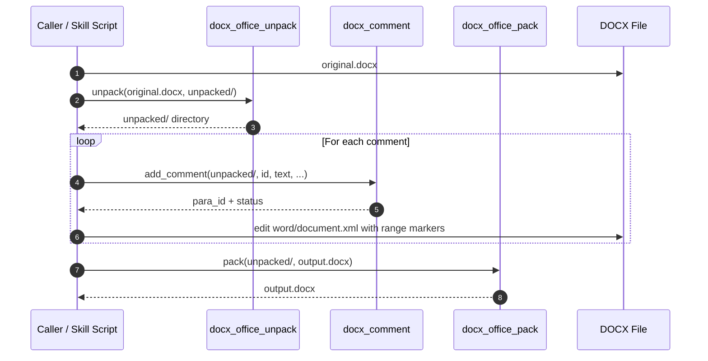
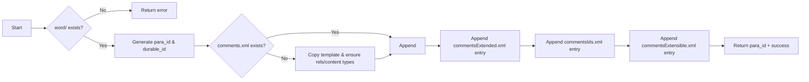
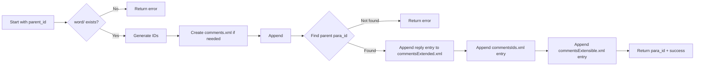
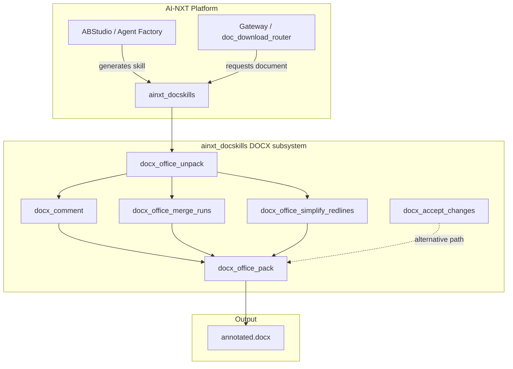

# docx_comment

## Brief Introduction

`docx_comment` is a low-level DOCX manipulation utility that adds Word comments (and comment replies) to an **unpacked** DOCX package by editing Office Open XML (OOXML) parts directly. It is part of the legacy `ainxt_docskills` document skill set and is typically used after a DOCX file has been unpacked by [`docx_office_unpack`](docx_office_unpack.md) and before it is repacked by [`docx_office_pack`](docx_office_pack.md).

The module does not require Microsoft Word or LibreOffice; it uses `defusedxml.minidom` to create and append the required `comments.xml`, `commentsExtended.xml`, `commentsIds.xml`, and `commentsExtensible.xml` parts, plus the corresponding `[Content_Types].xml` overrides and `document.xml.rels` relationships.

---

## Core Functionality

### `add_comment`

The single public entry point is `add_comment(...)`:

```python
def add_comment(
    unpacked_dir: str,
    comment_id: int,
    text: str,
    author: str = "Claude",
    initials: str = "C",
    parent_id: int | None = None,
) -> tuple[str, str]:
```

| Parameter | Description |
|-----------|-------------|
| `unpacked_dir` | Path to the unpacked DOCX directory (must contain a `word/` subfolder). |
| `comment_id` | Unique numeric identifier for the comment. Must match the `w:id` used in the comment range markers placed in `document.xml`. |
| `text` | Pre-escaped XML comment body (e.g., `&amp;` for `&`, `&#x2019;` for smart quotes). |
| `author` | Display name of the comment author. Defaults to `"Claude"`. |
| `initials` | Author initials shown in Word's comment pane. Defaults to `"C"`. |
| `parent_id` | Optional parent comment ID. When provided, the new comment is recorded as a reply. |

**Returns:** a tuple `(para_id, message)`. `para_id` is the generated hexadecimal paragraph ID that links the comment to the extended/ids/extensible parts.

### What the function does

1. **Validates the unpacked structure** — expects `word/` to exist.
2. **Generates identifiers** — a random 8-hex-digit `para_id` and `durable_id`, plus a UTC timestamp.
3. **Creates `word/comments.xml`** if missing from a template, and appends a `<w:comment>` element.
4. **Ensures package relationships** — on first comment creation, adds `comments.xml`, `commentsExtended.xml`, `commentsIds.xml`, and `commentsExtensible.xml` relationships to `word/_rels/document.xml.rels`.
5. **Ensures content types** — adds the corresponding `Override` entries to `[Content_Types].xml`.
6. **Creates/updates `commentsExtended.xml`** — records the comment paragraph ID and, for replies, the parent paragraph ID.
7. **Creates/updates `commentsIds.xml`** — maps the paragraph ID to a durable ID.
8. **Creates/updates `commentsExtensible.xml`** — stores the durable ID and UTC date.
9. **Returns** the paragraph ID and a status message.

> **Important:** `add_comment` only writes the comment *definitions*. The caller is still responsible for inserting the corresponding range markers into `word/document.xml`:
> ```xml
> <w:commentRangeStart w:id="0"/>
> ... commented content ...
> <w:commentRangeEnd w:id="0"/>
> <w:r><w:rPr><w:rStyle w:val="CommentReference"/></w:rPr><w:commentReference w:id="0"/></w:r>
> ```
> The CLI prints a template showing exactly where to place these markers.

---

## Architecture

`docx_comment` is a pure XML-editing helper. It has no runtime service dependencies, no database access, and no LLM calls. It operates on the file system representation of a DOCX package.

```mermaid
flowchart TB
    subgraph Input["Input: Unpacked DOCX"]
        A[word/document.xml]
        B[word/_rels/document.xml.rels]
        C[[Content_Types].xml]
    end

    subgraph docx_comment["docx_comment module"]
        D[add_comment]
        E[_ensure_comment_relationships]
        F[_ensure_comment_content_types]
        G[_append_xml]
        H[_find_para_id]
    end

    subgraph Output["Output: Updated Unpacked DOCX"]
        I[word/comments.xml]
        J[word/commentsExtended.xml]
        K[word/commentsIds.xml]
        L[word/commentsExtensible.xml]
        M[Updated rels & content types]
    end

    A --> D
    B --> E
    C --> F
    D --> G
    D --> H
    G --> I
    G --> J
    G --> K
    G --> L
    E --> M
    F --> M
```

---

## Component Relationships

| Component | Role | Collaborators |
|-----------|------|---------------|
| `add_comment` | Public API; orchestrates comment creation and package bookkeeping. | All helper functions below, plus template files. |
| `_ensure_comment_relationships` | Adds missing `Relationship` entries to `document.xml.rels`. | `word/_rels/document.xml.rels` |
| `_ensure_comment_content_types` | Adds missing `Override` entries to `[Content_Types].xml`. | `[Content_Types].xml` |
| `_append_xml` | Parses an XML part, appends new element(s), and writes it back with smart-quote encoding. | `comments.xml`, `commentsExtended.xml`, `commentsIds.xml`, `commentsExtensible.xml` |
| `_find_para_id` | Looks up the paragraph ID of a parent comment for reply threading. | `comments.xml` |
| `_generate_hex_id` | Generates random 8-hex-digit identifiers. | `add_comment` |
| `_encode_smart_quotes` | Converts Unicode curly quotes to numeric XML entities to avoid encoding issues. | `_append_xml` |

---

## Data Flow

The typical lifecycle of a DOCX comment operation is:



1. The DOCX is **unpacked** into a directory tree.
2. `add_comment` is called once per comment/reply to create the backing XML parts.
3. The caller inserts `<w:commentRangeStart>`, `<w:commentRangeEnd>`, and `<w:commentReference>` markers into `word/document.xml`.
4. The directory is **packed** back into a `.docx` file.

---

## Process Flow

### Adding a top-level comment



### Adding a reply



---

## How It Fits into the System

`docx_comment` sits in the **document manipulation layer** of the platform, inside the legacy `ainxt_docskills` skill pack. It is not invoked directly by the ABStudio backend APIs; instead, it is consumed by higher-level document-generation or document-review skills that need to annotate a DOCX with comments before returning it to the user.



For details on the surrounding document pipeline, see:

- [`docx_office_unpack`](docx_office_unpack.md) — extracts a DOCX into an editable directory.
- [`docx_office_pack`](docx_office_pack.md) — repackages the directory into a valid DOCX.
- [`docx_office_simplify_redlines`](docx_office_simplify_redlines.md) — normalizes tracked changes after unpacking.
- [`docx_office_merge_runs`](docx_office_merge_runs.md) — merges adjacent text runs for easier editing.
- [`docx_accept_changes`](docx_accept_changes.md) — accepts all tracked changes via LibreOffice.

---

## Dependencies

### Python packages

- `defusedxml` — secure XML parsing and serialization.
- `argparse`, `random`, `shutil`, `sys`, `datetime`, `pathlib` — standard library.

### Template files

The module expects a `templates/` directory next to `comment.py` containing:

- `comments.xml`
- `commentsExtended.xml`
- `commentsIds.xml`
- `commentsExtensible.xml`

These templates provide the root elements and namespace declarations required by the OOXML spec.

### Module dependencies

`docx_comment` does **not** import other project modules. It is a leaf utility. However, it is designed to be used in conjunction with the `docx_office_*` helpers listed above.

---

## Usage Example

### As a CLI tool

```bash
# Add a top-level comment
python skills/ainxt_docskills/docx/scripts/comment.py unpacked/ 0 "Please revise this section."

# Add a reply to comment 0
python skills/ainxt_docskills/docx/scripts/comment.py unpacked/ 1 "Done." --parent 0
```

After running, the tool prints the XML markers that must be inserted into `word/document.xml`.

### As a library

```python
from skills.ainxt_docskills.docx.scripts.comment import add_comment

para_id, msg = add_comment(
    unpacked_dir="/tmp/unpacked",
    comment_id=42,
    text="Consider rephrasing for clarity.",
    author="Reviewer",
    initials="R",
)
print(msg)  # Added comment 42 (para_id=...)
```

---

## Important Notes for Maintainers

1. **XML escaping is the caller's responsibility.** The `text` argument must already be XML-safe. The module only encodes smart quotes to numeric entities.
2. **Comment IDs must be unique** within the document and must match the IDs used in `document.xml` range markers.
3. **Range markers must be direct children of `<w:p>`**, never nested inside `<w:r>`. The CLI prints a reminder.
4. **No validation is performed** on the final package. Use [`docx_office_validate`](docx_office_validate.md) or [`docx_office_pack`](docx_office_pack.md) with `validate=True` before distributing the file.
5. **Legacy location vs. new location:** An equivalent implementation also exists at `ABStudio/skills/ainxt-skills/docx/scripts/comment.py`. Updates should be applied to both copies if both skill packs are still maintained.

---

## See Also

- [`docx_office_unpack`](docx_office_unpack.md)
- [`docx_office_pack`](docx_office_pack.md)
- [`docx_office_merge_runs`](docx_office_merge_runs.md)
- [`docx_office_simplify_redlines`](docx_office_simplify_redlines.md)
- [`docx_accept_changes`](docx_accept_changes.md)
- [`docx_office_validate`](docx_office_validate.md)
