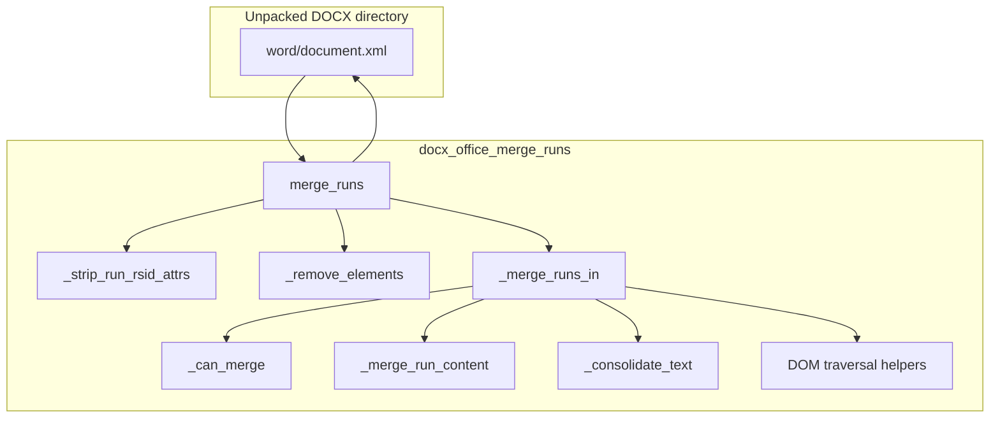
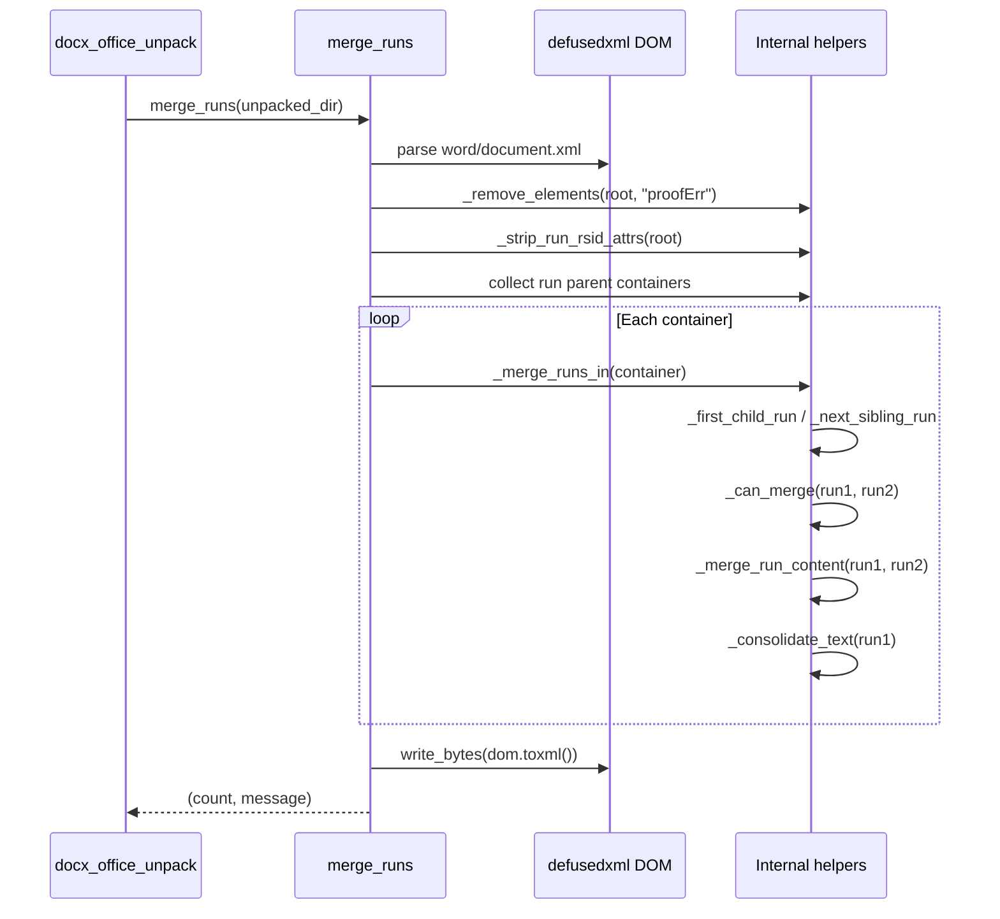
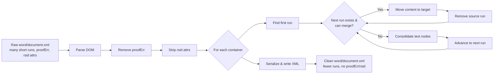

# docx_office_merge_runs

## Brief Introduction

`docx_office_merge_runs` is a low-level DOCX XML normalization helper used by the legacy Anthropic doc-skills pipeline. Its single responsibility is to merge adjacent `<w:r>` (run) elements inside an unpacked `.docx` package when they share identical run properties (`<w:rPr>`). By collapsing redundant runs and stripping non-rendering revision metadata, it produces smaller, cleaner `word/document.xml` files that are easier for downstream tools to diff, validate, and transform.

This module is part of the `docskills_legacy` family and is invoked automatically during DOCX unpacking. It is not a user-facing API; it operates directly on the extracted Office Open XML (OOXML) file tree.

---

## Purpose and Core Functionality

### What problem it solves

Microsoft Word and other DOCX producers frequently split logically contiguous text into many short `<w:r>` runs. This happens because of:

- Spell/grammar checking markers (`<w:proofErr>`)
- Revision tracking (`w:rsid*` attributes)
- Partial edits, copy-paste, or auto-formatting

Each split run repeats its own `<w:rPr>` formatting block. When the document is later processed by diff tools, redline simplifiers, or LLM-based generators, these micro-runs create noise and inflate file size. `merge_runs` removes that noise by:

1. Removing `<w:proofErr>` elements.
2. Stripping `rsid*` attributes from runs.
3. Merging adjacent runs with identical `<w:rPr>` XML.
4. Consolidating adjacent `<w:t>` text nodes inside each merged run.

### Public entry point

| Function | Signature | Responsibility |
|----------|-----------|----------------|
| `merge_runs` | `(input_dir: str) -> tuple[int, str]` | Loads `word/document.xml` from an unpacked DOCX directory, normalizes it, writes it back, and returns `(merge_count, message)`. |

### Internal helpers

| Function | Responsibility |
|----------|----------------|
| `_find_elements` | Recursively collects elements by local tag name, tolerating namespaced tags. |
| `_get_child` / `_get_children` | Locate first or all child elements by tag name. |
| `_is_adjacent` | Determines whether two elements are next to each other with only ignorable whitespace between them. |
| `_remove_elements` | Removes all elements matching a tag from the DOM. |
| `_strip_run_rsid_attrs` | Removes revision-session attributes from every `<w:r>`. |
| `_merge_runs_in` | Iterates over runs inside one container and collapses mergeable neighbors. |
| `_first_child_run` / `_next_element_sibling` / `_next_sibling_run` | DOM traversal helpers that skip text/comment nodes. |
| `_is_run` | Checks whether a node is a `<w:r>` element. |
| `_can_merge` | Compares the XML serialization of two `<w:rPr>` blocks. |
| `_merge_run_content` | Moves non-property children from a source run into a target run. |
| `_consolidate_text` | Joins adjacent `<w:t>` nodes and manages `xml:space="preserve"`. |

---

## Architecture and Component Relationships

### High-level architecture

### Component interaction

### Data flow

---

## How It Fits into the Overall System

`docx_office_merge_runs` is one step in the legacy DOCX post-processing chain. It does not run in isolation; it is invoked by [docx_office_unpack](docx_office_unpack.md) when a `.docx` file is unpacked for editing, validation, or transformation.

### Position in the DOCX processing pipeline

The unpack step optionally calls `simplify_redlines` first and then `merge_runs` for `.docx` files. After the caller modifies the unpacked XML, [docx_office_pack](docx_office_pack.md) re-zips the directory back into a valid OOXML package.

### Related modules

| Module | Relationship | Description |
|--------|--------------|-------------|
| [docx_office_unpack](docx_office_unpack.md) | Caller | Extracts the DOCX zip and triggers run merging. |
| [docx_office_pack](docx_office_pack.md) | Downstream | Re-zips the normalized directory into a `.docx`. |
| [docx_office_simplify_redlines](docx_office_simplify_redlines.md) | Sibling | Merges tracked-change regions before run merging happens. |
| [docx_office_validators](docx_office_validators.md) | Downstream | Validates the final OOXML schema after packing. |
| [docx_accept_changes](docx_accept_changes.md) | Sibling | Uses LibreOffice to accept tracked changes; run merging is not applied there. |
| [pptx_office_merge_runs](pptx_office_merge_runs.md) | Parallel | Equivalent run-merge helper for `.pptx` packages. |
| [xlsx_office_merge_runs](xlsx_office_merge_runs.md) | Parallel | Equivalent run-merge helper for `.xlsx` packages. |

---

## Detailed Process Flow

### 1. Pre-processing

`merge_runs` begins by parsing `word/document.xml` with `defusedxml.minidom`. It then:

- Removes every `<w:proofErr>` element. These spell/grammar markers are not rendered and would otherwise block run adjacency checks.
- Strips all attributes whose names contain `rsid` from every `<w:r>`. These revision identifiers differ between sessions and would make otherwise identical runs appear different.

### 2. Container discovery

Runs can live inside paragraphs (`<w:p>`), table cells (`<w:tc>`), tracked-change inserts (`<w:ins>`), deletions (`<w:del>`), and other containers. The module builds the set of all distinct parent nodes that contain at least one `<w:r>`, then processes each container independently.

### 3. Run merging inside a container

For each container:

1. Start at the first child `<w:r>`.
2. Look at the next element sibling.
3. If the sibling is also a run and `_can_merge` returns `True`, move its non-`rPr` children into the current run and remove the sibling. Repeat.
4. Once no more merges are possible, call `_consolidate_text` to join adjacent `<w:t>` nodes.
5. Advance to the next run and repeat.

`_can_merge` compares the full XML serialization of each run's `<w:rPr>` block. This is strict but correct: if bold, italic, font, color, or any other property differs, the runs are kept separate.

### 4. Text consolidation

After runs are merged, a single run may contain multiple adjacent `<w:t>` elements. `_consolidate_text` joins them into one `<w:t>`, preserving leading/trailing spaces by adding or removing `xml:space="preserve"` as required by the OOXML spec.

### 5. Serialization

The modified DOM is serialized back to `word/document.xml` with UTF-8 encoding. The function returns the total number of merge operations performed.

---

## Error Handling and Edge Cases

| Scenario | Behavior |
|----------|----------|
| `word/document.xml` missing | Returns `(0, "Error: <path> not found")`. |
| Parse or I/O exception | Returns `(0, "Error: <exception>")`. |
| Runs with different `rPr` | Not merged. |
| Runs separated by non-run elements | Not merged; `_is_adjacent` and `_next_element_sibling` enforce element adjacency. |
| Empty runs or runs with only `rPr` | Handled safely; `_merge_run_content` skips `rPr` children. |
| Text nodes with significant whitespace | `xml:space="preserve"` is set/removed correctly. |

---

## Dependencies

- `pathlib` — filesystem paths.
- `defusedxml.minidom` — secure XML parsing and DOM manipulation.

No external third-party packages beyond `defusedxml` are required.

---

## Notes for Maintainers

- The module mutates the DOM in place and overwrites `word/document.xml`. Callers should work on a copy of the unpacked package if the original tree must be preserved.
- The merge logic is namespace-tolerant: it matches tags by local name and optional namespace prefix.
- Because `_can_merge` compares serialized XML strings, minor differences such as attribute order or namespace prefixes are treated as different formatting. In practice this is acceptable because OOXML producers usually emit consistent `rPr` blocks.
- This module is specific to `.docx`. The `.pptx` and `.xlsx` variants live in [pptx_office_merge_runs](pptx_office_merge_runs.md) and [xlsx_office_merge_runs](xlsx_office_merge_runs.md) respectively.
