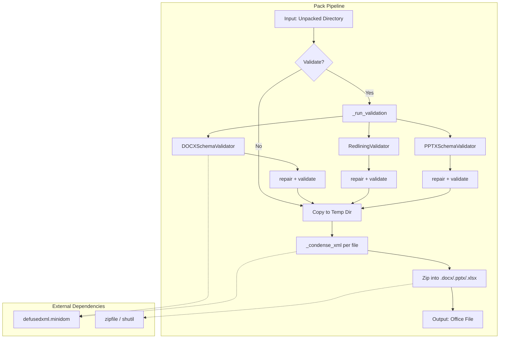
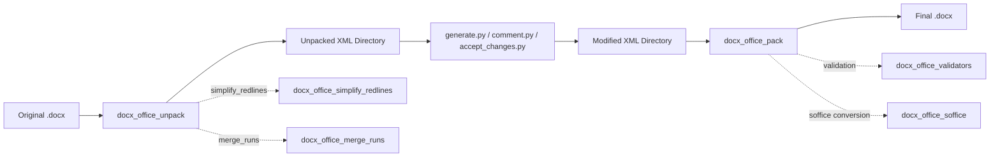
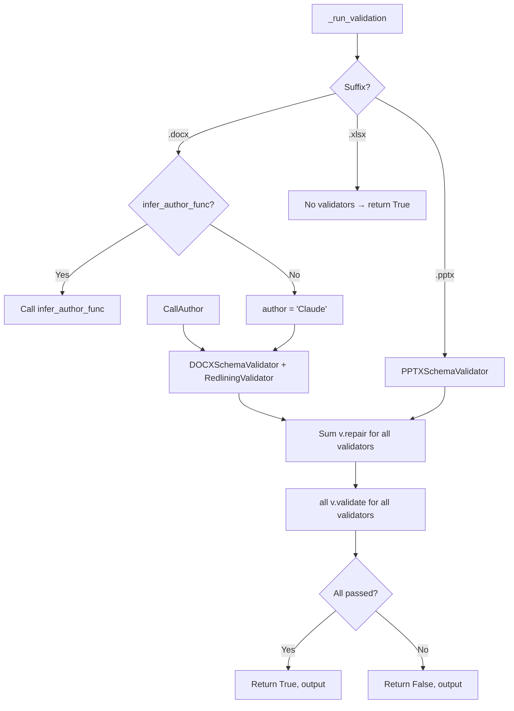
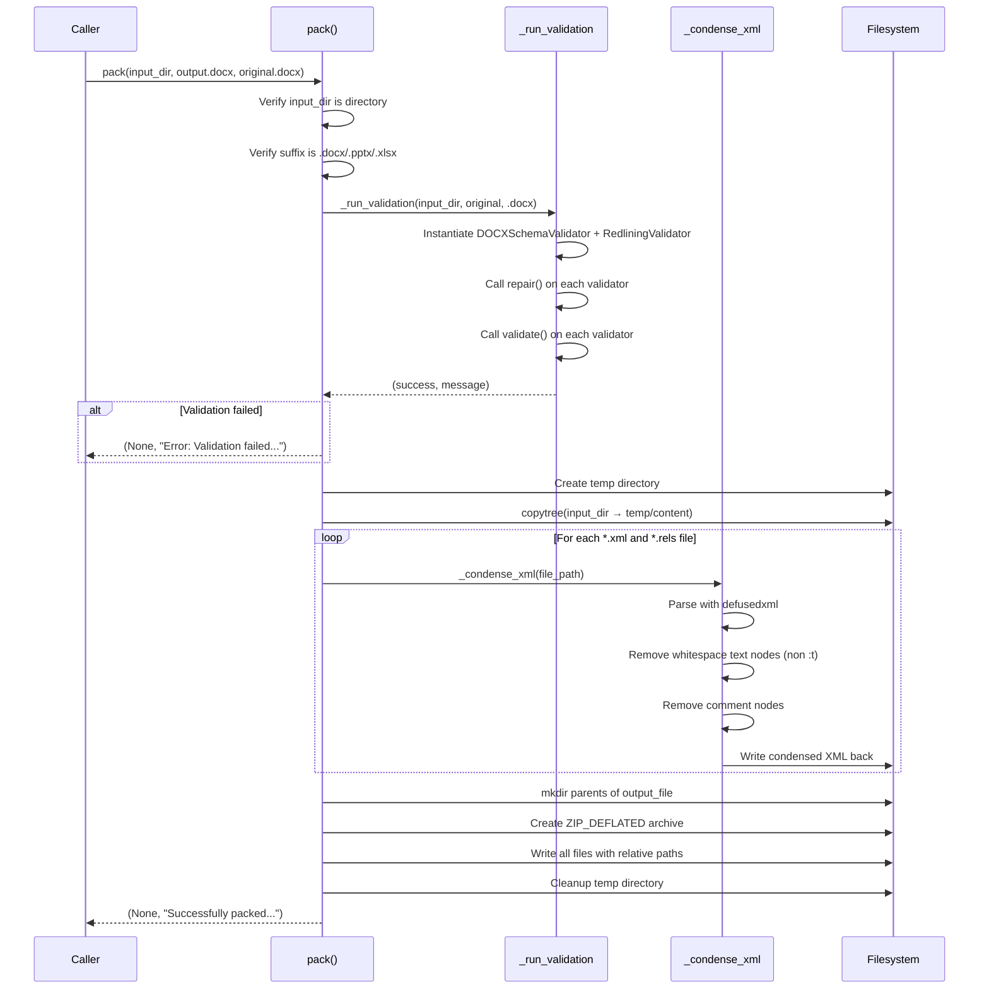
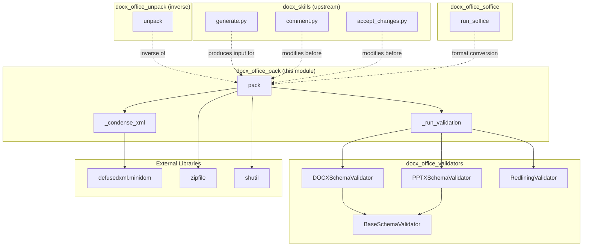
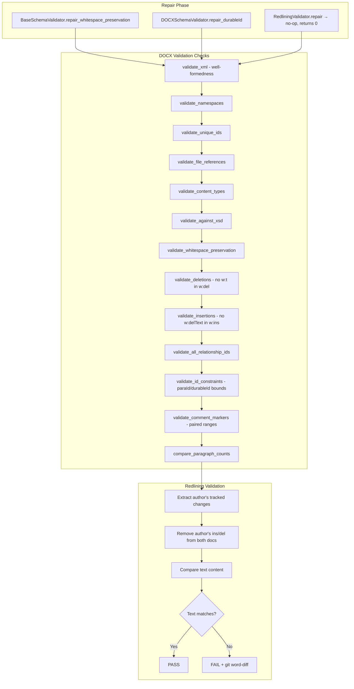

# docx_office_pack

## Introduction

The `docx_office_pack` module is the **final-stage packaging component** in the Anthropic DOCX document-skills pipeline. It takes a directory of unpacked Office XML parts (produced by the [docx_office_unpack](docx_office_unpack.md) module or modified by generation/comment/redlining scripts) and assembles them into a valid, compressed `.docx`, `.pptx`, or `.xlsx` file.

Before creating the output archive, `pack` optionally runs a full **validation-with-auto-repair** pass (delegated to the [docx_office_validators](docx_office_validators.md) module) and then **condenses** every XML and `.rels` file—stripping insignificant whitespace text nodes and XML comments—to produce a clean, minimal Office Open XML package.

---

## Architecture Overview



### Where Pack Fits in the Full DOCX Lifecycle



---

## Core Components

### `pack`

The primary entry point. Orchestrates the entire packaging workflow.

| Parameter | Type | Default | Description |
|-----------|------|---------|-------------|
| `input_directory` | `str` | — | Path to the unpacked Office document directory |
| `output_file` | `str` | — | Destination path; suffix must be `.docx`, `.pptx`, or `.xlsx` |
| `original_file` | `str \| None` | `None` | Original Office file used for validation comparison (redlining, XSD baseline) |
| `validate` | `bool` | `True` | Whether to run validation with auto-repair before packing |
| `infer_author_func` | `callable \| None` | `None` | Optional callback to infer the tracked-changes author name |

**Returns:** `tuple[None, str]` — `(None, message)` where message indicates success or error.

**Key behaviours:**

1. **Input validation** — Verifies the input directory exists and the output suffix is a supported Office format.
2. **Validation phase** — If `validate=True` and `original_file` is provided, delegates to `_run_validation`. If validation fails, packing is aborted.
3. **Temp-copy phase** — Copies the entire input directory to a temporary location so condensation never mutates the source.
4. **Condensation phase** — Iterates over all `*.xml` and `*.rels` files via `_condense_xml`.
5. **Archive phase** — Writes all files into a `ZIP_DEFLATED` archive at the output path, preserving relative directory structure.

---

### `_run_validation`

Internal function that instantiates and runs the appropriate validators based on the output file suffix.



**Validator selection logic:**

| Suffix | Validators Instantiated |
|--------|------------------------|
| `.docx` | `DOCXSchemaValidator` + `RedliningValidator` (with inferred or default author) |
| `.pptx` | `PPTXSchemaValidator` |
| `.xlsx` | *(none — validation passes trivially)* |

Each validator's `repair()` method is called first (auto-repair of whitespace preservation, durableId constraints, etc.), then `validate()` is called. The function returns `(success, output_message)`.

> **Note:** The validators themselves are documented in detail in [docx_office_validators](docx_office_validators.md).

---

### `_condense_xml`

Reduces the size and complexity of individual XML files by removing insignificant nodes.

**What it removes:**

| Node Type | Condition | Rationale |
|-----------|-----------|-----------|
| Text nodes | Whitespace-only (`.strip() == ""`) and parent is **not** a `*:t` element | Eliminates pretty-print indentation that bloats file size |
| Comment nodes | All XML comments | Office files do not require XML comments |

**What it preserves:**

- All element nodes and their attributes
- Text content inside `*:t` elements (e.g., `w:t`, `a:t`) — these carry actual document text where whitespace may be significant
- Text nodes with non-whitespace content

**Error handling:** If `defusedxml.minidom.parse` fails (malformed XML), the error is printed to `stderr` and the exception is re-raised, halting the pack operation. This prevents silently producing a corrupt output file.

**Output:** The condensed XML is written back to the same file using `dom.toxml(encoding="UTF-8")`.

---

## Data Flow



---

## Component Interaction Diagram



---

## Validation & Repair Flow (Detail)

The validation phase is the most complex part of packing. The diagram below shows the full repair-then-validate lifecycle for a `.docx` file:



> For full details on each validation check, see [docx_office_validators](docx_office_validators.md).

---

## CLI Usage

The module can be invoked directly from the command line:

```bash
python pack.py <input_directory> <output_file> [--original <file>] [--validate true|false]
```

**Examples:**

```bash
# Pack with full validation against an original file
python pack.py unpacked/ output.docx --original input.docx

# Pack without validation (faster, for trusted inputs)
python pack.py unpacked/ output.pptx --validate false

# Pack an XLSX (no validators currently defined)
python pack.py unpacked/ output.xlsx --original input.xlsx
```

**Exit codes:**
- `0` — Success
- `1` — Error (validation failure, invalid input, or packing error)

---

## Programmatic API

```python
from pack import pack

# Full validation with auto-repair
_, message = pack(
    input_directory="unpacked/",
    output_file="output.docx",
    original_file="original.docx",
    validate=True,
)
print(message)  # "Successfully packed unpacked/ to output.docx"

# Skip validation
_, message = pack(
    input_directory="unpacked/",
    output_file="output.docx",
    validate=False,
)

# With custom author inference
def my_author_func(unpacked_dir, original_file):
    # Custom logic to determine author name
    return "John Doe"

_, message = pack(
    input_directory="unpacked/",
    output_file="output.docx",
    original_file="original.docx",
    infer_author_func=my_author_func,
)
```

---

## Key Design Decisions

### 1. Temp-Directory Isolation
The input directory is **copied** to a temporary directory before condensation. This ensures the source files are never mutated, allowing re-packing or inspection of the original unpacked state after `pack` completes.

### 2. Validation is Optional but Recommended
Validation can be disabled (`validate=False`) for performance when the input is known to be correct (e.g., immediately after unpack without modifications). However, for any LLM-generated or modified content, validation should remain enabled to catch structural corruption.

### 3. Condensation Preserves Text Content
The `_condense_xml` function explicitly skips `*:t` elements (text-bearing elements like `w:t`, `a:t`) when removing whitespace nodes. This prevents accidental loss of significant whitespace in document text, which could alter rendering.

### 4. XLSX Has No Validators
Currently, no schema validators are implemented for `.xlsx` files. The `_run_validation` function returns `(True, None)` for XLSX, meaning validation always passes. This is a known limitation—XLSX files are packed without structural validation.

### 5. Author Inference for Redlining
For DOCX files with tracked changes, the `infer_author_func` callback allows the caller to dynamically determine which author's changes should be validated by the `RedliningValidator`. If inference fails, it falls back to `"Claude"` with a warning.

---

## Related Modules

| Module | Relationship |
|--------|-------------|
| [docx_office_unpack](docx_office_unpack.md) | **Inverse operation** — unpacks an Office file into a directory. `pack` reverses this process. |
| [docx_office_validators](docx_office_validators.md) | **Validation dependency** — provides `DOCXSchemaValidator`, `PPTXSchemaValidator`, and `RedliningValidator` used during the validation phase. |
| [docx_office_validate](docx_office_validate.md) | **Standalone validation** — CLI entry point for validation without packing. Shares the same validator classes. |
| [docx_office_soffice](docx_office_soffice.md) | **Format conversion** — LibreOffice (`soffice`) integration used for PDF rendering and format conversion of packed files. |
| [docx_office_simplify_redlines](docx_office_simplify_redlines.md) | **Pre-pack helper** — simplifies tracked changes in unpacked DOCX directories (called during unpack, not pack). |
| [docx_office_merge_runs](docx_office_merge_runs.md) | **Pre-pack helper** — merges adjacent XML runs in unpacked DOCX directories (called during unpack, not pack). |
| [docx_comment](docx_comment.md) | **Upstream modifier** — adds comments to an unpacked DOCX directory before packing. |
| [docx_accept_changes](docx_accept_changes.md) | **Upstream modifier** — accepts tracked changes in an unpacked DOCX directory before packing. |

---

## Error Handling Summary

| Scenario | Behaviour |
|----------|-----------|
| Input directory does not exist | Returns `(None, "Error: ... is not a directory")` |
| Output suffix unsupported | Returns `(None, "Error: ... must be a .docx, .pptx, or .xlsx file")` |
| Validation fails | Returns `(None, "Error: Validation failed for ...")` |
| XML parse error during condensation | Prints to `stderr` and **raises** exception (halts packing) |
| Successful pack | Returns `(None, "Successfully packed ... to ...")` |
