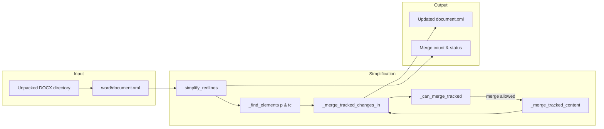
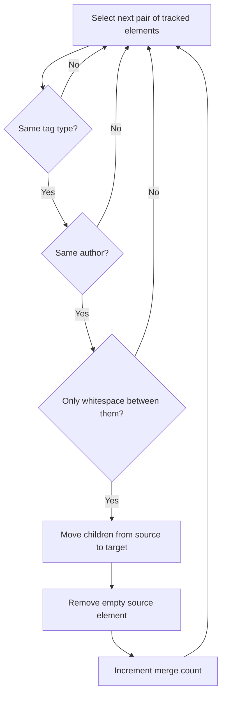
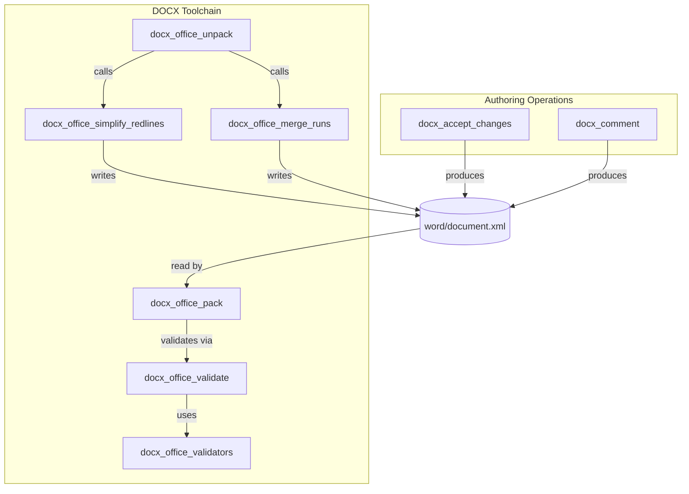
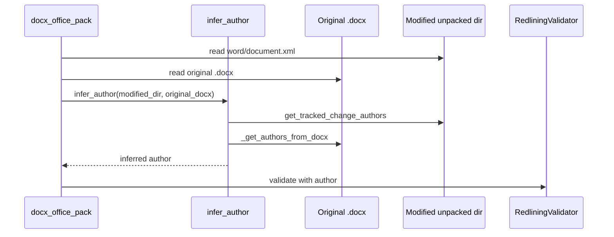
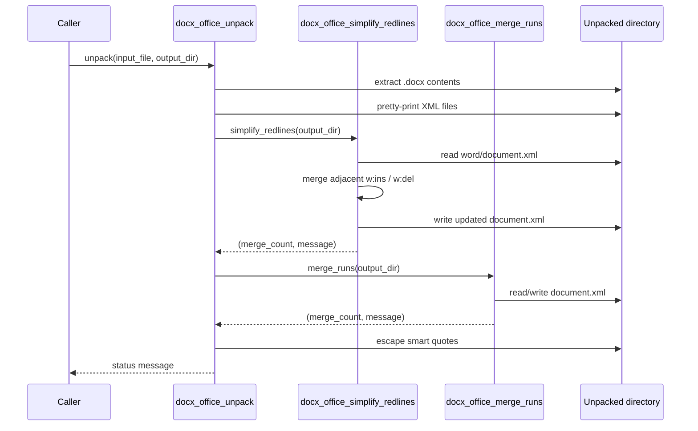

# docx_office_simplify_redlines

## Brief Introduction

`docx_office_simplify_redlines` is a helper module in the legacy Anthropic DocSkills DOCX toolchain. It reduces the complexity of heavily redlined Word documents by merging adjacent tracked-change elements (`<w:ins>` and `<w:del>`) that belong to the same author. The module operates directly on an unpacked DOCX `word/document.xml` tree and is normally invoked automatically during the unpack phase, before further editing or validation.

---

## Purpose and Core Functionality

Microsoft Word represents tracked changes as `<w:ins>` (insertions) and `<w:del>` (deletions) elements in `word/document.xml`. When an agent or user makes many small edits, the document can accumulate a large number of these wrappers, making downstream XML manipulation slower, harder to validate, and more error-prone.

This module consolidates those wrappers by:

1. Scanning all paragraph (`<w:p>`) and table-cell (`<w:tc>`) containers.
2. Finding sequences of adjacent `<w:ins>` or `<w:del>` elements.
3. Merging adjacent elements only when they:
   - Have the same tag type (`ins` with `ins`, `del` with `del`).
   - Have the same `w:author` attribute (timestamps are ignored).
   - Are truly adjacent, with only whitespace between them.
4. Moving all child nodes from the source element into the target element and removing the now-empty source.

In addition to the merge logic, the module provides utilities for inspecting tracked-change authorship:

- `get_tracked_change_authors` counts tracked-change elements per author in an unpacked `document.xml`.
- `_get_authors_from_docx` extracts the same counts directly from a packed `.docx` file.
- `infer_author` compares the author counts between a modified unpacked document and the original `.docx` to determine which author introduced new tracked changes. This is used by the validation pipeline when an explicit author is not supplied.

---

## Core Components

### `simplify_redlines(input_dir: str) -> tuple[int, str]`

Entry point for the simplification process. It parses `word/document.xml` from the supplied unpacked DOCX directory, merges adjacent tracked-change wrappers inside paragraphs and table cells, writes the modified DOM back to disk, and returns the number of merges performed along with a status message.

### `_merge_tracked_changes_in(container, tag: str) -> int`

Performs a single pass over the children of a container node, collecting all elements matching the requested tag (`ins` or `del`), then iteratively merges each element with its next sibling when `_can_merge_tracked` returns `True`.

### `_can_merge_tracked(elem1, elem2) -> bool`

Determines whether two tracked-change elements can be merged. It checks that both elements share the same author and that no non-whitespace elements or text nodes appear between them.

### `_merge_tracked_content(target, source)`

Moves every child node from `source` into `target` in order, then leaves `source` empty so the caller can remove it from the DOM.

### `_is_element(node, tag: str) -> bool`

Namespace-aware helper that matches a DOM node against a local tag name, handling both prefixed (`w:ins`) and non-prefixed (`ins`) forms.

### `_find_elements(root, tag: str) -> list`

Recursively walks the DOM tree and returns all elements whose local name matches the requested tag.

### `infer_author(modified_dir, original_docx, default="Claude") -> str`

Compares tracked-change author counts between a modified unpacked document and the original packed `.docx`. If exactly one author has more tracked changes in the modified version, that author is returned. If no new changes are detected, the default author is returned. If multiple authors appear to have added changes, a `ValueError` is raised.

---

## Architecture

The module is a pure XML-processing helper. It has no external service dependencies beyond Python's standard library, `defusedxml`, and the local filesystem. It expects an already-unpacked DOCX directory produced by the unpack step.

### Merge Decision Flow

---

## Component Relationships

`docx_office_simplify_redlines` is one of several helper modules that operate on unpacked Office XML. It is most closely related to the merge-runs helper and the pack/unpack/validate tooling.

### Relationship with Validation

The `infer_author` utility is consumed by the pack/validation pipeline. When a modified document is packed, the validator may need to know which author to attribute new tracked changes to. By comparing author counts against the original document, `infer_author` resolves that value automatically.

---

## How It Fits into the Overall System

This module belongs to the legacy `ainxt_docskills` DOCX skill set under `shared_skills`. It supports agentic document editing by keeping the underlying Office XML clean and predictable. The simplification step is transparent to end users but critical for reliable downstream behavior:

- **Unpack**: When a DOCX is unpacked for editing, `simplify_redlines` and `merge_runs` are applied automatically to normalize the XML.
- **Edit**: Agents or scripts modify the normalized XML, adding or removing tracked changes.
- **Pack**: Before repacking, the validation layer may call `infer_author` to determine which tracked changes belong to the editing agent.
- **Validate**: `RedliningValidator` confirms that removing the inferred author's tracked changes restores the original document text.

The same simplification pattern is reused for other Office formats. See [pptx_office_simplify_redlines](pptx_office_simplify_redlines.md) and [xlsx_office_simplify_redlines](xlsx_office_simplify_redlines.md) for the PowerPoint and Excel variants.

---

## Data Flow During Unpack

---

## Error Handling

The module uses defensive error handling:

- If `word/document.xml` is missing, it returns `(0, "Error: ...")` rather than raising.
- XML parse errors and unexpected exceptions are caught in `simplify_redlines` and returned as error messages.
- `infer_author` raises `ValueError` only when multiple authors appear to have added new tracked changes, signaling that the caller must disambiguate the author manually.

---

## References

- [docx_office_unpack](docx_office_unpack.md) — extracts DOCX contents and invokes this module.
- [docx_office_merge_runs](docx_office_merge_runs.md) — merges adjacent text runs, often called alongside simplification.
- [docx_office_pack](docx_office_pack.md) — repacks the unpacked directory and may use `infer_author` for validation.
- [docx_office_validate](docx_office_validate.md) — command-line validation entry point.
- [docx_office_validators](docx_office_validators.md) — contains `RedliningValidator`, which consumes inferred authors.
- [docx_accept_changes](docx_accept_changes.md) — accepts all tracked changes via LibreOffice.
- [docx_comment](docx_comment.md) — adds comments to a DOCX document.
- [pptx_office_simplify_redlines](pptx_office_simplify_redlines.md) — PowerPoint variant of this helper.
- [xlsx_office_simplify_redlines](xlsx_office_simplify_redlines.md) — Excel variant of this helper.
