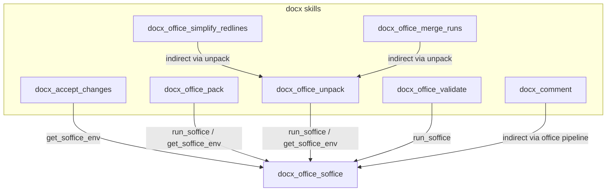
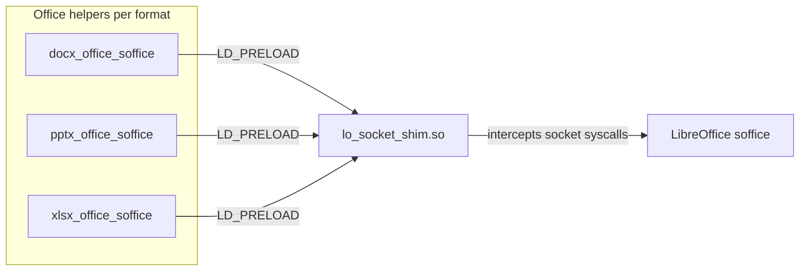
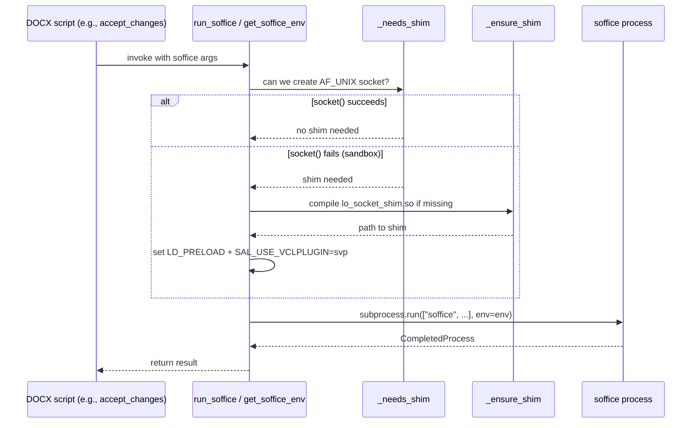
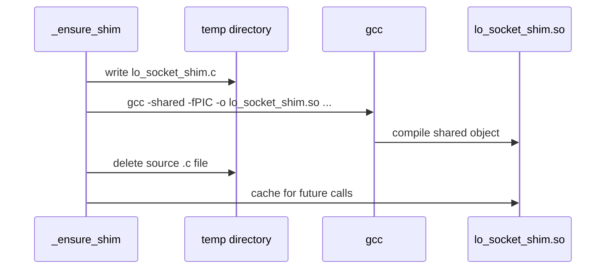
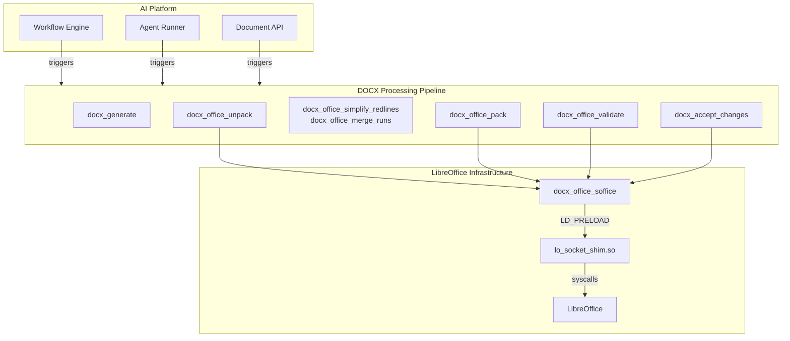

# docx_office_soffice

## Brief Introduction

`docx_office_soffice` is a low-level runtime helper that wraps calls to LibreOffice (`soffice`) for DOCX/PPTX/XLSX document processing. Its primary responsibility is to detect sandboxed environments where `AF_UNIX` domain sockets are blocked (common in hardened containers, serverless runtimes, or restricted VMs) and transparently apply an `LD_PRELOAD` shim so LibreOffice can still perform headless conversions and macro execution.

The module is part of the broader **docx skills** family under `skills\ainxt_docskills\docx\scripts\office\` and is consumed by higher-level document operations such as unpacking, packing, accepting tracked changes, and generating documents.

---

## Purpose and Core Functionality

LibreOffice's headless mode normally creates `AF_UNIX` sockets for inter-process communication. In restricted execution environments, creating these sockets fails with `EPERM`, causing conversions and macro runs to crash. `docx_office_soffice` solves this by:

1. **Runtime capability detection** (`_needs_shim`) – probes whether `AF_UNIX` sockets can be created.
2. **Dynamic shim compilation** (`_ensure_shim`) – writes, compiles, and caches a small C shared object that intercepts `socket`, `listen`, `accept`, and `close` syscalls.
3. **Environment preparation** (`get_soffice_env`) – returns an environment dict with `SAL_USE_VCLPLUGIN=svp` and, when needed, `LD_PRELOAD` pointing to the shim.
4. **Convenient execution wrapper** (`run_soffice`) – runs `soffice` with the prepared environment.

### Core Components

| Component | File | Responsibility |
|-----------|------|----------------|
| `run_soffice` | `skills\ainxt_docskills\docx\scripts\office\soffice.py` | Public API: executes `soffice <args>` with the corrected environment. |
| `get_soffice_env` | `skills\ainxt_docskills\docx\scripts\office\soffice.py` | Builds the environment dict used by `run_soffice` and by external callers that spawn their own subprocess. |
| `_needs_shim` | `skills\ainxt_docskills\docx\scripts\office\soffice.py` | Probes `socket(AF_UNIX, SOCK_STREAM)` to decide if the shim is required. |
| `_ensure_shim` | `skills\ainxt_docskills\docx\scripts\office\soffice.py` | Compiles the C shim on demand and caches it in the system temp directory. |

### The C Shim

The shim (`_SHIM_SOURCE`) is compiled into `lo_socket_shim.so` in the temp directory. It intercepts:

- `socket(AF_UNIX, ...)` – falls back to `socketpair()` when the real `socket()` call fails.
- `listen()` – no-ops for shimmed file descriptors.
- `accept()` – blocks on an internal pipe until `close()` signals completion, then returns `ECONNABORTED`.
- `close()` – tears down the shimmed FD bookkeeping and, for the listener FD, terminates the process (`_exit(0)`) to signal that the conversion is done.

This allows LibreOffice to believe it is using its normal socket-based IPC while actually using `socketpair` + pipes, bypassing the sandbox restriction.

---

## Architecture and Component Relationships

### Within the docx Office Toolkit

`docx_office_soffice` sits at the bottom of the DOCX office stack. It is a pure infrastructure utility with no business logic of its own; every other office module that needs to spawn LibreOffice depends on it either directly or indirectly.



### Cross-Format Reuse

The same `soffice.py` pattern is duplicated for **pptx skills** and **xlsx skills** (`pptx_office_soffice`, `xlsx_office_soffice`). These modules share identical logic because the underlying LibreOffice sandbox problem is format-agnostic. Changes to `docx_office_soffice` should generally be mirrored in those siblings.



---

## Data Flow

### Normal Execution Path



### Shim Lifecycle



---

## How It Fits into the Overall System

`docx_office_soffice` is a foundational enabler for the document-generation and document-manipulation capabilities of the platform. Without it, any headless LibreOffice operation would fail in sandboxed deployments.

### Upstream Consumers

| Consumer Module | Usage | See Also |
|-----------------|-------|----------|
| `docx_accept_changes` | Calls `get_soffice_env()` before running a LibreOffice Basic macro to accept all tracked changes. | [docx_accept_changes](docx_accept_changes.md) |
| `docx_office_pack` | Uses `run_soffice` for validation and final assembly of `.docx` files. | [docx_office_pack](docx_office_pack.md) |
| `docx_office_unpack` | Uses `run_soffice` when converting or inspecting Office packages. | [docx_office_unpack](docx_office_unpack.md) |
| `docx_office_validate` | Invokes LibreOffice through `run_soffice` for schema/redlining validation. | [docx_office_validate](docx_office_validate.md) |
| `docx_office_simplify_redlines` / `docx_office_merge_runs` | Post-processing helpers called after `unpack`; do not call soffice directly but live in the same office pipeline. | [docx_office_simplify_redlines](docx_office_simplify_redlines.md), [docx_office_merge_runs](docx_office_merge_runs.md) |

### System Context



---

## API Reference

### `run_soffice(args: list[str], **kwargs) -> subprocess.CompletedProcess`

Executes `soffice` with the arguments provided in `args`, using the environment prepared by `get_soffice_env`. Extra keyword arguments are forwarded to `subprocess.run`.

**Example:**

```python
from office.soffice import run_soffice

result = run_soffice(["--headless", "--convert-to", "pdf", "input.docx"])
```

### `get_soffice_env() -> dict`

Returns a copy of the current process environment with:

- `SAL_USE_VCLPLUGIN=svp` – forces LibreOffice to use the SVP (headless) VCL plugin.
- `LD_PRELOAD=<path_to_shim>` – only when `_needs_shim()` returns `True`.

Use this when you need to spawn `soffice` yourself rather than going through `run_soffice`.

**Example:**

```python
import subprocess
from office.soffice import get_soffice_env

env = get_soffice_env()
subprocess.run(["soffice", "--version"], env=env)
```

### `_needs_shim() -> bool`

Internal probe. Returns `True` if `socket.socket(AF_UNIX, SOCK_STREAM)` raises `OSError`, indicating that the environment blocks Unix domain sockets.

### `_ensure_shim() -> Path`

Internal helper. Ensures `lo_socket_shim.so` exists in the system temp directory, compiling it from the embedded C source if necessary. Returns the absolute path to the shared object.

---

## Operational Considerations

- **GCC dependency:** `_ensure_shim` requires `gcc` to be available on the host at runtime. If the shim is pre-built and cached, subsequent calls skip compilation.
- **Temp directory:** The shim is stored in `tempfile.gettempdir() / "lo_socket_shim.so"`. Ensure the temp directory is writable and persists across the process lifetime.
- **Security:** The shim uses `dlsym(RTLD_NEXT, ...)` to wrap libc functions and calls `_exit(0)` on listener close. It is intended only for trusted, headless LibreOffice conversions.
- **Format siblings:** The identical pattern is used by `pptx_office_soffice` and `xlsx_office_soffice`. Consider centralizing the helper if maintenance becomes burdensome.

---

## Related Modules

- [docx_accept_changes](docx_accept_changes.md) – accepts all tracked changes in a DOCX file using a LibreOffice macro.
- [docx_office_pack](docx_office_pack.md) – packs an unpacked Office XML tree back into a `.docx`/`.pptx`/`.xlsx` archive.
- [docx_office_unpack](docx_office_unpack.md) – unpacks an Office archive into an editable XML directory tree.
- [docx_office_validate](docx_office_validate.md) – validates Office documents against schema and redlining rules.
- [docx_office_simplify_redlines](docx_office_simplify_redlines.md) – simplifies tracked changes in DOCX XML.
- [docx_office_merge_runs](docx_office_merge_runs.md) – merges adjacent text runs in DOCX XML.
- [pptx_office_soffice](pptx_office_soffice.md) – equivalent helper for PPTX processing.
- [xlsx_office_soffice](xlsx_office_soffice.md) – equivalent helper for XLSX processing.
