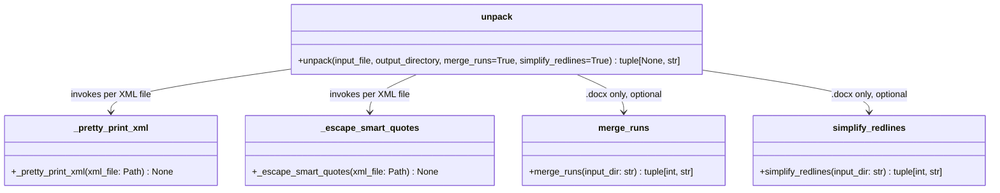
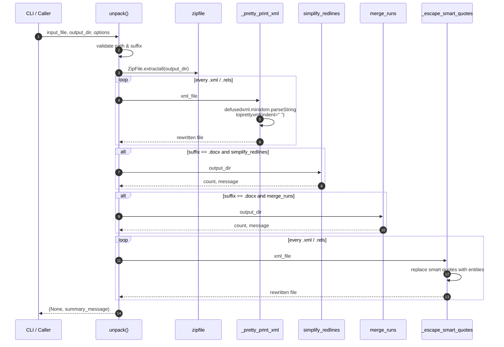

# docx_office_unpack

## Brief Introduction

`docx_office_unpack` is a utility module in the `ainxt_docskills` skill set that extracts Office Open XML files (`.docx`, `.pptx`, `.xlsx`) into editable directory trees. It is the first step in a round-trip document editing workflow: unpack → edit XML → pack. For `.docx` files, it can additionally normalize the XML by merging adjacent runs with identical formatting and collapsing adjacent tracked changes from the same author, making hand-edits and downstream diffing more predictable.

---

## Comprehensive Documentation

### 1. Module Purpose and Core Functionality

The module exposes a single public entry point, `unpack()`, plus two internal helpers:

| Component | Visibility | Responsibility |
|-----------|------------|----------------|
| `unpack()` | Public | Validates the input Office file, extracts the ZIP archive, pretty-prints all XML parts, optionally normalizes `document.xml`, and escapes smart quotes to XML entities. |
| `_pretty_print_xml()` | Private | Parses an XML file with `defusedxml.minidom` and rewrites it with consistent two-space indentation. |
| `_escape_smart_quotes()` | Private | Replaces Unicode curly quotes with numeric XML entities so they survive round-trip edits. |

Supported formats:

- `.docx` — WordprocessingML. Optional post-processing via `merge_runs` and `simplify_redlines`.
- `.pptx` — PresentationML. Extracted and pretty-printed only.
- `.xlsx` — SpreadsheetML. Extracted and pretty-printed only.

The module is designed to be invoked both as a CLI script and as a library function from other skill scripts.

### 2. Architecture

```mermaid
flowchart TB
    subgraph Input
        OFFICE[Office file<br/>.docx | .pptx | .xlsx]
    end

    subgraph docx_office_unpack
        UNPACK[unpack]
        PP[_pretty_print_xml]
        ESC[_escape_smart_quotes]
    end

    subgraph DOCX_only_helpers
        MR[merge_runs]
        SR[simplify_redlines]
    end

    OFFICE --> UNPACK
    UNPACK -->|extract ZIP| OUTDIR[output directory]
    UNPACK -->|for each .xml / .rels| PP
    PP --> OUTDIR
    UNPACK -->|if .docx + simplify_redlines| SR
    UNPACK -->|if .docx + merge_runs| MR
    SR --> OUTDIR
    MR --> OUTDIR
    UNPACK -->|final pass| ESC
    ESC --> OUTDIR
```

### 3. Component Relationships



### 4. Data Flow



### 5. Process Flows

#### 5.1 CLI Usage

```bash
python unpack.py document.docx unpacked/
python unpack.py presentation.pptx unpacked/
python unpack.py document.docx unpacked/ --merge-runs false
```

The CLI parses four arguments:

1. `input_file` — source Office file.
2. `output_directory` — destination for extracted contents.
3. `--merge-runs true|false` — default `true`; DOCX only.
4. `--simplify-redlines true|false` — default `true`; DOCX only.

If the returned message contains `"Error"`, the process exits with code `1`.

#### 5.2 Library Usage

```python
from unpack import unpack

_, message = unpack(
    "report.docx",
    "report_unpacked",
    merge_runs=True,
    simplify_redlines=True,
)
print(message)
```

### 6. Error Handling

The function returns `(None, message)` for all outcomes rather than raising exceptions to the caller:

| Scenario | Returned message |
|----------|------------------|
| Input file does not exist | `Error: <file> does not exist` |
| Wrong extension | `Error: <file> must be a .docx, .pptx, or .xlsx file` |
| Corrupted ZIP | `Error: <file> is not a valid Office file` |
| Unexpected exception | `Error unpacking: <exception>` |

XML pretty-printing and smart-quote escaping silently ignore per-file failures so that a single malformed part does not abort the entire unpack.

### 7. Smart Quote Escaping

Curly quotes are replaced with numeric XML entities before the files are left on disk:

| Character | Entity |
|-----------|--------|
| Left double quotation mark `"` | `&#x201C;` |
| Right double quotation mark `"` | `&#x201D;` |
| Left single quotation mark `'` | `&#x2018;` |
| Right single quotation mark `'` | `&#x2019;` |

This preserves typographic quotes through manual edits and prevents encoding ambiguities when the XML is later condensed and repacked.

### 8. How It Fits into the Overall System

`docx_office_unpack` is one node in the Office document round-trip pipeline used by the `ainxt_docskills` skill family:


The module is typically invoked from higher-level document skills or from the `soffice` helper when LibreOffice-based conversion is required. It is intentionally format-agnostic at the ZIP level and delegates DOCX-specific XML normalization to dedicated helper modules.

---

## References

- Inverse operation: [docx_office_pack.md](docx_office_pack.md)
- DOCX run merging helper: [docx_office_merge_runs.md](docx_office_merge_runs.md)
- DOCX tracked-change simplification helper: [docx_office_simplify_redlines.md](docx_office_simplify_redlines.md)
- Schema validation entry point: [docx_office_validate.md](docx_office_validate.md)
- LibreOffice runner: [docx_office_soffice.md](docx_office_soffice.md)
- Equivalent unpacker for presentations: [pptx_office_unpack.md](pptx_office_unpack.md)
- Equivalent unpacker for spreadsheets: [xlsx_office_unpack.md](xlsx_office_unpack.md)
- Parent skill family overview: [docskills_legacy.md](../agents/docskills_legacy.md)
