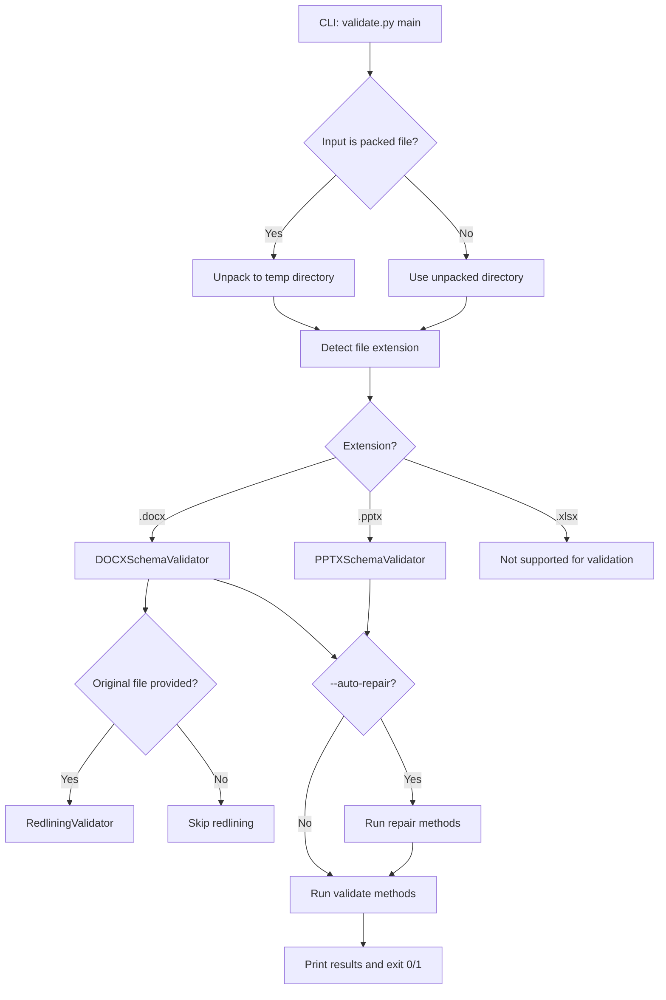
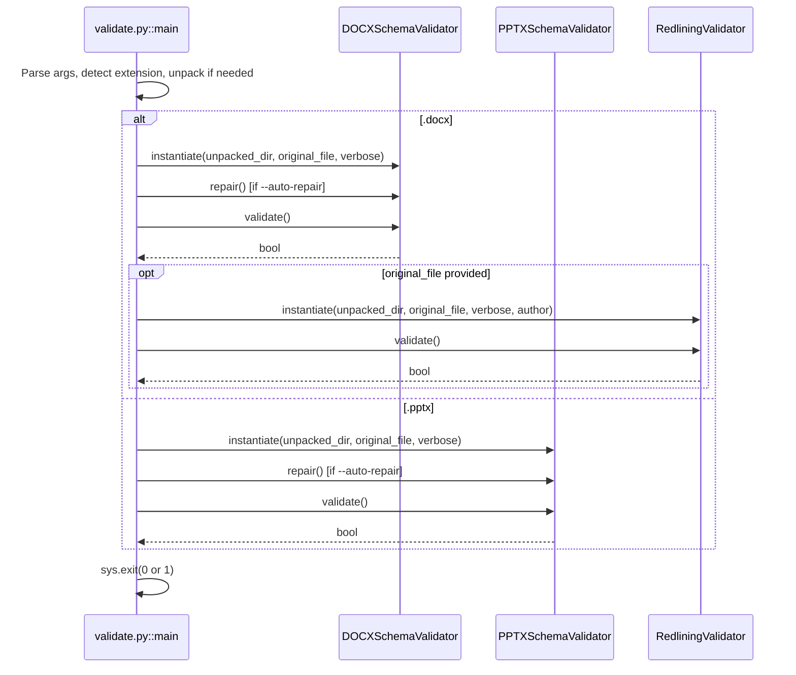

# docx_office_validate

## Brief Introduction

`docx_office_validate` is a command-line validation entry point for Microsoft Office Open XML documents (`.docx`, `.pptx`, `.xlsx`). It checks unpacked Office document XML trees against OOXML XSD schemas, validates package integrity, and verifies tracked changes (redlining) against an original file. The tool is part of the `ainxt_docskills` document-processing skill set and is typically invoked after document generation or modification to ensure the produced file is well-formed and will open correctly in Office applications.

## Purpose and Core Functionality

The module exposes a single CLI command, `main`, that performs the following:

1. **Accepts an Office document** — either an unpacked directory of XML files or a packed `.docx`/`.pptx`/`.xlsx` archive.
2. **Optionally accepts an original file** — used as a baseline for XSD error comparison and for redlining validation.
3. **Selects validators** based on the detected file extension:
   - `.docx` → `DOCXSchemaValidator` + optional `RedliningValidator`
   - `.pptx` → `PPTXSchemaValidator`
4. **Optionally auto-repairs** common issues such as:
   - `paraId`/`durableId` values that exceed OOXML limits
   - Missing `xml:space="preserve"` on `w:t` elements containing leading/trailing whitespace
5. **Runs validation** and exits with status `0` on success or `1` on failure.

### Command-Line Interface

```text
python validate.py <path> [--original <original_file>] [--auto-repair] [--author NAME] [-v]
```

| Argument | Description |
|----------|-------------|
| `path` | Unpacked directory or packed Office file to validate. |
| `--original` | Optional original `.docx`/`.pptx`/`.xlsx` used as a baseline. When omitted, all XSD errors are reported and redlining validation is skipped. |
| `--auto-repair` | Automatically repair common issues (hex IDs, whitespace preservation). |
| `--author` | Author name for redlining validation (default: `Claude`). |
| `-v`, `--verbose` | Enable verbose output. |

## Architecture and Component Relationships

### High-Level Architecture



### Component Interaction



### Core Component

#### `main`

Located in `skills\ainxt_docskills\docx\scripts\office\validate.py`, `main` is the only public entry point. It orchestrates argument parsing, file detection, unpacking, validator selection, optional repair, and final reporting.

Key responsibilities:

- **Path resolution**: Ensures the provided path exists and determines whether it is a packed Office file or an unpacked directory.
- **Original file handling**: Validates that `--original` points to a supported Office file when provided.
- **Extension detection**: Uses the original file or input path to determine the document type.
- **Temporary unpacking**: If a packed file is supplied, extracts it to a temporary directory using `zipfile`.
- **Validator assembly**: Builds a list of validator instances appropriate for the document type.
- **Repair and validation**: Optionally calls `repair()` on each validator, then calls `validate()` and aggregates results.
- **Process exit**: Returns exit code `0` when all validators pass and `1` otherwise.

## Validation Coverage

The actual validation logic is delegated to the validator classes defined in the sibling module `docx_office_validators`. `validate.py` itself does not implement domain-specific checks; it only wires the validators together.

| Concern | Handled By | See Also |
|---------|-----------|----------|
| XML well-formedness | `BaseSchemaValidator.validate_xml()` | [docx_office_validators.md](docx_office_validators.md) |
| Namespace declaration | `BaseSchemaValidator.validate_namespaces()` | [docx_office_validators.md](docx_office_validators.md) |
| Unique ID checks | `BaseSchemaValidator.validate_unique_ids()` | [docx_office_validators.md](docx_office_validators.md) |
| File/relationship references | `BaseSchemaValidator.validate_file_references()` | [docx_office_validators.md](docx_office_validators.md) |
| Relationship ID consistency | `BaseSchemaValidator.validate_all_relationship_ids()` | [docx_office_validators.md](docx_office_validators.md) |
| `[Content_Types].xml` declarations | `BaseSchemaValidator.validate_content_types()` | [docx_office_validators.md](docx_office_validators.md) |
| XSD schema validation | `BaseSchemaValidator.validate_against_xsd()` | [docx_office_validators.md](docx_office_validators.md) |
| DOCX-specific checks | `DOCXSchemaValidator.validate()` | [docx_office_validators.md](docx_office_validators.md) |
| PPTX-specific checks | `PPTXSchemaValidator.validate()` | [docx_office_validators.md](docx_office_validators.md) |
| Tracked-changes integrity | `RedliningValidator.validate()` | [docx_office_validators.md](docx_office_validators.md) |
| Auto-repair (whitespace, IDs) | `BaseSchemaValidator.repair()` / `DOCXSchemaValidator.repair()` | [docx_office_validators.md](docx_office_validators.md) |

## How It Fits into the Overall System

`docx_office_validate` sits at the end of the document-generation pipeline within the `ainxt_docskills` skill set. It is typically invoked by other scripts or build steps after a document has been generated, modified, or packed.

### Position in the Document Pipeline

```mermaid
flowchart LR
    A[Document generation/modification] --> B[docx_office_unpack](docx_office_unpack.md)
    B --> C[XML transformation / redlining]
    C --> D[docx_office_pack](docx_office_pack.md)
    D --> E[docx_office_validate]
    E -->|Pass| F[Deliver document]
    E -->|Fail| G[Repair or reject]
```

### Related Modules

- **[docx_office_validators.md](docx_office_validators.md)** — Implements `BaseSchemaValidator`, `DOCXSchemaValidator`, `PPTXSchemaValidator`, and `RedliningValidator`. This is where the actual validation rules live.
- **[docx_office_pack.md](docx_office_pack.md)** — Packs an unpacked Office document directory back into a `.docx`/`.pptx`/`.xlsx` archive. The output of `pack` is a natural input for `validate`.
- **[docx_office_unpack.md](docx_office_unpack.md)** — Unpacks a packed Office file into an XML directory. `validate.py` performs the same unpacking internally when given a packed file.
- **[docx_office_soffice.md](docx_office_soffice.md)** — LibreOffice/soffice integration used for round-trip conversion; validation can be run before or after soffice processing.
- **[docx_office_merge_runs.md](docx_office_merge_runs.md)** and **[docx_office_simplify_redlines.md](docx_office_simplify_redlines.md)** — Pre-validation transformation helpers that normalize runs and tracked changes.
- **[docx_accept_changes.md](docx_accept_changes.md)** and **[docx_comment.md](docx_comment.md)** — Other document-manipulation scripts that may produce input for validation.

## Usage Examples

### Validate an unpacked DOCX directory

```bash
python skills/ainxt_docskills/docx/scripts/office/validate.py ./unpacked_docx/
```

### Validate a packed DOCX against its original with auto-repair

```bash
python skills/ainxt_docskills/docx/scripts/office/validate.py \
  ./modified.docx \
  --original ./original.docx \
  --auto-repair \
  --author "Claude" \
  -v
```

### Validate a packed PPTX

```bash
python skills/ainxt_docskills/docx/scripts/office/validate.py ./presentation.pptx
```

## Exit Codes

| Exit Code | Meaning |
|-----------|---------|
| `0` | All selected validations passed. |
| `1` | One or more validations failed, or the file type is unsupported. |

## Notes

- `.xlsx` files are detected but not currently validated; the tool exits with an error if an `.xlsx` is supplied.
- When `--original` is omitted, redlining validation is skipped and all XSD errors are reported as new errors rather than being diffed against a baseline.
- The auto-repair feature modifies files in place when run against an unpacked directory. When run against a packed file, repairs are applied to the temporary unpacked copy and are not automatically repacked.
