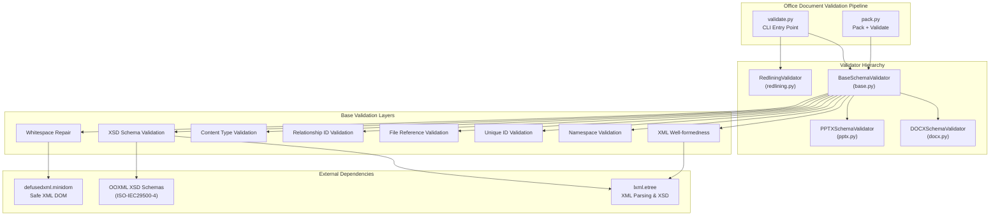
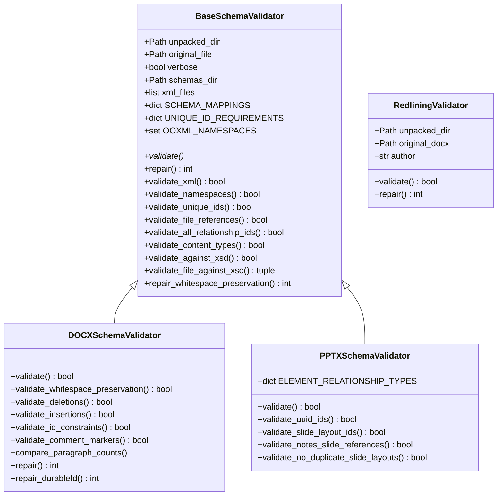
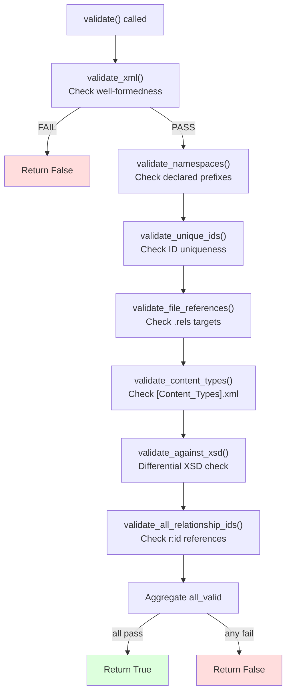
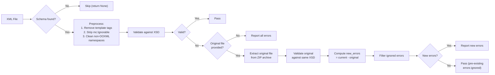
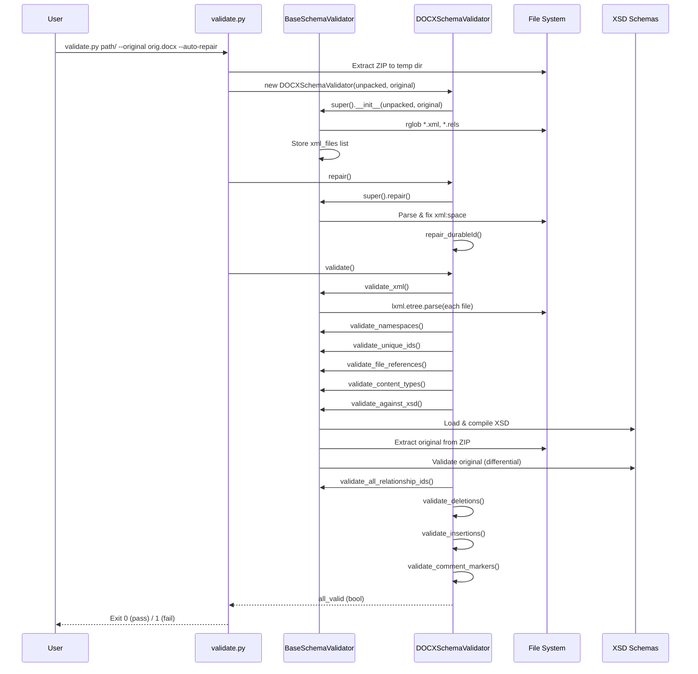
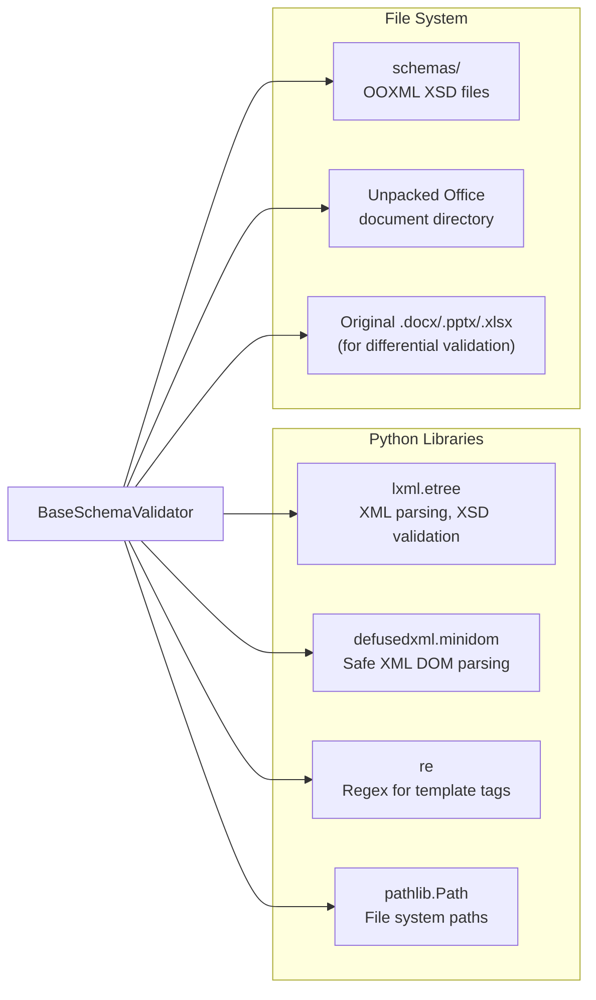

# docx_office_validators_base

## Introduction

The `docx_office_validators_base` module provides the foundational `BaseSchemaValidator` class — the abstract base for all OOXML (Office Open XML) document validation in the Anthropic doc-skills suite. It encapsulates common validation logic shared across DOCX, PPTX, and XLSX document formats, ensuring that programmatically generated or modified Office documents remain structurally sound and openable in Microsoft Office and other conformant applications.

The validator operates on **unpacked** Office document directories (the raw XML parts extracted from a `.docx`/`.pptx`/`.xlsx` ZIP archive) and performs a multi-layered validation pass: XML well-formedness, namespace correctness, ID uniqueness, relationship integrity, content-type declarations, and XSD schema conformance. It also includes an auto-repair mechanism for common issues such as missing `xml:space="preserve"` attributes.

---

## Architecture Overview



## Class Hierarchy & Inheritance



> **Note:** `RedliningValidator` does **not** inherit from `BaseSchemaValidator`. It is a standalone validator that checks tracked-changes (redlining) correctness by comparing the modified document against the original. See [docx_office_validators_redlining](../docx_office_validators_redlining.md) for details.

---

## Core Component: `BaseSchemaValidator`

### Purpose

`BaseSchemaValidator` is the shared base class that implements all format-agnostic validation logic for OOXML documents. It is designed to be subclassed by format-specific validators (`DOCXSchemaValidator`, `PPTXSchemaValidator`) that override the `validate()` method to orchestrate the appropriate combination of base and format-specific checks.

### Constructor

```python
def __init__(self, unpacked_dir, original_file=None, verbose=False)
```

| Parameter | Type | Description |
|-----------|------|-------------|
| `unpacked_dir` | `str` / `Path` | Path to the unpacked Office document directory (extracted ZIP contents) |
| `original_file` | `str` / `Path` / `None` | Path to the original packed Office file (`.docx`/`.pptx`/`.xlsx`). Used for differential XSD validation — only **new** errors introduced by modifications are reported. |
| `verbose` | `bool` | If `True`, prints PASSED messages for each successful validation check |

During initialization, the validator:
1. Resolves and stores the unpacked directory path
2. Locates the XSD schemas directory (sibling `schemas/` folder)
3. Discovers all `*.xml` and `*.rels` files recursively in the unpacked directory

### Class-Level Configuration

#### `SCHEMA_MAPPINGS`

Maps file patterns to their corresponding XSD schema files under the `schemas/` directory. This enables automatic schema selection during XSD validation:

| Pattern | Schema File | Covers |
|---------|-------------|--------|
| `word` | `ISO-IEC29500-4_2016/wml.xsd` | WordprocessingML (DOCX) |
| `ppt` | `ISO-IEC29500-4_2016/pml.xsd` | PresentationML (PPTX) |
| `xl` | `ISO-IEC29500-4_2016/sml.xsd` | SpreadsheetML (XLSX) |
| `[Content_Types].xml` | `ecma/.../opc-contentTypes.xsd` | OPC content types |
| `.rels` | `ecma/.../opc-relationships.xsd` | OPC relationships |
| `app.xml` | `shared-documentPropertiesExtended.xsd` | Extended document properties |
| `core.xml` | `ecma/.../opc-coreProperties.xsd` | Core document properties |
| `chart` | `dml-chart.xsd` | DrawingML charts |
| `theme` | `dml-main.xsd` | DrawingML themes |
| `people.xml` | `microsoft/wml-2012.xsd` | Word 2012 people |
| `commentsIds.xml` | `microsoft/wml-cid-2016.xsd` | Word 2016 comment IDs |
| `commentsExtensible.xml` | `microsoft/wml-cex-2018.xsd` | Word 2018 extensible comments |
| `commentsExtended.xml` | `microsoft/wml-2012.xsd` | Word 2012 extended comments |

#### `UNIQUE_ID_REQUIREMENTS`

Defines which XML elements require unique IDs and the scope of uniqueness:

| Element Tag | ID Attribute | Scope | Description |
|-------------|-------------|-------|-------------|
| `comment` | `id` | file | Comment IDs unique within file |
| `commentrangestart` | `id` | file | Comment range start markers |
| `commentrangeend` | `id` | file | Comment range end markers |
| `bookmarkstart` | `id` | file | Bookmark start markers |
| `bookmarkend` | `id` | file | Bookmark end markers |
| `sldid` | `id` | file | Slide IDs (PPTX) |
| `sldmasterid` | `id` | **global** | Slide master IDs (PPTX) — unique across entire package |
| `sldlayoutid` | `id` | **global** | Slide layout IDs (PPTX) — unique across entire package |
| `cm` | `authorid` | file | Comments (PPTX) |
| `sheet` | `sheetid` | file | Worksheet IDs (XLSX) |
| `definedname` | `id` | file | Defined names (XLSX) |
| `cxnsp` / `sp` / `pic` / `grpsp` | `id` | file | DrawingML shapes |

#### `OOXML_NAMESPACES`

A set of recognized OOXML namespace URIs. Elements/attributes using namespaces **not** in this set are treated as "ignorable" and stripped before XSD validation (implementing the Markup Compatibility `mc:Ignorable` mechanism).

#### `IGNORED_VALIDATION_ERRORS`

A list of error message substrings that are filtered out during XSD validation (e.g., `hyphenationZone`, `purl.org/dc/terms`) — these are known non-critical schema violations.

---

## Validation Methods

### Validation Flow



> **Note:** The exact sequence and set of validations called depends on the subclass's `validate()` implementation. `BaseSchemaValidator.validate()` itself raises `NotImplementedError`.

### 1. `validate_xml()` — XML Well-formedness

Parses every `*.xml` and `*.rels` file using `lxml.etree.parse()`. Reports syntax errors with file path, line number, and error message. Returns `False` if any file is not well-formed XML.

### 2. `validate_namespaces()` — Namespace Declaration Check

For each XML file, checks that all namespace prefixes referenced in `mc:Ignorable` attributes are actually declared in the document's namespace map. Undeclared namespaces in `Ignorable` attributes are reported as errors.

### 3. `validate_unique_ids()` — ID Uniqueness Validation

Iterates all XML elements and checks those listed in `UNIQUE_ID_REQUIREMENTS`:

- **File-scoped IDs**: Must be unique within a single XML file (e.g., comment IDs in `document.xml`)
- **Global-scoped IDs**: Must be unique across the entire package (e.g., slide master IDs)
- **Excluded containers**: Elements inside containers listed in `EXCLUDED_ID_CONTAINERS` (e.g., `sectionlst`) are skipped
- **AlternateContent handling**: `mc:AlternateContent` blocks are removed before checking, as they contain fallback content that may legitimately reuse IDs

### 4. `validate_file_references()` — Relationship Target Validation

Validates the integrity of the OPC relationship graph:

1. Parses all `.rels` files and resolves `Target` paths (relative, absolute, or root-relative)
2. Checks that every referenced target file actually exists on disk
3. Identifies **orphaned files** — files in the package that are not referenced by any relationship

Broken references and orphaned files are flagged as **CRITICAL** errors that will cause the document to appear corrupt.

### 5. `validate_all_relationship_ids()` — Relationship ID Reference Check

For each XML part that has a corresponding `.rels` file:

1. Builds a map of relationship IDs (`rId1`, `rId2`, ...) to their types
2. Checks for duplicate relationship IDs within the same `.rels` file
3. Scans the XML part for `r:id`, `r:embed`, and `r:link` attributes
4. Verifies that each referenced relationship ID exists in the `.rels` file
5. If `ELEMENT_RELATIONSHIP_TYPES` is defined (by subclasses), validates that the relationship **type** matches what the element expects (e.g., `sldId` should reference a `slide` relationship)

### 6. `validate_content_types()` — Content Type Declaration Check

Validates `[Content_Types].xml`:

1. Collects all declared `Override` parts (by `PartName`) and `Default` extensions
2. Checks that XML files with declarable root elements (e.g., `document`, `workbook`, `sld`, `presentation`) are listed as `Override` entries
3. Checks that non-XML files with known media extensions (e.g., `.png`, `.jpg`, `.emf`) have corresponding `Default` entries

### 7. `validate_against_xsd()` — Differential XSD Schema Validation

The most sophisticated validation layer. For each XML file:



**Key design decisions:**
- **Differential validation**: Only errors **introduced** by modifications are reported. Pre-existing errors in the original file are silently ignored. This prevents false failures when editing documents that already had minor schema violations.
- **Template tag removal**: `{{...}}` template placeholders in non-text nodes are stripped before validation to avoid false positives.
- **Ignorable namespace cleaning**: Non-OOXML namespaces and elements are removed from main content folders (`word/`, `ppt/`, `xl/`) before XSD validation, implementing the `mc:Ignorable` mechanism.
- **Schema path resolution**: `_get_schema_path()` uses file name, parent folder, and path patterns to select the appropriate XSD.

### 8. `repair()` / `repair_whitespace_preservation()` — Auto-Repair

The base `repair()` method calls `repair_whitespace_preservation()`, which:

1. Parses each XML file using `defusedxml.minidom` (safe XML parsing)
2. Finds all `*:t` elements (text run elements) whose text content starts or ends with whitespace
3. Adds `xml:space="preserve"` attribute if missing
4. Writes the modified XML back to disk
5. Returns the count of repairs made

Subclasses can extend `repair()` to add format-specific repairs (e.g., `DOCXSchemaValidator` adds `repair_durableId()`).

---

## Data Flow: Full Validation Lifecycle



---

## Integration Points

### With `validate.py` (CLI Entry Point)

The `validate.py::main()` function is the primary entry point for standalone validation. It:
1. Accepts a path to an unpacked directory or packed Office file
2. Optionally accepts `--original` for differential validation
3. Selects the appropriate validator based on file extension (`.docx` → `DOCXSchemaValidator`, `.pptx` → `PPTXSchemaValidator`)
4. Optionally runs `--auto-repair` before validation
5. For DOCX with an original file, also runs `RedliningValidator`

See [docx_office_validate](docx_office_validate.md) for CLI details.

### With `pack.py` (Pack + Validate)

The `pack.py::pack()` function runs validation before packing an unpacked directory back into a ZIP archive. If validation fails, packing is aborted. This ensures no corrupt documents are produced.

See [docx_office_pack](docx_office_pack.md) for packing details.

### With Subclass Validators

| Subclass | Module | Additional Validations |
|----------|--------|----------------------|
| `DOCXSchemaValidator` | [docx_office_validators_docx](docx_office_validators_docx.md) | Whitespace preservation, deletion/insertion correctness, ID constraints (`paraId`, `durableId`), comment marker pairing, paragraph count comparison |
| `PPTXSchemaValidator` | [docx_office_validators_pptx](docx_office_validators_pptx.md) | UUID ID validation, slide layout ID references, notes slide reference uniqueness, duplicate slide layout detection |
| `RedliningValidator` | [docx_office_validators_redlining](../docx_office_validators_redlining.md) | Tracked changes correctness (standalone, not a subclass) |

### Code Duplication Note

The `BaseSchemaValidator` class is **duplicated identically** across three skill directories:
- `skills/ainxt_docskills/docx/scripts/office/validators/base.py`
- `skills/ainxt_docskills/pptx/scripts/office/validators/base.py`
- `skills/ainxt_docskills/xlsx/scripts/office/validators/base.py`

This duplication exists because each skill package is self-contained and can be deployed independently. The same pattern applies to all shared `office/` utilities (`pack.py`, `unpack.py`, `soffice.py`, `validate.py`, and the `helpers/` modules).

---

## External Dependencies



| Dependency | Purpose |
|-----------|---------|
| `lxml.etree` | XML parsing, XPath queries, XSD schema validation, namespace handling |
| `defusedxml.minidom` | Safe XML DOM parsing for repair operations (prevents XXE attacks) |
| `re` | Regular expression for template tag (`{{...}}`) detection and removal |
| `pathlib.Path` | Cross-platform file path manipulation |
| `zipfile` | Extracting original file for differential validation (imported locally) |
| `tempfile` | Temporary directories for original file extraction (imported locally) |

---

## Key Design Patterns

### 1. Template Method Pattern
`BaseSchemaValidator` defines common validation methods but leaves `validate()` abstract. Subclasses implement `validate()` to call the appropriate combination of base methods and format-specific methods.

### 2. Differential Validation
Rather than requiring perfect XSD conformance, the validator compares errors against the original file. This pragmatic approach allows editing of real-world documents that may have pre-existing minor violations.

### 3. Markup Compatibility Handling
The validator implements the OOXML `mc:Ignorable` mechanism by stripping non-OOXML namespaces and elements before XSD validation, allowing documents with extension namespaces to pass validation.

### 4. Safe XML Processing
Repair operations use `defusedxml` (which mitigates XML External Entity attacks) while validation uses `lxml` (which provides XSD support). This separation ensures both safety and functionality.

### 5. Self-Contained Schema Resolution
Schema paths are resolved relative to the validator's own file location (`__file__`), making each skill package portable without external schema configuration.
