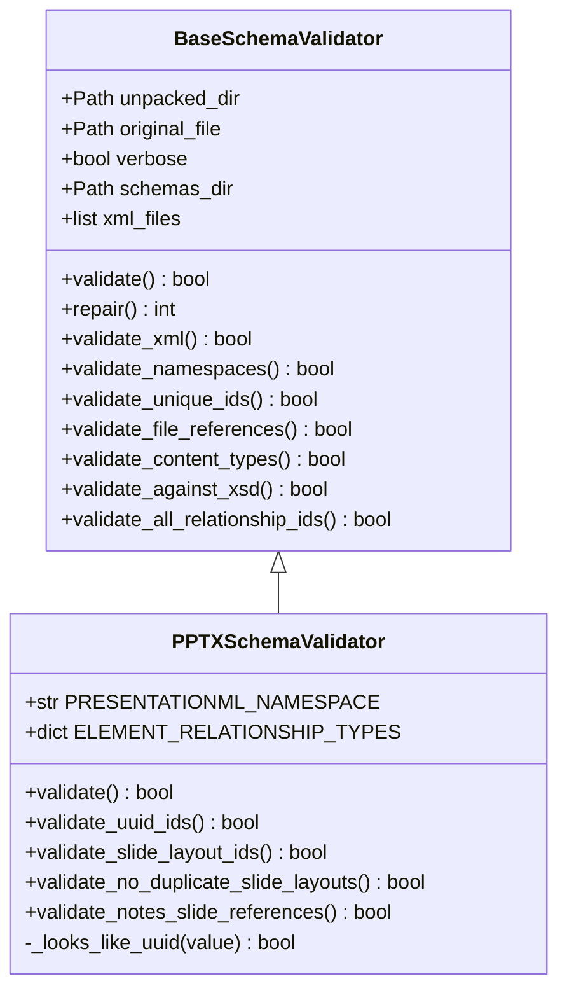
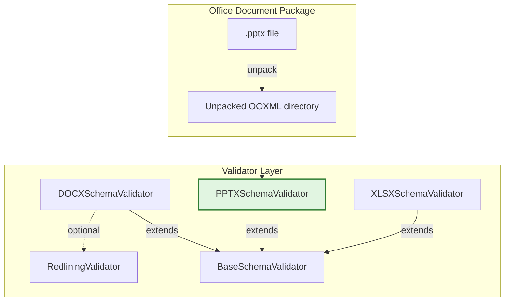
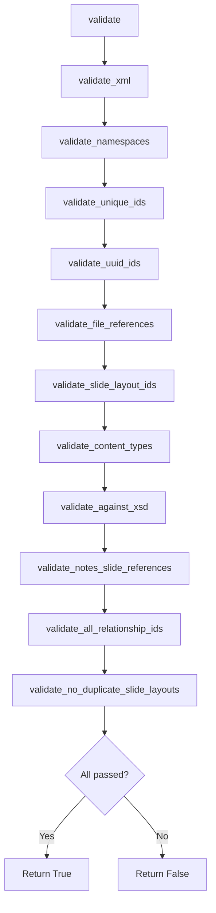
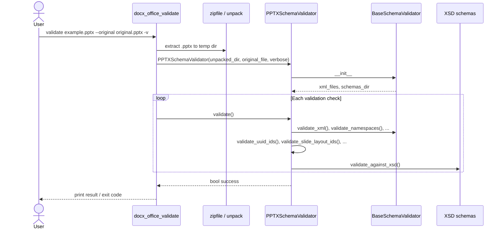
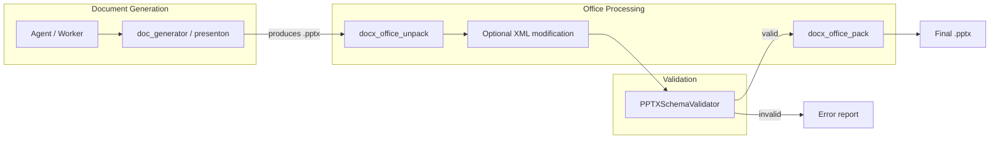

# docx_office_validators_pptx

## Brief Introduction

The `docx_office_validators_pptx` module provides PowerPoint-specific Open XML validation for `.pptx` documents. It defines `PPTXSchemaValidator`, a concrete validator that extends the shared [`BaseSchemaValidator`](docx_office_validators_base.md) and adds checks tailored to the PresentationML package structure. This module is part of the legacy `ainxt_docskills` document-processing toolkit and is invoked by the [`docx_office_validate`](docx_office_validate.md) CLI when the target file has a `.pptx` extension.

The validator ensures that an unpacked PPTX package is well-formed, internally consistent, and conforms to the OOXML PresentationML schema. It catches common corruption sources such as broken relationships, duplicate slide layouts, invalid UUID-like identifiers, and missing content-type declarations before the file is repacked or opened in Microsoft PowerPoint.

---

## Core Responsibilities

| Responsibility | Description |
| --- | --- |
| **XML well-formedness** | Parses every `.xml` / `.rels` file in the unpacked package and reports syntax errors. |
| **Namespace validation** | Verifies that all namespace prefixes used in `mc:Ignorable` attributes are declared. |
| **Unique ID checks** | Enforces file-scoped and globally-scoped uniqueness for PPTX element IDs (inherited from the base class). |
| **UUID-like ID validation** | Detects ID values that look like UUIDs and ensures they contain only valid hexadecimal characters. |
| **Relationship integrity** | Confirms that every relationship target exists and that every file is referenced. |
| **Slide layout references** | Validates that `sldLayoutId` elements in slide masters point to real slide layout relationships. |
| **Content type declarations** | Ensures `[Content_Types].xml` declares all presentation parts and media extensions. |
| **XSD schema validation** | Validates XML files against the ISO/IEC 29500 PresentationML XSD, ignoring pre-existing errors when an original file is supplied. |
| **Notes-slide uniqueness** | Detects notes slides that are referenced by more than one slide. |
| **Duplicate layout detection** | Ensures each slide has exactly one `slideLayout` relationship. |
| **Relationship ID consistency** | Verifies that `r:id` / `r:embed` / `r:link` attributes reference existing relationships of the expected type. |

---

## Architecture

### Class Hierarchy



### Module Position in the Document Pipeline



---

## Component Details

### `PPTXSchemaValidator`

`PPTXSchemaValidator` is the only public class in this module. It inherits initialization, XML parsing helpers, and generic OOXML checks from [`BaseSchemaValidator`](docx_office_validators_base.md), then layers PresentationML-specific rules on top.

#### Constructor

The constructor is inherited from `BaseSchemaValidator`:

```python
PPTXSchemaValidator(unpacked_dir, original_file=None, verbose=False)
```

| Parameter | Type | Description |
| --- | --- | --- |
| `unpacked_dir` | `str` / `Path` | Path to the unpacked PPTX directory. |
| `original_file` | `str` / `Path` (optional) | Original `.pptx` file used to baseline XSD errors. |
| `verbose` | `bool` | When `True`, prints `PASSED` messages for successful checks. |

#### `validate()`

Orchestrates the full validation pipeline. It runs the inherited generic checks first, then the PPTX-specific checks. Any single failure causes the final result to be `False`, but all checks still execute so that the caller receives a complete error report.



#### `validate_uuid_ids()`

Scans every XML attribute whose local name is `id` or ends with `id`. If the value looks like a UUID (32 alphanumeric characters after stripping braces, parentheses, and hyphens), it must match the standard UUID pattern. This catches corrupted or randomly-generated IDs that contain invalid hex characters.

#### `validate_slide_layout_ids()`

For each slide master (`ppt/slideMasters/*.xml`):

1. Loads the corresponding `_rels/*.xml.rels` file.
2. Collects the relationship IDs (`rId...`) that point to `slideLayout` relationships.
3. Checks every `<p:sldLayoutId>` element in the master to ensure its `r:id` is in that valid set.

This prevents masters from referencing slide layouts that do not exist in the package.

#### `validate_no_duplicate_slide_layouts()`

Iterates over `ppt/slides/_rels/*.xml.rels` and ensures each slide has **exactly one** `slideLayout` relationship. Multiple layout references are a common source of PPTX corruption.

#### `validate_notes_slide_references()`

Builds a map of notes-slide targets to the slides that reference them. A notes slide may be referenced by at most one slide; otherwise the presentation is considered corrupt.

#### Inherited checks

The following checks are provided by [`BaseSchemaValidator`](docx_office_validators_base.md) and are reused without modification:

- `validate_xml()`
- `validate_namespaces()`
- `validate_unique_ids()`
- `validate_file_references()`
- `validate_content_types()`
- `validate_against_xsd()`
- `validate_all_relationship_ids()`

See the base validator documentation for implementation details.

---

## Data Flow



---

## Relationship to Other Modules

| Module | Relationship |
| --- | --- |
| [`docx_office_validators_base`](docx_office_validators_base.md) | Parent class providing generic OOXML validation infrastructure. |
| [`docx_office_validators_docx`](docx_office_validators_docx.md) | Sibling validator for Word documents; shares the same base class but implements Word-specific rules. |
| [`docx_office_validators_redlining`](../docx_office_validators_redlining.md) | Optional redlining validator used only for `.docx` files when an original file is supplied. |
| [`docx_office_validate`](docx_office_validate.md) | CLI entry point that selects `PPTXSchemaValidator` for `.pptx` inputs. |
| [`docx_office_pack`](docx_office_pack.md) | Packs the validated unpacked directory back into a `.pptx` file. |
| [`docx_office_unpack`](docx_office_unpack.md) | Unpacks a `.pptx` file into the directory structure consumed by this validator. |

---

## How It Fits into the Overall System

The `docx_office_validators_pptx` module sits at the end of the document-generation pipeline for PowerPoint outputs. After an agent or worker produces a `.pptx` file (for example via [`doc_generator`](../shared_integrations_doc_generator.md) or the [`presenton_worker`](../workers_document_knowledge_workers.md)), the package may be unpacked, modified, and repacked. This validator guarantees that the final artifact remains valid OOXML and can be opened by end-user applications.

It is also used during skill development and CI, where generated PPTX files are validated against the original baseline to ensure that only intentional changes are introduced.



---

## Error Reporting

All validation methods follow a consistent reporting style:

- **FAILED** messages include the relative path, line number, and a human-readable description.
- **PASSED** messages are printed only when `verbose=True`.
- Critical relationship errors include guidance such as "Broken references MUST be fixed, and unreferenced files MUST be referenced or removed."

Example output:

```text
FAILED - Found 1 slide layout ID validation errors:
  ppt/slideMasters/slideMaster1.xml: Line 12: sldLayoutId with id='2147483649' references r:id='rId2' which is not found in slide layout relationships
Remove invalid references or add missing slide layouts to the relationships file.
```

---

## Notes for Maintainers

- The validator imports `lxml.etree` lazily inside each method. This keeps module import time low and makes the dependency optional at import time.
- `ELEMENT_RELATIONSHIP_TYPES` maps PresentationML `*Id` element names to expected relationship types. This mapping is used by `validate_all_relationship_ids()` (inherited from the base class) to detect mismatched `r:id` references.
- The module is intentionally **not** runnable as a script; running it directly raises `RuntimeError`.
- When extending this validator, prefer adding a dedicated method and calling it from `validate()` rather than modifying inherited base behavior, so that DOCX and XLSX validators remain unaffected.
