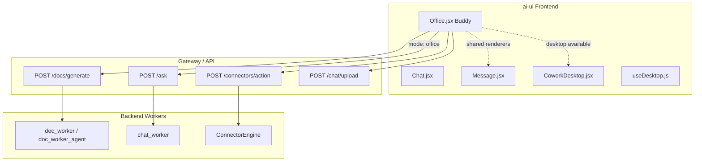
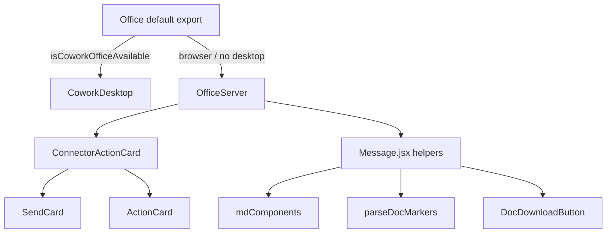
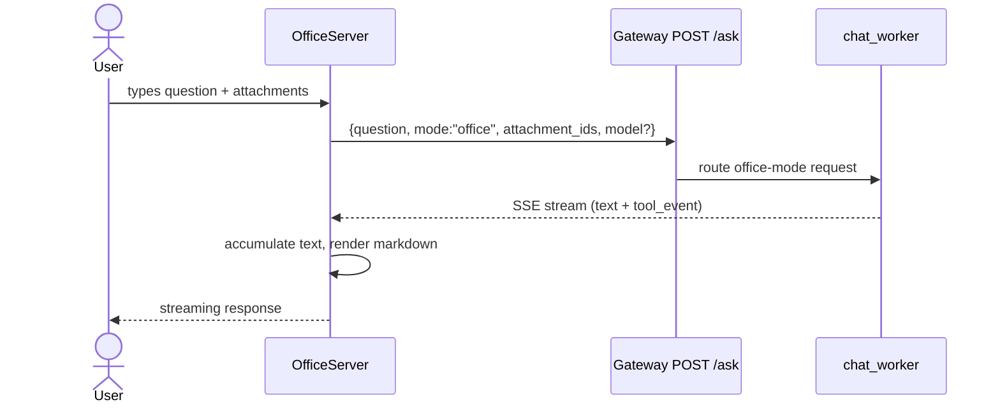
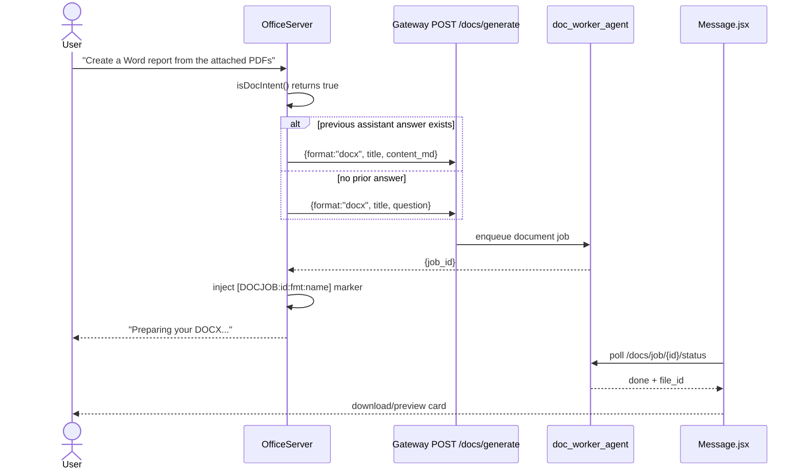
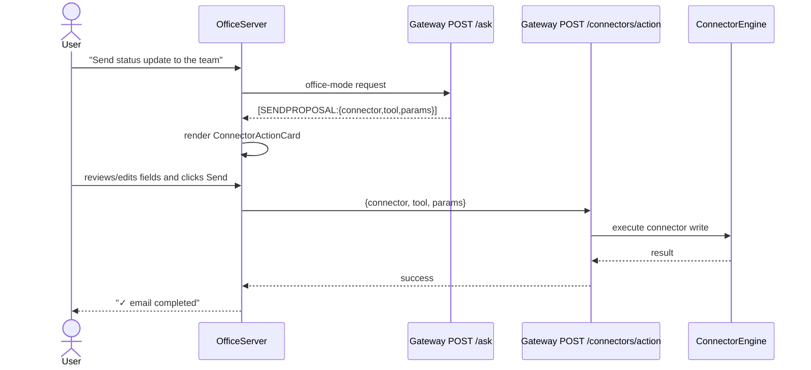
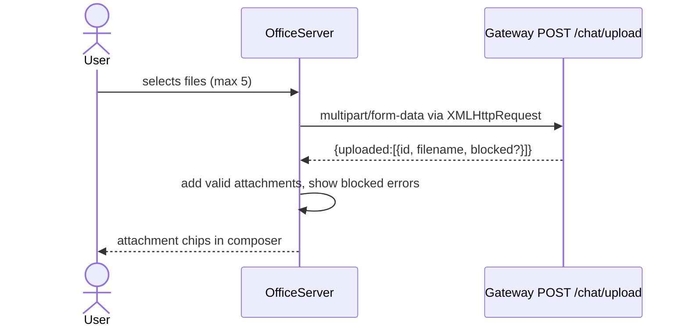
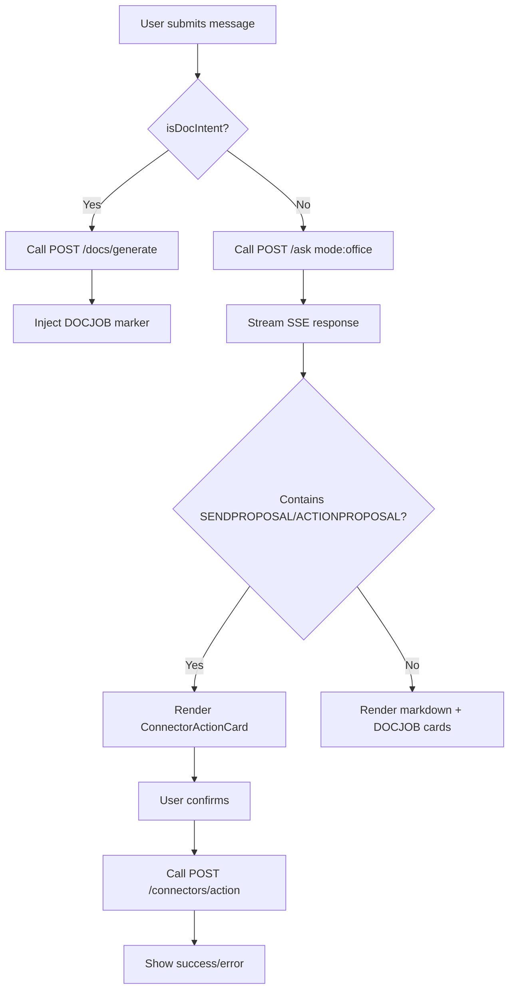

# Office Module (Buddy)

## Brief Introduction

The **Office** module — internally codenamed **Buddy** — is the AI office assistant persona in the `ai-ui` frontend. It is aimed at non-engineering users and provides a chat interface for reading documents, drafting content, generating Word/Excel/PowerPoint files, and performing actions through enterprise connectors such as Outlook, Teams, Jira, and Confluence.

Unlike the [Code](../codebase/code.md) module, which runs a local coding agent inside the desktop app, Buddy is designed to run **server-side** through the gateway orchestrator. This allows it to work identically in both the browser and the desktop application without requiring a local runtime. When the desktop app is available, Office can optionally delegate to the full local agent via [CoworkDesktop](../cowork/cowork_desktop.md).

The module is implemented as a single React component file: `ai-ui/src/components/Office.jsx`.

---

## Core Responsibilities

| Capability | Description |
|------------|-------------|
| **Conversational office assistant** | Streaming chat using `POST /ask` with `mode: "office"`. |
| **Document generation** | Detects document intent and calls `POST /docs/generate` to produce DOCX, XLSX, PPTX, or PDF files. |
| **File attachments** | Uploads up to 5 files via `POST /chat/upload` for reading, summarizing, or including in generated documents. |
| **Connector actions** | Renders review cards for `[SENDPROPOSAL:...]` and `[ACTIONPROPOSAL:...]` markers, letting the user confirm before any write operation is performed via `POST /connectors/action`. |
| **Desktop delegation** | When running inside the AiNxt desktop app, routes to `CoworkDesktop` for full local-agent execution. |

---

## Architecture

### High-Level Placement



### Component Hierarchy



---

## Core Components

### `Office` (default export)

The entry point that decides which runtime to use:

- If `isCoworkOfficeAvailable` is true (desktop app with local office agent support), render `CoworkDesktop`.
- Otherwise render `OfficeServer`, the browser/server-side chat flow.

### `OfficeServer`

The main server-side Buddy UI. It mirrors the chat shell from [Chat.jsx](../chat/chat.md) but adds office-specific behavior:

- **State**: messages, input, model selection, busy flag, attachments, upload progress.
- **Streaming**: consumes Server-Sent Events (SSE) from `POST /ask`.
- **Document intent**: short-circuits to `POST /docs/generate` when the user asks for a document.
- **Connector proposals**: parses `[SENDPROPOSAL:...]` and `[ACTIONPROPOSAL:...]` markers and renders confirmation cards.
- **Tool events**: displays live tool activity chips (`doc_generate`, `connector_call`, `retrieve`, etc.).

### `ConnectorActionCard`

A reusable review/confirm card for connector write operations. It:

- Pre-fills parameters from the proposal.
- Inherits attachment IDs from the last user message when appropriate.
- Calls `POST /connectors/action` only after explicit user confirmation.
- Shows success or error states.

### `SendCard` / `ActionCard`

Thin wrappers around `ConnectorActionCard`:

- `SendCard` — for sending emails/Teams messages (`kind = "send"`).
- `ActionCard` — for calendar updates/cancellations (`kind = "action"`).

---

## Data Flow

### 1. Regular Office Chat



### 2. Document Generation



### 3. Connector Action Confirmation



### 4. File Upload



---

## Key Utilities

### Document Intent Detection

```javascript
function isDocIntent(text) { ... }
function detectDocFormat(text) { ... }
```

- `isDocIntent` matches verbs like *generate/create/draft* followed by document nouns, or explicit file extensions.
- `detectDocFormat` returns `pptx`, `xlsx`, `docx`, `pdf`, `md`, or `txt` based on keywords.

These helpers mirror the patterns used in [Chat.jsx](../chat/chat.md) and the backend [chat_worker](../workers/workers.md#chat_agent_execution_workers).

### Tool Event Labeling

```javascript
function toolLabel(te) { ... }
```

Maps raw tool events to human-readable status chips such as:

- `read_document` → "Reading document"
- `doc_generate` → "Generating document"
- `connector_call` → "Using connector"
- `retrieve` → "Searching knowledge base"

### Marker Parsing

Office reuses the shared marker pipeline from [Message.jsx](../chat/message.md):

- `[DOCJOB:id:format:filename]` → rendered as `DocDownloadButton`.
- `[SENDPROPOSAL:{...}]` / `[ACTIONPROPOSAL:{...}]` → rendered as confirmation cards.

---

## Dependencies

### Internal Frontend Modules

| Module | Purpose |
|--------|---------|
| [Message.jsx](../chat/message.md) | `mdComponents`, `parseDocMarkers`, `DocDownloadButton` |
| [CoworkDesktop.jsx](../cowork/cowork_desktop.md) | Full local-agent desktop experience |
| [useDesktop.js](../ui/ai_ui_frontend_hooks.md) | `isCoworkOfficeAvailable` detection |
| [config.js](../core/config.md) | `API_BASE`, `authFetch` |

### Backend Modules

| Module | Purpose |
|--------|---------|
| [gateway.py](../core/gateway.md) | `POST /ask`, `POST /docs/generate`, `POST /connectors/action`, `POST /chat/upload` |
| [routers/chat_router.py](../chat/chat_router.md) | Chat upload and messaging endpoints |
| [routers/doc_download_router.py](doc_download_router.md) | Document generation, status polling, download |
| [routers/connectors_router.py](../connectors/connectors_router.md) | Connector action execution |
| [workers/doc_worker_agent.py](../workers/workers.md#document_knowledge_workers) | Document generation worker |
| [workers/chat_worker.py](../workers/workers.md#chat_agent_execution_workers) | Office-mode chat execution |
| [connectors/engine.py](../skills/shared_integrations.md#connector_infrastructure) | Connector runtime |

---

## Configuration & Constants

```javascript
const OFFICE_CLIENT_HEADER = { "X-AiNxt-Client": "office" };
```

This header is attached to every Buddy request so the gateway can identify the client context.

### Model Selector

| Key | Label |
|-----|-------|
| `auto` | Auto |
| `claude` | Claude Sonnet 4.6 |
| `gpt` | GPT-5.4 |
| `gemini` | Gemini 2.5 Flash |

### Suggestion Prompts

The empty-state shows quick-start suggestions:

- Summarize attached PDFs into a Word document
- Check Outlook unread emails
- Convert data into an Excel sheet
- Draft a status update from Jira

---

## Security & Governance

- **No autonomous connector writes**: The agent emits proposals; `ConnectorActionCard` requires explicit user confirmation before `POST /connectors/action` is invoked.
- **Attachment compliance**: Uploaded files are scanned server-side; blocked files are surfaced as assistant error messages.
- **Document retention**: Generated files have a TTL and are cleaned by [purge_worker](../workers/workers.md#infrastructure_maintenance_workers). The `DocDownloadButton` handles `expired` and `410 Gone` states gracefully.
- **Safe markdown rendering**: Uses the same `mdComponents` and URL transform as [Chat.jsx](../chat/chat.md) to prevent unsafe content injection.

---

## Process Flow: Sending a Message



---

## Related Documentation

- [Chat](../chat/chat.md) — general chat UI that Office mirrors
- [Message](../chat/message.md) — shared message rendering and document markers
- [CoworkDesktop](../cowork/cowork_desktop.md) — local-agent desktop mode
- [Gateway](../core/gateway.md) — main API gateway
- [Connectors Router](../connectors/connectors_router.md) — connector action endpoints
- [Document Download Router](doc_download_router.md) — document generation endpoints
- [Workers](../workers/workers.md) — background job workers
- [Shared Integrations](../skills/shared_integrations.md) — connector adapters and engine
