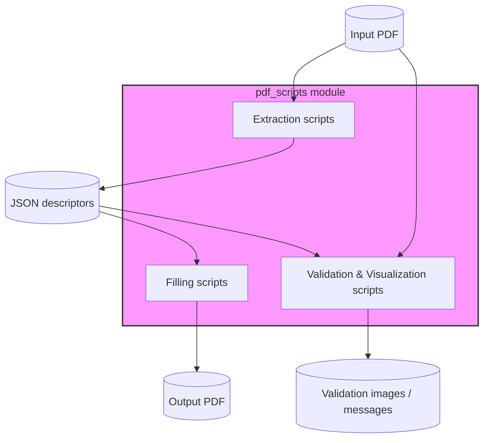
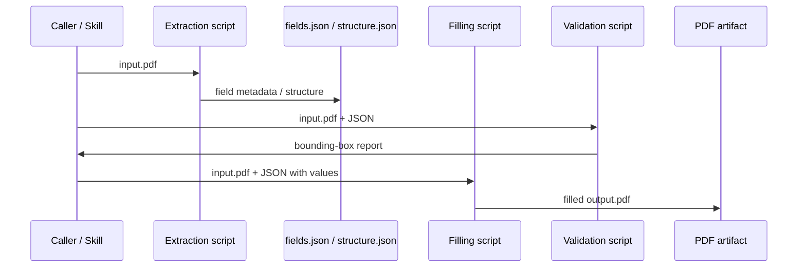

# pdf_scripts Module

## Introduction

The `pdf_scripts` module is a collection of standalone Python utilities for PDF form processing. It lives under `skills/ainxt_docskills/pdf/scripts/` and is part of the legacy Anthropic doc-skills toolkit. The scripts are designed to be invoked directly from the command line or imported by higher-level skills/agents that need to:

- Inspect fillable and non-fillable PDF forms.
- Extract field metadata, labels, lines, checkboxes, and row boundaries.
- Fill PDF forms either through native AcroForm fields or by overlaying text annotations.
- Validate and visualize field bounding boxes to catch layout errors before filling.
- Convert PDF pages to images for preview, annotation, or vision-model consumption.

These utilities are intentionally low-level and file-based: they read a PDF (and optionally a JSON descriptor) and produce another PDF or JSON artifact. They do not expose a network API; instead, they are consumed by agent skills, workflow nodes, or backend services such as [`docskills_legacy`](../agents/docskills_legacy.md) and the broader [`shared_skills`](../agents/shared_skills.md) ecosystem.

## Architecture Overview

The module is organized around three functional concerns:

1. **Extraction** – pull structured information out of PDFs.
2. **Filling** – write data into PDFs.
3. **Validation & Visualization** – verify coordinates and produce human-readable previews.



### Data Flow

A typical end-to-end workflow looks like this:



### Dependencies

- [`pypdf`](https://pypi.org/project/pypdf/) – reading/writing PDFs and AcroForm fields.
- [`pdfplumber`](https://pypi.org/project/pdfplumber/) – text, line, and rectangle extraction.
- [`pdf2image`](https://pypi.org/project/pdf2image/) – rasterizing PDF pages.
- [`Pillow`](https://pypi.org/project/Pillow/) – image manipulation and bounding-box overlays.

## Sub-modules

| Sub-module | Purpose | Key files |
|------------|---------|-----------|
| [pdf_scripts_extraction](pdf_scripts_extraction.md) | Extract form field metadata from fillable PDFs and geometric structure from non-fillable PDFs. | `extract_form_field_info.py`, `extract_form_structure.py` |
| [pdf_scripts_filling](pdf_scripts_filling.md) | Populate PDF forms using native AcroForm fields or FreeText annotations. | `fill_fillable_fields.py`, `fill_pdf_form_with_annotations.py` |
| [pdf_scripts_validation](pdf_scripts_validation.md) | Validate bounding-box geometry and generate preview images. | `check_bounding_boxes.py`, `create_validation_image.py`, `convert_pdf_to_images.py` |

## How It Fits into the System

`pdf_scripts` is one leaf of the [`shared_skills`](../agents/shared_skills.md) tree. It is most commonly used by:

- **Agent skills** that need to read or complete PDF documents (e.g., contract review, form automation).
- **Workflow nodes** in [`abstudio_backend`](../ui/abstudio_backend.md) that orchestrate document tasks.
- **Backend document APIs** such as [`api_documents`](../api/api_documents.md) and [`api_kb`](../api/api_kb.md), which may invoke these scripts as part of extraction or generation pipelines.

Because the scripts are stateless and CLI-oriented, they can be executed inside sandboxed workers, containerized skills, or directly on the backend depending on the deployment.

## Common Usage Patterns

### Fill a fillable PDF

```bash
python extract_form_field_info.py input.pdf fields.json
# edit fields.json to add "value" keys
python fill_fillable_fields.py input.pdf fields.json output.pdf
```

### Fill a non-fillable PDF

```bash
python extract_form_structure.py input.pdf structure.json
# build a fields.json with entry_bounding_box and entry_text
python fill_pdf_form_with_annotations.py input.pdf fields.json output.pdf
```

### Validate before filling

```bash
python check_bounding_boxes.py fields.json
python create_validation_image.py 1 fields.json page_1.png page_1_validated.png
```

## Notes

- All scripts are self-contained and can be run as `__main__` programs.
- `fill_fillable_fields.py` imports `get_field_info` from `extract_form_field_info.py`; this is the only intra-module import.
- The module is considered **legacy** (`ainxt_docskills`) and coexists with the newer [`pdf_skills`](../agents/pdf_skills.md) under `ABStudio/skills/ainxt-skills/pdf/scripts`.
