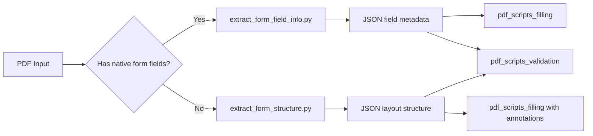
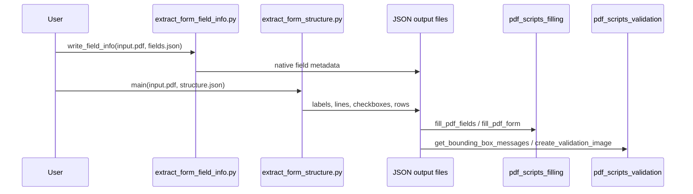
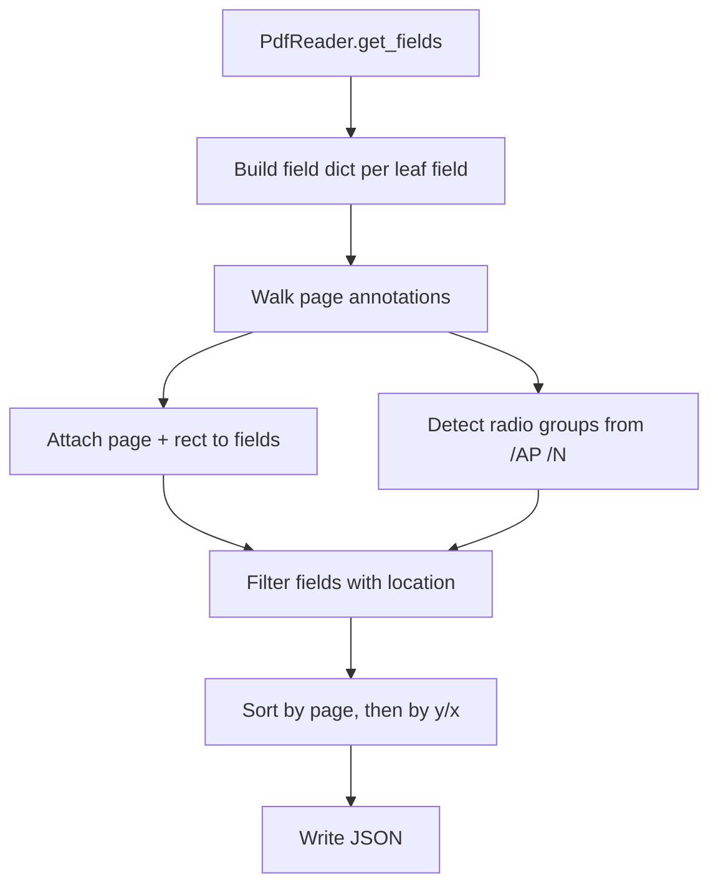
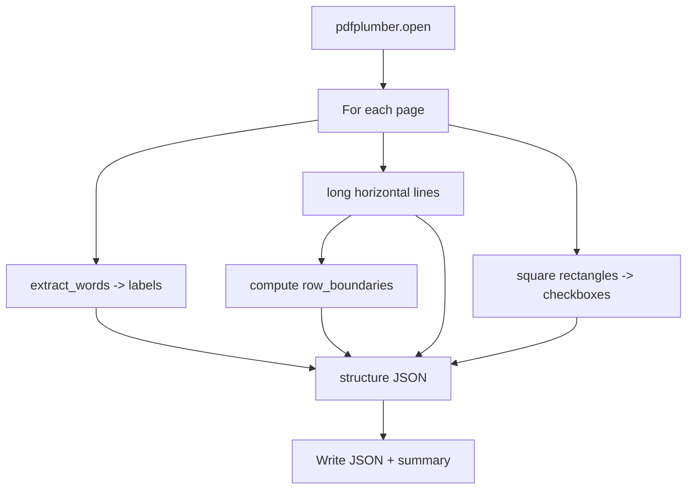
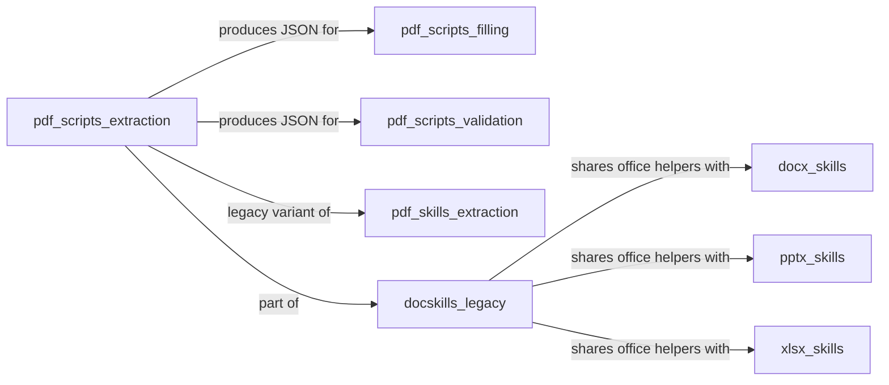

# pdf_scripts_extraction

## Brief Introduction

The `pdf_scripts_extraction` module provides command-line utilities for inspecting PDF documents and emitting structured JSON descriptions of their form-related content. It is part of the legacy `ainxt_docskills` PDF skill set and supports two complementary extraction modes:

1. **Fillable form field discovery** — `extract_form_field_info.py` reads PDFs that already contain interactive AcroForm fields and outputs metadata such as field IDs, types (text, checkbox, choice, radio group), page numbers, and bounding rectangles.
2. **Non-fillable form structure analysis** — `extract_form_structure.py` uses layout analysis to locate text labels, horizontal lines, checkbox-like rectangles, and inferred row boundaries in static PDFs that do not contain native form fields.

The JSON outputs produced by these scripts are consumed by sibling modules in the `pdf_scripts` family, particularly [`pdf_scripts_filling`](pdf_scripts_filling.md) and [`pdf_scripts_validation`](pdf_scripts_validation.md), to fill forms and validate field placements. For the newer Anthropic skill implementation of the same concepts, see [`pdf_skills_extraction`](../agents/pdf_skills_extraction.md).

---

## Comprehensive Documentation

### 1. Module Purpose and Core Functionality

PDF forms come in two flavors: native fillable AcroForms and "flat" documents that only look like forms. The `pdf_scripts_extraction` module handles both cases so that downstream automation can either fill existing fields or overlay annotations at computed coordinates.

#### 1.1 Fillable Field Extraction (`extract_form_field_info.py`)

The entry point `write_field_info(pdf_path, json_output_path)` opens a PDF with `pypdf.PdfReader`, enumerates form fields, and writes a JSON file containing:

- `field_id`: the fully qualified field name, including parent groups (e.g., `address.street`).
- `type`: one of `text`, `checkbox`, `choice`, `radio_group`, or an unknown fallback.
- For checkboxes: `checked_value` and `unchecked_value`.
- For choice fields: `choice_options` with value/text pairs.
- For radio groups: `radio_options` with each option's on-value and rectangle.
- `page`: the 1-based page number where the field annotation appears.
- `rect`: the annotation bounding box.

Fields are sorted by page and then by top-to-bottom, left-to-right position to produce a human-readable field list.

#### 1.2 Non-Fillable Structure Extraction (`extract_form_structure.py`)

The entry point `main()` (or `extract_form_structure(pdf_path)`) opens a PDF with `pdfplumber` and builds a structure object with:

- `pages`: page dimensions.
- `labels`: every word extracted with its bounding box.
- `lines`: long horizontal lines that likely separate rows or sections.
- `checkboxes`: small square rectangles that look like checkboxes.
- `row_boundaries`: inferred row bands derived from consecutive horizontal lines.

This output is used when a PDF must be filled by adding text annotations rather than updating native form fields.

---

### 2. Architecture and Component Relationships

#### 2.1 High-Level Architecture



#### 2.2 Component Interaction



#### 2.3 Internal Data Flow for `extract_form_field_info.py`



#### 2.4 Internal Data Flow for `extract_form_structure.py`



---

### 3. Core Components

#### 3.1 `write_field_info`

| Aspect | Description |
|--------|-------------|
| **File** | `skills/ainxt_docskills/pdf/scripts/extract_form_field_info.py` |
| **Library** | `pypdf` |
| **Inputs** | Path to a PDF with AcroForm fields; path for output JSON. |
| **Outputs** | JSON array of field descriptors. |
| **Key helpers** | `get_full_annotation_field_id`, `make_field_dict`, `get_field_info` |

`get_full_annotation_field_id` walks the `/Parent` chain of an annotation to reconstruct dotted field names. `make_field_dict` maps `/FT` values to friendly types and extracts state lists for buttons and choices. `get_field_info` merges the field dictionary with page annotation data, resolves radio groups from appearance dictionaries, and sorts the final list.

#### 3.2 `main` (`extract_form_structure`)

| Aspect | Description |
|--------|-------------|
| **File** | `skills/ainxt_docskills/pdf/scripts/extract_form_structure.py` |
| **Library** | `pdfplumber` |
| **Inputs** | Path to a static PDF; path for output JSON. |
| **Outputs** | JSON object with pages, labels, lines, checkboxes, row_boundaries. |
| **Key helpers** | `extract_form_structure` |

The script heuristically identifies checkboxes as rectangles whose width and height are between 5 and 15 points and whose aspect ratio is close to 1. Horizontal lines spanning more than half the page width are treated as row separators, and consecutive separators are paired into `row_boundaries`.

---

### 4. Dependencies

#### 4.1 External Libraries

- **`pypdf`** — Used by `extract_form_field_info.py` to read AcroForm fields and annotations.
- **`pdfplumber`** — Used by `extract_form_structure.py` for word, line, and rectangle extraction.
- **`json` / `sys`** — Standard library for serialization and CLI handling.

#### 4.2 Module Dependencies



- [`pdf_scripts_filling`](pdf_scripts_filling.md): consumes field metadata to update native fields or add FreeText annotations.
- [`pdf_scripts_validation`](pdf_scripts_validation.md): consumes structure metadata to check bounding-box correctness and generate validation images.
- [`pdf_skills_extraction`](../agents/pdf_skills_extraction.md): newer Anthropic skill implementation of the same extraction concepts.
- [`docskills_legacy`](../agents/docskills_legacy.md): parent module containing legacy docx, pptx, xlsx, and PDF skills.

---

### 5. How the Module Fits into the Overall System

The `pdf_scripts_extraction` module sits at the **data-preparation layer** of the document-automation pipeline. It is not invoked directly by the ABStudio backend API; instead, it is executed as a standalone script or wrapped by a skill/tool call when a user wants to:

1. Inspect an unknown PDF form before filling it.
2. Generate a template JSON that can be edited and passed to the filling scripts.
3. Validate that a flat PDF has been correctly interpreted before annotation.

Within the broader system tree:

- It belongs to `shared_skills` → `docskills_legacy` → `pdf_scripts` → `pdf_scripts_extraction`.
- It mirrors the newer `ABStudio/skills/ainxt-skills/pdf/scripts/extract_form_field_info.py` and `extract_form_structure.py` under [`pdf_skills_extraction`](../agents/pdf_skills_extraction.md).
- Outputs may ultimately be used by [`doc_generator`](doc_generator.md) or workflow nodes that produce filled PDFs as artifacts.

---

### 6. Usage Examples

#### 6.1 Extract native fillable fields

```bash
python skills/ainxt_docskills/pdf/scripts/extract_form_field_info.py \
  input.pdf fields.json
```

Sample output:

```json
[
  {
    "field_id": "name",
    "type": "text",
    "page": 1,
    "rect": [100.0, 650.0, 300.0, 670.0]
  },
  {
    "field_id": "subscribe",
    "type": "checkbox",
    "checked_value": "/Yes",
    "unchecked_value": "/Off",
    "page": 1,
    "rect": [100.0, 600.0, 115.0, 615.0]
  }
]
```

#### 6.2 Extract structure from a flat PDF

```bash
python skills/ainxt_docskills/pdf/scripts/extract_form_structure.py \
  input.pdf structure.json
```

Sample output:

```json
{
  "pages": [{"page_number": 1, "width": 612.0, "height": 792.0}],
  "labels": [
    {"page": 1, "text": "Name:", "x0": 72.0, "top": 100.0, "x1": 110.0, "bottom": 115.0}
  ],
  "lines": [{"page": 1, "y": 120.0, "x0": 72.0, "x1": 540.0}],
  "checkboxes": [{"page": 1, "x0": 72.0, "top": 140.0, "x1": 85.0, "bottom": 153.0, "center_x": 78.5, "center_y": 146.5}],
  "row_boundaries": [{"page": 1, "row_top": 120.0, "row_bottom": 140.0, "row_height": 20.0}]
}
```

---

### 7. Notes for Maintainers

- The scripts are intentionally standalone and have minimal dependencies, making them easy to run inside sandboxes or Docker containers.
- `extract_form_field_info.py` skips fields with `/Kids` (container fields) but uses page annotations to discover radio-group options.
- `extract_form_structure.py` relies on heuristics; scanned or heavily styled PDFs may produce noisy labels and false-positive checkboxes.
- When adding new field types, extend `make_field_dict` and keep the output schema compatible with [`pdf_scripts_filling`](pdf_scripts_filling.md).
