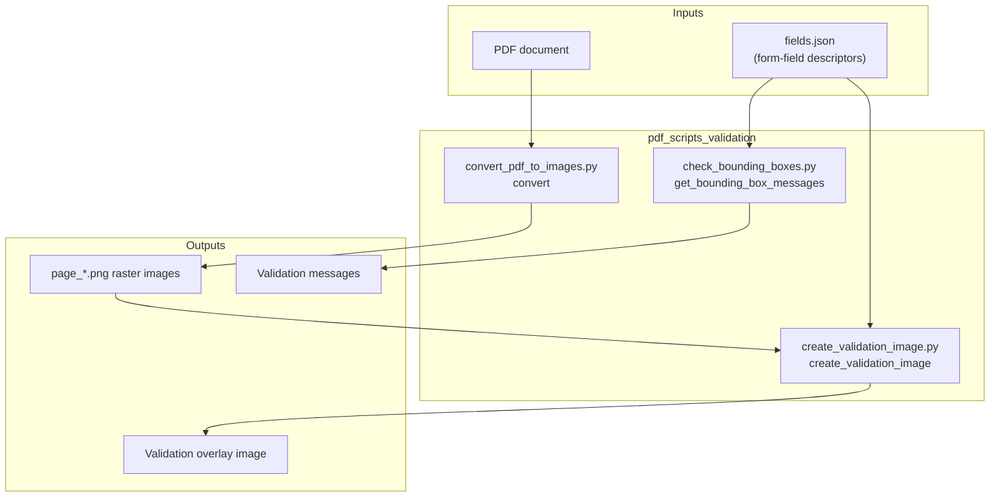
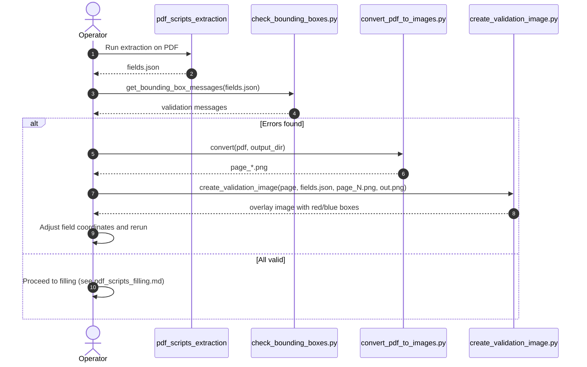
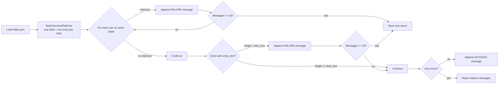
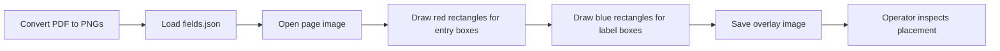
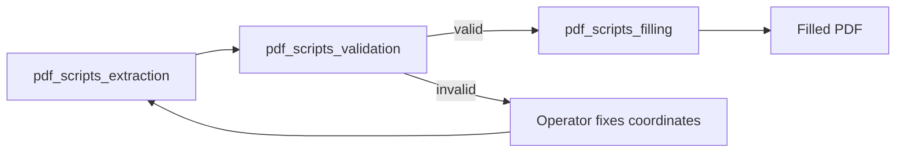

# PDF Scripts Validation Module

## Brief Introduction

The `pdf_scripts_validation` module provides lightweight, standalone utilities for visually validating and debugging PDF form-field definitions before they are used for automated filling. It operates on a `fields.json` descriptor (produced by the PDF extraction pipeline) and performs two main tasks:

1. **Geometric validation** of label and entry bounding boxes (intersection checks and text-height fit checks).
2. **Visual validation** by rendering bounding boxes on top of rasterized PDF pages so operators can inspect field placement.

These scripts are intended to be invoked from the command line or from higher-level document-automation skills. They help catch layout problems early, before a fillable PDF is generated with overlapping or clipped fields.

---

## Module Scope

| Concern | Covered by this module | Delegated to other modules |
|---|---|---|
| Parse `fields.json` form-field descriptors | ✅ `check_bounding_boxes.py` | ❌ |
| Detect intersecting label/entry bounding boxes | ✅ `check_bounding_boxes.py` | ❌ |
| Detect entry boxes too short for their font size | ✅ `check_bounding_boxes.py` | ❌ |
| Convert PDF pages to PNG images | ✅ `convert_pdf_to_images.py` | ❌ |
| Overlay bounding boxes on page images | ✅ `create_validation_image.py` | ❌ |
| Extract form structure / field coordinates | ❌ | [pdf_scripts_extraction.md](pdf_scripts_extraction.md) |
| Fill PDF form fields with values | ❌ | [pdf_scripts_filling.md](pdf_scripts_filling.md) |
| Office Open XML packaging / validation | ❌ | [docx_office_pack.md](docx_office_pack.md), [pptx_office_pack.md](pptx_office_pack.md) |
| General document parsing / OCR | ❌ | [document_processing.md](document_processing.md), [core_ocr.md](core_ocr.md) |

---

## Core Components

### `check_bounding_boxes.py`

**Primary function:** `get_bounding_box_messages(fields_json_stream) -> list[str]`

Reads a JSON stream containing `form_fields` and returns a list of human-readable validation messages. The function performs the following checks:

- **Intersection checks:** For every pair of bounding boxes on the same page, it reports whether a label or entry rectangle intersects another label or entry rectangle. It distinguishes between self-intersections (label vs. entry of the same field) and cross-field intersections.
- **Height fit check:** For each entry box that has associated `entry_text`, it verifies that the box height is at least the specified font size. This prevents text from being clipped when the PDF is filled.
- **Early abort:** To keep output readable, validation stops after 20 messages and asks the caller to fix the reported issues and rerun.

**Data class:** `RectAndField` — a small helper that pairs a bounding rectangle with its type (`"label"` or `"entry"`) and the parent field dictionary.

### `convert_pdf_to_images.py`

**Primary function:** `convert(pdf_path, output_dir, max_dim=1000)`

Renders each page of a PDF to a PNG using `pdf2image.convert_from_path` at 200 DPI. If a page exceeds `max_dim` pixels in either dimension, it is downscaled proportionally. Output files are named `page_1.png`, `page_2.png`, etc. This produces the base images used by `create_validation_image.py`.

### `create_validation_image.py`

**Primary function:** `create_validation_image(page_number, fields_json_path, input_path, output_path)`

Draws red rectangles around entry bounding boxes and blue rectangles around label bounding boxes for all fields on the requested page. The resulting image is saved to `output_path`, giving operators a visual map of where fields are positioned.

---

## Architecture



---

## Data Model

The validation scripts expect `fields.json` to contain an array of form-field records under the key `form_fields`. Each record must include:

| Field | Type | Meaning |
|---|---|---|
| `description` | `str` | Human-readable field name / label text |
| `page_number` | `int` | 1-based page index where the field appears |
| `label_bounding_box` | `[x1, y1, x2, y2]` | Rectangle of the visible label |
| `entry_bounding_box` | `[x1, y1, x2, y2]` | Rectangle where the value will be filled |
| `entry_text` (optional) | `{"font_size": float, ...}` | Typography metadata for the value |

> **Note:** The exact schema is produced by the extraction scripts documented in [pdf_scripts_extraction.md](pdf_scripts_extraction.md).

---

## Component Interactions



---

## Process Flows

### Bounding-Box Validation Flow



### Visual Validation Flow



---

## Dependencies

### External Libraries

| Library | Purpose |
|---|---|
| `pdf2image` | Rasterize PDF pages to PIL images |
| `Pillow` (`PIL`) | Image resizing and drawing of bounding-box overlays |

### Internal Dependencies

| Dependency | Relationship |
|---|---|
| [pdf_scripts_extraction.md](pdf_scripts_extraction.md) | Produces the `fields.json` input consumed by validation |
| [pdf_scripts_filling.md](pdf_scripts_filling.md) | Uses validated coordinates to fill PDF forms |
| [pdf_scripts.md](pdf_scripts.md) | Parent module grouping extraction, filling, and validation |
| [docskills_legacy.md](../agents/docskills_legacy.md) | Broader legacy document-skills context |

---

## How It Fits into the System

The `pdf_scripts_validation` module sits in the **quality-assurance step** of the PDF form-automation pipeline:



Within the larger platform, this pipeline is typically invoked by document-generation workers (see [document_knowledge_workers.md](../workers/document_knowledge_workers.md)) or by agentic skills that need to produce filled government forms, invoices, or reports. The validation step prevents downstream fill failures caused by overlapping fields or clipped text.

---

## Usage Examples

### Validate bounding boxes

```bash
python skills/ainxt_docskills/pdf/scripts/check_bounding_boxes.py fields.json
```

### Rasterize a PDF

```bash
python skills/ainxt_docskills/pdf/scripts/convert_pdf_to_images.py input.pdf ./pages
```

### Create a validation overlay for page 1

```bash
python skills/ainxt_docskills/pdf/scripts/create_validation_image.py \
  1 fields.json ./pages/page_1.png ./pages/page_1_validated.png
```

---

## Error Messages Reference

| Message pattern | Meaning | Suggested fix |
|---|---|---|
| `FAILURE: intersection between label and entry bounding boxes for ...` | A field's own label and entry rectangles overlap | Increase separation or resize one of the rectangles |
| `FAILURE: intersection between ... bounding box for ... and ... bounding box for ...` | Two different fields' rectangles overlap on the same page | Reposition one of the fields |
| `FAILURE: entry bounding box height ... is too short for the text content ...` | The entry box is shorter than the font size | Increase box height or reduce font size |
| `Aborting further checks; fix bounding boxes and try again` | 20 issues reported; early stop for readability | Fix reported issues and rerun |
| `SUCCESS: All bounding boxes are valid` | No geometric or fit issues detected | Proceed to filling |

---

## Maintenance Notes

- The 20-message cap in `check_bounding_boxes.py` is a UX safeguard, not a correctness limit. If many errors exist, rerun after each batch of fixes.
- `convert_pdf_to_images.py` uses a fixed 200 DPI. For higher-resolution validation images, increase the DPI or remove the `max_dim` scaling.
- Color coding in `create_validation_image.py` is hard-coded: **red = entry**, **blue = label**. Keep this convention consistent with any UI that consumes the overlay images.
- These scripts are stateless and file-system based; they do not require a database or network connection.
