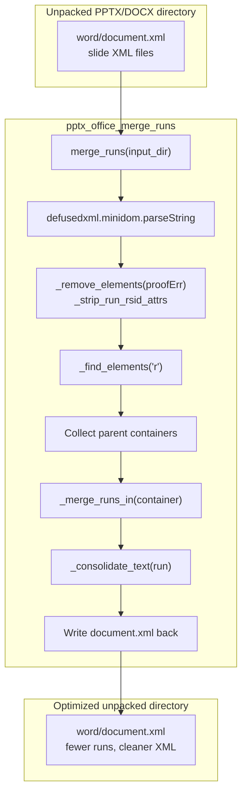
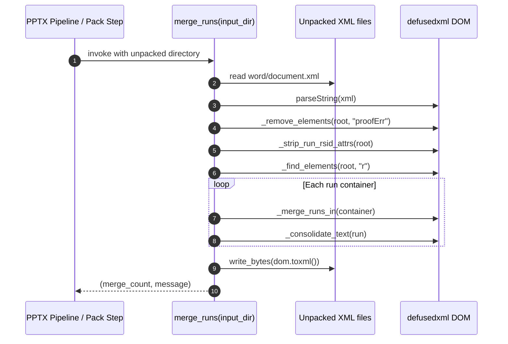
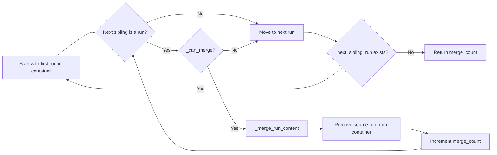
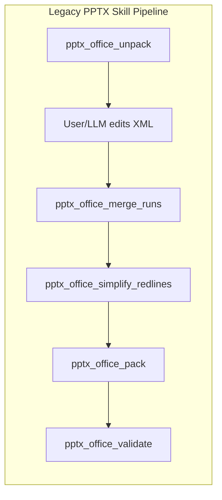

# pptx_office_merge_runs

## Brief Introduction

`pptx_office_merge_runs` is a low-level Office Open XML helper used by the legacy Anthropic docskills PPTX pipeline. Its purpose is to optimize the XML representation of a `.pptx` (and by extension `.docx`/`.xlsx`) document after it has been unpacked: it merges adjacent `<w:r>` (run) elements that share identical `<w:rPr>` run properties, strips revision-tracking `rsid` attributes from runs, and removes `<w:proofErr>` spell/grammar markers that would otherwise prevent merging.

The module is intentionally generic. It operates on the unpacked `word/document.xml` (or equivalent PPTX XML files) using `defusedxml.minidom` and does not depend on `python-pptx` or `python-docx`. It is normally invoked as a post-processing step before the document is repacked by [`pptx_office_pack`](pptx_office_pack.md).

---

## Core Functionality

| Concern | Responsibility |
|--------|----------------|
| **Run deduplication** | Merge neighboring runs with the same formatting so the final document is smaller and cleaner. |
| **Text consolidation** | Merge adjacent `<w:t>` text nodes inside a single run, preserving leading/trailing whitespace with `xml:space="preserve"`. |
| **Revision metadata cleanup** | Strip `rsid*` attributes from runs; these are revision identifiers that do not affect rendering. |
| **Proofing marker removal** | Remove `<w:proofErr>` elements that sit between runs and block run merging. |

---

## Architecture

### Component Breakdown

| Component | Visibility | Purpose |
|-----------|------------|---------|
| `merge_runs` | public | Entry point. Parses `word/document.xml`, orchestrates cleanup and merging, writes the result back. |
| `_find_elements` | private | Recursively collects elements by local tag name, tolerating namespaced tags (`w:r`, `a:r`, etc.). |
| `_get_child` / `_get_children` | private | Locate child elements by tag name. |
| `_is_adjacent` | private | Determines whether two elements are next to each other with only whitespace/text nodes in between. |
| `_remove_elements` | private | Removes all elements matching a tag from the DOM. |
| `_strip_run_rsid_attrs` | private | Removes any attribute whose name contains `rsid` from every run. |
| `_merge_runs_in` | private | Iterates over runs in a container, greedily merging each run with its next sibling while `_can_merge` is true. |
| `_first_child_run` / `_next_sibling_run` / `_next_element_sibling` | private | DOM traversal helpers that skip text/comment nodes. |
| `_is_run` | private | Predicate: node is a run element (`r` or `*:r`). |
| `_can_merge` | private | Compares `<w:rPr>` XML serialization of two runs. |
| `_merge_run_content` | private | Appends non-`rPr` children from the source run into the target run. |
| `_consolidate_text` | private | Merges adjacent `<w:t>` text nodes inside a run and manages `xml:space`. |

---

## Dependencies

### External Libraries

- `defusedxml.minidom` — secure XML DOM parsing/writing.
- `pathlib.Path` — filesystem path handling.

### Related Modules

| Module | Relationship |
|--------|--------------|
| [`pptx_office_pack`](pptx_office_pack.md) | Consumer. `merge_runs` is typically called before `pack` re-zips the optimized XML into a `.pptx`. |
| [`pptx_office_simplify_redlines`](pptx_office_simplify_redlines.md) | Sibling helper. Handles tracked-change (`<w:ins>`/`<w:del>`) consolidation; `merge_runs` focuses on plain run merging. |
| [`pptx_office_unpack`](pptx_office_unpack.md) | Predecessor. Produces the unpacked XML directory that `merge_runs` reads. |
| [`pptx_office_validate`](pptx_office_validate.md) | Follow-up. Validates the packed document after optimization. |
| [`docx_office_merge_runs`](docx_office_merge_runs.md) | Equivalent helper for the DOCX legacy pipeline. The two files are near-identical and may share logic in the future. |
| [`xlsx_office_merge_runs`](xlsx_office_merge_runs.md) | Equivalent helper for the XLSX legacy pipeline. |

---

## Data Flow

---

## Process Flow: Merging Runs

### Merge Criteria

Two runs can be merged only when:

1. They are adjacent element siblings (`_is_adjacent` / `_next_element_sibling`).
2. Both are run elements (`_is_run`).
3. Their run properties (`<w:rPr>`) are structurally identical, compared by XML serialization (`rpr1.toxml() == rpr2.toxml()`).
4. Either both runs have an `rPr` child or neither does.

### Text Consolidation Rules

Inside a single run, adjacent `<w:t>` elements are merged:

- Concatenate text content.
- If the merged text starts or ends with whitespace, set `xml:space="preserve"`.
- Otherwise remove the `xml:space` attribute if present.
- Remove the now-empty second `<w:t>` element.

---

## How It Fits into the System

`pptx_office_merge_runs` belongs to the **legacy Anthropic docskills PPTX skill set** under `shared_skills`. It is one of several XML-normalization utilities that prepare an unpacked Office document before it is validated and repacked.

The module is not exposed as a standalone API endpoint. It is imported and called by higher-level scripts in the same skill family, ultimately invoked through the ABStudio skill execution framework (see [`engine_native_engine`](../reference/engine_native_engine.md) and [`api_execution`](../api/api_execution.md)).

---

## Error Handling

| Scenario | Behavior |
|----------|----------|
| `word/document.xml` missing | Returns `(0, "Error: <path> not found")`. |
| XML parse or I/O exception | Returns `(0, "Error: <exception message>")`. |
| No runs found | Returns `(0, "Merged 0 runs")`. |

The function never raises; it returns a `(count, message)` tuple so callers can decide whether to abort packing.

---

## Notes for Maintainers

- The module uses `defusedxml.minidom` rather than `xml.dom.minidom` to mitigate XML entity expansion attacks when processing untrusted Office documents.
- Namespace handling is lenient: tags are matched by local name or by suffix (`w:r` matches `r` and any `*:r`).
- The `rPr` comparison is a literal XML-string comparison, so attribute order matters. In practice `minidom` serializes attributes consistently.
- Because the same logic exists for DOCX and XLSX, future refactoring could extract a shared `office/helpers/merge_runs.py` base implementation. Until then, changes should be mirrored across [`docx_office_merge_runs`](docx_office_merge_runs.md) and [`xlsx_office_merge_runs`](xlsx_office_merge_runs.md).
